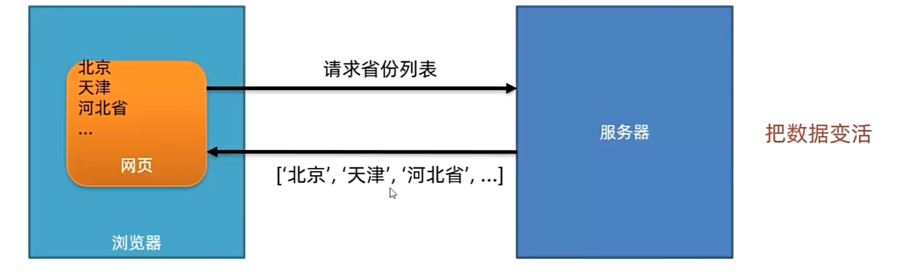

## 基础概念

AJAX是浏览器与服务器进行数据通信的技术



>  ==为什么渲染函数不能写在axios外部？==
>
> 如果将 `getBookList()` 函数放在 `axios` 请求之外,就会出现 `getBookList()` 先于 `axios` 请求完成而执行的情况。这就可能导致页面渲染出现问题。
>
> 1. **数据获取的同步性**:
>      当 `getBookList()` 函数位于 `axios` 请求外部时,它会在 `axios` 请求发出后立即执行。但此时可能还没有收到服务器返回的最新数据,因此无法正确渲染页面。
>
> 2. **数据的可靠性**:
>      将 `getBookList()` 放在 `axios` 回调函数内部,可以确保在有最新的图书列表数据时才进行页面渲染,从而保证数据的可靠性。
>
>    在 JavaScript 中,`axios` 请求是一个异步操作,这意味着它不会立即返回结果,而是会在一段时间后才返回。在此期间,JavaScript 会继续执行其他代码,不会等待 `axios` 请求完成。
>
> 3. **异步操作的正确性**:
>      `axios` 请求是一个异步操作,如果 `getBookList()` 函数放在外部,很容易出现先渲染再获取数据的情况,导致页面渲染不正确。

## axios基础使用

1. 引入axios.js库，与服务器进行数据通信

   ```html
   <script src="https://cdn.jsdelivr.net/npm/axios/dist/axios.min.js"></script>
   ```

2. 使用axios 函数，传入配置对象， 再用.then 回调函数接收结果，并做后续处理

   ```js
   axios({
   	url:'目标资源地址'
   }).then((result) => {
   	//对服务器返回的数据做后续处理
   })
   ```

### url

uniform resource locator 统一资源定义符


==http协议==：超文本传输协议，规定浏览器和服务器之间**数据传输的格式**

==域名==：标记**服务器**在互联网中的**方位**

==资源路径==：标记**资源**在服务器下的**具体位置**

### 查询参数

浏览器提供给服务器的额外信息，让服务器返回浏览器想要的数据

> 不常用格式：http://xxxx.com/xxx/xxx`?参数名1=值1&参数名2=值2`
>
> `查询字符串`：是在 URL 中附加的一串键值对,用于向服务器传递参数。它位于 URL 的问号(`?`)后面,各个参数之间使用 `&` 符号分隔。

**常用格式**：使用params选项 

```js
axios({
	url:'目标资源地址',
  params:{
		参数名: 值
}
}).then(result => {})
```


### 请求方法

| 常用请求方法 |                |
| ------------ | -------------- |
| **GET**      | **获取数据**   |
| **POST**     | **数据提交**   |
| PUT          | 修改数据(全部) |
| DELETE       | 删除数据       |
| PATCH        | 修改数据(部分) |

### 数据提交

> method 一般默认为GET,可以省略不写(不区分大小写)

```js
axios({
	url:'目标资源地址',
	method: '请求方法', 
	data: {
		参数名: 值
}
}).then((result) => {
  //对服务器返回的数据做后续处理
}).catch((error) => {
  //处理报错 (点开到response中查看具体问题)
})
```

==Tips==:不想要某个对象的属性，可以使用delet删除，也可以自己封装一个对象，自己添加属性

```js
  // 发布文章的时候不需要id属性 可以删除id属性 id属性是为了后边编辑文章使用
  delete data.id;
  // 自己添加cover的信息
  data.cover = {
    type: 1, //封面类型
    images: [document.querySelector(".rounded").src],
  };
```

> 例题：提交注册的用户名和密码

```html
    <!-- 引入axios库 -->
    <script src="https://cdn.jsdelivr.net/npm/axios/dist/axios.min.js"></script>
    <script>
      axios({
        url: "http://hmajax.itheima.net/api/register",
        method: "post",
        data: {
          username: "dawniandgzuibang",
          password: "052345678",
        },
      })
        .then((result) => {
          alert(result.data.message);
        })
        .catch((error) => {
          alert(error.response.data.message);
        });
    </script>
```

### 公共配置

提取公共前缀地址，配置后axios请求时都会baseURL + url

```js
axios.defaults.baseURL = "基地址";
```

## [axios拦截器](https://www.axios-http.cn/docs/interceptors)

在请求或响应被 then 或 catch 处理前拦截它们。

### 拦截器模板

```js
// 添加请求拦截器
axios.interceptors.request.use(function (config) {
    // 在发送请求之前做些什么
    return config;
  }, function (error) {
    // 对请求错误做些什么
    return Promise.reject(error);
  });

// 添加响应拦截器
axios.interceptors.response.use(function (response) {
    // 2xx 范围内的状态码都会触发该函数。
    // 对响应数据做点什么
    return response;
  }, function (error) {
    // 超出 2xx 范围的状态码都会触发该函数。
    // 对响应错误做点什么
    return Promise.reject(error);
  });
```

### 请求拦截器

```js
axios.interceptors.request.use(function (config) {
  // 在发送请求之前做些什么
  // 同意携带 token 令牌字符串在请求头上
  //本地客户端存储令牌
  const token = localStorage.getItem("token");
  token && (config.headers.Authorization = `Bearer ${token}`);
  return config;
});
```

### 响应拦截器

```js
axios.interceptors.response.use(
  function (response) {
    // 2xx 范围内的状态码都会触发该函数。
    // 对响应数据做点什么 例如：直接返回服务器的响应结果对象
    const result = response.data;
    return result;
  },
  function (error) {
    // 超出 2xx 范围的状态码都会触发该函数。
    // 对响应错误做点什么 例如 🔴统一对401 身份验证失败情况做出处理
    console.dir(error);
    if (error?.response?.status === 401) {
      alert("身份验证失败，请重新登录");
      localStorage.clear();
      location.href = "../login/index.html";
    }
    return Promise.reject(error);
  }
);
```

## token令牌

访问权限的令牌，本质上是一串字符串，正确登录后，由后端签发并返回

> 1. 前端只能判断token 有无，而后端才能判断token 的有效性
> 2. 利用`loaclStorage` 存储令牌在本地，并将它添加到请求头上

```js
// 添加请求拦截器
axios.interceptors.request.use(function (config) {
  // 在发送请求之前做些什么
  // 同意携带 token 令牌字符串在请求头上
  const token = localStorage.getItem("token");
  token && (config.headers.Authorization = `Bearer ${token}`);
  return config;
});
```

## 请求报文

**请求报文**：浏览器按照`HTTP 协议`要求的格式，**发送给服务器的内容**

HTTP协议：规定了浏览器发送及服务器返回内容的样式

> 请求报文的格式
>
> 1. 请求行：请求方法，URL，协议
> 2. 请求头：以键值对的格式携带的附加信息，比如：Content-Type
> 3. 空行：分隔请求头，空行之后的是发送给服务器的资源
> 4. 请求体：发送的资源
>
> 

请求报文的作用：**用于核查错误**(看提交的是否正确)


## 响应报文

**响应报文**：服务器按照`HTTP 协议`要求的格式，**返回给浏览器的内容**

HTTP 协议：规定了浏览器发送及服务器返回内容的格式

> 1. 响应行（状态行）：协议、HTTP 响应状态码、状态信息
> 2. 响应头：以键值对的格式携带的附加信息，比如：Content-Type
> 3. 空行：分隔响应头，空行之后的是服务器返回的资源
> 4. 响应体：返回的资源
>
>  alt="image-20240801193908266" style="zoom: 33%;" />

### HTTP响应状态码

用来表明请求是否成功完成

|        |            |
| ------ | ---------- |
| 状态码 | 说明       |
| 1xx    | 信息       |
| 2xx    | 成功       |
| 3xx    | 重定向     |
| 4xx    | 客户端错误 |
| 5xx    | 服务端错误 |

## [接口文档](https://apifox.com/apidoc/shared-1b0dd84f-faa8-435d-b355-5a8a329e34a8/api-87683400)

接口文档：由`后端提供`的描述接口的文章

接口：使用AJAX 和服务器通讯时，使用的URL，请求方法，以及参数

> 请求参数
>
> - query参数 params {
>
>   }
>
>  alt="image-20240802162557409" style="zoom: 50%;" />
>
> - body参数 data {
>
>   }
>
>  alt="image-20240802162612700" style="zoom:50%;" />

## form-serialize插件

快速收`集表当元素的值`，转变为一个`对象`

> ==**易错**==只能收集到表单元素的信息，如： <input> <select> <option> <button> <textarea> 等, 像 这种标签元素的信息就会自动略过，无法收集
>
> ==Tips==:这种时候可以自己额外添加属性
>
> ```js
> // 前提: data 使我们利用serialize收集到的信息对象
> // 通过自己添加属性来完善缺失的img标签的信息
> data.img = "..." 
> ```

**使用前提**：

1. 引入代码


```html
<script src="form-serialize.js"></script>
```

1. 表单元素需要设置`name属性` name: username 

```js
// 1. 获取表单元素
const form = document.queryselector(".example-form")
// 2. serialize(获取到的表单元素, {hash: true, empty: true}) hash 和 empty 一般都为true
const formInfo = serialize(form, {hash:ture, empty: true})
```

> `hash` 设置获取到的数据结构
>
> - -true：js对象
>
> - -fasle: 获取到的查询字符串 username=admin&password=123456
>
> `empty` 设置是否获取空值
>
> - -true: 可以为空值的属性 {username：, password: }
> - -false: 不获取为空值的属性 {}

## Bootstrap弹框

不离开当前页面，显示单独内容，供用户操作

引入 bootstrap.js库

```html
<script src="https://cdn.jsdelivr.net/npm/bootstrap@5.2.2/dist/js/bootstrap.min.js"></script>
```

### 属性控制

通过自定义属性 控制弹框的显示和隐藏

 alt="image-20240802193103210" style="zoom:50%;" />

1. 绑定实现显示弹框

```html
 data-bs-toggle="modal" 给按钮实现点击显示

 data-bs-target="mybox" 选择对应的弹框
```

2. 绑定实现隐藏弹框 绑定在x 那个按钮上

​	   data-bs-dismiss = "modal"

 alt="image-20240802193233012" style="zoom: 50%;" />

### js控制

> 什么时候使用js控制呢 ?
>
> 就是当你想隐藏弹框之前首先要保存数据,做出一系列操做时，这个时候就用js控制属性不再适用
>
> 使用方法：
>
> 1. 创建弹框对象 
>
>    ```js
>    // 1. 获取弹框元素
>    const modalDom = document.querySelector(".name-box");
>    // 2. 创建对应的弹框的对象
>    const modal = new bootstrap.Modal(modalDom);
>    ```
>
> 2. 调用弹框的方法
>
>    ```js
>    弹框对象.show();
>    弹框对象.hide()；
>    ```
>

## 图片上传

1. 绑定事件类型为`change`

2. 利用`FormData()`携带图片文件，`e.target.files` 为文件列表

3. 

   ```js
   const 对象名 = new FormData();
   // 对象名.append("参数名", 参数值) 参数值也就是图片文件的存储位置值
   对象名.append("img", e.target.fiels[0])
   ```

4. 提交到服务器， 获取图片url网址使用

   ```js
   axios({
   	url:"",
   	method: "post",
   	data:对象名 //不是对象结构而是FormData 所以直接写在:后面
   }).then((result) => {
   	const imgUrl = result.data.data.url;
   	document.querySelector("元素名").src = imgUrl
   })
   ```

5. 保存url到浏览器 并使用

   ```js
   localStorage.setItem(键, 值);
   locakStorage.getItem(键)
   ```


## XMLHttpRequest

AJAX原理- **`XMLHttpRequest(XHR)`对象用于与服务器交互**。通过XMLHttpRequest可以再不刷新页面的情况下请求特定URL，获取数据。

> 1. 与`axios`有什么关系呢？
>
> `axios`内部采用`XMLHttpRequest`与`服务器`交互
>
> 2. ==与axios 的区别==
>
> `axios` 会`自动`将JavaScript对象`转变为JSON字符`串，发送给服务器，同时返回给客户端时也会自动将字符串转变成Javascript对象。而`XMLHttpRequest`需要我们使用`手动转换`
>
> - 在**指定参数查询**时，需要用到`URLSearchParams对象`并转为字符串(`toString()`)
> - 在**提交数据**到服务器时，需要手动`添加请求头`，并将请求体转变为JSON字符串(`JSON.stringify()`)

### 基本使用

```js
// 1. 创建XMLHttpRequest对象
const xhr = new XMLHttpRequeset()
// 2. 配置请求方法和地址
xhr.open("请求方法", "URL地址");
// 3. 监听loadend事件，接收响应结果
xhr.addEventListener("loadend", ()=> {
  console.log("xhr.response")
  // 将JSON字符串转为JavaScript对象
  const data = JSON.parse(xhr.response);
  console.log(data.list);
})
// 4. 发送请求
xhr.send()
```

### 查询参数

通过创建`URLSearchParams`查询对象并转变为指定格式的字符串进行查询进行查询

```js
const paramsObj = new URLSerachParams({
	参数名1: 值1,
	参数名2: 值2,
})

const querytString = paramsObj.toString()

// 将其拼接在URL地址后面
xhr.open("GET", `url...?${querytString}`)
```

```html
<script>
      document.querySelector(".sel-btn").addEventListener("click", () => {
        const pname = document.querySelector(".province").value;
        const cname = document.querySelector(".city").value;

        // 创建查询参数对象
        const qObj = {
          pname,
          cname,
        };

        // 🔴将查询参数对象 转成一个 URLSearchParams 对象。
        const paramsObj = new URLSearchParams(qObj);
        // 转成字符串
        const queryString = paramsObj.toString();

        // 使用 xml对象查询 🔴
        const xhr = new XMLHttpRequest();
        xhr.open("GET", `http://hmajax.itheima.net/api/area?{queryString}`);
      });
</script>
```

### 数据提交

> 需要自己**写请求头**并将请求体**手动转变为JSON**字符串,然后send(JSON字符串)
>
>  alt="image-20240805140741173" style="zoom:33%;" />
>
> ```js
> const xhr = new XMLHttpRequest()
> xhr.open("请求方法", "URL地址");
> xhr.addEvenListener("loadend", () => {
>   console.log("xhr.response");
> })
> 
> //请求头 content-Type 具体看后端提供的文档是什么
> xhr.setRequestHeader("content-Type", "application/json")
> //请求体要转变为JSON字符串
> const user = {username: "", password: ""};
> const userStr = JSON.stringify(user)
> 
> xhr.send(userStr)
> ```

```html
<body>
    <button class="reg-btn">注册用户</button>
    <script>
      /**
       * 目标：使用xhr进行数据提交-完成注册功能
       */
      document.querySelector(".reg-btn").addEventListener("click", () => {
        const xhr = new XMLHttpRequest();
        xhr.open("POST", "http://hmajax.itheima.net/api/register");
        xhr.addEventListener("loadend", () => {
          console.log(xhr.response);
        });

        // 🔴设置请求头 告诉服务器内容类型为JOSN字符串
        xhr.setRequestHeader("content-Type", "application/json");
        // 准备提交数据
        const userObj = {
          username: "你大爷66666",
          password: "123456",
        };
        // 转换成JSON字符串
        const userStr = JSON.stringify(userObj);
        xhr.send(userStr);
      });
    </script>
  </body>
```

## Promise

> 有三种状态：一旦改变后就不能再次更改
>
> 1. pending
> 2. fulfilled 当resolve()被调用后就会改变成 then()
> 3. rejected 当rejected()被调用后 catch()
>
> - 当 Promise 对象的状态为 resolved 时, then() 方法的回调函数会被执行, 并接收 resolve() 函数的参数。
>
> - 当 Promise 对象的状态为 rejected 时,catch() 方法的回调函数会被执行,并接收 reject() 函数的参数。

### 基于Promise + XHR 封装myAxios函数 

```html
<script>
  // 1. 创建一个Promise对象
  const p = new Promise((resolve, reject) => {
		// 2. 执行异步任务-并传递结果
    //成功调用: resolve(值) 触发then()执行
    //失败调用: reject(值)	 触发catch()执行
  });

  // 3. 接收结果
  p.then((result) => {
    //成功
    console.log(result);
  }).catch((error) => {
    //失败
    console.log(error);
  });
</script>
```

### 封装简易axios

> 利用`响应状态码`判断是否响应成功

```html
<script>
  function myAxios(config) {
    return new Promise((resolve, reject) => {
      const xhr = new XMLHttpRequest();
      xhr.open(config.method || "GET", config.url);
      xhr.addEventListener("loadend", () => {
        // 响应状态码
        if (xhr.status >= 200 && shr.status < 300) {
          resolve(JSON.parse(xhr.response));
        } else {
          reject(xhr.response);
        }
      });
      xhr.send();
    });
  }

  myAxios({
    url: "",
  })
    .then((result) => {
    console.log(result);
  })
    .catch((error) => {
    console.log(error);
  });
</script>
```

### 获取地区列表(指定参数查询)

> 1. 先进行一个判断是否有params
> 2. 将参数对象转变为`URLSearchParams`后再转变为JSON字符串
> 3. 将查询参数拼接在url地址后面

```html
<script>
      function myAxios(config) {
        // 返回的是一个Promise对象
        return new Promise((resolve, reject) => {
          // 在Promise构造函数中发送AJAX请求
          const xhr = new XMLHttpRequest();
          // 🔴判断是否有params
          if (config.params) {
            const paramsObj = new URLSearchParams(config.params);
            const queryString = paramsObj.toString();
            // 🔴拼接
            config.url += `?${queryString}`;
          }
          xhr.open(config.method || "GET", config.url); //逻辑或
          xhr.addEventListener("loadend", () => {
            if (xhr.status >= 200 && xhr.status < 300) {
              resolve(JSON.parse(xhr.response));
            } else {
              reject(xhr.response);
            }
          });
          xhr.send();
        });
      }

      myAxios({
        url: "http://hmajax.itheima.net/api/area",
        params: {
          pname: "江西省",
          cname: "上饶市",
        },
      }).then((result) => {
        console.log(result);
        document.body.innerHTML = result.list.join("<br>");
      });
    </script>
```

### 注册用户(提交数据)

> 1. 手动添加请求头
>
> 2. 请求体的转换别忘了

```html
<button>注册用户</button>
<script>
  function myAxios(config) {
    return new Promise((resolve, reject) => {
      const xhr = new XMLHttpRequest();
      xhr.open(config.method || "GET", config.url);
      xhr.addEventListener("loadend", () => {
        if (xhr.status >= 200 && xhr.status < 300) {
          resolve(JSON.parse(xhr.response));
        } else {
          reject(xhr.response);
        }
      });
      if (config.data) {
        const jsonStr = JSON.stringify(config.data);
        // 🔴要自己写请求头
        xhr.setRequestHeader("Content-Type", "application/json");
        xhr.send(jsonStr);
      } else {
        xhr.send();
      }
    });
  }

  document.querySelector("button").addEventListener("click", () => {
    myAxios({
      url: "http://hmajax.itheima.net/api/register",
      method: "POST",
      data: {
        username: "黑马no1hello",
        password: "123456",
      },
    })
      .then((result) => {
      console.log(result);
    })
      .catch((error) => {
      console.dir(error);
    });
  });
</script>
```

### Promise.all()

```html
<script>
      /**
       * 目标：掌握Promise的all方法作用，和使用场景
       * 业务：当我需要同一时间显示多个请求的结果时，就要把多请求合并
       * 例如：默认显示"北京", "上海", "广州", "深圳"的天气在首页查看
       * code：
       * 北京-110100
       * 上海-310100
       * 广州-440100
       * 深圳-440300
       */
      //   1. 请求城市的天气 得到Promise对象
      const bjPromise = axios({
        url: "http://hmajax.itheima.net/api/weather",
        params: { city: "110100" },
      });
      const shPromise = axios({
        url: "http://hmajax.itheima.net/api/weather",
        params: { city: "310100" },
      });
      const gzPromise = axios({
        url: "http://hmajax.itheima.net/api/weather",
        params: { city: "440100" },
      });
      const szPromise = axios({
        url: "http://hmajax.itheima.net/api/weather",
        params: { city: "440300" },
      });

      //   2. 使用Promise.all静态方法
      const p = Promise.all([bjPromise, shPromise, gzPromise, szPromise]);
      p.then((result) => {
        console.log(result);
        document.body.innerHTML = result
          .map((item) => {
            return `
            <li>${item.data.data.area}----${item.data.data.weather}</li>
            `;
          })
          .join("");
      }).catch((error) => {
        console.dir(error);
      });
    </script>
```

## 嵌套地狱

在最外层捕获异常 无法真正捕获最内层的错误


## Promise链式调用

依靠`then() `方法会==返回一个新生成的Promise 对象==特性，继续串联下一环任务，直到结束

```html
<script>
      /**
       * 目标：掌握Promise的链式调用
       * 需求：把省市的嵌套结构，改成链式调用的线性结构
       */
      //    1. 创建Promise对象
      const p = new Promise((resolve, reject) => {
        setTimeout(() => {
          resolve("弋江镇");
        }, 200);
      });
      //   2. 获取省份名字
      const p2 = p.then((result) => {
        console.log(result);
        // 3. 创建Promise对象
        return new Promise((resolve, reject) => {
          setTimeout(() => {
            resolve(result + "北京");
          }, 2000);
        });
      });

      //   4. 获取城市名字
      p2.then((result) => {
        console.log(result);
      });
      //then()返回的是一个新的Promise对象
      console.log(p2 === p);
    </script>
```

## async函数[见ES6]

### 利用async函数和await解决回调函数地狱问题

```html
<body>
    <form>
      <span>省份：</span>
      <select>
        <option class="province"></option>
      </select>
      <span>城市：</span>
      <select>
        <option class="city"></option>
      </select>
      <span>地区：</span>
      <select>
        <option class="area"></option>
      </select>
    </form>
    <script src="https://cdn.jsdelivr.net/npm/axios/dist/axios.min.js"></script>
    <script>
      /**
       * 目标：掌握async和await语法，解决回调函数地狱
       * 概念：在async函数内，使用await关键字，获取Promise对象"成功状态"结果值
       * 注意：await必须用在async修饰的函数内（await会阻止"异步函数内"代码继续执行，原地等待结果）
       */
      //   1. 定义一个async修饰函数
      async function getData() {
        // 2. 用await等到成功的结果
        const pObj = await axios({
          url: "http://hmajax.itheima.net/api/province",
        });
        const pname = pObj.data.list[0];
        const cObj = await axios({
          url: "http://hmajax.itheima.net/api/city",
          params: { pname },
        });
        const cname = cObj.data.list[0];
        const areaObj = await axios({
          url: "http://hmajax.itheima.net/api/area",
          params: { pname, cname },
        });
        const areaName = areaObj.data.list[0];
        document.querySelector(".province").innerHTML = pname;
        document.querySelector(".city").innerHTML = cname;
        document.querySelector(".area").innerHTML = areaName;
      }
      getData();
    </script>
  </body>
```

### async错误捕获

```js
async function getData() {
        // 1. 🔴用try包裹肯能产生错误的代码
        // 如果try里面的某行代码报错了 那try中的剩余代码就不会执行了
        try {
          const pObj = await axios({
            url: "http://hmajax.itheima.net/api/province",
          });
          const pname = pObj.data.list[0];
          const cObj = await axios({
            url: "http://hmajax.itheima.net/api/city",
            params: { pname },
          });
          const cname = cObj.data.list[0];
          const aObj = await axios({
            url: "http://hmajax.itheima.net/api/area1",
            params: { pname, cname },
          });
          const areaName = aObj.data.list[0];

          document.querySelector(".province").innerHTML = pname;
          document.querySelector(".city").innerHTML = cname;
          document.querySelector(".area").innerHTML = areaName;
        } catch (error) {
          console.dir(error);
        }
      }

      getData();
```

## 跨页面跳转传参

1. location.search

   它表示当前页面 URL 中的查询参数部分。

   例如，如果当前 URL 是 `https://example.com/page?name=John&age=30`，那么 `location.search` 的值就是 `?name=John&age=30`。

2. URLSearchParams()

   可以将这个查询参数字符串转换成一个 `URLSearchParams` 对象,翻遍将属性值取出来

```js
const paramsStr = location.search;
const paramsObj = new URLSearchParams(paramsStr);
```

> 如何取出`URLSearchParams` 对象的属性和值？
>
> 当我们 console.log(paramsObj) 时,输出的确只显示了 URLSearchParams 对象的一些基本信息,而没有展示具体的键值对内容。这是因为 URLSearchParams 对象实际上是一个特殊的对象,它的内部结构和普通的 JavaScript 对象有所不同。
>
> 1. 利用forEach()
>
>    在使用 forEach 方法时,我们并没有将 URLSearchParams 对象转换为普通的 JavaScript 对象,但仍然可以输出键值对。这是因为 URLSearchParams 对象实现了迭代器协议(Symbol.iterator)和可迭代协议(for...of)。这意味着它可以被用于 for...of 循环和其他支持可迭代对象的方法。
>
>    ```js
>    paramsObj.forEach((value, key) => {}
>    ```
>
> 2. 使用 Object.fromEntries()
>
>    可以将 URLSearchParams 转换为普通 JavaScript 对象
>
>    ```js
>    const paramsObj = Object.fromEntries(new URLSearchParams(location.search));
>    console.log(paramsObj);
>    ```

## 常见案例

### 登录

> 1. 点击登录有不同内容的提示框：利用函数封装

```html
<!DOCTYPE html>
<html lang="en">
  <head>
    <meta charset="UTF-8" />
    <meta http-equiv="X-UA-Compatible" content="IE=edge" />
    <meta name="viewport" content="width=device-width, initial-scale=1.0" />
    <title>11.案例_登录</title>
    <!-- 引入bootstrap.css -->
    <link
      rel="stylesheet"
      href="https://cdn.jsdelivr.net/npm/bootstrap@5.2.2/dist/css/bootstrap.min.css"
    />
    <!-- 公共 -->
    <style>
      html,
      body {
        background-color: #edf0f5;
        width: 100%;
        height: 100%;
        display: flex;
        justify-content: center;
        align-items: center;
      }

      .container {
        width: 520px;
        height: 540px;
        background-color: #fff;
        padding: 60px;
        box-sizing: border-box;
      }

      .container h3 {
        font-weight: 900;
      }
    </style>
    <!-- 表单容器和内容 -->
    <style>
      .form_wrap {
        color: #8b929d !important;
      }

      .form-text {
        color: #8b929d !important;
      }
    </style>
    <!-- 提示框样式 -->
    <style>
      .alert {
        transition: 0.5s;
        opacity: 0;
      }

      .alert.show {
        opacity: 1;
      }
    </style>
  </head>

  <body>
    <div class="container">
      <h3>欢迎-登录</h3>
      <!-- 登录结果-提示框 -->
      <div class="alert alert-success" role="alert">提示消息</div>
      <!-- 表单 -->
      <div class="form_wrap">
        <form>
          <div class="mb-3">
            <label for="username" class="form-label">账号名</label>
            <input type="text" class="form-control username" />
          </div>
          <div class="mb-3">
            <label for="password" class="form-label">密码</label>
            <input type="password" class="form-control password" />
          </div>
          <button type="button" class="btn btn-primary btn-login">登 录</button>
        </form>
      </div>
    </div>
    <script src="https://cdn.jsdelivr.net/npm/axios/dist/axios.min.js"></script>
    <!-- 目标 
    点击按钮 提交信息到服务器 
    axios函数判断信息 
    针对不同信息给出相应的提示设置对应的提示框样式 封装的方法
    -->
    <script>
      const myAlert = document.querySelector(".alert");

      // 函数封装
      // 不要命名alert 这是一个js方法 啊啊啊啊啊啊
      function alertFn(info, isSuccess) {
        // 显示提示框
        // alert.classList.forEach((element) => {
        //   console.log(element);
        // });
        myAlert.classList.add("show");
        // myAlert.classList.forEach((element) => {
        //   console.log(element);
        // });
        myAlert.innerHTML = info;

        // 颜色修改
        const bgstyle = isSuccess ? "alert-success" : "alert-danger";
        myAlert.classList.add(bgstyle);
        setTimeout(() => {
          // 🔴避免类名冲突 在消失的时候要重置背景色
          myAlert.classList.remove("show");
          myAlert.classList.remove("bgstyle");
        }, 3000);
      }

      // alertFn("TEST", true);
      // 绑定点击事件
      document.querySelector(".btn-login").addEventListener("click", () => {
        const username = document.querySelector(".username").value;
        const password = document.querySelector(".password").value;

        // 判断长度
        if (username.length < 8) {
          alertFn("用户名必须大于8位", false);
          return; //如果不符合要求 直接用return阻止代码继续执行
        }
        if (password.length < 6) {
          alertFn("密码必须大于等于6位", false);
          return; //如果不符合要求 直接用return阻止代码继续执行
        }
        // 符合要求则提交数据
        axios({
          url: "http://hmajax.itheima.net/api/login",
          method: "post",
          data: {
            username,
            password,
          },
        })
          .then((result) => {
            alertFn("登陆成功", true);
          })
          .catch((error) => {
            alertFn("登录失败", false);
          });
      });
    </script>
  </body>
</html>
```

