## 作用域

### 局部作用域

#### `函数作用域`

在函数内部声明的变量只能在函数内部被访问，外部无法直接访问。函数执行完毕后函数内部的变量实际被清空了。

#### `块级作用域`

在JavaScript中使用 `{ } `包裹的代码成为代码块，代码块内部声明的变量外部将 `[有可能] 无法访问`

> 1. `let `声明的`变量`、`const`声明的`常量` 会产生块级作用域，`var`不会产生块级作用域
> 2. **不同代码块之间的变量无法互相访问**
> 3. 推荐使用 let 或 const, 所以基本默认块级作用域

```js
for(let i = 0 ; i < = 3; i++) {
  console.log(i);
  var m = 4;
}
console.log(i) //-> i is not efined
console.log(m) ; //->4
```

### 全局作用域

`<script>标签`和`.js文件`的最外层就是所谓的全局作用域, 在此声明的变量在函数内部也可以被访问。

> 1. 为window对象动态的添加属性也是全局的，不推荐
> 2. 函数中未使用任何关键字声明的变量为全局变量，不推荐
> 3. 尽可能少声明全局变量，防止全局变量被污染

## 作用域链

作用域链本质上是最底层的`变量查找机制`。在函数被执行时，会优先查找当前函数作用域中查找变量，如果当前作用域找不到则会依次逐级查找父级作用域指导全局作用域。

> 1. 父级作用域无法访问子级作用域，相当于块级作用域的外部去访问内部，当然是不行的 

## 垃圾回收机制

垃圾回收机制(Garbage Collection) 简称GC。JS内存的分配和回收都是自动完成的，内存不使用的的时候会被垃圾回收器自动回收

### 内存的生命周期

1. 内存分配：当我们声明变量、函数、对象的时候，系统会自动为他们分配内存
2. 内存使用：即读写内存，也就是使用变量、函数等
3. 内存回收：使用完毕，由垃圾回收器自动回收不再使用的内存

> [!note]
>
> 1. `全局变量`一般不回收(初回页面被关闭了)
> 2. 一般情况下`局部变量`的值，不用了会被自动回掉

### 内存泄漏

程序中分配的`内存`由于某种原因程序`未释放`或`无法释放`叫做内存泄漏

### 回收机制的算法说明

#### 堆栈空间分配区别：

1.`栈`（操作系统）：由`操作系统自动分配`释放函数的参数值、局部变量等，基本数据类型放到栈里面。
2.`堆`（操作系统）：一般由程序员分配释放，若程序员不释放，由`垃圾回收机制回收`。复杂数据类型放到堆里面。

#### 引用计数法

IE采用的引用计数算法，定义“内存不再使用”，就是看一个`对象`是否有指向它的引用，没有引用了就回收对象

算法：

1. 跟踪记录被引用的次数
2. 如果被引用了一次，那么就记录次数1，多次引用会累加++
3. 如果减少一个引用就减1-
4. 如果引用次数是0，则释放内存

```js
const arr = [1, 2, 3, 4];
arr = null;
```

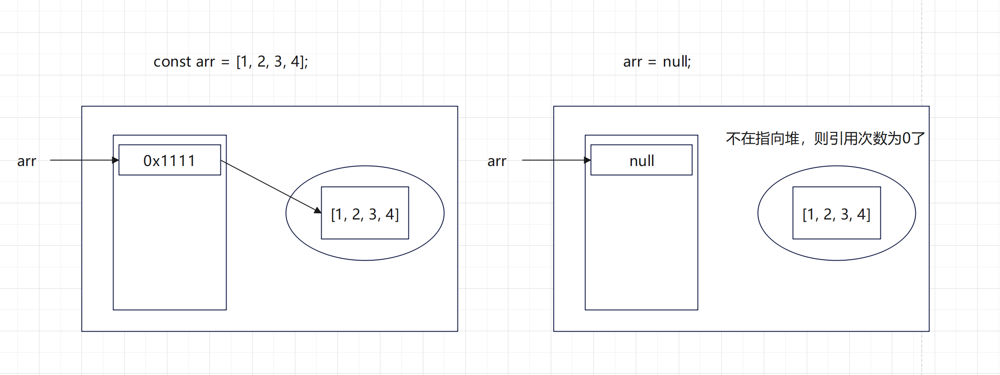

```js
let person = {
	age: 18;
	name:'Judy'
}
let p = person
person = 1
p = null
```

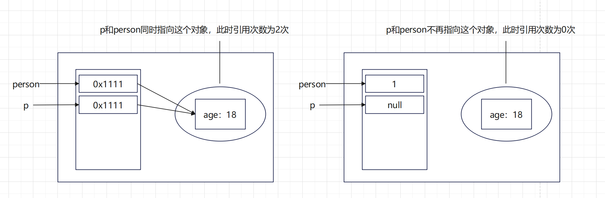

> [!note]
>
> **致命问题:嵌套引用**
>
> 如果两个对象相互引用，尽管他们已经不再使用，垃圾回收器并不会回收，最终导致内存泄漏
>
> ```js
> function fn() {
>   let o1 = {};
>   let o2 = {};
>   o1.a = o2;
>   o2.a = o1;
> }
> ```
>
> 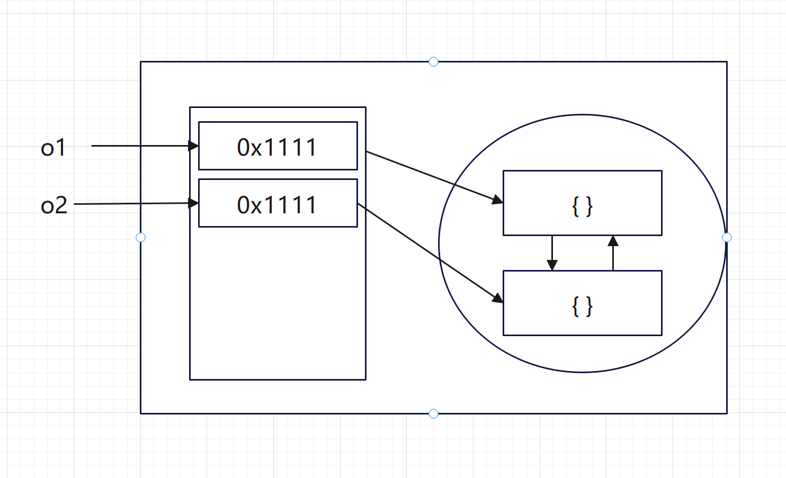
>
> 函数执行完仍然相互指引，所以不会被回收

#### 标记清除法

1.标记清除算法将“不再使用的对象”定义为“`无法达到的对象`”。
2.就是从`根部`（在JS中就是全局对象）出发定时扫描内存中的对象。凡是能从`根部到达`的对象，都是还`需要使用`的。
3.那些无法由根部出发触及到的对象被标记为不再使用，稍后进行回收。

```js
function fn() {
  let o1 = {};
  let o2 = {};
  o1.a = o2;
  o2.a = o1;
}
```

> 函数执行完毕后，根部(全局)已经访问不到(函数内部)，所以自动清除

## 闭包

> 一个函数对周围状态的引用捆绑在一起，内层函数中访问到其外层函数的作用域
>

**闭包 = 内层函数 + 外层函数的变量**

```html
<script>
  function outer() {
    const a = 1;
    function f() {
      console.log(a);
    }
    f();
  }
  outer();
</script>
```


### 私有变量

利用闭包实现私有变量，只能被Increment函数访问和修改，而不能被外部直接访问

```js
      function counter() {
        let count = 0;

        return function () {
          return ++count;
        };
      }

      const increment = counter();
      // 相当于 counter()的返回值被赋值给了increment
    //   inrement = function() {return ++count}
    // 实现了私有变量count 只能被Increment函数访问和修改，而不能被外部直接访问
      console.log(increment()); //1
      console.log(increment()); //2
```

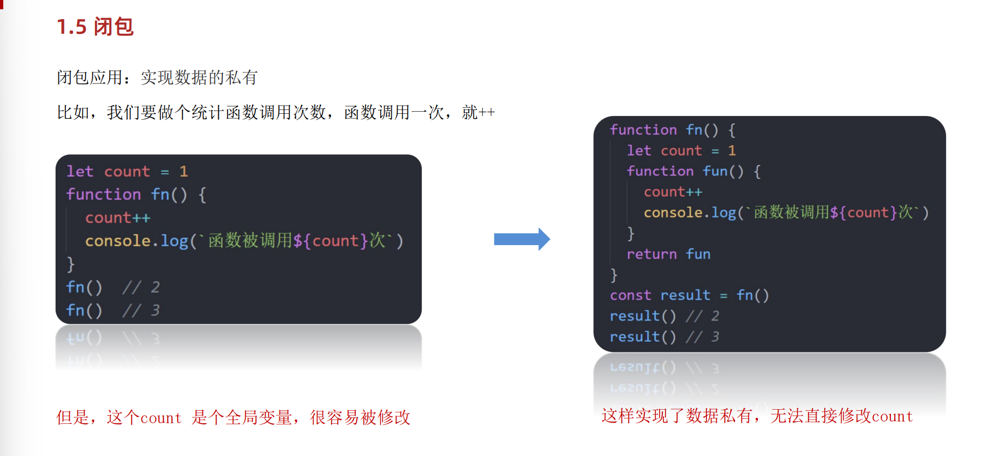

### 可能引起的问题

内存泄漏 右图的count不会被回收，因为fun一直在使用

## 变量提升

仅存在于var声明的变量 详见JavaScript语法部分

## 函数参数

### 动态参数`arguments`

返回值为**伪数组**

```html
<script>
  function getSum() {
    // arguments 动态参数 只存在于函数里面
    // 是个伪数组
    console.log(arguments);
  }
  getSum(2, 3, 4, 5);
</script>
```

### 剩余参数 `...`

剩余参数允许我们将一个不定数量的参数表示为一个**数组**

```html
<script>
  function getSum(...arr) {
    console.log(arr);
  }
  getSum(2, 3, 4);
</script>
```

```html
<script>
  function getSum(a, b, ...arr) {
    //传至少2个参数
    console.log(a); //1
    console.log(b); //2
    console.log(arr); //[3, 4, 5]
  }
  getSum(1, 2, 3, 4, 5);
</script>
```

可以将**数组元素逐个输出**

```js
const arr = [1, 2, 3, 4, 5];
console.log(...arr); //1 2 3 4 5
console.log(arr); //[1, 2, 3, 4, 5]
```

可直接用于获取**数组的最大最小值**

```js
console.log(Math.max(1, 2, 3, 4, 5)); //5
console.log(Math.max(arr)); //NaN
console.log(Math.max(...arr)); //5
console.log(Math.min(...arr)); //1
```

可用于**数组合并**

```js
      const arr2 = [6, 7, 8, 9];
      const arr3 = [...arr, ...arr2];
      console.log(...arr3);
```

### 差别

1. ... 是语法符号，置于最末函数形参之前，用于获取多余的实参 
2. 借助 ... 获取的剩余实参，是个真数组
3. **`剩余参数`用于将多个参数表示为一个数组，而`展开运算符`用于将数组或对象展开为独立的元素**

**还是提倡多使用 剩余参数**

## 箭头函数

> ==为什么用箭头函数？啥时候用？==
>
> 反正没有逻辑部分就是单纯的返回值 就写成箭头函数的形式 简单便捷

### 基本用法

箭头函数更适用于那些本来**需要匿名函数的地方**

```js
const fn2 = (x) => {
  console.log(x);
};
fn2(1);
```

> 1. 只有一个形参的时候可以省略小括号
> 2. 只有一行代码的时候，我们可以省略大括号 和 return

```js
const fn3 = x => x + x;
```

==Attention❗❗❗❗❗==

在箭头函数中,如果只有一个`表达式作为返回值`,可以省略 `return` 关键字。但是,如果这个`表达式是一个字符串字面量`,**它会被当作函数体而不是返回值**。

```js
let lists = list.map((areaName) => `<li class="list-group-item">${areaName}</li>`).join("");
此处该字符串为空 因为map中的箭头函数没有使用return为关键字 导致html语句被当做函数体而不是返回值 
//正确写法 使用return关键字
let lists = list
  .map((areaName) => {
    return `<li class="list-group-item">${areaName}</li>`;
  })
  .join("");
//或者使用括号包裹表达式,以隐式返回:
let lists = list
  .map((areaName) => (`<li class="list-group-item">${areaName}</li>`))
  .join("");
```

**利用箭头函数返回对象**

加括号的函数体返回对象字面量表达式

```js
const fn3 = (uname, gender) => ({ uanme: uname, gender: gender }); //🔴对象 {属性名，形参/属性值}
console.log(fn3("我", "女"));
```

**在箭头函数中使用剩余参数...**

```js
const fn4 = (...arr) => arr;
console.log(fn4(1, 2, 3, 4));
```

### 箭头参数参数

1. 普通函数有arguments动态参数
2. 箭头函数`没有arguments`动态参数，但是有`剩余参数...args`

### 箭头函数this

> 1. 引入箭头函数的目的是更简短的函数写法并且不绑定this，箭头函数的语法比函数表达式更简洁
>
> 2. 中【使用箭头函数前需要考虑函数中 this 的值】，事件回调函数使用箭头函数时，this 为全局的 window，因此**DOM事件回调函数为了简便，还是不太推荐使用箭头函数**
>
>    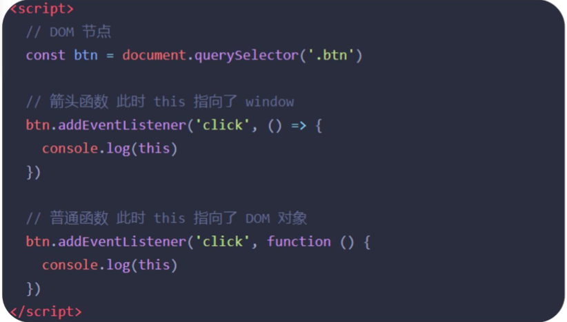

**箭头函数不会创建自己的this,它只会从自己的作用域链的上一层沿用this。**

```js
//   this 谁调用的这个函数 this就执行谁
console.log(this); //window
function fn5() {
  console.log(this); //window
}
fn5(); // window.fn5()

const obj = {
  name: "Namy",
  sayHi: function () {
    console.log(this); //obj
  },
};
obj.sayHi();

const fn6 = () => {
  console.log(this);
  //🔴window 这一层没有找到，只能去上一层作用域找，所以是window
};
fn6();
//   对象方法的箭头函数的this
const obj2 = {
  uname: "Lucy",
  sayHi: () => {
    console.log(this); //window
  },
};
obj2.sayHi(); //箭头函数没有this 指向，所以来到上一层作用域，可以发现在对象中this指向是window

const obj3 = {
  uname: "jojo",
  sayHi: function () {
    const fn7 = () => {
      console.log(this); //obj3,箭头函数内部没有this，上一级函数作用域有this，obj调用的这个函数
    };
    fn7();
  },
};
obj3.sayHi();
```

## 解构赋值

> **我们可以从数组和对象中提取数据并将其赋值给变量。**

### 数组解构

数组解构是将数组的单元值快速批量赋值给一系列变量的简洁语法。

```js
// 基础赋值
const [a, b, c] = [1, 2, 3];
console.log(a);
console.log(b);
console.log(c);

//二维数组
const [a, b, [c, d]] = [1, 2, [3, 4]];
console.log(a);
console.log(b);
console.log(c);

// 交换两个变量
let m = 1;
let n = 3;
[m, n] = [n, m];
console.log(m, n);

//变量多 单元值少
const [a, b, c, d] = [1, 2, 3];
console.log(a); //1
console.log(b); //2
console.log(c); //3
console.log(d); //undefined

//变量少 单元值多
const [x, y, z] = [1, 2, 3, 4];
console.log(x); //1
console.log(y); //2
console.log(z); //3

//利用剩余参数解决变量少 单元值多的情况
const [m, n, ...other] = [1, 2, 3, 4, 5];
console.log(m); //1
console.log(n); //2
console.log(...other); //3 4 5

//防止有undefined传递单元值的情况，可以设置默认值
const [j = "手机", k = "华为"] = ["小米"];
console.log(j); //小米
console.log(k); //华为

//按需导入，忽略某些返回值
const [q, , w, e] = [1, 2, 3, 4];
console.log(q); //1
console.log(w); //3
console.log(e); //4
```

### 对象解构

对象左侧的变量应与对象 `person` 中的属性键具**有相同的名称**。如果名称不同，将显示 `undefined`：

```js
let person = {name: "Sarah", country: "Nigeria", job: "Developer"};

let {name, friends, job} = person;

console.log(name);//"Sarah"
console.log(friends);//undefined
```

出现变量名冲突 **可改名**

```html
旧变量名: 新变量名
```

```js
const name = "aaa";
//   const { name, age } = { name: "daniang", age: 18 };
// ⭐出现变量名冲突 可改名 旧变量名：新变量名
const { name: username, age } = { name: "daniang", age: 18 };
console.log(username);
console.log(age);
```

### 对象数组解构

```js
const pig = [
{
uname: "佩奇",
uage: 18,
},
{
uname: "李想",
uage: "22",
},
];
const [{ uname, uage }] = pig;
//⭐只会输出第一个对象
console.log(uname);
console.log(uage);

// ⭐使用 map 提取每个对象的 uname 和 uage
const users = pig.map(({ uname, uage }) => ({ uname, uage }));
console.log(users); //对象数组
// 打印每个用户的信息
users.forEach(({ uname, uage }) => {
console.log(`用户名: ${uname}, 年龄: ${uage}`);
});
```

### 多级对象解构

```html
<script>
  const pig = {
    name: "佩奇",
    family: {
      mother: "猪妈妈",
      father: "猪爸爸",
      sister: "乔治",
    },
    age: 6,
  };
  const {
    name,
    family: { mother, father, sister },
    age,
  } = pig;
  console.log(name);
  console.log(mother);
  console.log(father);
  console.log(sister);
  console.log(age);
</script>
```

### 例题-渲染商品列表

> 1. 利用`forEach`加上`解构`的方法获取列表的name, price, picture
> 2. 老样子，使用`render函数`进行渲染，内部是利用`字符串拼接`的方式，最后在外部调用函数
> 3. 针对不同的类别的商品进行一个筛选，要用到`Array.flter()`方法进行筛选，每一次都点击都重新获取数组并渲染这个重新生成的数组，但记住该数组的初始值结尾全列表...我不想再解释了

```html
<!DOCTYPE html>
<html lang="en">
  <head>
    <meta charset="UTF-8" />
    <meta http-equiv="X-UA-Compatible" content="IE=edge" />
    <meta name="viewport" content="width=device-width, initial-scale=1.0" />
    <title>商品渲染</title>
    <style>
      * {
        margin: 0;
        padding: 0;
        box-sizing: border-box;
      }

      .list {
        width: 990px;
        margin: 0 auto;
        display: flex;
        flex-wrap: wrap;
      }

      .item {
        width: 240px;
        margin-left: 10px;
        padding: 20px 30px;
        transition: all 0.5s;
        margin-bottom: 20px;
      }

      .item:nth-child(4n) {
        margin-left: 0;
      }

      .item:hover {
        box-shadow: 0px 0px 5px rgba(0, 0, 0, 0.2);
        transform: translate3d(0, -4px, 0);
        cursor: pointer;
      }

      .item img {
        width: 100%;
      }

      .item .name {
        font-size: 18px;
        margin-bottom: 10px;
        color: #666;
      }

      .item .price {
        font-size: 22px;
        color: firebrick;
      }

      .item .price::before {
        content: "¥";
        font-size: 14px;
      }

      .filter {
        display: flex;
        width: 990px;
        margin: 0 auto;
        padding: 50px 30px;
      }

      .filter a {
        padding: 10px 20px;
        background: #f5f5f5;
        color: #666;
        text-decoration: none;
        margin-right: 20px;
      }

      .filter a:active,
      .filter a:focus {
        background: #05943c;
        color: #fff;
      }
    </style>
  </head>

  <body>
    <div class="filter">
      <a data-index="1" href="javascript:;">0-100元</a>
      <a data-index="2" href="javascript:;">100-300元</a>
      <a data-index="3" href="javascript:;">300元以上</a>
      <a href="javascript:;">全部区间</a>
    </div>
    <div class="list">
      <!-- <div class="item">
      
      <p class="name"></p>
      <p class="price"></p>
    </div> -->
    </div>
    <script>
      // 2. 初始化数据
      const goodsList = [
        {
          id: "4001172",
          name: "称心如意手摇咖啡磨豆机咖啡豆研磨机",
          price: "289.00",
          picture:
            "https://yanxuan-item.nosdn.127.net/84a59ff9c58a77032564e61f716846d6.jpg",
        },
        {
          id: "4001594",
          name: "日式黑陶功夫茶组双侧把茶具礼盒装",
          price: "288.00",
          picture:
            "https://yanxuan-item.nosdn.127.net/3346b7b92f9563c7a7e24c7ead883f18.jpg",
        },
        {
          id: "4001009",
          name: "竹制干泡茶盘正方形沥水茶台品茶盘",
          price: "109.00",
          picture:
            "https://yanxuan-item.nosdn.127.net/2d942d6bc94f1e230763e1a5a3b379e1.png",
        },
        {
          id: "4001874",
          name: "古法温酒汝瓷酒具套装白酒杯莲花温酒器",
          price: "488.00",
          picture:
            "https://yanxuan-item.nosdn.127.net/44e51622800e4fceb6bee8e616da85fd.png",
        },
        {
          id: "4001649",
          name: "大师监制龙泉青瓷茶叶罐",
          price: "139.00",
          picture:
            "https://yanxuan-item.nosdn.127.net/4356c9fc150753775fe56b465314f1eb.png",
        },
        {
          id: "3997185",
          name: "与众不同的口感汝瓷白酒杯套组1壶4杯",
          price: "108.00",
          picture:
            "https://yanxuan-item.nosdn.127.net/8e21c794dfd3a4e8573273ddae50bce2.jpg",
        },
        {
          id: "3997403",
          name: "手工吹制更厚实白酒杯壶套装6壶6杯",
          price: "99.00",
          picture:
            "https://yanxuan-item.nosdn.127.net/af2371a65f60bce152a61fc22745ff3f.jpg",
        },
        {
          id: "3998274",
          name: "德国百年工艺高端水晶玻璃红酒杯2支装",
          price: "139.00",
          picture:
            "https://yanxuan-item.nosdn.127.net/8896b897b3ec6639bbd1134d66b9715c.jpg",
        },
      ];
      // 渲染函数
      function render(arr) {
        let str = "";
        arr.forEach((item) => {
          // 2. 利用字符串拼接生成的结构添加到页面中
          const { name, price, picture } = item;
          str += `
          <div class="item">
            
            <p class="name">${name}</p>
            <p class="price">${price}</p>
          </div>
        `;
        });
        document.querySelector(".list").innerHTML = str;
      }
      render(goodsList);

      // 过滤筛选
      document.querySelector(".filter").addEventListener("click", (e) => {
        const { tagName, dataset } = e.target; //e.target是个对象
        // 判断 利用fl=ilter方法
        if (tagName === "A") {
          let arr = goodsList; //返回的新数组 要求初始值必须为全部列表数据 这样在最后一个类别“全部”中就会正常显示
          if (dataset.index === "1") {
            arr = goodsList.filter(
              (item) => item.price > 0 && item.price <= 100
            );
          } else if (dataset.index === "2") {
            arr = goodsList.filter(
              (item) => item.price > 100 && item.price <= 200
            );
          } else if (dataset.index === "3") {
            arr = goodsList.filter(
              (item) => item.price > 200 && item.price <= 300
            );
          }
          console.log(arr);
          render(arr);
        }
      });
    </script>
  </body>
</html>
```

## 深入对象

### 创建对象的三种方式

1. 利用对象字面量创建对象

   ```js
   const o = {
   	name: "佩奇"
   }
   ```

2. 利用new Object创建对象

   ```js
   const o = new object({ name: "佩奇"})
   const obj = new Object()
   obj.sex = "pink老师"
   ```

3. 利用构造函数创建对象

### 构造函数

可以通过构造函数来快速创建多个类似的对象

规定：

1. 命名必须以`大写字母`开头
2. 它们只能由`new`操作符来执行

> **执行流程**
>
> 1. 立刻创建一个新的对象。
> 2. 将新建的对象设置为**函数**的this，在**构造函数**中可以使用this来引用新建的对象。
> 3. 逐行**执行函数**中的代码。
> 4. 将新建的对象作为返回值返回。

```js
// 直接赋值类型
var Vehicle = function () {
  this.price = 1000;
};

var v = new Vehicle();
v.price // 1000

// 传参类型
function Pig(name, age) {
  this.name = name; //对象.属性值 = 形参
  this.age = age;
}
const Pappa = new Pig("佩奇", 6);
const George = new Pig("乔治", 3);
console.log(Pappa);
console.log(George);
```

> [!note]
>
> 1. 使用new关键字调用函数的行为被称为`实例化`
> 2. 构造函数内部无需写return,返回值即为新创建的对象
> 3. 构造函数内部的return返回的值无效，所以`不要写return`
> 4. new Object new Date（)也是`实例化构造函数`

### 实例化

**使用new关键字调用函数的行为被称为实例化**

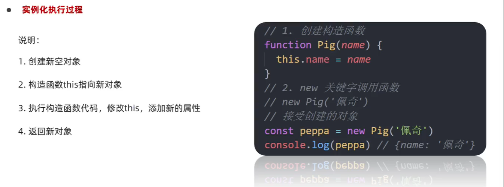

### 实例成员

通过`构造函数创建`的对象称为`实例对象`，实例对象中的属性和方法称为`实例成员`。

```js
function Person() {
	this.name = '小明'
	this.sayHi = function() {
		console.log("hello")
	}
}

const p1 = new Person() //p1是构造函数的实例对象
console.log(p1.name); //访问实例属性
p1.sayHi();	//调用实例方法
```

### 静态成员

`构造函数`的属性和方法被称为`静态成员`。

- 静态对象是直接附加在构造函数本身上的属性和方法。
- 静态对象不是通过实例化创建的,而是直接定义在构造函数上
- 静态成员方法中的this 指向构造函数本身

```js
function Person(name, age) {}

//静态属性
Person.eyes = 2;
parson.arms = 2;
//静态方法
Person.walk = function() {
	console.log("人人都会走路");
	//this 指向Person
	console.log(this.eyes);
}
```

### 比较

o.eyes 就是静态属性 Obbject.eyes 就是实例成员

## 编程思想

### 面向过程

面向过程就是分析出解决问题所需要的步骤，然后用函数把这些步骤一步一步实现，使用的时候再一个一个的依次调用就可以了。(蛋炒饭)

### 面向对象

面向对象是把事务分解成为一个个对象，然后由对象之间分工与合作。(盖浇饭)

**面向对象是以对象功能来划分问题，而不是步骤。**

### 二者对比

#### 面向过程编程

优点：性能比面向对象高，适合跟硬件联系很紧密的东西，例如单片机就采用的面向过程编程。

缺点：没有面向对象易维护、易复用、易扩展

#### 面向对象编程

特点：继承性、封装性、多态性

优点：易维护、易复用、易扩展，由于面向对象有封装、继承、多态性的特性，可以设计出低耦合的系统，使系统更加灵活、更加易于维护

缺点：性能比面向过程低

### 例题

```html
<!DOCTYPE html>
<html lang="en">
  <head>
    <meta charset="UTF-8" />
    <meta name="viewport" content="width=device-width, initial-scale=1.0" />
    <title>Document</title>
  </head>
  <body>
    <!-- 采用面向对象思想完成 -->
    <button id="delete">删除</button>
    <button id="login">登录</button>
    <script>
      function Model(title = "", message = "") {
        // 1. ⭐创建 Model 模态盒子

        // 1.1 创建div标签
        // 注意要用this 使其指向当前的ModelBox
        // 🔴 modelBox 相当于是Model的属性值
        this.modelBox = document.createElement("div");
        console.log(typeof this.modelBox); //Object
        /* 🔴 在 JavaScript 中,DOM 元素是一种特殊的对象类型,
        它们是由浏览器提供的对象,而不是由 JavaScript 原生定义的。
        因此,当你打印 this.modelBox 时,它会显示为 Object。*/

        // 1.2 给div标签添加类名 Model
        this.modelBox.className = "model";

        // 1.3 Model盒子内部填充两个 div标签 并修改文字内容
        this.modelBox.innerHTML = `
        <div class = "header">${title}<i>x</i></div>
        <div class = "body">${message}</div> 
        `;
      }

      //   2. 在构造函数的prototype上挂载 open 方法
      Model.prototype.open = function () {
        // 🔴 防止重复出现模态框 要进行判断
        // 判断页面中有没有模态框 有则先删除 没有则添加
        const box = document.querySelector(".model");
        box && box.remove(); //逻辑与中断
        document.body.append(this.modelBox);
        // 🔴 关闭小叉叉 调用外部close方法
        this.modelBox.querySelector("i").addEventListener("click", () => {
          this.close(); //🔴此处需要使用箭头函数，因为箭头函数没有this,从而指外面一层实例对象modelBox
        });
      };

      //   3. 在构造函数的prototype上挂载 close 方法
      Model.prototype.close = function () {
        this.modelBox.remove();
      };

      //   4. 实例化
      //   4.1 删除按钮
      document.querySelector("#delete").addEventListener("click", () => {
        //      4.1.1 利用 Model构造函数 实例化对象
        const del = new Model("温馨提示", "您没有权限删除操作");
        //      4.1.2 调用prototype上挂载的open方法
        del.open();
      });
      //   4.2 登录按钮
      document.querySelector("#login").addEventListener("click", () => {
        const login = new Model("友情提示", "您还没有注册账号");
        login.open();
      });
    </script>
  </body>
</html>

```

## 原型

### 构造函数

**封装是面向对象思想中比较重要的一部分，js面向对象可以通过构造函数实现的封装。**

1. 构造函数体现了`面向对象的封装特性`
2. 构造函数实例创建的对象彼此独立、互不影响

> **问题**:存在浪费内存的问题 (原型很好的解决了这个问题),相同功能的函数开辟了两个内存空间.
>
> **解决方法**：将相同的功能挂载到prototype(原型)上

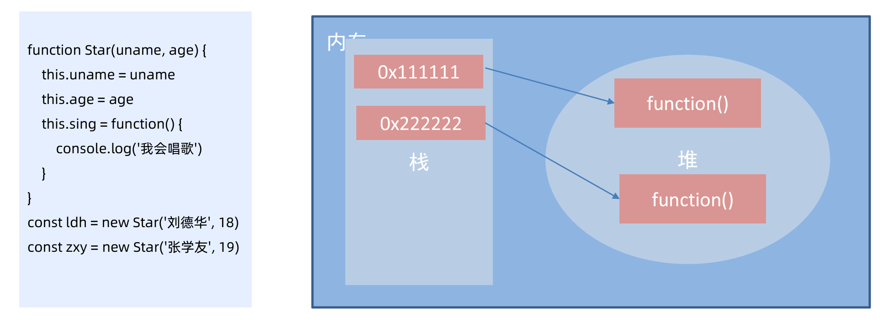

### prototype (原型对象)

每一个`构造函数`都有一个`prototype 属性`，指向另一个`对象`，所以我们也称为**原型对象**。

**作用**：这个对象`可以挂载函数`，对象实例化不会多次创建原型上函数，`节约内存`。我们可以把那些不变的方法，直接定义在prototype 对象上，这样所有对象的实例就可以共享这些方法。

> 1. 构造函数通过原型分配的函数是所有对象所`共享的`。
>3. **构造函数和原型对象中的`this`都指向`实例化的对象`**

```html
<script>
  function Star(name, age) {
    this.name = name;
    this.age = age;
    // this.sing = function () {
    //   console.log("sing");
    // };
  }
  const ldh = new Star("刘德华", 55);
  const zxy = new Star("张学友", 58);
  console.log(Star.prototype); //object载
  // 公共的方案写到原型对象
  Star.prototype.sing = function () {
    console.log("sing");
  };
  zxy.sing();
</script>
```

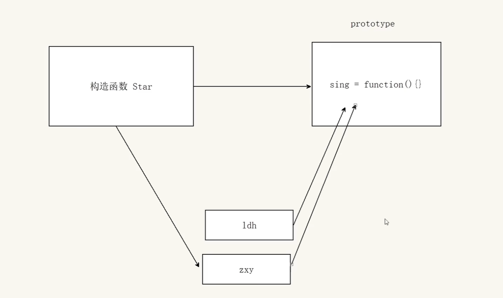

### constructor属性

每个原型对象里面都有个constructor属性，该属性`指向`该原型对象的`构造函数`。

**作用**：当我们对prototype进行赋值时，则会导致找不到原型型对象，此时则需要constructor属性指向原构造函数

### prototype 挂载函数的用法

```js
Star.prototype = {
        //2.🔴 则需要重新指回原型对象的构造函数
        constructor: Star,
        sing: function () {
          console.log("sing");
        },
        dance: function () {
          console.log("dance");
        },
      };
      console.log(Star.prototype); //1. 没有constructor,则不知道该原型对象属于哪一个构造函数了
```

### 对象原型

对象都会有一个属性`__proto__ ` 指向构造函数的prototype 原型对象，之所以我们对象可以使用构造函数prototype 原型对象的属性和方法，就是因为对象有`__proto__ `原型的存在。

- `[[prototype]]`和`__proto__`意义相同.

- `__proto__`对象原型里面也有一个`constructor属性`，指向创建该实例对象的构造函数

1. **constructor属性 均指向构造函数**
2. **对象原型指向原型对象**
3. **原型对象 和 对象原型 均来自于构造函数**

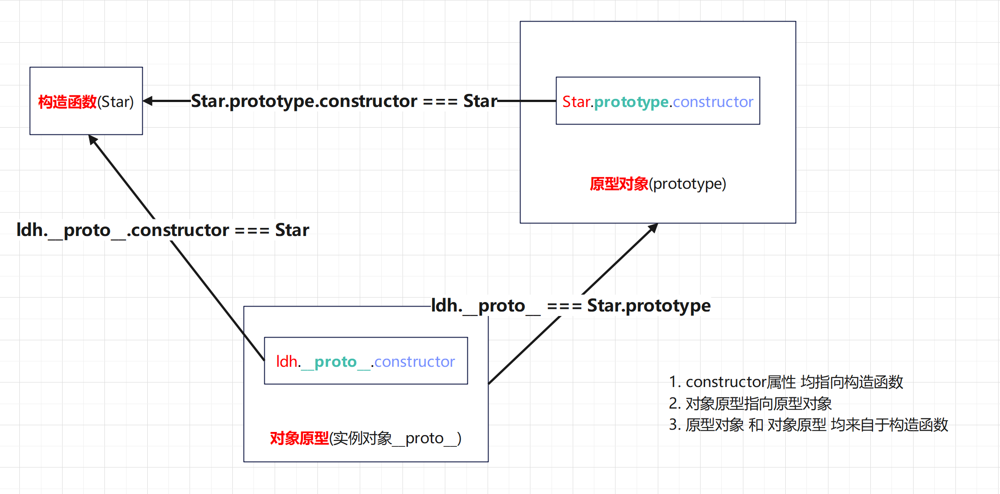

### 原型继承

#### 问题抛出

> 在使用protoytpe 赋值时，会发现对任意一个使用该属性的构造函数单独添加方法/属性，其余的构造函数也会自动添加，因为他们的prototye均指向同一个Person

```js
const Person = {
  eyes: 2,
  head: 1,
};
// 男人
function Man() {};
Man.prototype = People
Man.prototype.constructor = Man
const Pink = New Man();
// 给男人添加一个方法
Man.prototype.smoking = function() {}
// 女人
function Woman() {};
Woman.prototype = People
Woman.prototype.constructor = Woman
const Ziyi = New Woman();
console.log(Ziyi) //发现女的也有男的方法
```

#### 解决方法

> 再次抽取构造函数，利用原型继承的方法。**利用构造函数生成不同的对象** ，避免男人女人有相同的方法
>
> 父构造函数(父类) 子构造函数(子类)
>
> **子类的原型 = new 父类**

```js
function Person() {
  this.eyes = 2;
  this.head = 1;
}
//   🔴原型继承
Woman.prototype = new Person();
Man.prototype = new Person();
```


### 原型链 prototype chain

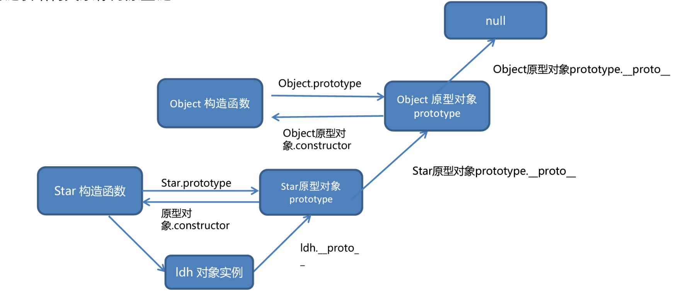

Every object in JavaScript has a built-in property, which is called its **prototype**. The prototype is itself an object, so the prototype will have its own prototype, making what's called a **prototype chain**. The chain ends when we reach a prototype that has `null` for its own prototype.
JavaScript 中的每个对象都有一个内置属性，该属性称为其**原型**。原型本身就是一个对象，所以原型将有自己的原型，形成所谓的**原型链**。当我们到达一个原型时，链结束，该原型具有 `null` 作为其自己的原型。

```js
const myObject = {
  city: "Madrid",
  greet() {
    console.log(`Greetings from ${this.city}`);
  },
};

myObject.greet(); // Greetings from Madrid
```

这是一个具有一个数据属性 `city` 和一个方法 `greet()` 的对象。如果在控制台中键入对象的名称，后跟句点，如 `myObject.`，则控制台将弹出此对象可用的所有属性的列表。你会看到，除了 `city` 和 `greet` 之外，还有很多其他属性！

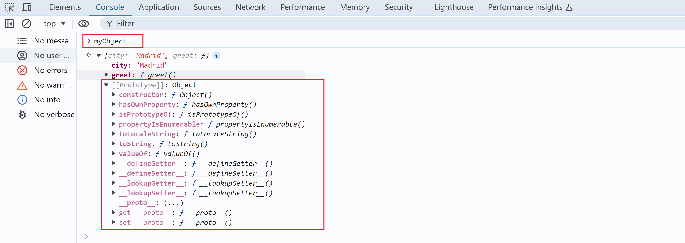

When you try to access a property of an object: if the property can't be found in the object itself, the prototype is searched for the property. If the property still can't be found, then the prototype's prototype is searched, and so on until either the property is found, or the end of the chain is reached, in which case `undefined` is returned.
当您尝试访问对象的属性时：如果在对象本身中找不到该属性，则会在原型中搜索该属性。如果仍然找不到该属性，则搜索原型的原型，依此类推，直到找到该属性或到达链的末端，在这种情况下返回 `undefined`。

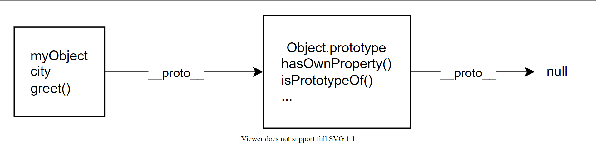

So when we call `myObject.toString()`, the browser:

- looks for `toString` in `myObject`
- can't find it there, so looks in the prototype object of `myObject` for `toString`
- finds it there, and calls it.

### `__proto__` vs `prototype`

`__proto__` is the actual object that is used in the lookup chain to resolve methods, etc. `prototype` is the object that is used to build `__proto__` when you create an object with `new`:
`__proto__` 是在查找链中用于解析方法等的实际对象。 `prototype` 是使用 `new` 创建对象时用于构建 `__proto__` 的对象：

```js
( new Foo ).__proto__ === Foo.prototype
( new Foo ).prototype === undefined
```

**JavaScript 中 `Object` 的内置方法和属性确实是通过 `Object.prototype` 进行构建的。**

### 利用`instanceof`查找是否在该原型链上

```html
<script>
  // instanceof
  function Person() {}
  const ldh = new Person();
  console.log(ldh instanceof Person); //true
  console.log(ldh instanceof Object); //true
  console.log(toString instanceof Object); //true
  console.log(toString instanceof Person); //false
  console.log(Array instanceof Object); //true 万物皆对象
</script>
```

### 例题

自己定义求max / min / sum 的函数，实现任何数组的实例对象都能使用

```html
<script>
  const arr = [1, 2, 3];
  // 相当于 const arr = new Array(1,2,3);
  //   1. 最大值
  Array.prototype.max = function () {
    return Math.max(...this);
    // 原型函数里面的this 指向实例对象 arr 不需要传参了
  };
  //   2. 最小值
  Array.prototype.min = function () {
    return Math.min(...this);
  };
  //   3. 求和
  Array.prototype.sum = function () {
    return this.reduce((prev, current) => prev + current, 0);
  };
  console.log(arr.max());
</script>
```

## class类

> ES6 的`class`可以看作只是一个语法糖，新的`class`写法只是让对象原型的写法更加清晰、更像面向对象编程的语法而已。**ES6 的类，完全可以看作构造函数的另一种写法。**
>
> **1. class 中函数声明不需要function**
>
> **2. class可以直接写赋值语句 不需要关键字声明**

```js
class Point {
  constructor(x, y) {
    this.x = x;
    this.y = y;
  }
  a = 1

  toString() {
    return '(' + this.x + ', ' + this.y + ')';
  }
}
```

`constructor()`方法就是`构造方法`,`this` 关键字则代表实例对象。构造器不是必须写的，要对实例进行初始化的操作，如添加指定属性时才写。

### class类中的方法

当你使用 class 语法定义一个类时,class 内部的方法声明会被自动添加到该`类的原型`上。这意味着这些方法可以被该类的所有`实例共享访问`,而不是每个实例都有一份独立的拷贝。其实和构造函数同理啦。

### class类的继承

- Class 可以通过`extends`关键字实现继承，让子类继承父类的属性和方法。
- 子类的`constructor()`方法也`不是必须写的`，如果只是当单纯的想继承父类的属性和方法，不额外添加，可以只写如下形式，照样正常传参。

```js
class Student extends Person {
	
}

const stu1 = new Student{'tom', 18}; //正常输出该学生的属性值
```

- 子类必须在`constructor()`方法中调用`super()`，且得写在最前面，否则就会报错。这是因为子类自己的`this`对象，必须先通过父类的构造函数完成塑造，得到与父类同样的实例属性和方法。

- 类中所定义的原型方法，都是放在类的原型对象上。


```html
<script>
  // 创建一个Person类
  class Person {
    // 构造器方法
    constructor(name, age) {
      this.name = name;
      this.age = age;
    }
    // 一般方法
    Speak() {
      //🔴speak()方法放在了Person的原型对象上,供实例使用
      console.log(`我叫${this.name}, 我的年龄是${this.age}`);
    }
  }

  //   创建一个Student类继承Person类
  class Student extends Person {
    constructor(name, age, grade) {
      super(name, age); //必须写在前面
      this.grade = grade;
    }

    // 重写从父类继承的方法
    Speak() {
      console.log(
        `我叫${this.name}, 我的年龄是${this.age}, 我读的是￥{this.grade}年级`
      );
    }
    Study() {
      console.log("Study hard");
    }
  }
  //   创建一个Person类的实例对象
  const p1 = new Person("tom", 18);
  const s1 = new Student("小张", 15, "一年级");
  console.log(p1); //无法找到Speak()方法
  console.log(s1);
  console.log(Person.prototype); //->Speak()
  console.log(Student.prototype); //->Person {}
  p1.Speak();
</script>
```

### class中的this指向

**将一个实例对象的方法赋值给另一个变量，此时该方法的this指向会改变**

```js
p1.speak(); 此时speak中的this指向就是该实例对象
```

```js
const x = p1.speak;
x(); 此时speak中的this指向是window,而由于类中所定义的方法自动开启严格模式，导致this指向为undefined
```

```html
    <script>
      class Person {
        constructor(name, age) {
          this.name = name;
          this.age = age;
        }
        speak() {
          console.log(this);
        }
      }
      const p1 = new Person("tom", 18);
      p1.speak(); //通过实例调用speak方法 输出Person类的实例
      const x = p1.speak;
      //🔴类中所定义的 方法自动开启严格模式 和babel没有关系
      x(); // 此时为函数的直接调用 this 指向的就是window 严格模式下则是undefined
    </script>
```

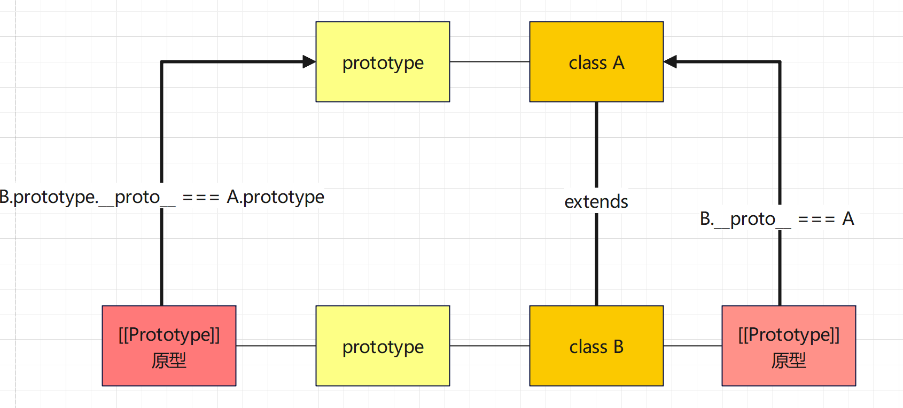

## 深浅拷贝

### 数据类型

> To really understand copying, you have to get into how JavaScript stores values.

#### Primitive data types

- Number — e.g. `1`
- String — e.g. `'Hello'`
- Boolean — e.g. `true`
- `undefined`
- `null`

When you make a copy, it will be a real copy. 原值不会受到影响

#### Composite data types

**Objects and Arrays 才存在深浅拷贝**

### 浅拷贝

**拷贝的是地址,只适合内部为`简单数据类型的拷贝`（单层对象）**

> - 对象的属性值为简单数据类型 则直接拷贝值 故原对象的属性值不会更改
>
> -  对象的属性值为复杂数据类型则拷贝的是地址 所以会更改

常见方法：

1. 拷贝对象：`Object.assgin()` / 展开运算符 `{...obj} `拷贝对象

2. 拷贝数组：`Array.prototype.concat() `  或者 `[...arr]`

```html
<script>
  const obj = {
    name: "pink",
    age: 18,
    family: {
      baby: "小pink",
    },
  };
  const o = obj;
  //   🔴直接赋值 相当于复制的是地址 原属性值会被一同修改
  o.age = 20;
  console.log(obj.age); //20 原对象的属性值夜被更改了
  //   浅拷贝 只适合内部为简单数据类型的拷贝（单层对象）
  const oo = { ...obj };
  const ooo = {};
  Object.assign(ooo, obj);
  oo.age = 28;
  ooo.age = 29;
  ooo.family.baby = "老pink";
  console.log(`obj.age = ${obj.age}`); //20 未改变属性值
  console.log(obj); // 此时的对象的内置对象的属性值被更改
  //   🔴 对象的属性值为简单数据类型 则直接拷贝值 故原对象的属性值不会更改
  //   复杂数据类型则拷贝的是地址 所以会更改
</script>
```

### 深拷贝

**新对象不会影响旧对象**

#### 递归函数实现

> **一定要先判断是否为数组再判断是否为对象**(因为数组也属于对象，所以要先筛选数组)

```html
<script>
  const obj = {
    name: "pink",
    age: 18,
    hobby: ["游泳", "摄影"],
    language:{
      English: "fluent",
      Chinese: "native"
    }
  };
  const o = {};
  // 拷贝函数
  function deepCopy(newObj, oldObj) {
    // 遍历对象
    for (let k in oldObj) {
      // 先判断属性值是否为数组
      if (oldObj[k] instanceof Array) {
        newObj[k] = [];
        deepCopy(newObj[k], oldObj[k]);
      // 后判断属性值是否为对象
      } else if(oldObj[k] instanceof Onject) {
        newObj[k] = {};
        deepCopy(newObj[k], oldObj[k]);
      } else {
        // k 属性名 oldObj[k] 属性值
        newObj[k] = oldObj[k];
      }
    }
  }
  deepCopy(o, obj);
  o.age = 20;
</script>
```

解释: 当hobby 进入到deepCopy函数中时

```js
oldObj[k] = hobby (属性值为数组)
```

```js
newObj[k] = [  ]  
//表示新属性值为空数组
```

```js
deepCopy(newObj[k], oldObj[k])
//deepCopy(新属性名 = []，旧属性名 = hobby)
//再次调用deepCopy函数 此时传递的参数为([], hobby)
//此时 k 会变为数组的索引号 newObj[k] 为数组元素
```

#### lodash实现

> 需要先引用js库才能使用
>
> ```html
> <script src="./lodash.min.js"></script>
> ```
>
> 这是一个js File 需要下载到本地

```html
    <script src="./lodash.min.js"></script>
    <script>
      const obj = {
        name: "pink",
        age: 18,
        hobby: ["乒乓球", "足球"],
        family: {
          baby: "小pink",
        },
      };
      const o = _.cloneDeep(obj);
      console.log(o);
      o.family.baby = "老baby";
      console.log(obj);
    </script>
```

#### JSON字符串转换实现

> `JSON.stringify()`把对象转换成JSON字符串，`JSON.parse()`把字符串转换成对象，则与原对象`失去关联` , 从而实现了深拷贝

```html
<script>
  const obj = {
    name: "pink",
    age: 18,
    hobby: ["乒乓球", "足球"],
    family: {
      baby: "小pink",
    },
  };
  const o = JSON.parse(JSON.stringify(obj));
  console.log(o);
  o.family.baby = "123";
  console.log(obj);
</script>
```

## 异常

### throw抛出异常

1. throw `抛出异常`信息，程序也会`终止执行`
2. throw 后面跟的是错误提示信息
3. Error 对象配合throw 使用，能够设置更详细的错误信息

```html
<script>
  function fn(x, y) {
    if (!x || !y) {
      //会中断程序
      // throw "用户没有传递参数"
      throw new Error("用户没有传递参数"); //且显示更详细的错误信息
    }
    return x + y;
  }
  console.log(fn());
</script>
```

### try catch 捕获异常

1. `try...catch `用于捕获错误信息(浏览器提供的错误信息) **不会自动终止程序，需要额外添加return终止**
2. 将预估可能发生错误的代码写在try代码段中 
3. 如果try代码段中出现错误后，会执行catch代码段，并截获到错误信息
4. `finally`不管是否有错误，都会执行

```html
<body>
  <p>123</p>
  <script>
    function fn() {
      try {
        // 可能发生错误的代码要写在这里面
        const p = document.querySelector(".p");
        p.style.color = "red";
      } catch (error) {
        //拦截错误 提示浏览器提供的错误信息 但是不中断程序的执行
        console.log(error.message);
        //需要额外加return终止程序
        //   return;
        //或者搭配throw 终止程序
        throw new Error("您看出错了吧");
      } finally {
        // 不管程序对不对一定会执行的代码
        alert("弹出对话框");
      }
    }
    fn();
  </script>
</body>
```

### debugger 

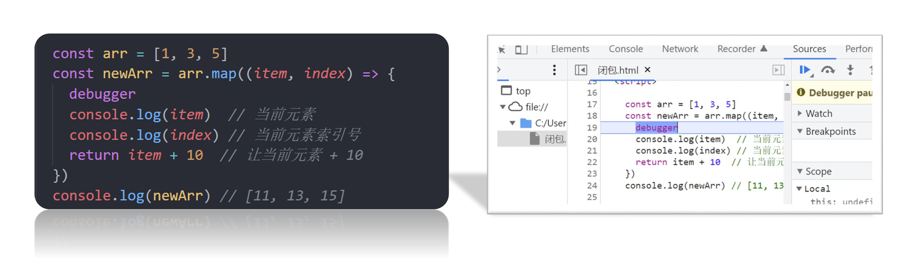

## 回调函数

将**函数作为参数**传递给另一个函数，so在函数内部可以调用该形参，相当于调用外部的函数

```js
// function
function greet(name, callback) {
    console.log('Hi' + ' ' + name);
    callback();
}

// callback function
function callMe() {
    console.log('I am callback function');
}

// passing function as an argument
greet('Peter', callMe);
```

## Promise对象

### 含义

> Promise 是异步编程的一种解决方案。比传统方案回调函数和事件更合理和强大。

所谓`Promise`，简单说就是一个**容器**，里面保存着某个未来才会结束的事件（通常是一个异步操作）的结果。从语法上说，Promise 是一个**对象**，从它可以获取异步操作的消息。

特点：

1. 对象的状态不受外界影响。`Promise`对象代表一个异步操作，有三种状态：`pending`（进行中）、`fulfilled`（已成功）和`rejected`（已失败）。

2. 一旦状态改变，就不会再变，任何时候都可以得到这个结果，这时就称为 resolved（已定型）。`Promise`对象的状态改变，只有两种可能：

   - 从`pending`变为`fulfilled`

   - 从`pending`变为`rejected`

### 基本用法

ES6 规定，`Promise`对象是一个构造函数，用来生成`Promise`实例。

```js
const promise = new Promise(function(resolve, reject) {
  // ... some code

  if (/* 异步操作成功 */){
    resolve(value);
  } else {
    reject(error);
  }
});
```

### 示例

```js
// promise 可以接受函数作为参数传递
// 该函数的两个参数 resolve 和 reject 它们都是函数，由JavaScript内部引擎提供，不用自己部署
let p = new Promise((resolve, reject) => {
  let a = 1 + 1;
  if (a === 2) {
    resolve("success"); // resolve 函数的作用是在异步操作调用成功后将异步操作的结果座位参数传递出去
  } else {
    reject("Failed"); //reject 函数的作用是在异步操作失败是将报出的错误作为参数传递出去
  }
});
// then catch 会接受函数resolve 和 reject 函数内部传递的参数值
p.then((message) => {
  console.log(`This is in the then ${message}`);
}).catch((message) => {
  console.log(`This is in tha catch ${message}`);
});
```

### 链式`.then()`方法

**当在 `.then()` 方法中返回一个非 Promise 值时**:

- 这个返回值会被自动包装成一个已经 resolved 的 Promise 对象。
- 也就是说,返回一个普通值等同于返回 `Promise.resolve(value)`。

```html
<script>
      fetchData(1)
        //id = 1 resolve(`Data 1`)
        //data1 = Data 1
        //-> Data 1: Data 1
        .then((data1) => {
          console.log("Data 1:", data1);
          return fetchData(2); // 返回一个新的 Promise 对象
        })
        /*
        相当于
        fetchData(2).then((data2) => {...})
        */
        .then((data2) => {
          console.log("Data 2:", data2);
          return "Result"; // 返回一个非 Promise 值
        })
        // "Result".then((result) => {})
        // 相当于 Promise.resolve("Result").then(...)
        // result  = "Result"
        // -> Final result:Result
        .then((result) => {
          console.log("Final result:", result);
        })
        .catch((error) => {
          console.error("Error:", error);
        });

      function fetchData(id) {
        // 返回一个 Promise 对象
        return new Promise((resolve, reject) => {
          // 模拟从服务器获取数据
          setTimeout(() => {
            resolve(`Data ${id}`);
          }, 1000);
        });
      }
    </script>
```

### `catch()`方法

- 如果该对象状态变为`resolved`，则会调用`then()`方法指定的回调函数；如果异步操作抛出错误，状态就会变为`rejected`（**返回`reject()`方法时调用catch方法**）就会调用`catch()`方法指定的回调函数，处理这个错误
- 另外，`then()`方法指定的回调函数，如果运行中抛出错误，也会被`catch()`方法捕获。

```js
// Promise 被 reject() 调用
Promise.resolve()
  .then(() => {
    return Promise.reject(new Error('API call failed'));
  })
  .catch((error) => {
    console.error('Caught error:', error.message); // Caught error: API call failed
  });
```

### **回调函数与Promise的区别**

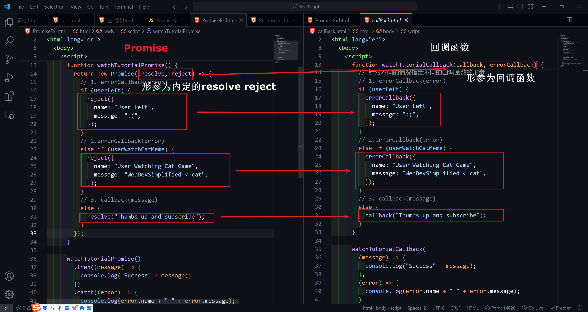

## Generator 函数

> Generator 函数是 ES6 提供的一种异步编程解决方案，语法行为与传统函数完全不同。

Generator 函数是一个状态机，封装了多个内部状态。执行 Generator 函数会返回一个遍历器对象，返回的遍历器对象，可以依次遍历 Generator 函数内部的每一个状态。

**要加一个 * 在function后面**

```js
function* helloWorldGenerator() {
  yield 'hello';
  yield 'world';
  return 'ending';
}

var hw = helloWorldGenerator();

hw.next()
// { value: 'hello', done: false }

hw.next()
// { value: 'world', done: false }

hw.next()
// { value: 'ending', done: true }

hw.next()
// { value: undefined, done: true }
```

与普通函数不同的是，调用 Generator 函数后，该**函数并不执行**，返回的也不是函数运行结果，而是一个指向内部状态的指针对象，也就是上一章介绍的遍历器对象。

每次调用`next`方法，内部指针就从函数头部或上一次停下来的地方开始执行，直到遇到下一个`yield`表达式（或`return`语句）为止。换言之，Generator 函数是分段执行的，`yield`表达式是暂停执行的标记，而`next`方法可以恢复执行。

## async函数

### 介绍

> 1. 为什么引入async函数？
>
>    ES2017标准引入async函数，使得异步操作变得更加方便
>
> 2. 它与Generator函数的差别是什么？
>
>    async函数就是Generator函数的`语法糖`。`async`函数就是将 Generator 函数的星号（`*`）替换成`async`，将`yield`替换成`await`，仅此而已。
>
>    ```js
>    const gen = function* () {
>      const f1 = yield readFile('/etc/fstab');
>      const f2 = yield readFile('/etc/shells');
>      console.log(f1.toString());
>      console.log(f2.toString());
>    };
>    ```
>
>    上面代码的函数`gen`可以写成`async`函数，就是下面这样。
>
>    ```js
>    const asyncReadFile = async function () {
>      const f1 = await readFile('/etc/fstab');
>      const f2 = await readFile('/etc/shells');
>      console.log(f1.toString());
>      console.log(f2.toString());
>    };
>    
>    //箭头函数使用async 就近原则 给距离最近的函数添加async
>    (async () =>{
>      const result = await axios({
>        
>      })
>    })
>    ```
>
> 3. 它比Generator函数好在哪？
>
>    1）内置执行器
>
>    Generator 函数的执行必须靠执行器，所以才有了`co`模块，而`async`函数自带执行器。也就是说，`async`函数的执行，与普通函数一模一样，只要一行。
>
>    ```js
>    asyncReadFile();
>    ```
>
>    2）**返回值是 Promise**
>
>    `async`函数的返回值是 Promise 对象，这比 Generator 函数的返回值是 Iterator 对象方便多了。

### 基本用法

函数前面的`async`关键字，表明该函数内部有异步操作。调用该函数时，会立即返回一个`Promise`对象。当函数执行的时候，一旦遇到`await`就会先返回，等到异步操作完成，再接着执行函数体内后面的语句。

```js
async function timeout(ms) {
  await new Promise((resolve) => {
    setTimeout(resolve, ms);
  });
}

async function asyncPrint(value, ms) {
  await timeout(ms);
  console.log(value);
}

asyncPrint('hello world', 50);
```

## ==JS执行机制==

JavaScript语言大特点是**单线程**，同一时间只能做一件事。单线程就意味着，所有任务需要排队，前一个任务结束，才会执行后一个任务。这样所导致的问题是： 如果 JS 执行的时间过长，这样就会造成页面的渲染不连贯，导致页面渲染加载阻塞的感觉。

为了解决这个问题，利用多核 CPU 的计算能力，HTML5 提出 Web Worker 标准，允许 JavaScript 脚本创建多个线程。于是，JS 中出现了`同步`和`异步`。

### 同步

前一个任务结束后再执行后一个任务，程序的执行顺序与任务的排列顺序是一致的、同步的。

### 异步

你在做一件事情时，因为这件事情会花费很长时间，在做这件事的同时，你还可以去处理其他事情。

### 同步任务

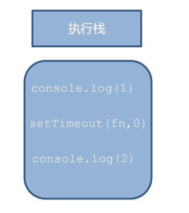 alt="image-20240721130312478.png" style="zoom:33%;"> alt="image-20240721130312478" style="zoom:50%;" />

同步任务都在主线程上执行，形成一个`执行栈`。

### 异步任务

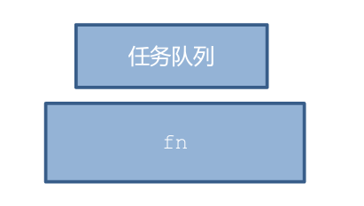 alt="image-20240721130424589.png" style="zoom:33%;"> alt="image-20240721130424589" style="zoom:50%;" />

JS 的异步是通过`回调函数`实现的。一般而言，异步任务有以下三种类型: 

1. 普通事件，如 click、resize 等

2. 资源加载，如 load、error 等
3. 定时器，包括 setInterval、setTimeout 等异步任务相关添加到`任务队列`中（任务队列也称为消息队列）。

### **执行机制**

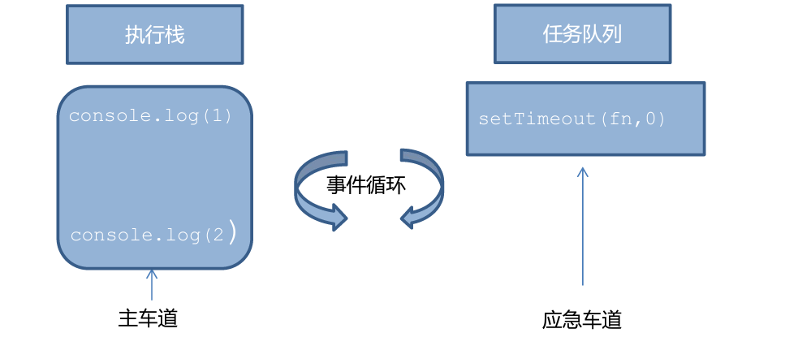 alt="image-20240721130806086.png" style="zoom:33%;"> alt="image-20240721130806086" style="zoom:50%;" />

1. 先执行执行栈中的`同步任务`
2. 异步任务放入`任务队列`中
3. 一旦执行栈中的所有同步任务执行完毕，系统就会按此读取`任务队列中的异步任务`，于是读取的异步任务结束等待状态，进入执行栈，开始执行。

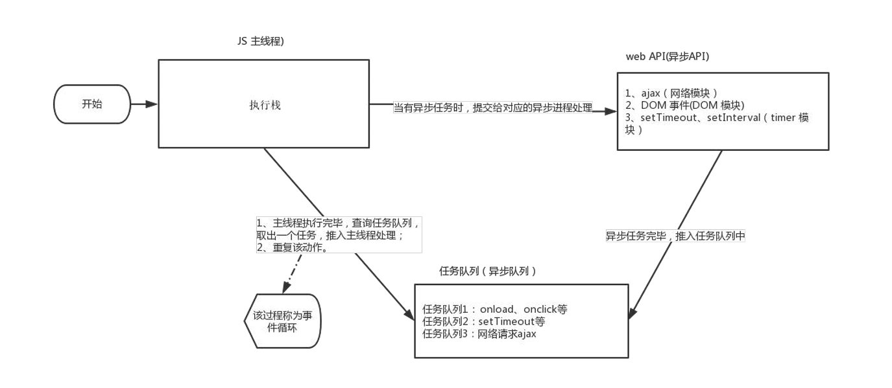

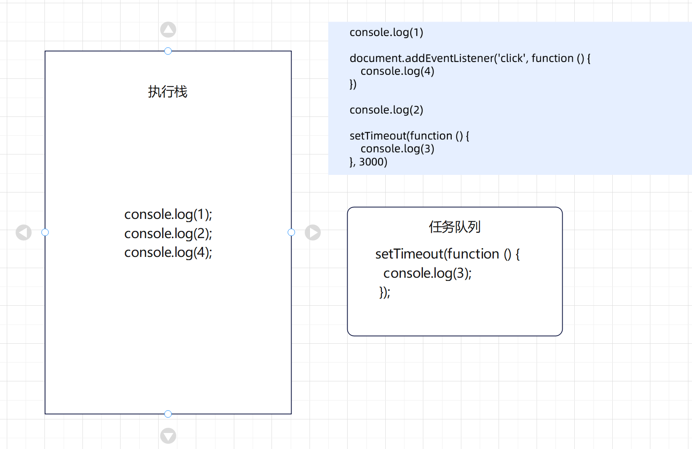

### **事件循环**


由于主线程不断的重复获得任务、执行任务、再获取任务、再执行，所以这种机制被称为事件循环（event loop )。

### 宏任务与微任务

js代码主要分为两大类： 同步代码、异步代码。而异步代码分为：微任务与宏任务

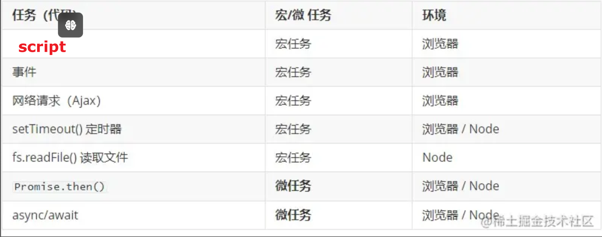

**在异步任务中，优先调度微任务队列，微任务队列被清空后才会调用宏任务队列**

**微任务**仅来自于我们的代码。它们通常是由 promise 创建的：对 `.then/catch/finally` 处理程序的执行会成为微任务。微任务也被用于 `await` 的“幕后”，因为它是 promise 处理的另一种形式。

> [!note]
>
> ❗❗❗new Promise 本身是同步任务 ，Promise中的.then（）中的才是异步任务

### [事件循环执行机制详细版](https://cloud.tencent.com/developer/article/2131471)

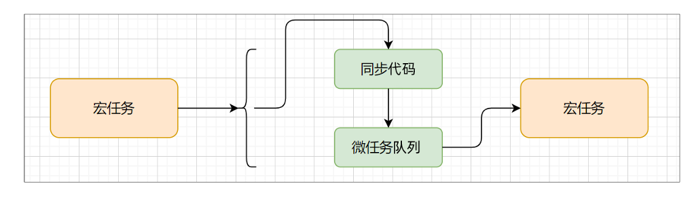

1. 进入到script标签（script本身就是一个宏任务）就进入到了事件循环
2. 遇到同步任务，立即执行
3. 遇到微任务，放入微任务队列
4. 遇到宏任务，放入宏任务队列
5. 当执行栈中的同步任务清空后，优先将微任务队列的任务压入执行栈
6. 当微任务队列清空后再将宏任务队列的任务压入执行栈

### 测试

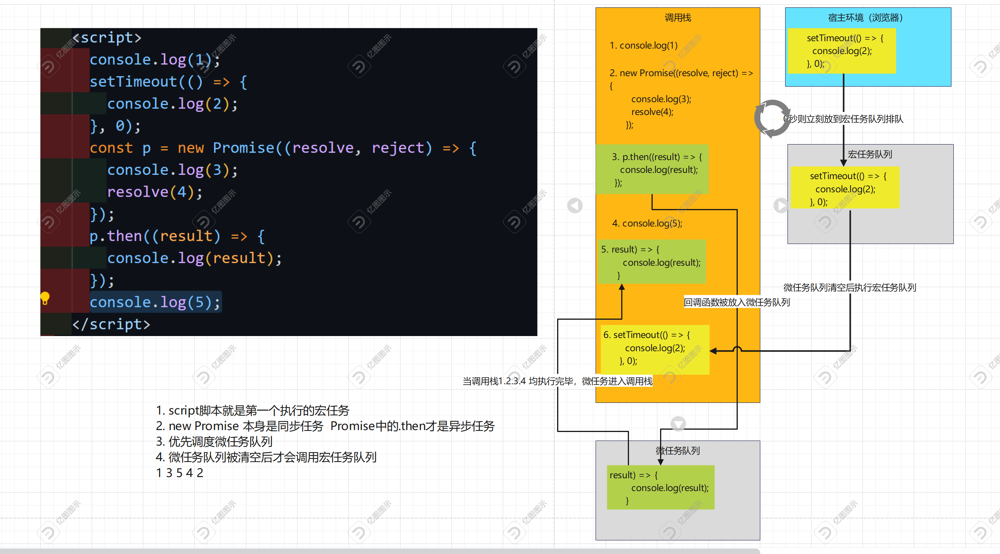

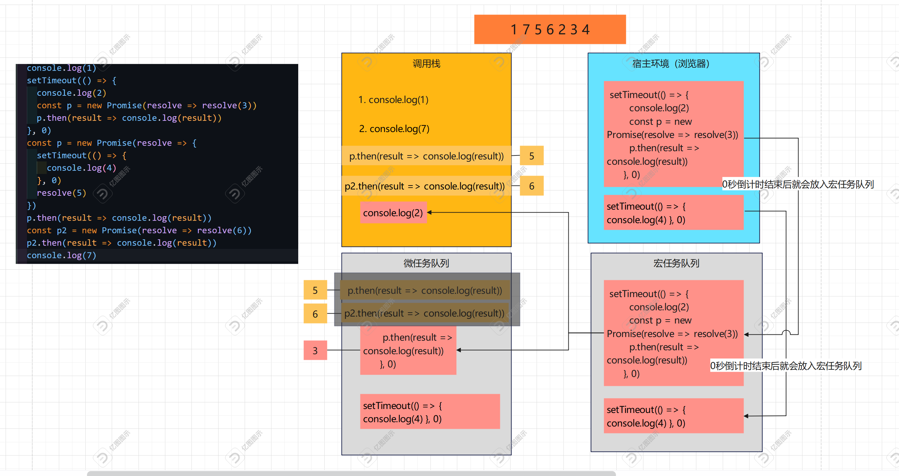

## [迭代器和生成器](https://medium.com/simform-engineering/iterators-and-generators-in-javascript-22da731b7fe3)

### 迭代器

**迭代器是一个对象，它定义一个序列，并在终止时可能附带一个返回值。**

`迭代器函数`是`返回迭代器对象`的唯一函数

**迭代器对象** : 是具有`next()方法`和`return()方法`的对象，该方法`返回`具有两个属性的`对象`：value 和 done。`value 属性`表示序列中的下一个值，`done 属性`指示迭代器是否已到达序列的末尾。

> Iterator 的遍历过程是这样的。
>
> （1）创建一个指针对象，指向当前数据结构的起始位置。也就是说，遍历器对象本质上，就是一个指针对象。
>
> （2）第一次调用指针对象的`next`方法，可以将指针指向数据结构的第一个成员。
>
> （3）第二次调用指针对象的`next`方法，指针就指向数据结构的第二个成员。
>
> （4）不断调用指针对象的`next`方法，直到它指向数据结构的结束位置。

#### 自定义迭代器示例

利用了`闭包`的特性：nextIndex是`私有变量`

```js
// 迭代器函数 返回值是迭代器对象
      function Iterator(array) {
        let nextIndex = 0;
        return {
          // 返回的迭代器对象：具有next()方法的对象
          next: function () {
            if (nextIndex < array.length) {
              return {
                // 该next()方法返回具有value和done两个属性的对象
                value: array[nextIndex++],
                done: false,
              };
            } else {
              return {
                value: undefined,
                done: true,
              };
            }
          },
          
          return: function() {
            console.log("终止");
            return {
              value: bull,
              done: true
            }
          }
        };
      }
      const array = [1, 2, 3, 4, 5];
      const arrayValue = Iterator(array); 
//调用迭代器函数，返回迭代器对象
/* 相当于 🔴🔴🔴🔴🔴
const arrayValue = {
	next: function {},
	return: function {},
}
*/
      console.log(arrayValue.next()); // { value: 1, done: false }
      console.log(arrayValue.next()); // { value: 2, done: false }
      console.log(arrayValue.next()); // { value: 3, done: false }
      console.log(arrayValue.next()); // { value: 4, done: false }
      console.log(arrayValue.next()); // { value: 5, done: false }
      console.log(arrayValue.next()); // { value: undefined, done: true }
	arrayValue.return(); //提前终止输出 终止
```

#### Symbol.iterator 函数

**任意一个对象的`Symbol.iterator`方法，等于该对象的遍历器生成函数，调用该函数会返回该对象的一个遍历器对象。**

我们可以直接使用 Symbol.iterator 函数来迭代数组

> 🔴Symbol是特殊的原始数据类型，用于创建唯一的属性名，只能通过[]来访问它的属性，且[]内部不能有引号

```js
const array = [1, 2, 3, 4, 5];
const iterator = array[Symbol.iterator](); 

console.log(iterator.next()); // { value: 1, done: false }
console.log(iterator.next()); // { value: 2, done: false }
console.log(iterator.next()); // { value: 3, done: false }
console.log(iterator.next()); // { value: 4, done: false }
console.log(iterator.next()); // { value: 5, done: false }
console.log(iterator.next()); // { value: undefined, done: true }

console.log(array["length"]);
console.log(array.length);
```

#### 调用 Iterator 接口的场合

1. **for...of 循环**
   - 当使用 `for...of` 循环遍历数据结构时,JavaScript 会自动调用该数据结构的 Iterator 接口,从而遍历它的成员。
2. **解构赋值**
   - 对数组或其他实现了 Iterator 接口的数据结构进行解构赋值时,也会自动调用 Iterator 接口。
3. **扩展运算符 (...)**
   - 当使用扩展运算符 `...` 将一个数组或其他实现了 Iterator 接口的数据结构展开时,也会自动调用 Iterator 接口。
4. **yield\* 表达式**
   - 在 generator 函数中,`yield*` 命令用来在一个 generator 函数里面执行另一个 generator 函数,这时会自动调用被执行的 generator 函数的 Iterator 接口。
5. **其他场合**
   - 调用 `Array.from()`方法时
   - 使用 `Map()` 构造函数时
   - 进行最后一项事件循环的 `for...of` 循环遍历

### 生成器


## this指向

### 普通函数

**普通函数的调用方式决定了this的值，即【谁调用this的值指向谁】**

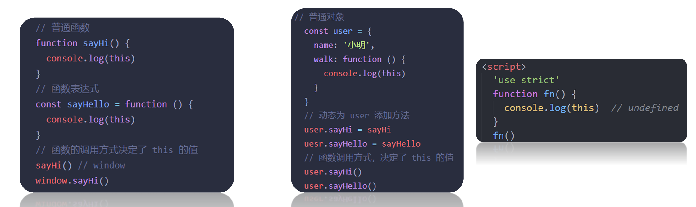

> 普通函数没有明确调用者时this值为window，严格模式下没有调用者时this的值为undefined

### 箭头函数

**箭头函数中并不存在this**

1. 箭头函数会默认帮我们绑定外层this 的值，所以在箭头函数中this 的值和外层的this 是一样的
2. 箭头函数中的this引用的就是最近作用域中的this 
3. 向`外层作用域`中，一层一层`查找this`，直到有this的定义

### 改变this指向

#### bind() [推荐使用]

bind() 方法不会调用函数。但是能改变函数内部this 指向。`返回`由指定的this 值和初始化参数`改造的原函数拷贝`（新函数）

```html
<button>发送短信</button>
    <script>
      const obj = {
        age: 18,
      };
      function fn(params) {
        console.log(this);
      }
      // bind()不会调用函数 会改变this指向

      const fun = fn.bind(obj); //未调用fn()所以无输出 返回更改过this的原函数
      console.log(fun);
      fun(); //调用返回值 相当于调用函数

      // 需求：按钮点击就立马禁用 2秒后自动开启
      const btn = document.querySelector("button");
      btn.addEventListener("click", function () {
        this.disabled = true;
        setTimeout(
          function () {
            this.disabled = false; //🔴无法开启 因为是window调用的setTimeout
            //setTimeout 是一个全局函数,它的回调函数在全局上下文中执行。
          }.bind(this), //使其指向btn
          2000
        );
      });
    </script>
```

#### call()

使用call 方法调用函数，同时指定被调用函数中this的值，返回值就是函数的返回值，因为是它调用的函数

```js
函数.call(新的this指向, 参数1, 参数2)
```

```html
    <script>
      const obj = {
        name: "pink",
      };
      function fn(x, y) {
        console.log(x + y);
        console.log(this);
      }

      // 1. 调用函数
      // 2. 改变this指向
      //  函数.call(新的this指向, 参数1, 参数2)
      fn.call(obj, 1, 2);
    </script>
```

#### apply()

使用apply方法调用函数，同时指定被调用函数中this的值。返回值就是函数的返回值，因为它就是调用函数

```js
 函数.apply(新的this指向, [数组参数])
```

> 与call()区别：传递的值必须包含在`数组`里面
>
> this指向可以为null

```html
<script>
  const obj = {
    name: "pink",
  };
  function fn(x, y) {
    console.log(x + y);
    console.log(this);
  }

  // 1. 调用函数
  // 2. 改变this指向
  //  函数.apply(新的this指向, [数组参数])
  fn.apply(obj, [1, 2]);
  //   3. 返回值 本身就是在调用函数  所以返回值就是原先函数的返回值
  // 使用场景 求数组最大值
  const arr = [1, 2, 3];
  const max = Math.max.apply(null, arr);
  console.log(max);
  console.log(Math.max(...arr));
</script>
```

### 使用场景

事件回调函数使用箭头函数时，this为全局的window，因此`DOM事件`回调函数如果里面需要DOM对象的this，则`不推荐使用箭头函数`

## 防抖和节流

### 防抖 

规定时间内停下来才执行 


## 经典案例

1. 例题-自己定义求max / min / sum 的函数，实现任何数组的实例对象都能使用 [`原型`]
1. 采用`面向对象的思想`完成渲染页面 [`编程思想`]
