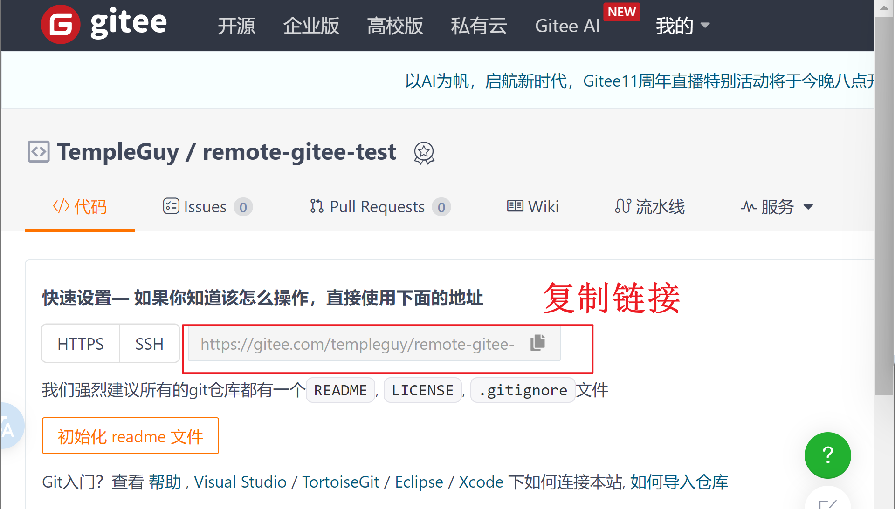

## 集中式的版本控制系统

集中式版本控制系统，版本库是**集中存放在中央服务器**的，而干活的时候，用的都是自己的电脑，所以要先从中央服务器取得最新的版本，然后开始干活，干完活了，再把自己的活推送给中央服务器。中央服务器就好比是一个图书馆，你要改一本书，必须先从图书馆借出来，然后回到家自己改，改完了，再放回图书馆。

集中式版本控制系统最大的毛病就是**必须联网才能工作**，如果在局域网内还好，带宽够大，速度够快，可如果在互联网上，遇到网速慢的话，可能提交一个10M的文件就需要5分钟，这还不得把人给憋死啊。

## 分布式版本控制系统

Git是分布式版本控制系统。

分布式版本控制系统根本没有“中央服务器”，每个人的电脑上都是一个完整的版本库，这样，你工作的时候，就不需要联网了，因为版本库就在你自己的电脑上。既然每个人电脑上都有一个完整的版本库，那多个人如何协作呢？比方说你在自己电脑上改了文件A，你的同事也在他的电脑上改了文件A，这时，你们俩之间只需把各自的修改推送给对方，就可以互相看到对方的修改了。

和集中式版本控制系统相比，分布式版本控制系统的安全性要高很多，因为每个人电脑里都有完整的版本库，某一个人的电脑坏掉了不要紧，随便从其他人那里复制一个就可以了。而集中式版本控制系统的中央服务器要是出了问题，所有人都没法干活了。

## 配置Git

在开始菜单里找到“Git”->“Git Bash”

```
$ git config --global user.name "Your Name"
$ git config --global user.email "email@example.com"
```


## 创建版本库

版本库又名仓库，英文名**repository**，你可以简单理解成一个目录，这个目录里面的所有文件都可以被Git管理起来，每个文件的修改、删除，Git都能跟踪，以便任何时刻都可以追踪历史，或者在将来某个时刻可以“还原”。

## 代码托管中心

代码托管中心是基于网络服务器的远程代码仓库，一般我们简单称为**远程库**。

局域网：GitLabs

互联网：GitHub(外网)、Gitee码云（国内网站)

## Github运行机制


> 通过比对提交文件与本地文件的不同，记录每一次的提交更新
>
> 删除存储文件也要在本地文件删除后再次commit
>
> **无法进行word 文档、图片的比对，只能对文本文档进行比对**

## 版本号


> 可用于找到文件 .git -> objects -> 版本号前两位数字


## 多人协作-分支与合并

### 什么是分支

相当于生成了仓库的多个副本


主分支：

 alt="image-20240513181422583.png" style="zoom:33%;"> alt="image-20240513181422583" style="zoom: 25%;" />

其他副本分支 Recent branch：

 alt="image-20240513181826430.png" style="zoom:33%;"> alt="image-20240513181826430" style="zoom:50%;" />


### 遇到冲突文件如何处理

 alt="image-20240526195315357.png" style="zoom:33%;"> alt="image-20240526195315357" style="zoom:33%;" />

具体打开后如下

 alt="image-20240513183335822.png" style="zoom:33%;"> alt="image-20240513183335822" style="zoom: 33%;" />

当前分支同名文件内容为user,order分支同名内容为order，合并两个文件内容，则可以将齐修改成如下：

 alt="image-20240513183419767.png" style="zoom:33%;"> alt="image-20240513183419767" style="zoom:33%;" />

## 创建标签

右键单击

 alt="image-20240513184028481.png" style="zoom:33%;"> alt="image-20240513184028481" style="zoom: 50%;" />

## 远程仓库

### 克隆GitHub远程仓库

1. 在网页端创建远程仓库


2. 在桌面端克隆远程仓库


3. 桌面端网页端同步更新


### 克隆Gitee远程仓库

 alt="image-20240527161324600.png" style="zoom:33%;"> alt="image-20240527161324600" style="zoom: 33%;" />

 alt="image-20240527161405934.png" style="zoom:33%;"> alt="image-20240527161405934" style="zoom:33%;" />

## Ignore File

 alt="image-20240527162539036.png" style="zoom:33%;"> alt="image-20240527162539036" style="zoom: 33%;" />

## 通过图标判断文件操作


## `IDEA 集成 GitHub &  Gitee`

1. 上传IDEA 中的project到github中(直接变成一个仓库)

    alt="image-20240527173224569.png" style="zoom:33%;"> alt="image-20240527173224569" style="zoom:33%;" />

2. 如何将IDEA中修改的本地文件提交到github中

 alt="image-20240527171231538.png" style="zoom:33%;"> alt="image-20240527171231538" style="zoom:33%;" />

3. 当在github中更新了文件，如何在IDEA中同步更新  alt="image-20240527171751873.png" style="zoom:33%;"> alt="image-20240527171751873" style="zoom:33%;" />

4. 克隆来自GitHub的项目

    alt="image-20240527173707455.png" style="zoom:33%;"> alt="image-20240527173707455" style="zoom:33%;" />

## git基础指令

 alt="image-20240527185224553.png" style="zoom:33%;"> alt="image-20240527185224553" style="zoom:33%;" />

clone 、publish 用于对整个项目的操作

pull 、push 用于比对更改后的操作

### 创建文件初始化

新建文件夹->右键-> open Git Bash here

输入：

```git
git init
```

### clone

```
 git clone https://gitee.com/templeguy/remote-gitee-test.git
```


[仓库Http链接 ]: imgFiles/remote-gitee-test.git

### configure

```
//针对仓库完成配置
git config user.name Ye
git config user.email 3332522674@qq.com
//针对所有仓库完成配置
git config --global user.name Ye
git config --global user.email 3332522674@qq.com
```

在github中同样可以修改

 alt="image-20240527193610901.png" style="zoom:33%;"> alt="image-20240527193610901" style="zoom: 33%;" />

### git status

添加文件b.txt前后变化

 alt="image-20240527194250052.png" style="zoom:33%;"> alt="image-20240527194250052" style="zoom: 50%;" />

### git add  & git commit

 alt="image-20240527194428950.png" style="zoom:33%;"> alt="image-20240527194428950" style="zoom:50%;" />

-m 指的是注解这次操作的意图

 如何将本地文件提交到已创建的github仓库上？

将远程仓库克隆到本地 然后复制文件到该仓库地址 最后commit