## JS的组成

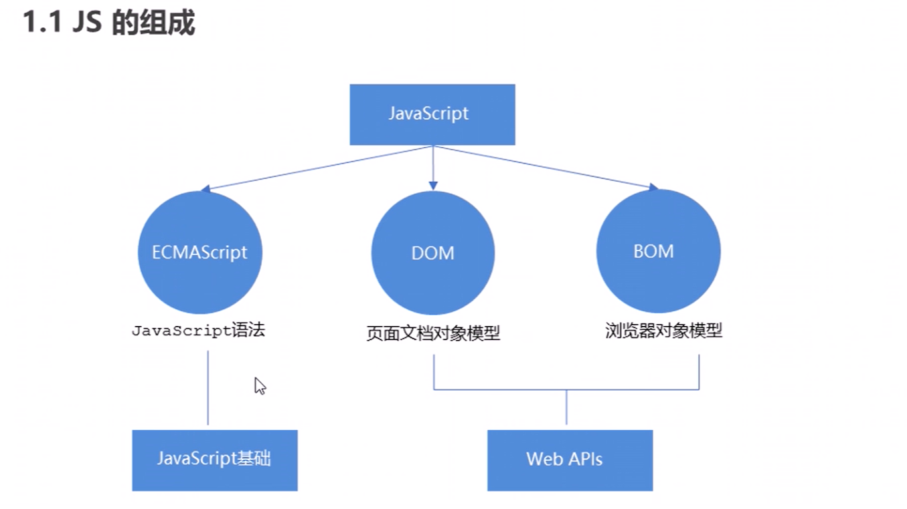

JavaScript：

EAMAScrpit-JavaScript语法

DOM-页面文档对象模型

BOM浏览器对象模型

> JavaScript是一种弱类型或者说动态语言，意味着不用提前声明变量类型，在运行过程中类型自会确定
>
> ​     var x = 10;
>
> ​     x = "white"; 

## 输入输出框

```javascript
prompt("input text");	//输入框
alert("who are you");	//弹出框
console.log("anything");	//控制台输出
```

## 变量声明

`let` 和 `const` 是 ES6 引入的两个新的声明变量的关键字,它们与 `var` 关键字有以下几个主要的区别:

1. **作用域 (Scope)**:
   - `var` 声明的变量有函数作用域或全局作用域。
   - `let` 和 `const` 声明的变量有块级作用域。
2. **变量提升 (Hoisting)**:
   - `var` 声明的变量会被提升到当前作用域的顶部,并初始化为 `undefined`。
   - `let` 和 `const` 声明的变量也会被提升,但是在初始化之前访问它们会抛出 `ReferenceError`。
3. **重复声明**:
   - `var` 允许在同一作用域内重复声明同一个变量,后声明的变量会覆盖前面的变量。
   - `let` 和 `const` 不允许在同一作用域内重复声明同一个变量,会抛出 `SyntaxError`。
4. **初始化**:
   - `var` 声明的变量会被自动初始化为 `undefined`。
   - `let` 声明的变量没有初始值,在初始化之前访问会抛出 `ReferenceError`。
   - `const` 声明的变量必须在声明时进行初始化,且初始值不能被修改。
5. **赋值**:
   - `let` 声明的变量可以被重新赋值。
   - `const` 声明的变量不能被重新赋值,但如果变量是一个对象,对象的属性仍然可以被修改。

**const优先，数组和对象尽量用const**

- const不能重新赋值，尽管值相同也会报错

  ```javascript
  const num = 10;
  num = 10;
  ```

- **可重新赋值的特殊情况**(前提是在函数内部声明)。在每次生成随机数的函数执行时，`const randomNum` 在新的块级作用域中被声明和初始化。尽管 `const` )变量在其声明的作用域内不能重新赋值，但因为每次回调函数执行时创建了新的作用域，所以可以多次声明 `randomNum`。而垃圾回收机制确保在函数执行完毕后，不再使用的 `randomNum` 变量的内存会被回收，从而不会导致内存泄漏。

- `const` 声明的作用域既可以是块级作用域，也可以是函数作用域。

- `const` 声明只有在声明的位置之后才能访问（参见[暂时性死区](https://developer.mozilla.org/zh-CN/docs/Web/JavaScript/Reference/Statements/let#暂时性死区)）。因此，`const` 声明通常被视为[非提升](https://developer.mozilla.org/zh-CN/docs/Glossary/Hoisting)的声明方式。

> [!IMPORTANT]
>
> 某些情况即使改变也可以使用const**：复杂数据类型只要地址不修改就不会报错，你可以更改、添加或删除对象的属性，但不能重新分配完整的对象**
>
> ```html
> <script>
> const arr = ["red", "pink"];
> arr.push("push");
> console.log(arr);
> </script>
> ```
>
> 因为数组的地址不会改变
>
> ```html
> const arr = ["red", "pink"];
> arr = [1, 2, 4];
> console.log(arr);
> ```
>
> 此时开辟了一个新数组，地址改变，所以会报错
>
> 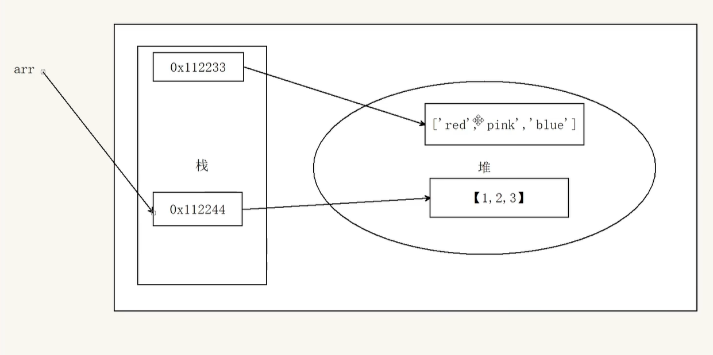
>
> ```JavaScript
> //1
> const names = []
> names = [1, 2, 3]
> //2
> const obj = {}
> obj = {
> 	uname: '我'
> }
> ```
>
> 以上两个均会报错，相当于重新提供了数组/对象

## 运算符

### 严格相等运算符 (`===`)

- 严格比较两个值是否完全相等,包括值和类型。
- 当两个操作数的类型不同时,不会进行任何类型转换。
- 如果两个操作数的值和类型都相同,则返回 `true`,否则返回 `false`

使用 ===  !== 不使用 == !=

```javascript
console.log(1 === 1);
// Expected output: true

console.log('hello' === 'hello');
// Expected output: true

console.log('1' === 1);
// Expected output: false

console.log(0 === false);
// Expected output: false
```

### 抽象相等运算符 (`==`)

- 比较两个值是否相等,在比较之前会先`进行类型转换`。
- 会尝试将两个操作数转换为一个公共类型,然后再进行比较。
- 类型转换的规则比较复杂,可能会导致一些意料之外的结果。

### 展开运算符`...`

将一个数组进行展开，不修改原数组

求数组最大最小值

```js
console.log(Math.max(1, 2, 3, 4, 5)); //5
console.log(Math.max(arr)); //NaN
console.log(Math.max(...arr)); //5
console.log(Math.min(...arr)); //1
```

合并数组

```js
const arr2 = [6, 7, 8, 9];
const arr3 = [...arr, ...arr2];
console.log(...arr3);
```

与剩余参数的区别

剩余参数：函数参数使用，得到`真数组 `	

展开运算符：`数组中`使用，数组展开

### 三目运算符` * ？* ：*`

```js
condition ? valueIfTrue : valueIfFalse
```

1. `condition`：一个返回布尔值的表达式。
2. `valueIfTrue`：如果 `condition` 为 true,则返回该值。
3. `valueIfFalse`：如果 `condition` 为 false,则返回该值。

```js
let age = 18;
let canVote = age >= 18 ? "Yes" : "No";
console.log(canVote); // Output: "Yes"

let score = 85;
let grade = score >= 90 ? "A" : score >= 80 ? "B" : score >= 70 ? "C" : "D";
console.log(grade); // Output: "B"
```

### 可选链操作符 `?.`

它可以安全地访问嵌套对象的属性。使用可选链操作符的好处是,即使嵌套对象的属性不存在,也不会抛出异常,而是会安全地返回 `undefined`。这样可以避免代码因为意外的 null 或 undefined 值而崩溃的情况。

```js
if (error?.response?.status === 401) {}
```

### 位运算符

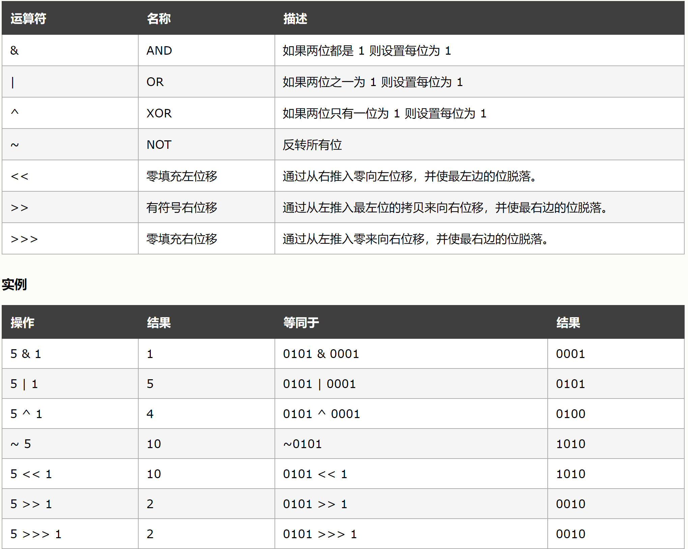 alt="image-20240726192314055.png" style="zoom:33%;"> alt="image-20240726192314055" style="zoom: 50%;" />

### 逗号运算符

当JavaScript引擎遇到逗号运算符时，它会按顺序评估每个表达式，并返回最后一个表达式的值。

```js
const a = (1, 2, 3);
console.log(a); // 输出：3
```

#### 逗号运算符的用途

##### 1. 在函数参数和返回值中使用

逗号运算符允许你在一行中编写多个表达式，这在函数参数和返回值中特别有用。例如：

```
function exampleFunction(param1, param2) {  const result1 = param1 * 2;  const result2 = param2 + 10;  return [result1, result2]; // 使用逗号运算符简化代码}const [resultA, resultB] = exampleFunction(5, 3);console.log(resultA); // 输出：10console.log(resultB); // 输出：13
```

在这个例子中，`exampleFunction`函数使用逗号运算符在一行中返回两个值。这使得代码更加简洁，同时也提高了可读性。

##### 2. 在循环和条件语句中使用

逗号运算符也可以用于循环和条件语句中，以在一行中执行多个操作。例如：

```
for (let i = 0, j = 10; i < j; i++, j--) {  console.log(`i: ${i}, j: ${j}`);}
```

在这个`for`循环中，我们使用了逗号运算符来初始化两个变量`i`和`j`，并在每次迭代中更新它们的值。

##### 3. 在变量声明和赋值中使用

逗号运算符还可以用于在同一行中声明和赋值多个变量。例如：

```
const x = 1, y = 2, z = x + y;console.log(z); // 输出：3
```

在这个例子中，我们使用了逗号运算符来声明和初始化三个变量`x`、`y`和`z`，并在同一行中计算`z`的值。

## js中的`假值`

在 JavaScript 中,以下 7 种值被认为是"假值"(falsy)：

1. **false**: 布尔类型的 `false` 值。
2. **0**: 数字类型的 0。
3. **0n**: BigInt 类型的 0。
4. **""**: 空字符串。
5. **null**: 表示缺少值或不存在的对象。
6. **undefined**: 表示变量未被赋值。
7. **NaN**: Not a Number，表示一个非数值。

除了这 7 种值之外,其他所有的值都被认为是"真值"(truthy)。这些真值包括:

- 所有非零数字(正数、负数、浮点数)
- 非空字符串
- 布尔值 `true`
- 所有对象(包括数组、函数、Date、RegExp 等)

## 逻辑中断

### 逻辑与

&& 当第一个操作为 true 时,才会执行第二个式子(全真为真) ,当第一个式子为false时,直接false,不会执行第二个式子

```lua
lua 代码解读复制代码  找假。  左边式子值可以转成false，则无条件返回左边式子的值，右边不执行。 反之无条件返回右边式子的值。
  
    3 > 1 && console.log('ok')  //会执行console.log('ok')
    3 < 1 && console.log('oks')  //第一个式子不成立,则直接false,看都不会看第二个式子一眼
```

### 逻辑或

逻辑或（logical OR）中断是一种特殊的中断处理机制,它可以在多个条件发生时立即执行某些操作。

在编程中,逻辑或中断通常通过使用 `||` 操作符来实现。它的工作原理如下:

1. 从左到右依次检查各个条件表达式。
2. 一旦遇到一个为 `true` 的条件,立即执行相应的操作,而不再检查后续的条件。
3. 如果所有条件都为 `false`, 则执行默认的操作。

这种机制可以大大简化程序的逻辑流程,提高代码的可读性和效率。

下面是一个例子:

```js
function handleUserInput(input) {
  // 逻辑或中断
  input.trim().length === 0 && console.log('Input is empty') ||
  input.length > 50 && console.log('Input is too long') ||
  /[^a-zA-Z0-9\s]/.test(input) && console.log('Input contains invalid characters') ||
  // 如果以上条件都不满足,则执行默认操作
  console.log('Input is valid');
}

handleUserInput('   ');  // Output: Input is empty
handleUserInput('This is a very long input that exceeds the maximum length');  // Output: Input is too long
handleUserInput('Hello, world!');  // Output: Input is valid
handleUserInput('Hello, world?!');  // Output: Input contains invalid characters
```

在这个例子中，`handleUserInput()` 函数使用逻辑或中断来检查用户输入是否满足某些条件。如果输入为空字符串、长度过长或包含无效字符,则会分别打印相应的警告消息。如果输入满足所有条件,则打印"Input is valid"。

## 进制

### 八进制

前面加 `0o`

```javascript
var num1 = 0o10;
console.log(num1);
```

### 十六进制

前面加 `0x`

```javascript
var num2 = 0xa;
console,log(num2);	//-> A
```

## 字符串型

用单引号最好(多个引号则外单内双)

```javascript
console.log('你是"刘亦菲"吗');
```

### 字符串的不可变

指的是里面的值不可变，虽然看上去内容可以改变，但其实知识地址变了，**内存中新开辟了一个空间**，字符串所有的方法，都不会修改字符串本身，操作完后会**返回一个新的字符串**

🔵**所以不要大量的拼接字符串，会占用大量的内存**

### **常用方法**

```javascript
  //字符串操作方法
  //   1. concat('字符串1', '字符串2', ...)
  var str = "andy";
  console.log(str.concat("red"));
  //   2. substr('截取的起始位置', '截取几个字符');
  var str1 = "你会不会自由荡漾";
  console.log(str1.substr(3, 5));
  //   3. 替换字符串 replace('被替换的字符', '替换为的字符'), 若多次出现该字符，只会第一个字符
  console.log(str.replace("a", "b"));
  //   4. 字符串转换为数组 split('分隔符')
  var str2 = "red,pink,blue";
  console.log(str2.split(","));
  var str2 = "red&pink&blue";
  console.log(str2.split("&"));
```

#### split() `字符串转为数组`

`split()` 将字符串转换成数组 与`join()`的功能相反

```js
const str = "pink,red";
const arr = str.split(",");
console.log(arr);
```

#### substring() `字符串截取`

[`String`](https://developer.mozilla.org/zh-CN/docs/Web/JavaScript/Reference/Global_Objects/String) 的 **`substring()`** 方法返回该字符串从起始索引到结束索引（不包括）的部分，如果未提供结束索引，则返回到字符串末尾的部分。返回值为截取部分的字符串。

```js
const str = 'Mozilla';

console.log(str.substring(1, 3));
// Expected output: "oz"

console.log(str.substring(2));
// Expected output: "zilla"
```

#### startsWith() 以什么开头

[`String`](https://developer.mozilla.org/zh-CN/docs/Web/JavaScript/Reference/Global_Objects/String) 的 **`startsWith()`** 方法用来判断当前字符串是否以另外一个给定的子字符串开头，并根据判断结果返回 `true` 或 `false`。

```js
startsWith(searchString)
startsWith(searchString, position)
//searchString 期望被找到的起始位置（即 searchString 的第一个字符的索引）。默认为 0。
```

```js
const str1 = 'Saturday night plans';

console.log(str1.startsWith('Sat'));
// Expected output: true

console.log(str1.startsWith('Sat', 3));
// Expected output: false

```

#### includes() `是否存在`

[`String`](https://developer.mozilla.org/zh-CN/docs/Web/JavaScript/Reference/Global_Objects/String) 值的 **`includes()`** 方法执行区分大小写的搜索，以确定是否可以在一个字符串中找到另一个字符串，并根据情况返回 `true` 或 `false`。

```js
const str1 = "你今年几岁了";
console.log(str1.includes("今年", 3)); //false
console.log(str1.includes("今年")); //true
```

#### indexOf 返回`字符所在位置`

`indexOf()`

```javascript
indexOf(searchElement)
indexOf(searchElement, 起始查找索引号)
```

```JavaScript
  var str = "改革春风吹满地";
  console.log(str.indexOf("春"));
  console.log(str.indexOf("春"), 3);
```

#### length 检测`字符串的长度 `

```javascript
var str = "Who are you";
console.log(str.length);
```

### 返回字符

```javascript
  // 1. charAt(index) 根据位置返回字符
  var str = "andy";
  console.log(str.charAt(3));
  // 2. charCodeAt(index) 返回相应索引号的字符ASCII值 目的： 判断用户按下了哪个键
  console.log(str.charCodeAt(0)); //97
  // 3. str[index] h5新增
  console.log(str[0]);
```

### 例题_返回多次重复出现的字符所有位置和次数

构思：用数组元素`arr[n]`存储每次字符出现的位置，用arr.length 表示字符出现的次数。依据indexOf( )，首先查询第一个字符出现的位置，并存储到数组中，这样就让indexOf从第一个字符出现的位置之后开始查找。

```javascript
  var str = "abcdefoxyozzopp";
  var arr = [];
  var firstO = str.indexOf("o");
  if (firstO !== -1) {
    arr.push(firstO);
    var begin = firstO + 1;
    while (str.indexOf("o", begin) !== -1) {
      arr.push(str.indexOf("o", begin));
      begin = str.indexOf("o", begin) + 1;
    }
  }
  console.log(arr);
  console.log(arr.length);
```

### 例题_统计出现最多的字符 charAt

```javascript
      //有一个对象 来判断是否有该属性 对象['属性名']

      var o = {
        age: 18,
      };
      if (o["sex"]) console.log("里面有该属性");
      else console.log("里面没有该属性");

      // 统计出现最多的字符
      //    利用charAt() 遍历这个字符串
      //    把每个字符存储给对象 如果对象没有该属性 就为1 如果存在就+1
      var str = "abcdefoxyozzopp";
      var o = {}; //声明一个空对象
      for (var i = 0; i < str.length; i++) {
        var chars = str.charAt(i);
        if (o[chars]) {
          o[chars]++;
        } else {
          o[chars] = 1;
        }
      }
      //   遍历对象
      var max = 0;
      var ch = " ";
      for (var k in o) {
        // k 是属性名 o[k]是属性值
        if (o[k] > max) max = o[k];
        ch = k;
      }
      console.log("最多放字符是" + ch);
```

### **例题-把字符串的内容存入到对应的html标签内**

> 1. `split` 转换成数组
> 2. `map` 修改数组内容为html标签 返回值为`伪数组`
> 3. `join` 将数组中的html语句拼接为字符串
> 4. innerhTML = str

```html
<script>
  // 把 gift的内容分别放入span中
  const spans = document.querySelectorAll("span");
  const gift = "50g茶叶,清洗球";
  /*
      // 首先将字符串转变成数组
      const arr = gift.split(",");
      // 将伪数组转变成真数组
      const arr2 = Array.from(spans);
      let i = 0;
      arr2.forEach((element) => {
        element.innerHTML = arr[i++];
      });
      */
  //方法二 用str存入每次的span标签 最后用innerHTML = str
  const str = gift
  .split(",")
  .map((item) => `<span class="tag">【赠品】${item}</span></br>`)
  .join("");
  //split 字符串转换成数组
  // map 将数组的元素内容改成html标签 返回值伪数组
  // join 将数组拼接成字符串
  document.querySelector("div").innerHTML = str;
</script>
```

## 转义符

以\ 开头

`\n` 换行

` \\ `  \

` \' `  '

 `\t` tab缩进

 `\b` 空格

## label标签

你可以使用嵌套在标记语句中的 [`break`](https://developer.mozilla.org/zh-CN/docs/Web/JavaScript/Reference/Statements/break) 或 [`continue`](https://developer.mozilla.org/zh-CN/docs/Web/JavaScript/Reference/Statements/continue) 语句跳转到对应标记。

```js
labelName: statement
```

```js
outer: for (let i = 0; i < 3; i++) {
  console.log(`Outer loop: ${i}`);

  inner: for (let j = 0; j < 3; j++) {
    console.log(`   Inner loop: ${j}`);
    if (j === 1) {
      break outer; // 跳出 outer 循环
    }
  }
}
```

```html
Outer loop: 0
   Inner loop: 0
   Inner loop: 1
```

## 其它方法

### `toFixed` 设置保留小数的长度

```js
      // toFixed设置保留小数的长度
      const price = 12.345;
      console.log(price.toFixed(0)); //12
```

### 非数字`isNaN()`

这个方法用来判断非数字

并且返回一个值 如果是数字返回的是false

否则返回true

```javascript
console.log(isNaN(12));
```

### 检测数据类型 

- `typeof` 用于检查值的数据类型,返回一个字符串。
- `instanceof` 用于检查一个对象是否是某个构造函数的实例。
- `typeof` 适用于**基本数据类型和对象**,而 `instanceof` 只适用于**对象**。
- 对于 `null` 值,`typeof` 会返回 `"object"`(这是一个已知的 bug)。

#### `typeof`

```javascript
console.log(typeof str);
```

#### `instanceof`

```js
function Person(name) {
  this.name = name;
}

let john = new Person("John");
console.log(john instanceof Person); // true
console.log(john instanceof Object); // true

console.log(42 instanceof Number);   // false
console.log("hello" instanceof String); // false
```

## 数组

```javascript
// 1. 创建数组
var arr = new Array(); //法一 new
var arr = []; //法二
var arr1 = [1, 2, 3, 4];
// 2. 获取数组元素
console.log(arr1);
console.log(arr1[2]);
//   3. 数组长度 = 数组元素个数
console.log(arr1.length);
```

> Find the max number
>
> ```javascript
> //   test: find the max in arr1
> for (let i = 0; i < arr1.length; i++) {
> var maxNumber = 0;
> if (arr1[i] >= maxNumber) maxNumber = arr1[i];
> }
> console.log(maxNumber);
> ```

### 主要方法

#### 遍历数组

> `for in`是遍历对象的，也能用于遍历数组，但一般不用

##### forEach( )

forEach（） 方法为每个数组元素执行一次提供的函数，**不会有返回值**，在 `forEach()` 方法内部,我们可以对每个元素执行各种操作,比如修改元素的值、添加新元素、删除元素等。但是这些操作只会影响到遍历过程中的临时变量,而不会直接影响到原数组。

```js
forEach(callbackFn)
forEach(callbackFn, thisArg)
数组名.forEach(function(数组元素, 索引号){
  
  
})
```

```js
let numbers = [1, 2, 3, 4, 5];

numbers.forEach(function(num, index) {
  numbers[index] = num * 2; // 修改元素的值
});

console.log(numbers); // Output: [2, 4, 6, 8, 10]
```

##### map（）

map（） 方法创建一个新数组（**有返回值**)，其中填充了对调用数组中的每个元素调用提供的函数的结果。

```js
map(callbackFn)
map(callbackFn, thisArg)
```

```js
const array1 = [1, 4, 9, 16];

// Pass a function to map
const map1 = array1.map((x) => x * 2);

console.log(map1);
// Expected output: Array [2, 8, 18, 32]
```

#### join()

把数组中的所有元素转换成一个字符串

```js
数组名.join(",");	//用,号分割
```

#### ==利用`map` & `join` 渲染页面==

> 注意在map 函数内部要使**用return** 返回模板字面量

```js
const str = bookList
      .map((element, index) => {
        return `
        <tr>
          <td>${index + 1}}</td>
          <td>${element.bookname}</td>
          <td>${element.author}</td>
          <td>${element.publisher}</td>
          <td>
            <span class="del">删除</span>
            <span class="edit">编辑</span>
          </td>
        </tr>
        `;
      })
      .join("");
    console.log(str);
    document.querySelector(".list").innerHTML = str;
```

#### 三个方法综合案例

```html
    <script>
      const arr = ["red", "blue", "green"];
			// map() 有返回值 返回新数组
      //   有参数
      const newArr = arr.map(function (element, index) {
        console.log(element);
        console.log(index);
        return element + "颜色";
      });
      let i = 0;
      //   无参数
      const newArr2 = arr.map(function () {
        return i++;
      });
      //   forEach 无返回值 直接修改原数组的值
      arr.forEach(function (element, index) {
        arr[index] = "aaa";
      });

      //   join方法 把数组中的所有元素转换成一个字符串
      console.log(newArr.join("+"));
      console.log(arr);
      console.log(newArr);
      console.log(newArr2);
    </script>
```

#### reduce( )

返回函数累计处理的结果，经常用于求和等

> **对象数组中的元素进行累加使用reduce  一定要写初始值为0**

```html
<script>
  const arr = [1, 5, 8];
  // arr.reduce(function(上一次的值, 当前值){}, 初始值)
  // 1. 没有初始值
  const total = arr.reduce(function (prev, current) {
    return prev + current;
  });
  console.log(total);

  //   2. 有初始值
  const total2 = arr.reduce(function (prev, current) {
    return prev + current;
  }, 18);
  console.log(total2);
  //   箭头函数写法
  //   arr.reduce((prev, current) => prev + current, 18);
</script>
```

对象数组中使用reduce

```html
<script>
  const arr = [
    {
      name: "张三",
      salary: 10000,
    },
    {
      name: "李四",
      salary: 10000,
    },
    {
      name: "王五",
      salary: 10000,
    },
  ];
  //   对象数组中的元素进行累加 一定要写初始值
  // 🔴因为如果没有初始值，则会以数组的第一个元素作为初始值，而数组的第一个元素为对象，所以必须指定初始值为0
  const total = arr.reduce((prev, current) => {
    return prev + current.salary;
  }, 0);
  console.log(total);
</script>
```

#### filter( )

方法创建一个新的数组，新数组中的元素是通过检查指定数组中符合条件的所有元素

**filter只能用比较运算符，map只能有加减乘除运算符**

```html
<script>
  const arr = [10, 20, 30];
  const newArr = arr.filter(function (item, index) {
    // console.log(item);
    // console.log(index);
    return item >= 20; 
  });
  console.log(newArr);
</script>
```

#### find( )

**`find()`** 方法返回数组中满足提供的测试函数的第一个元素的值。否则返回 [`undefined`](https://developer.mozilla.org/zh-CN/docs/Web/JavaScript/Reference/Global_Objects/undefined)。**自动返回，无需return语句**。

```js
// find()
const array1 = [5, 12, 8, 130, 44];

const found = array1.find((element) => element > 10);

console.log(found);
// Expected output: 12
```

**使用场景：依据某个独有的属性找到对象**

```js
      const arr1 = [
        {
          name: "小米",
          price: 1999,
        },
        {
          name: "华为",
          price: 3999,
        },
      ];
      const re2 = arr1.find(function (item) {
        return item.name === "小米";
        // 🔴回调函数返回值为true时，find函数自动返回当前item,无需return语句
      });
      console.log(re2);
```

#### some( )

**`some()`** 方法测试数组中是否至少有一个元素通过了由提供的函数实现的测试。如果在数组中找到一个元素使得提供的函数返回 true，则返回 true；否则返回 false。它不会修改数组。

```js
const array = [1, 2, 3, 4, 5];

// Checks whether an element is even
const even = (element) => element % 2 === 0;

console.log(array.some(even));
// Expected output: true
```

#### every( )

**`every()`** 方法测试一个数组内的所有元素是否都能通过指定函数的测试。它返回一个布尔值。

```js
const isBelowThreshold = (currentValue) => currentValue < 40;

const array1 = [1, 30, 39, 29, 10, 13];

console.log(array1.every(isBelowThreshold));
// Expected output: true
```

### 检测对象是否为数组

##### instanceof 运算符

```javascript
  var arr = [];
  var obj = {};
  console.log(arr instanceof Array); //->true
  console.log(obj instanceof Array); //->false
```

##### Array.isArray(参数)

```javascript
  console.log(Array.isArray(arr));
```

### 替换/添加/删除数组元素

#### `splice`

依据指定索引号删除或插入或替换元素

```javascript
splice(start)
splice(start, deleteCount)
splice(start, deleteCount, item1)
splice(start, deleteCount, item1, item2)
splice(start, deleteCount, item1, item2, /* …, */ itemN)
splice(索引号, 删除元素个数, 元素值)
//deleteCount表示删除数
```

1. 插入元素：第二个参数为0

```javascript
var arr= [1, 2, 3];
arr.splice(0, 0, 0);	//在索引号为0的位置，删除0个元素 = 插入1个元素，元素值为0
// -> [0, 1, 2, 3]
//插入元素可以使n个，反正deleteCount为0即可
const myFish = ["angel", "clown", "mandarin", "sturgeon"];
const removed = myFish.splice(2, 0, "drum", "guitar");

// myFish 是 ["angel", "clown", "drum", "guitar", "mandarin", "sturgeon"]
// removed 是 []，没有移除的元素
```

2. 删除元素：无需第三个参数

```JavaScript
var arr= [1, 2, 3];  
arr.splice(3, 1);
console.log(arr);
// -> [0, 1, 2]
```

3. 替换元素：第二个参数为1，第三个参数为将被换成的元素

```javascript
var arr = [0, 1, 2];
arr.splice(2, 1, 8);
console.log(arr);
// -> [0, 1, 8]
```

#### `push()`

在数组末尾添加一个或多个数组元素 返回值是新数组的长度

```JavaScript
  var arr = [1, 2, 3];
  console.log(arr.push("cici")); //->4
  console.log(arr); //数组元素
```

#### `unshift() `

在数组开头添加一个或多个数组元素 返回值是新数组的长度

```javascript
  console.log(arr.unshift("yifei", "ziyi")); //->7
  console.log(arr); //数组元素
```

#### `pop()`

删除数组的最后一个元素(无需参数) 返回值是被删除的元素

```javascript
var arr = [1, 2, 3];
console.log(arr.pop()); //3
console.log(arr); //[1, 2]
```

#### `shift()`

删除数组的第一个元素(无需参数) 返回值是被删除的元素

```javascript
var arr = [1, 2, 3];
console.log(arr.shift()); //1
console.log(arr); //[2, 3]
```

### `翻转`数组 reverse( )

```javascript
  var arr = [1, 2, 3];
  arr.reverse();
  console.log(arr);
```

### 数组`排序` sort( )

arr.sort(指定函数)

```javascript
  var arr1 = [1, 23, 11, 34, 3, 5];
  console.log(arr1);
  arr1.sort(function (a, b) {
    return a - b; //升序的顺序排列 b-a为降序排列
  });
//必须要有这一部分才能正常排序
  console.log(arr1);
```

### 数组索引

```javascript
  // 1. indexOf (数组元素)返回数组元素的第一个索引号 不存在则返回-1
  var arr = ["red", "blue", "red", "grey"];
  console.log(arr.indexOf("red")); //->0
  // 2. lastIndexOf (数组元素)返回数组元素的最后一个索引号 不存在则返回-1
  console.log(arr.lastIndexOf("red")); //->2
```

### 数组`转换为字符串`

```javascript
  //   1. toString()我们的数组转换为字符串
  var arr = [1, 2, 3];
  console.log(arr.toString());
  //   2. join(分隔符)
  var arr1 = ["green", "blue", "red"];
  console.log(arr1.join());
  console.log(arr1.join("-"));
  console.log(arr1.join("&"));
```

### `伪数组`转为真数组 form()

静态方法

```js
console.log(Array.from('foo'));
// Expected output: Array ["f", "o", "o"]

console.log(Array.from([1, 2, 3], (x) => x + x));
// Expected output: Array [2, 4, 6]

```

例题: js中`querySelectorAll`获取的均是伪数组

```js
const lis = document.querySelectorAll("ul li");
console.log(lis); //得到的是伪数组
//   lis.pop();
//TypeError: lis.pop is not a function 伪数组没有数组的方法
// 🔴转换成真数组 nodelist to array
const liss = Array.from(lis);
console.log(liss);
```

### 例题_筛选数组

有一个包含工资的数组[1500,2000,2000,2100,1800]，要求把数组中工资超过2000的删除，剩余的放到新数组里面

```JavaScript
  var arr = [1500, 2000, 2000, 2100, 1800];
  var newArr = [];
  for (var i = 0; i < arr.length; i++) {
    if (arr[i] <= 2000) newArr.push(arr[i]);
  }
  console.log(arr);
  console.log(newArr);
```

### 例题_数组去重

```javascript
  //将新数组中没有重复的内容并送入新数组
  var arr = [1, 2, 4, 2, 1, 3, 3];
  var newArr = [];
  for (var i = 0; i < arr.length; i++) {
    if (newArr.indexOf(arr[i]) === -1) newArr.push(arr[i]);
  }
  console.log(newArr) ;
```

## 函数

### 声明函数

```javascript
//   1. 声明函数（关键字全小写）
function say() {
console.log("Hello");
}
//	 2. 函数表达式(匿名函数)
var 变量名 = function (形参) {};
// 类似 var num = 10;
var fun = function () {
console.log("我是函数表达式");
};
fun();
//   ⭐fun 是变量名，不是函数名，所以该函数没有名字
```

### 调用函数

```javascript
say();
```

### 多值传递

注意`return`可以通过返回数组做到多值传递

```javascript
return [num1 + num2, num1 - num2]
```

### 返回值

函数没有return则返回undefined

### `arguments`

arguments实际上是当前函数的一个内置对象，所以函数都内置了arguments对象，arguments对象中存储了传递的所有实参

```javascript
  function fn() {
    console.log(arguments);
    console.log(arguments.length);
    console.log(arguments[2]);
    //我们可以按照数组的方式遍历
    for (var i = 0; i <= arguments.length; i++) {
      console.log(arguments[i]);
    }
  }
  fn(1, 2, 3);
```

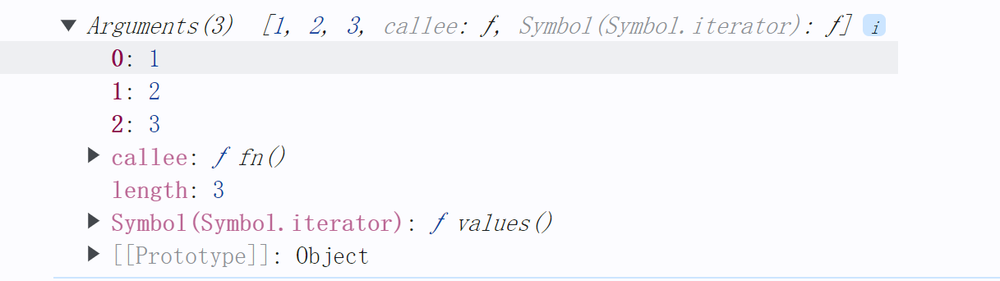 alt="image-20240629120234651.png" style="zoom:33%;"> alt="image-20240629120234651" style="zoom:50%;" />

### `自调用函数`

自调用函数（Self-invoking functions）是一个无名（匿名）函数，在其定义之后`立即被调用`。

> 自调用函数有什么好处？
>
> 默认情况下，在自执行函数中声明的变量仅可用于自执行函数中的代码。这使得在编写代码时无需担心变量在其他 JavaScript 代码块中的命名方式。
>
> 自调用函数的主要好处是它们只执行一次，并且不会用在页面生命周期内持续的各种 crud 填充全局命名空间。
>
> 自调用函数的使用情况
>
> 自调用函数对于**初始化任务**非常有用。例如，如果我们有一个网页，在其中我们想要将事件侦听器附加到 DOM 元素和其他初始化工作，那么自调用函数将是完成这项工作的最佳工具！

```js
(function() {})();
```

## 伪数组

伪数组 并不是真正意义上的数组

1. 具有数组的length属性

2. 按照索引号的方式进行存储

3. 他没有真正数组的方法 pop() push()... 

## 块级作用域

js中没有块级作用域（现阶段没有）

js作用域：全局作用域 、 局部作用域 (函数中声明的变量，函数外部不能访问)

⭐**没有声明直接赋值则当做全局变量看待。**在函数作用域内 加var定义的变量是局部变量，不加var定义的就成了全局变量。

块级作用域 { }	if { }	for { }

```javascript
if (3 < 5) {
	var num = 10;
}
console.log(num);
//在Java中无法正常输出，但JavaScript中可以
```

### 作用域链

内部函数访问外部函数的变量，采取的是链式查找的方式来决定取哪个值（就近原则输出）

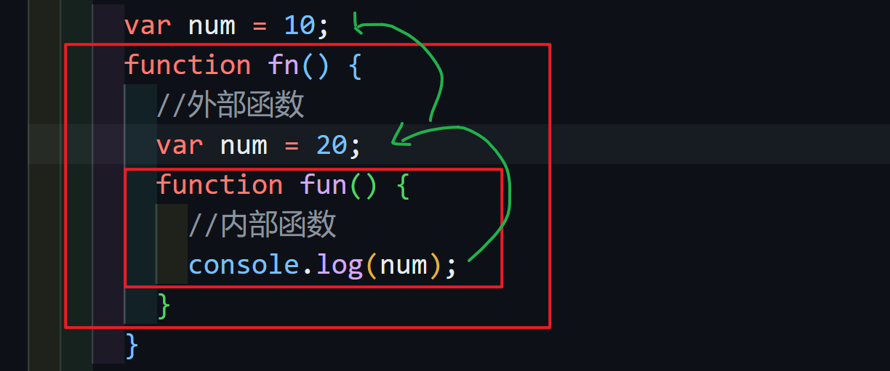

```JavaScript
  function f1() {
    var a = (b = c = 9);
    /*相当于
    var a = 9;
    b = 9;
    c = 9;*/
    //b & c直接赋值没有声明当全局变量看
    console.log(a); 
    console.log(b);
    console.log(c);
  }
  f1();
  console.log(a);
  console.log(b);
  console.log(c);
```

> 输出结果 9 9 9  a is not defined 9 9
>
> b c 为全局变量 ，而a为局部变量，所以外部输出时相当于未定义过

## JavaScript预解析

js 引擎分为两步：预解析 代码执行

js引擎会把`var` 还有`function`提升到**当前作用域**的最前面

预解析分为**变量预解析**(变量提升)和**函数预解析**(函数提升)

### [变量提升var 与 let/const的区别](https://www.freecodecamp.org/chinese/news/javascript-let-and-const-hoisting/)

> **结论**：变量提升不仅存在于使用 `var` 关键字声明的变量中,也存在于使用 `let` 和 `const` 声明的变量中。
>
> `let` 和 `const` 定义的变量是会提升的，只是它们提升的时候不会进行默认初始化，使得它们无法被访问（因为这些变量在暂时性死区里）。**[会报错]**
>
> 另一方面，`var` 定义的变量在提升时会默认初始化为 `undefined`。**[不会报错]**

下面是一个例子展示 `var`、`let` 和 `const` 在变量提升方面的差异:

```js
console.log(x); // Output: undefined
var x = 5;

console.log(y); // ReferenceError: Cannot access 'y' before initialization
let y = 10;

console.log(z); // ReferenceError: Cannot access 'z' before initialization
const z = 15;
```

#### var

这里只有变量声明（`var x`）被提升了，变量的初始化（`= 5`）却没有被提升。所以在 `x` 声明之前访问它，得到的是 **var 定义的变量的默认初始值**，即 `undefined`。

#### let / const

发现会报错：**ReferenceError: Cannot access 'number' before initialization**。

由 `let` 或 `const` 定义的变量提升时**不会**默认初始化，所以在声明之前访问会报错：**ReferenceError: Cannot access 'variable' before initialization**。

然而由 `var` 定义的变量提升时**会**被初始化为默认值 `undefined`，所以在声明之前访问会得到 `undefined`。

#### 暂时性死区

`let`/`const` 定义的变量被提升却无法正常访问，是因为存在**暂时性死区（Temporal Dead Zone）**。

`x、y` 变量就处于暂时性死区中，JavaScript 知道它的存在（因为它的声明被提升了），却无法正常访问它（因为它没有被初始化）。

### 函数提升

. 函数表达式不存在提升的现象

```javascript
  fun(); //报错
  var fun = function () {
    console.log(22);
  };
```

> 此处不是函数提升，是变量提升，是以变量形式声明函数，所以是变量提升，相当于：
>
> ```javascript
> var fun;
> fun();
> fun = function () {
> 	console.log(22);
> }
> ```

函数提升案例

```javascript
  fn();
  function fn() {
    console.log(11); // ->11
  }
```

### Test

```javascript
  var num = 10;
  fun();

  function fun() {
    console.log(num);
    var num = 20;
  }
```

> 相当于
>
> ```javascript
> var num;
> function fun() {
> 	var num;
> 	console.log(num);
> 	num = 20;
> }
> num = 10;
> ```
>
> 依据作用域链，就近原则找到声明却未定义的num,所以结果为undefined

## 对象

> 属性：事物的特征
>
> 方法：事物的行为

### 创建对象

#### 对象字面量

指的是{ }里面包含了对象的属性和方法

```javascript
var obj1 = {};	//创建了一个空对象
const onj2 = {
	uname:"Judy"，
	age: 18,
	sex: woman,
	sayHi: function() {
	console.log("HI!");
	}
}
```

> 1. 里面的属性或方法采用键值对的形式
> 2. 多个属性和方法中间用 , 隔开
> 3. 方法后面跟的是一个匿名函数

#### 利用new object（对象实例化）

```javascript
  const obj = new Object();
  obj.uname = "cici";
  obj.age = 18;
  obj.sex = "woman";
  obj.sayHi = function () {
    console.log("Hi");
  };
```

> 1. 利用等号赋值
> 2. 用 ; 结束

#### 构造函数

> 我们为什么需要构造函数？
>
>    因为对象字面量和利用new object创建对象的方式一次只能创建一个对象
>
>    里面封装的是对象不是普通代码，就是吧我们对象里面相同的属性和代码封装到函数里
>
>    我们需要创建四大天王的对象 相同的属性: 名字 年龄 性别 相同的方法: 唱歌

```JavaScript
  // ⭐构造函数的语法格式 
  
  function 构造函数名(形参1, 形参2, 形参3...) {
      this.属性 = 值;
      this.方法 = function() {}
  }
  new 构造函数名(实参1, 实参2, 实参3...);
  
  // 1. 构造函数名首字母大写
  // 2. 构造函数无需return即可返回结果
  // 3. 调用构造函数必须使用new
```

```javascript
  function Star(uname, age, sex) {
    this.name = uname;
    this.age = age;
    this.sex = sex;
    this.sing = function (song) {
      console.log(song);
    };
  }
const ldh = new Star("刘德华", 18, "男");
const zxy = new Star("张学友", 19, "男");
  ldh.sing("冰雨"); //调用方法
  console.log(ldh.name + zxy.name);
```

### 遍历对象 for in

```javascript
//for in 遍历对象
for (变量 in 对象) {

}
```

```javascript
  var obj = {
    name: "cc",
    age: 18,
    sex: "woman",
  };  
  for (var k in obj) {
    console.log(k); //->属性名
    console.log(obj[k]); //->属性值
  }
```

### 调用对象

```javascript
// 属性： 对象名.属性名 或 对象名['属性名']
console.log(obj2.uname);
console.log(obj2["uname"]);
// 方法：对象名.方法名()
obj2.sayHi();
```

#### 对象表达式`obj[k]`

**对象名[属性名] = 属性值**

当您试图访问对象中不存在的属性时,使用点符号会抛出错误,而使用对象表达式则会返回 `undefined`。这种安全访问的特性在某些情况下很有用。

```js
const person = { name: "John" };
console.log(person.age); // 报错: Cannot read property 'age' of undefined
console.log(person["age"]); // undefined
```

### 删除对象属性 `delete`

```js
const Employee = {
  firstname: 'Maria',
  lastname: 'Sanchez',
};

console.log(Employee.firstname);
// Expected output: "Maria"

delete Employee.firstname;

console.log(Employee.firstname);
// Expected output: undefined
```

### 内置对象

JavaScript中的对象分为三种：自定义对象、内置对象、浏览器对象

前面两种对象JS基础内容，属于EXMAScript,第三个浏览器对象属于我们JS独有的，我们JS API讲解

内置对象就是JS语言自带的一些对象，提供了一些常用的或是最基本而必要的功能

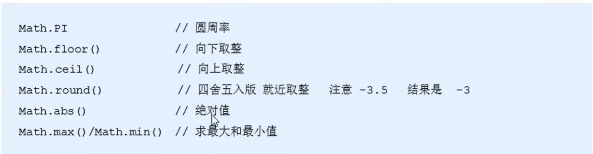

### **Object 静态方法**

> 静态方法的使用并不对对象的创建方式有任何要求。只要是在构造函数上定义了静态方法,就可以通过该构造函数来调用这些静态方法,与对象的创建方式无关。

1. `Object.keys( )`此静态方法获取对象中所有的属性（键）,返回的是一个数组

2. `Object.values( )`静态方法获取对象中所有属性值,返回的是一个数组
3. `Object.assign( ) `静态方法常用于对象拷贝,经常使用的场景给对象添加属性

```js
// 使用对象字面量的形式创建对象
const o = { name: "佩奇", age: 18 };
//   获得所有的属性名 返回数组
console.log(Object.keys(o));
//   获得所有的属性名 返回数组
console.log(Object.values(o));
//   拷贝对象
const oo = {};
Object.assign(oo, o);
console.log(oo);
//   拷贝(添加)属性
Object.assign(o, { gender: "woman" });
console.log(o); //{name: '佩奇', age: 18, gender: 'woman'}
```

#### 例题：**将对象属性拼接为字符串**

> 1. 要使用`join`的方法拼接字符串则需要将获取的属性值转变为数组
>
> 2. 此时可以使用object的静态方法`Object.values()`,获取属性值且返回数组

```js
      const spec = {
        size: "40*40cm",
        color: "balck",
      };

      const arr = Object.values(spec);
      console.log(arr);
      console.log(arr.join("/"));
```

#### [parseInt](https://www.freecodecamp.org/news/parseint-in-javascript-js-string-to-int-example/)

**使用 `parseInt` 函数的主要目的是从字符串中提取数字。这会将返回值转换为实际数字。**

> 此函数解析（分解）字符串并返回整数或 `NaN`（不是数字）。
>
> ```txt
> parseInt(string)
> ```

```javascript
const myNumber = '3';
console.log(2 + parseInt(myNumber));
// returns 5
```

> [!Important]
>
> 当我们在字符串中的数字之前有一些文本时，就会发生这种情况。像“age is 50”这样的值将返回一个 `NaN` 值，因为 `parseInt` 函数只查看字符串开头的第一个值。如果该值不是数字，则返回 `NaN`。这里：

```javascript
const age = 'age is 50';
console.log(parseInt(age));
// returns NaN
```

> [!IMPORTANT]
>
> 请注意，`parseInt` 函数忽略浮点值。如果上面的年龄是 50.05，那么它仍然会返回 50 并忽略 .05。
>
> 以同样的方式，如果我们有一个这样的字符串：“50 100 150 200”，那么我们只会得到 50 个返回给我们。这是因为 `parseInt` 函数仅尝试提取字符串的第一个值。 
>
> 如果字符串的值像这样写在一起：“50istheage”，则仍将返回 50。

#### [Math.random()](https://www.freecodecamp.org/chinese/news/javascript-random-number-how-to-generate-a-random-number-in-js/)

该方法不带任何参数。

**默认情况下，该方法返回一个介于 `0` 和 `1` 之间的随机小数（或浮点数）值。**

需要注意的是，`0` 包含在内，而 `1` 不包含在内。因此，它将返回一个大于或等于 `0` 且始终小于且从不等于 `1` 的值。

[得到两数之间的一个随机数，包括两数在内](https://developer.mozilla.org/zh-CN/docs/Web/JavaScript/Reference/Global_Objects/Math/random#%E5%BE%97%E5%88%B0%E4%B8%80%E4%B8%AA%E4%B8%A4%E6%95%B0%E4%B9%8B%E9%97%B4%E7%9A%84%E9%9A%8F%E6%9C%BA%E6%95%B4%E6%95%B0%EF%BC%8C%E5%8C%85%E6%8B%AC%E4%B8%A4%E4%B8%AA%E6%95%B0%E5%9C%A8%E5%86%85)

```javascript
nction getRadom(max, min) {
        return Math.floor(Math.random() * (max - min + 1) + min); // 包含最小值和最大值
}
      console.log(getRadom(56, 99));
```

```js
//随机生成数组任意索引号
const random = praseInt(Math.random() * Array.length);
//parseInt 函数忽略浮点值
```

#### 猜数字游戏

```javascript
  function getRadom(max, min) {
    return Math.floor(Math.random() * (max - min + 1) + min); // 包含最小值和最大值
  }
  var num = prompt("请输入数字（1-10）");
  var lucky = getRadom(1, 10);
  for (; num != lucky; ) {
    if (num > lucky) num = prompt("太大了，请重新输入");
    if (num < lucky) num = prompt("太小了，请重新输入");
  }
  alert("你终于猜对了！");
```

#### 日期对象

是一个构造函数 必须使用new来创建我们的日期对象

```JavaScript
  var arr = new Array();
  var obj = new Object();
  var date = new Date();
```

1. 如果没有参数则返回系统当前时间

```javascript
console.log(date);
```

2. 参数常用的写法 数字型 `2019, 10, 01`字符串型 `'2019-10-1 8:8:8'`

```javascript
  var date1 = new Date("2024-10-1");
  var date2 = new Date(2024, 10, 1);
  console.log(date1);
  console.log(date2);
```

3. 日期格式化

```javascript
  console.log(date.getFullYear()); //返回当前日期的年份
  console.log(date.getMonth() + 1); //返回的月份小一个月 记得月份加一
  console.log(date.getDate()); //返回的几号
  console.log(date.getDay()); //周一 1 周六 6 周日 0
```

4.   要求封装一个函数返回当前时分秒 00:00:00

```javascript
  function dateHMS() {
    var date = new Date();
    var h = date.getHours();
    var m = date.getMinutes();
    var s = date.getSeconds();
    h = h < 10 ? "0" + h : h;
    m = m < 10 ? "0" + m : m;
    s = s < 10 ? "0" + s : s;
    console.log(h + ":" + m + ":" + s);
  }
  dateHMS();
```

5. 获得Date总的毫秒数(**时间戳**)

```javascript
  //   Date 对象是基于1970年1月1日起的毫秒数
  //   1. valueOf()
  console.log(date.valueOf());
  //   2. getTime()
  console.log(date.getTime());
  // 3. 简单的写法(最常用的写法)
  var date3 = +new Date();
  console.log(date3);
  // 4. H5新增方法
  console.log(Date.now());
```

#### 倒计时

```javascript
  //直接用时间相减会得到负数，改用时间戳相减，再把时间戳转化为时分秒
  function conuntdown(time) {
    var nowTime = +new Date(); //返回当前时间总毫秒数
    var inputTime = +new Date(time); //返回的是用户输入时间总的毫秒数
    var times = (inputTime - nowTime) / 1000; //剩余时间总秒数
    var s = parseInt(times % 60);
    var m = parseInt((times / 60) % 60);
    var h = parseInt((times / 60 / 60) % 24);
    var d = parseInt(times / 60 / 60 / 24);
    return d + "天" + h + "时" + m + "分" + s + "秒";
  }
  console.log(conuntdown("2024-6-30 17:25:00"));
```

### 数组对象

```javascript
new Array(数组长度);
new Aray(元素1, 元素2, 元素3...);
```

```javascript
var arr = [1, 2, 3]; //字面量形式创建
var arr1 = new Array(2); //表示数组的长度为2
var arr1 = new Array(2, 3); //等价于里面有两个数组元素分别是2，3
```

### `可迭代键值对 -> 对象`

`Object.fromEntries()` 是一个非常实用的 JavaScript 方法,它可以将一个可迭代的键值对集合转换为一个对象。

它的作用与 `Object.entries()` 方法正好相反,`Object.entries()` 可以将一个对象转换为一个由键值对组成的数组。

下面是一个简单的示例:

```js
解释const urlParams = new URLSearchParams('?name=John&age=30');

// 使用 Object.fromEntries() 将 URLSearchParams 转换为对象
const paramsObj = Object.fromEntries(urlParams);

console.log(paramsObj);
// 输出: { name: 'John', age: '30' }
```

## [对象数组](https://www.freecodecamp.org/chinese/news/javascript-array-of-objects-tutorial-how-to-create-update-and-loop-through-objects-using-js-array-methods/)

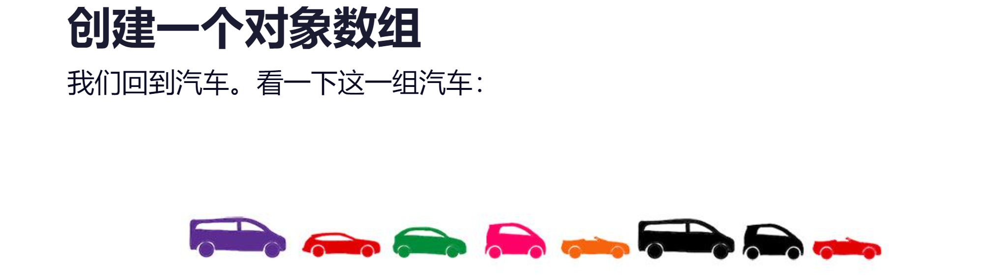

我们可以将它们写成这样的数组：

```JavaScript
let cars = [
  {
    "color": "purple",
    "type": "minivan",
    "registration": new Date('2017-01-03'),
    "capacity": 7
  },
  {
    "color": "red",
    "type": "station wagon",
    "registration": new Date('2018-03-03'),
    "capacity": 5
  },
  {
    ...
  },
  ...
]
```

与数组具有相同的方法和属性

### 判断对象判断是否有该属性

`对象['属性名']`

```javascript
  var o = {
    age: 18,
  };
  if (o["sex"]) console.log("里面有该属性");
  else console.log("里面没有该属性");
```

我们可以使用 `Array.unshift` 在数组的开头添加一个新的对象。

```js
let car = {
  "color": "red",
  "type": "cabrio",
  "registration": new Date('2016-05-02'),
  "capacity": 2
}
cars.unshift(car);
```

## 数据类型

### 原始值

#### symbol

ES6 引入了一种新的原始数据类型`Symbol`，表示独一无二的值。它属于 JavaScript 语言的原生数据类型之一。

Symbol 值通过`Symbol()`函数生成。这就是说，对象的属性名现在可以有两种类型，一种是原来就有的字符串，另一种就是新增的 Symbol 类型。凡是属性名属于 Symbol 类型，就都是独一无二的，可以保证不会与其他属性名产生冲突。

```js
let s = Symbol();

typeof s
// "symbol"
```

> 注意，`Symbol()`函数前不能使用`new`命令，否则会报错。这是因为生成的 Symbol 是一个原始类型的值，不是对象，所以不能使用`new`命令来调用。另外，由于 Symbol 值不是对象，所以也不能添加属性。基本上，它是一种类似于字符串的数据类型。

##### 访问symbol类型属性名

当我们使用点号 `.` 访问对象属性时,属性名必须是一个有效的标识符,即满足变量命名规则的字符串。但是 Symbol 类型的属性名不满足这个要求,所以不能使用点号 `.` 来访问。

相反,我们需要使用方括号 `[]` 来动态访问对象的属性。这种方式允许我们使用任意类型的属性名,包括 Symbol 类型。**不需要引号**

```js
array[Symbol.iterator]()
```

#### BigInt

BigInt 可以表示任意大的整数。

#### 其他：

Number、Boolean、Null、Undefined、String

### 非原始值

Object 是 JavaScript 中最复杂的类型，它表示对象。复杂地说，Object 又包括很多子类型，比如 Date、Array、Set、RegExp。

### 数据类型转换

```javascript
 //类型转换

 //1. toString()
 var num4 = 10;
 var str2 = num4.toString();
 console.log(typeof str2);

 console.log(typeof toString(num4));

 //   2. parseInt() 可作为将输入的String 转为int
 var age = prompt("please input your age:");
 console.log(typeof parseInt(age));

 //   3.parseFloat() 可作为将输入的String 转为float

 //   4. Number()

 //   5.Boolean() 0 NaN null undefined -> false 其他为true
 console.log(Boolean(null)); 
```

## 基本包装类型

```javascript
var str = "andy";
console.log(str.length); //-> 4
```

> 对象才有属性和方法，复杂数据类型才有属性和方法，简单数据类型为什么会有length属性呢？

`基本包装类型`： **把简单数据类型包装为复杂数据类型**

> ```javascript
>   // 1. 把简单数据类型包装为复杂数据类型
>   var temp = new String("andy");
>   //   2. 把临时变量的值给 str
>   str = temp;
>   // 3. 销毁这个临时变量
>   temp = null;
> ```

## 简单数据类型&复杂数据类型

> **简单类型又叫做原始数据类型或者值类型(Primitve Data Types)，复杂类型又叫做引用类型(Reference Data Types)。**

**值类型**：简单数据类型/基本数据类型，在存储时变量中存储的是值本身，因此叫做值类型 string ，number，boolean，undefined，null  

**引用类型**：复杂数据类型，在存储时变量中存储的仅仅是地址（引用），因此叫做引用数据类型 通过 new 关键字创建的对象（系统对象、自定义对象），如 Object、Array、Date等

### 堆和栈

**栈（操作系统）**：由操作系统自动分配释放存放函数的参数值、局部变量的值等。其操作方式类似于数据结构中的栈（ 简单数据类型存放到栈里面 ）

**堆（操作系统）**：存储复杂类型(对象)，一般由程序员分配释放，若程序员不释放，由垃圾回收机制回收（ 复杂数据类型存放到堆里面）

#### 简单类型的内存分配

**值类型（简单数据类型）**： string ，number，boolean，undefined，null

值类型变量的数据直接存放在变量（**栈空间**）中

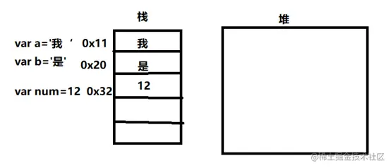

#### 复杂数据类型的内存分配

**引用类型（复杂数据类型）**：通过 new 关键字创建的对象（系统对象、自定义对象），如 Object、Array、Date等

**引用类型变量（栈空间）** 里存放的是地址，真正的对象实例存放在**堆空间**中

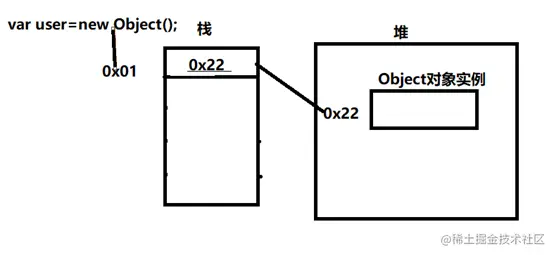

### 可变性和不可变性

可变的可以被改变或添加，而不可变的意味着不能改变或添加的东西。JavaScript 中的基元值不能添加任何内容，它们只能重新赋值。

## `undefined`和`null`的区别

### undefined

undefined 是“全局对象”的一个属性。也就是说，它是全局作用域的一个变量（下面展开对 undefined 变量的赋值操作）。undefined 的`最初值就是原始数据类型 undefined`。

### null

null 是一个字面量，不像 undefined，它不是“全局对象”的一个属性。null 是表示缺少的标识，指示`变量未指向任何对象`。把 null 作为尚未创建的对象，或许更好理解。在 API 中，null 常使用来表示返回类型应是一个对象，但没有关联某个具体对象的这么一个值。

### 区别

```js
let name;
let age = null;
//   声明了但是未初始化
console.log(name); //undefined
console.log(age); //null
```

null 和 undefined 都表示空，主要区别在于 undefined 表示尚未初始化的变量的值，而 null 表示该变量有意缺少对象指向。

undefined

- 这个变量从根本上就没有定义。
- 隐藏式 空值。

null

- 这个值虽然定义了，但它并未指向任何内存中的对象。
- 声明式 空值。

#### typeof

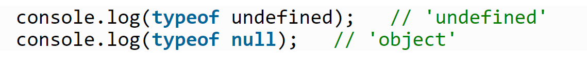

#### == & ===

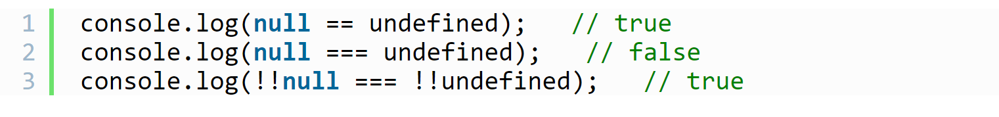
