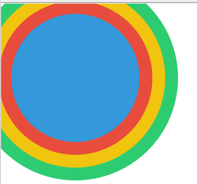

# Sass比css增强的特性有哪些？

Sass (Syntactically Awesome Stylesheets) 是 CSS 的一种预处理器，Sass 提供了许多增强的功能，如变量、嵌套、混合、继承、循环和条件语句，使得 CSS 编写更加简洁、模块化和易于维护。这些特性特别适合于大型项目和复杂的样式需求，使得编写样式更加简洁、高效。相比于纯 CSS，Sass 提供了一些强大的特性，以下是一些主要的增强功能：

## 1. **变量（Variables）**

Sass 允许你使用变量来存储值（例如颜色、字体大小等），从而避免重复定义。可以轻松复用这些变量，提升代码的维护性和一致性。

```scss
$primary-color: #3498db;
$font-size: 16px;

body {
  color: $primary-color;
  font-size: $font-size;
}
```

## 2. **嵌套（Nesting）**

Sass 支持将 CSS 选择器嵌套在一起，这与 HTML 的结构类似。嵌套使得样式结构更具层次感，更加直观。

```scss
nav {
  ul {
    margin: 0;
    padding: 0;
    list-style: none;
  }

  li { display: inline-block; }

  a {
    text-decoration: none;
    color: $primary-color;
  }
}
```

## 3. **部分文件与导入（Partials and Imports）**

Sass 允许将样式拆分为多个部分文件，通过 `@import` 将它们组合起来，提升了代码的模块化和可维护性。Sass 会在编译时将它们合并为一个文件。

```scss
// _variables.scss
$primary-color: #3498db;
$secondary-color: #2ecc71;

// main.scss
@import 'variables';
body {
  color: $primary-color;
}
```

## 4. **混合（Mixins）**

Mixin 可以让你定义样式片段并在需要时复用，甚至可以接受参数。它们可以减少重复代码，提高可维护性。

```scss
@mixin border-radius($radius) {
  -webkit-border-radius: $radius;
  -moz-border-radius: $radius;
  border-radius: $radius;
}

.button {
  @include border-radius(10px);
}
```

## 5. **继承（Inheritance）**

Sass 支持选择器之间的继承，允许一个选择器继承另一个选择器的所有样式，减少冗余代码。

```scss
%button-style {
  padding: 10px 20px;
  font-size: 14px;
  border-radius: 5px;
}

.button-primary {
  @extend %button-style;
  background-color: $primary-color;
}

.button-secondary {
  @extend %button-style;
  background-color: $secondary-color;
}
```

## 6. **运算（Operations）**

Sass 允许在样式中进行数学运算，如加、减、乘、除。你可以使用这些运算动态调整样式值。

```scss
.container {
  width: 100% - 20px;
}

body {
  font-size: 16px * 1.2;  // 计算得出 19.2px
}
```

## 7. **条件和循环（Conditionals and Loops）**

Sass 支持编程逻辑，如条件语句 (`@if`, `@else`) 和循环 (`@for`, `@each`, `@while`)，使得样式生成更加灵活。

```scss
@mixin theme-colors($theme) {
  @if $theme == 'dark' {
    background-color: black;
    color: white;
  } @else if $theme == 'light' {
    background-color: white;
    color: black;
  }
}

body {
  @include theme-colors('dark');
}
```

## 8. **函数（Functions）**

Sass 允许定义自定义函数，可以执行更复杂的计算，并返回一个值。

```scss
@function calculate-percentage($part, $total) {
  @return $part / $total * 100%;
}

.container {
  width: calculate-percentage(300px, 1200px);  // 25%
}
```

## 9. **颜色函数（Color Functions）**

Sass 提供丰富的颜色处理函数，可以轻松地对颜色进行调整，例如 `lighten()`、`darken()`、`mix()` 等。

```scss
.button {
  background-color: lighten($primary-color, 20%);  // 调亮颜色
}
```

## 10. **模块系统（Modules, from Dart Sass）**

最新的 Dart Sass 引入了模块系统，支持通过 `@use` 和 `@forward` 实现模块化、隔离作用域和更好的命名空间管理。

```scss
// colors.scss
$primary-color: #3498db;

@forward 'colors';  // 导出模块

// main.scss
@use 'colors';

body {
  color: colors.$primary-color;
}
```

# 垂直居中

```css
/* flex */
align-items: center
/* 普通 */
magrin: auto
```

# padding和margin是干什么的

### 1. **`padding`（内边距）**

`padding` 用于控制元素**内容与边框之间的距离**，也就是说，它会在元素的内容和元素的边框之间添加内边距，扩大元素的可点击区域或增加视觉空白。

### 2. **`margin`（外边距）**

`margin` 用于控制**元素与其他元素之间的距离**，也就是外边距。`margin` 使得元素在页面中有额外的空间，用来隔开它与周围元素的距离。

# body > .pi-main

`body > .pi-main` 是一个子元素选择器，用于选择 `body` 元素下直接子元素为类名为 `pi-main` 的元素

**`>`**: 表示“直接子元素”关系。它只会选择那些是父元素直接子元素的元素，而不是嵌套的子元素。

### 示例

假设你的 HTML 结构如下：

```html
<body>
  <div class="pi-main">这是 pi-main 的内容</div>
  <div>
    <div class="pi-main">这是另一个 pi-main 的内容</div>
  </div>
</body>
```

在这个结构中，只有第一个 `div`（直接子元素）会被 `body > .pi-main` 选择器匹配，而第二个 `div` 不会被匹配，因为它是嵌套在另一个 `div` 中。

# css画一个圆并添加多重边框的方法

我们可以使用 `border-radius` 和 `box-shadow` 来创建一个圆并为其添加多重边框。



### 1. **创建圆形**

使用 `border-radius: 50%` 可以将一个正方形元素变成圆形。

### 2. **添加多重边框**

多重边框可以通过两种方式实现：

- 使用 `box-shadow` 创建边框效果，该属性可设置的值包括阴影的 X 轴偏移量、Y 轴偏移量、模糊半径、扩散半径和颜色。
- 使用嵌套元素来创建多个层级的边框

```html
<!DOCTYPE html>
<html lang="en">
<head>
  <meta charset="UTF-8">
  <meta name="viewport" content="width=device-width, initial-scale=1.0">
  <style>
    .circle {
      width: 100px;
      height: 100px;
      background-color: #3498db; /* 圆形的背景颜色 */
      border-radius: 50%; /* 将元素变成圆形 */
      box-shadow: 
        0 0 0 10px #e74c3c, /* 第一层边框，红色 */
        0 0 0 20px #f1c40f, /* 第二层边框，黄色 */
        0 0 0 30px #2ecc71; /* 第三层边框，绿色 */
    }
  </style>
</head>
<body>
  <div class="circle"></div>
</body>
</html>
```