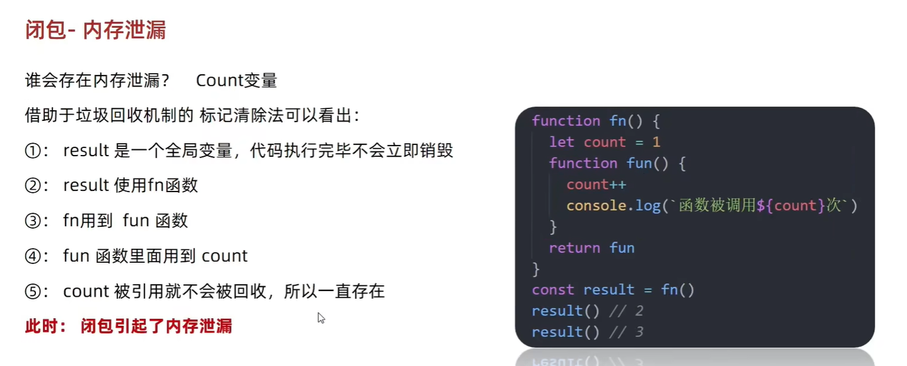

# 类型判断相关问题

## 怎么判断数组

1. `ES6` 提供的新方法 `Array.isArray()`
2. 如果不存在`Array.isArray()`呢？可以借助`Object.prototype.toString.call()` 进行判断，此方式兼容性最好
3. `instanceof` 判断
```js
let arr = [1,2,3,4]
console.log(Array.isArray(arr));
console.log(arr instanceof Array);
console.log(Object.prototype.toString.call(arr))

> true
> true
> [object Array]
```
`instanceof` 判断数组类型如此之简单，为何不推荐使用？

`instanceof` 操作符的问题在于，如果网页中存在多个 `iframe` ，那便会存在多个 `Array` 构造函数，此时判断是否是数组会存在问题。

更详细的内容可以参考博文：[JavaScript为啥不用instanceof检测数组
](https://blog.csdn.net/weixin_42467709/article/details/105302852)

## [浅谈 instanceof 和 typeof 的实现原理](https://juejin.cn/post/6844903613584654344?searchId=20240928174136E79D412C0449802CDAB7)

可以去看看原型链,就是判断能不能通过_proto找到prototype

instanceof 实现原理

```jsx
function new_instance_of(leftVaule, rightVaule) { 
    let rightProto = rightVaule.prototype; // 取右表达式的 prototype 值
    leftVaule = leftVaule.__proto__; // 取左表达式的__proto__值
    while (true) {
    	if (leftVaule === null) {
            return false;	
        }
        if (leftVaule === rightProto) {
            return true;	
        } 
        leftVaule = leftVaule.__proto__ 
    }
}
```

# 字符串与数字相运算

当 `+` 运算符用于两个操作数时，如果其中一个操作数是字符串，JavaScript 默认会将另一个操作数（如果是数字）**转换为字符串**。这是因为在 JavaScript 中，`+` 运算符既可以用于数值相加，也可以用于字符串拼接。

对于减法（`-`）、乘法（`*`）和除法（`/`）等运算符，JavaScript 会优先将操作数**转换为数字**。这是因为这些运算符通常用于数学运算，字符串在这种情况下往往不具备直接的意义。

- 在 `2 + "1"` 的情况下，操作数 `2` 是数字，`"1"` 是字符串，结果是拼接成字符串 `"21"`。
- 在 `2 - "1"` 的情况下，字符串 `"1"` 会被转换为数字 `1`，结果是 `1`。

> 问题：
>
> 1. `a+"1"-1`等于？
>
>    如果 `a` 是一个数值（比如 `a = 2`），那么：
>
>    - `a + "1"` 会将 `a` 转换为字符串，结果为字符串拼接。比如 `2 + "1"` 结果是 `"21"`。
>    - `"21" - 1` 由于 `-` 操作符会将字符串 `"21"` 转换回数值，因此结果是 `21 - 1 = 20`。
>
>    如果 `a` 是一个非数值类型（比如 `a` 是 `undefined`、`null` 或者 `boolean`），情况会有所不同：
>
>    - `undefined + "1"` 会返回 `"undefined1"`，之后 `"undefined1" - 1` 会返回 `NaN`，因为 `"undefined1"` 不能被转换为数值。
>    - `null + "1"` 会返回 `"null1"`，之后 `"null1" - 1` 也会返回 `NaN`。
>    - 如果 `a` 是 `true`，那么 `true + "1"` 结果是 `"true1"`，而 `"true1" - 1` 结果同样是 `NaN`。

# 如何保留两位小数(四舍五入)

`toFixed()` 方法可以直接将一个数字格式化为指定的小数位数，并返回一个`字符串`。

```jsx
let num = 3.14159;
let result = parseFloat(num.toFixed(2));  // 输出 3.14（数值类型）
```

`Math.round()` 可以通过乘除法实现保留两位小数，先将数值乘以 100，再除以 100：

```jsx
let num = 3.14159;
let result = Math.round(num * 100) / 100;  // 输出 3.14
```

# 判断字符串中有多少a

使用 `split()` 方法, `split()` 可以将字符串按指定字符拆分为数组，然后通过数组长度判断字符的数量。

```jsx
let str = "JavaScript is amazing";
// 通过检测a 把str拆分成一个个片段存入数组[J, v, Script is, m, zing]
let count = str.split('a').length - 1;  // 输出 3
```

使用`正则表达式 /表达式/修饰符 `判断

```jsx
let str = "JavaScript is amazing";
let matches = str.match(/a/g); // 获取所有匹配的 "a"
let count = matches ? matches.length : 0; // 如果没有匹配，返回 0
console.log(count); // 输出: 3
```

# 序列化对象

在 JavaScript 中，序列化对象是指将对象转换为字符串，以便存储或传输。最常用的序列化方式是使用 `JSON.stringify()` 方法。

```jsx
let obj = { name: "Alice", age: 25, city: "New York" };
let serializedObj = JSON.stringify(obj);
console.log(serializedObj);  // 输出: '{"name":"Alice","age":25,"city":"New York"}'
```

# 谷歌浏览器有哪些可用的客户端存储技术？

### 1. **`Cookies`（Cookie）**

- **用途**: 小型数据存储，用于保持用户会话、跟踪用户行为或存储一些轻量级的数据。

- **特点**: 通常由服务器创建，可以设置到期时间，并且会在每次 HTTP 请求时自动发送给服务器。

- **容量限制**: 每个 Cookie 通常限制为约 4KB。

- 示例

  ```js
  document.cookie = "username=John Doe; expires=Fri, 31 Dec 2024 12:00:00 UTC; path=/";
  ```

### 2. **`LocalStorage`（本地存储）**

- **用途**: 用于存储较大的数据，适合持久化数据（即使浏览器关闭数据也不会被清除）。

- **特点**: 数据存储在用户浏览器中，只有在同一域名下的网页可以访问。数据没有过期时间，除非用户手动清除。

- **容量限制**: 通常为 5-10MB（依赖于浏览器）。

- 示例

  ```js
  localStorage.setItem("username", "John Doe");
  let username = localStorage.getItem("username");
  ```

### 3. **`SessionStorage`（会话存储）**

- **用途**: 用于在单个会话期间存储数据，当会话结束（例如浏览器标签页关闭时），数据会被清除。

- **特点**: 和 `localStorage` 类似，但数据仅限于当前会话，不会在标签页关闭后保存。

- **容量限制**: 通常为 5MB 左右（依赖于浏览器）。

- 示例

  ```js
  sessionStorage.setItem("userSession", "active");
  let session = sessionStorage.getItem("userSession");
  ```

# 交换两个变量的值

使用数组解构赋值（ES6+）

```jsx
let a = 5;
let b = 10;

// 使用数组解构赋值进行交换
[a, b] = [b, a];

console.log(a); // 输出: 10
console.log(b); // 输出: 5
```

# isNaN() && isFinite()

`isNaN()` 函数用于判断一个值是否是 `NaN`（Not-a-Number）。

```jsx
console.log(isNaN(Infinity)); // 输出: false
```

- `Infinity` 是一个表示无穷大的特殊数值，属于数字类型。

`isFinite()` 函数用于判断一个值是否是有限数（finite number）。

```jsx
console.log(isFinite(Infinity)); // 输出: false
```

- `isFinite()` 会检查传入的值是否是有限的数字。如果传入的值是 `Infinity`、`-Infinity` 或 `NaN`，则返回 `false`。
- `Infinity` 是一个特殊的数值，表示无穷大，因此不被视为有限数。

# 判断对象属性释放存在

### 使用in关键字

该方法可以判断对象的自有属性和继承来的属性是否存在。

```js
let obj = {name:"ziyi", age:20, gender: "girl"}
console.log("name" in obj) //->true
```

### 使用对象的hasOwnProperty()方法

该方法只能判断自有属性是否存在，对于继承属性会返回false。

```jsx
console.log(obj.hasOwnProperty("name")) //->true
```

# null 和undefined的区别

null: 一个无的对象 

```jsx
console.log(Number(null)) //->0
```

undefined: 未定义

```jsx
console.log(Number(undefined)) //->NaN
```

# ==隐式转换

只需值相等无需类型相等

```jsx
console.log(null == undefined) //->true
```

# [['1','2','3'].map(parseInt)](https://segmentfault.com/a/1190000040053922)

```jsx
['1','2','3'].map((item,index)=>{
  return parseInt(item,index)
})
```

```jsx
parseInt('1',0)   //1
parseInt('2',1)   //NaN
parseInt('3',2)   //NaN
```

```jsx
parseInt('1',0);       // 1  (radix是0的时候，按16/8进制解析，但是如果开头是1-9就按10进制解析，所以是1)

parseInt('2',1);       // NaN  ( radix参数小于 2 或者大于 36，则 parseInt() 将返回 NaN。)

parseInt('3',2);      // NaN   (radix的参数是2，所以按二进制解析，而二进制最大为1，只能为0，1, 3显然超了，转换不了，所以是NaN)
```

## parseInt(string,radix)

可解析一个字符串，并返回一个整数。

> 先看demo ,此处看似radix为进制。但官网文档解释为基数

```apache
var num1 = parseInt("10",2);          //2 (按二进制解析)
var num2 = parseInt("10",8);          //8 (按八进制解析)
var num3 = parseInt("10",10);        //10 (按十进制解析)
var num4 = parseInt("10",16);         //16 (按十六进制解析)
```

1. **`parseInt("10", 2)`**：
   - 在二进制（基数 2）中，字符串 `"10"` 代表数字 `2`。
   - 因为二进制只有 `0` 和 `1`，`"10"` 表示 `1 * 2^1 + 0 * 2^0 = 2`。
2. **`parseInt("10", 8)`**：
   - 在八进制（基数 8）中，字符串 `"10"` 代表数字 `8`。
   - 在八进制中，`"10"` 表示 `1 * 8^1 + 0 * 8^0 = 8`。
3. **`parseInt("10", 10)`**：
   - 在十进制（基数 10）中，字符串 `"10"` 代表数字 `10`。
   - 十进制的表示方法就是我们平常使用的方式。
4. **`parseInt("10", 16)`**：
   - 在十六进制（基数 16）中，字符串 `"10"` 代表数字 `16`。
   - 在十六进制中，`"10"` 表示 `1 * 16^1 + 0 * 16^0 = 16`。

# [slice、splice、split 三者的区别](https://segmentfault.com/a/1190000023539818)

## slice（切割）

 **功能一：截取字符串**

```jsx
let str = 'hello world'
console.log(str.slice(0,5))
```

**功能二：截取数组**

```jsx
let arr = [1,2,3,4,5]
console.log(arr.slice(2,5))
```

## splice

**`splice()`** 方法[就地](https://zh.wikipedia.org/wiki/原地算法)移除或者替换已存在的元素和/或添加新的元素。

```js
splice(start, deleteCount, item1, item2)
```

> 你能说说splice和slice的差别吗？
>
> slice：截取功能
>
> - 截取数组为主，也可以截取字符串
> - 不改变原数组
>
> splice()：数组增删查改
>
> -  只能对数组增删查改，字符串无效
> - 会改变原数组

```jsx
const months = ['Jan', 'March', 'April', 'June'];
months.splice(1, 0, 'Feb');
// Inserts at index 1
console.log(months);
// Expected output: Array ["Jan", "Feb", "March", "April", "June"]

months.splice(4, 1, 'May');
// Replaces 1 element at index 4
console.log(months);
// Expected output: Array ["Jan", "Feb", "March", "April", "May"]
```

## split（分离）

以基于指定的分隔符将一个字符串分割成 多个子字符串，并将结果放在一个数组中	

```jsx
let str = 'this is a test'
str.split('s') //->["thi", " i", " a te", "t"]
```

# 闭包

**闭包 = 内层函数 + 引用外层函数的变量**

> 为什么要用闭包？
>
> ```jsx
> // 统计函数的调用次数
> // 普通函数
> let i = 0;
> function fn() {
>   i++;
>   console.log(`函数被调用了${i}次`);
> }
> 
> //采用闭包的形式
> function a() {
>   let i = 0;
>   return function() {
>     i++;
>     console.log(`函数被调用了${i}次`)
>   }
> }
> const fun = a()
> fun() //函数被调用了1次
> ```
>
> 可以看到未使用闭包的情况下`i`为全局变量，容易被污染, 而采用闭包的形式可以**实现数据的私有化**，防止被污染。

## 内存泄漏问题


