计算机网络 = 通信技术 + 计算机技术

计算机网络就是互连、自治的就计算机集合

自治：无主从关系

互联：互联互通

通过交换网络互连主机

什么是Internet？

ISP (Internet Service Provider)

计算设备集合 通过通过链路 

# 网络协议

是网络中的数据交换要遵循的规则

## 协议的三要素

### 语法(syntax)

数据与控制信息的结构和格式

信号电平

### 语义(Semantics)

需要发出何种控制信息

完成何种动作以及做出何种响应

差错控制

### 时序(Timing)

事件顺序

速度匹配

## 计算机网络结构

### 网络边缘

主机、网络应用

客户/服务器应用模型

对等(peer-peer, P2P)应用模型：客户发送请求，服务器接收

通信在对等实体之间直接进行

### 接入网络，物理介质

有线或无线通信链路

- 住宅（家庭）接入网络
- 机构接入网络 (学校,企业等)
- 移动接入网络

### 网络核心

路由+转发

# 计算机网络性能

## 速率

速率：即数据率，单位时间传输信息量(bit rate) ，

单位 b/s kb/s Mb/s Gb/s

k = $10^{3}$ M = $10^{6}$ G = $10^{9}$

速率往往是指`额定速率`或`标称速率`

## 带宽

带宽(bandwith)原本指信号具有的频率宽度，即最高频率与最低频率只差，单位是赫兹

**网络中的带宽**：通常是数字信道所能传送的`最高数据率`

单位 b/s kb/s Mb/s Gb/s

## 延时

为什么会发生延时和丢包？

- 分组在路由器缓存中排队
- 队列缓存容量有限，分组到达已满队列将被丢弃（即丢包）

丢包率：丢包数/已发分组总数

吞吐量：在发送端与接收端之间传送速率(b/s)

- 即时吞吐量：给定时刻的速率
- 平均吞吐量：一段时间的平均速率

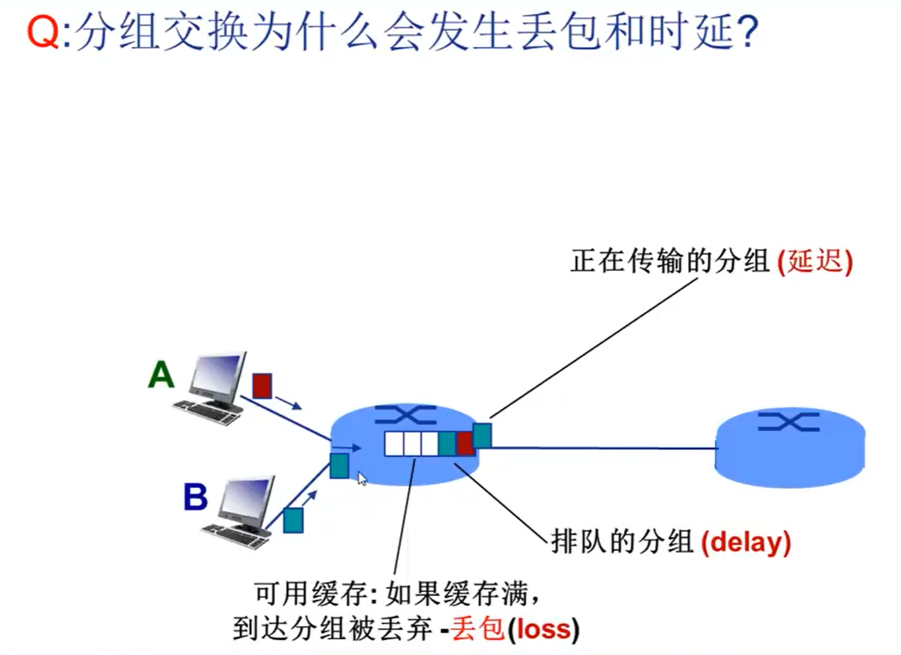

# 计算机网格体系结构-分层结构

网络体系结构式从`功能上`描述计算机网络结构

每层遵循某个`网络协议`完成本层功能

所以计算机网络体系结构式计算机网络的各层次及其协议的集合

> 为什么采用分层结构？
>
> - 结构清晰，有利于识别复杂系统的部件及其关系
> - 模块化的分层易于系统更新、维护
> - 有利于标准化

实体：表示任何可发生或接收信息的硬件或软件进程

协议是控制两个对等实体进行通信的规则的集合，协议是水平的（只存在与相同层次之间）

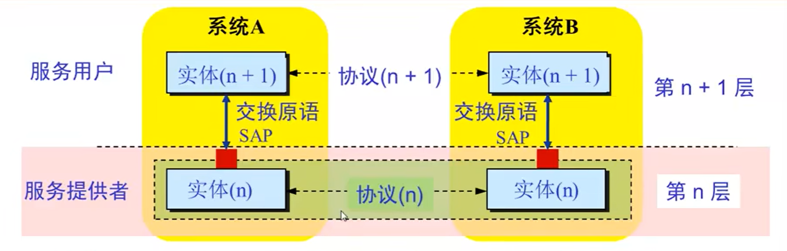

任何一层实体需要使用下层服务，遵循本层协议，实现本层功能。

- n层向上提供服务
- n+1层使用下层服务，遵循本层协议

# OSI参考模型

协议是对等的 数据传输是纵向的

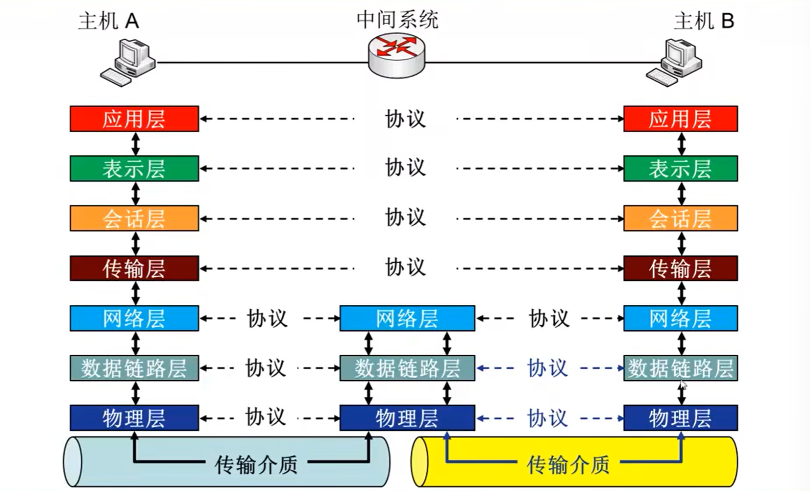

传输层~应用层 端-端层

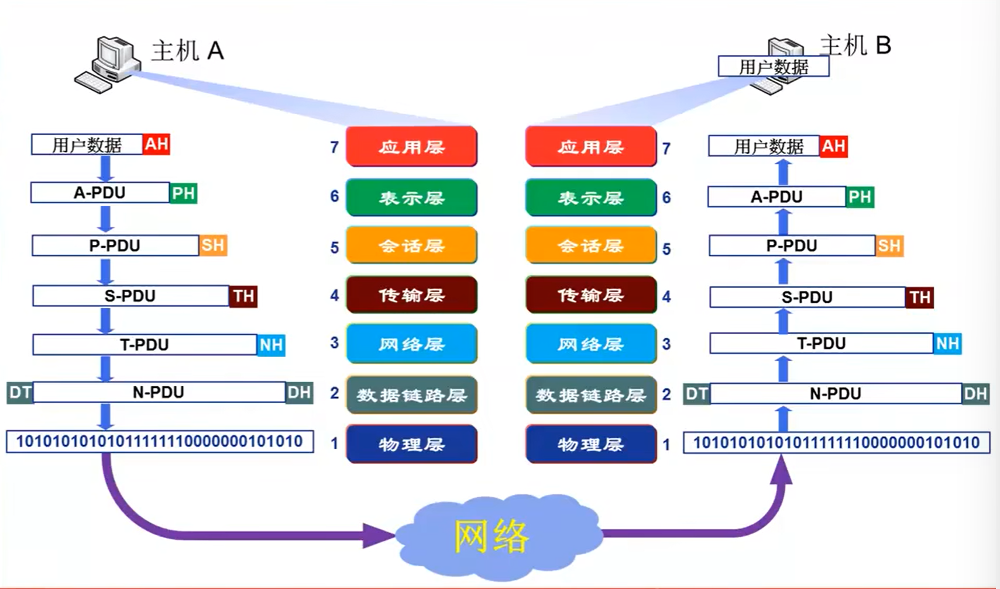

为什么需要数据封装？

增加控制信息

- 控制信息：

  - 地址：标识发送端/接收端

  - 差错检测编码：用于差错检测或纠正

  - 协议控制：实现协议功能的附加信息，如：优先级、服务质量等

## 非端到端层

### 物理层

### 数据链层

负责`结点-结点`数据传输

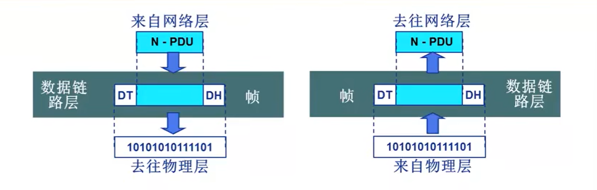

- 物理寻址：用于识别谁发出数据，谁接收数据

  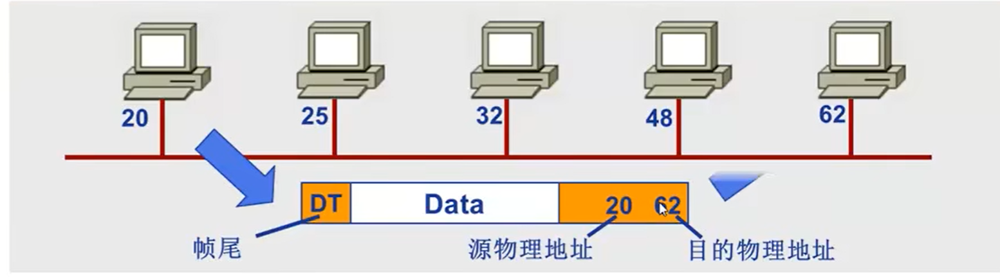

- 流量控制：让发出端的速率和接收端的速率匹配。避免淹没接收端

### 网络层

负责源主机到目的主机数据分组交付

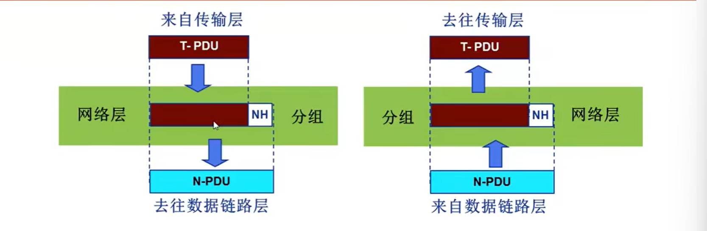

- 逻辑寻址：全局唯一，确保数据分组被送达目的地

- 路由：路径选择
- 分组转发

## 端到端

### 传输层

负责原-目的（端-端）（进程间）完整报文传输

- 分段与重组
- SAP寻址

### 会话层

对话控制

同步：在数据流中插入”同步点“

### 表示层

处理两个系统交换信息的语法与语义

- 数据表示转化
- 加密/解密
- 压缩/解压缩

### 应用层

支持用户通过用户代理或网络接口使用网络

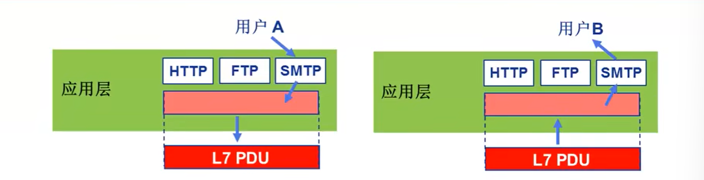

# TCP/IP参考模型

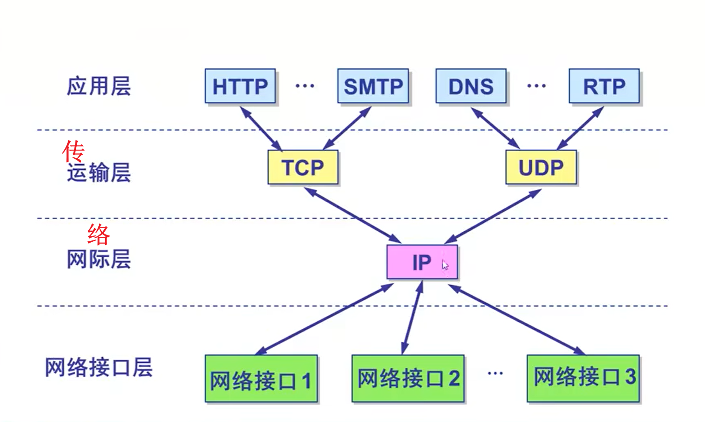

# 5层参考模型

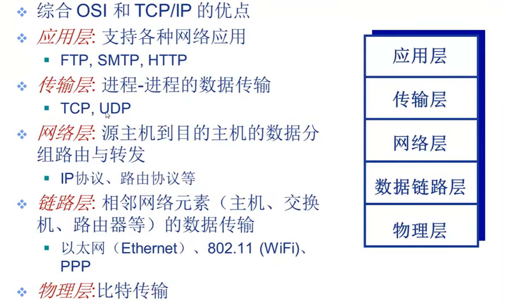

# 网络应用体系结构

## 客户机/服务器结构

web

服务器

- 7*24小时提供服务
- 永久性访问地址/域名
- 利用大量服务器实现可扩展性

客户机

- 没有什么硬性要求

## 点对点结构(p2p)

文件共享

- 没有永远在线的服务器
- 任意端系统/节点之间可以直接通讯
- 节点间歇性接入网络
- 节点可能改变IP地址

## 混合结构

Napster

- 文件传输使用p2p结构
- 文件的搜索采用C/S结构，节点向中央服务器查询

# 网络应用进程通信

> **进程**：主机上运行的程序
>
> 同一主机上进行的进程之间如何通信？
>
> - 进程间通信机制
> - 操作系统提供

不同主机上进行的进程之间如何通信？

- 消息(报文)交换

**客户机进程**：发起通信的进程

**服务器进程**：等待通信请求的进程

## socket

进程间通信依靠的是**套接字Socket**实现

- 传输基础设施向进程提供API

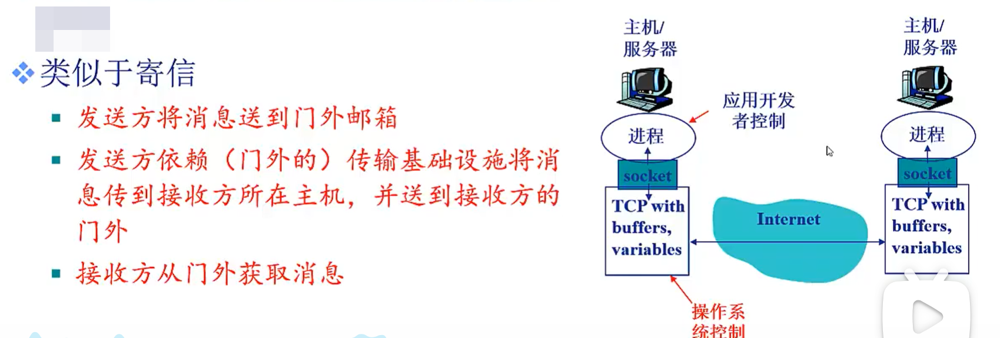

## 寻址进程

1. 如何寻址主机？ 

​	IP地址

2. 有了IP地址后，是否足以定位进程?

   不能，同一主机上可能同时又多个进程需要通信

3. 需要端口实现区分同一主机上的多个进程。

   为主机上每个需要通信的进程分配一个端口号，如：

   - HTTP Server: 80
   - Mail Server: 25

**IP地址 + 端口号  = 进程的标识符**

## 应用程协议

> 决定了消息交换的格式、方法

1. 公开协议

   - RFC定义

   - 允许互操作

   - HTTP、SMTP

2. 私有协议
   - 多数P2P文件共享应用

### 协议的内容

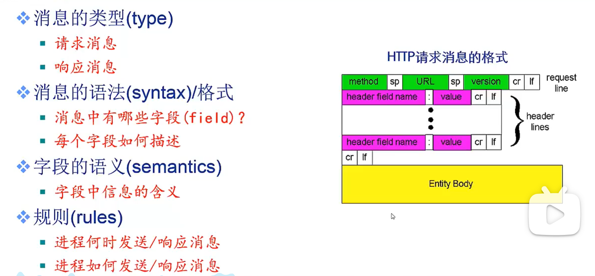

# Web应用

网页包含多个对象

- 对象：HTML文件、JEPG图片、视频文件、动态脚本等
- 基本HTML文件：包含对其他对象的引用的链接

对象的寻址

- `url`(uniform resource locator):`统一资源定位器`
- `Scheme://host:port/path`
  - scheme ：协议 ，可省略(http://)
  - www.someschool.edu/someDept/pic.gif
    - www.someschool.edu hostname
    - someDept/pic.gif pathname

## HTTP协议

万维网遵循的是`超文本传输协议`(`HyperText Transfer Protocol`)

### c/s结构

- 客户——Browser:请求、接受、展示Web对象
- 服务器——Web Server:响应客户端的请求，发送对象

### 依靠TCP传输服务

- 服务器在80端口等待客户的请求
- 浏览器发起到服务器的TCP连接（创建套接字Socket)
- 服务器接受来自浏览器的TCP连接
- 浏览器(HTTP客户端)与Wb服务器(HTTP服务器)交
- 换HTTP消息
- 关闭TCP连接

**无状态**：服务器不维护任何有关客户端过去所发请求的信息

## HTTP连接

### 非持久性连接

- 每个TCP连接最多蕴蓄传输一个对象
- HTTP 1.0版本使非持久性连接

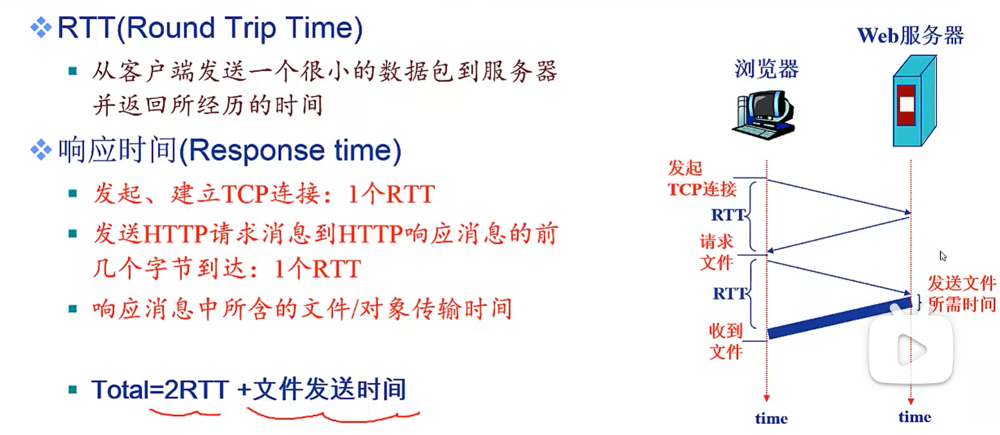

### 持久性连接

- 每个TCP连接允许传输多个对象
- HTTP 1.1版本默认使用持久性连接

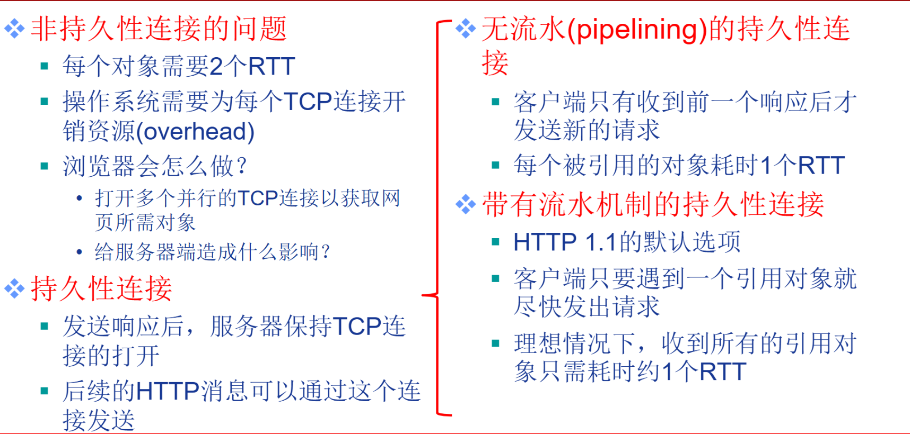

## 请求消息

用`ASCII`编写

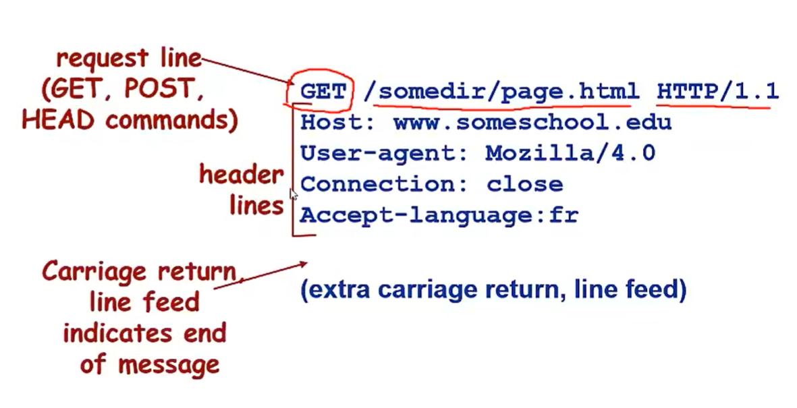

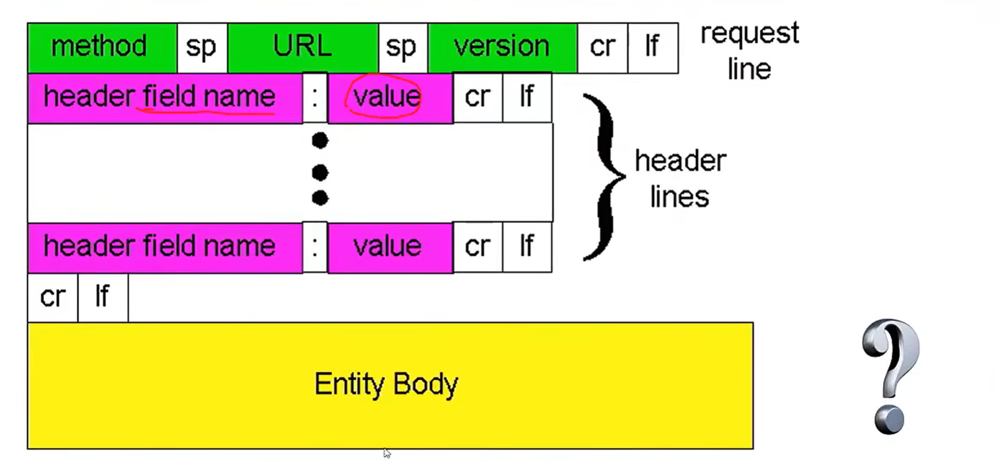

**POST方法**

- 网页经常需要填写表格
- 在请求消息的消息体(entity body)中上传客户端的输入

**URL方法**（少量信息）

- 使用GET方法
- 输入信息通过request行的url字段上传(url携带参数)

## HTTP方法的类型

### HTTP/1.0

- GET
- POST
- HEAD
  - 请Server不要将所有请求的对象放入响应消息中

### HTTP/1.1

- GET、POST、HEAD
- PUT
  - 将消息体中的文件上传到URL字段所指定的路径
- DELETE
  - 删除URL字段所指定的文件

## 响应消息

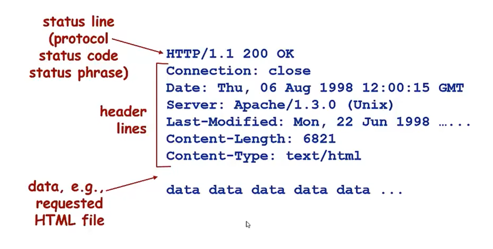

Date: Web服务器生成响应消息的时间

Last-Modified: 上次修改的时间

## 响应状态码

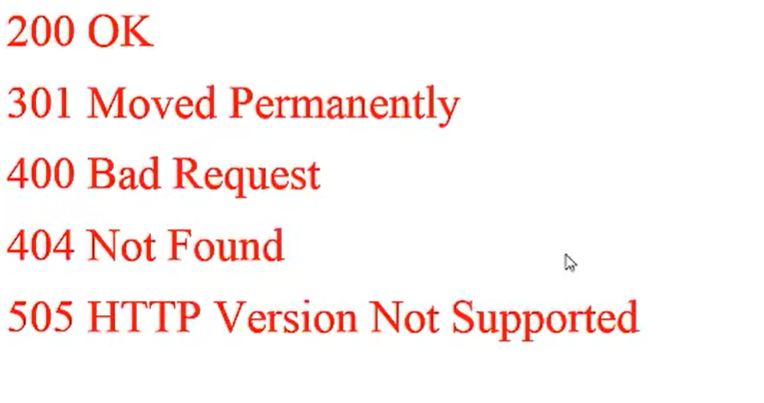

## Cookie技术

