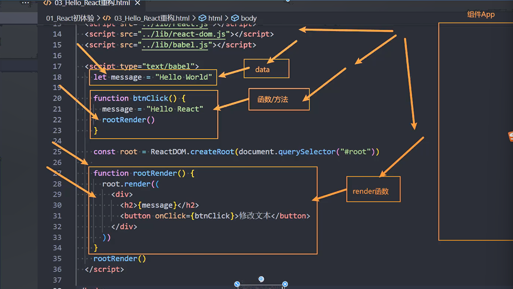
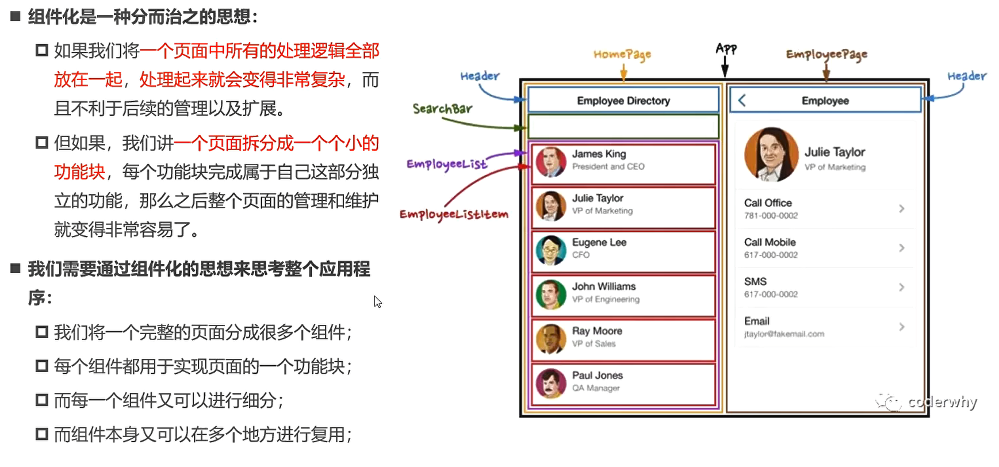
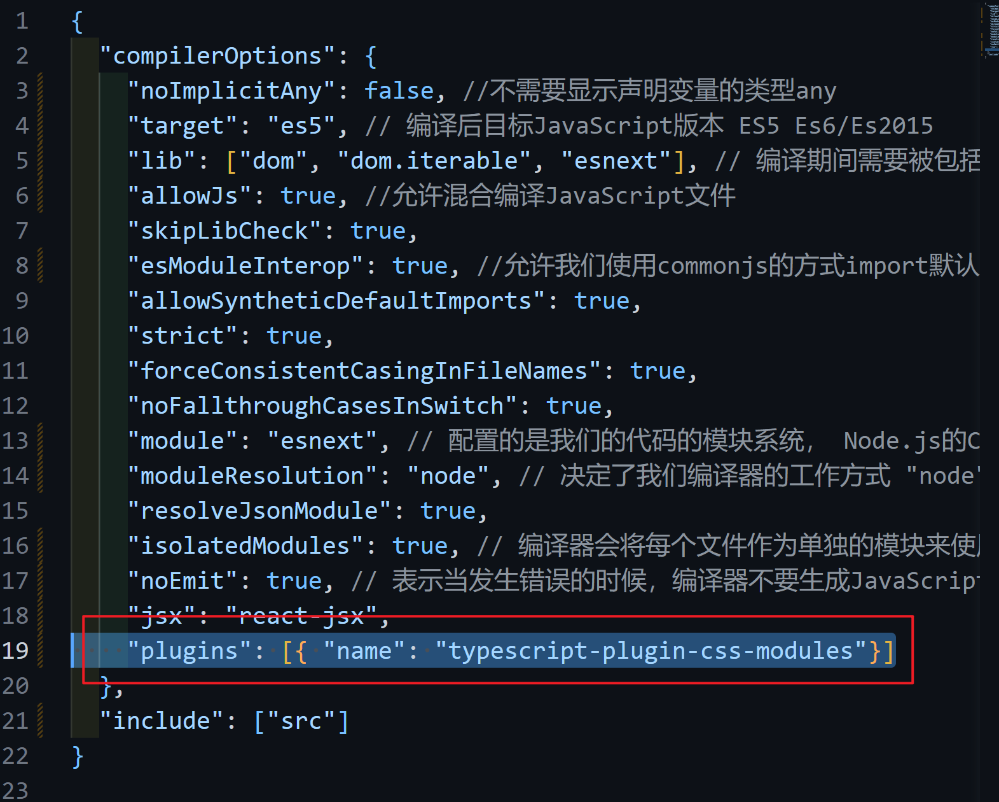

# Hello React

> 编写react代码需要引入三个包
>
> 1. `react`: 包含react所必须的核心代码
> 2. `react-dom`: react渲染在不同平台所需要的核心代码
> 3. `babel`: 将jsx转变成js代码的工具

```javascript
    <!-- CDN 引入 -->
    <script
      crossorigin src="https://unpkg.com/react@18/umd/react.development.js"
    ></script>
    <script
      crossorigin
      src="https://unpkg.com/react-dom@18/umd/react-dom.development.js"
    ></script>
    <script src="https://unpkg.com/@babel/standalone/babel.min.js"></script>
```

> react18之前：ReactDOM.render
>
> ```javascript
> ReactDOM.render(<h2>Hello world</h2>, document.querySelector("#root"));
> ```
>
> > [!CAUTION]
> >
> > Warning: ReactDOM.render is no longer supported in React 18. Use createRoot instead.

## 模板

React 18之后：允许有多个root

```javascript
<!DOCTYPE html>
<html lang="en">
  <head>
    <meta charset="UTF-8" />
    <meta name="viewport" content="width=device-width, initial-scale=1.0" />
    <title>Hello React</title>
  </head>
  <body>
    <div id="root"></div>
    <div id="root"></div>
    <!-- 添加依赖 -->
    <!-- CDN 引入 -->
    <script
      crossorigin
      src="https://unpkg.com/react@18/umd/react.development.js"
    ></script>
    <script
      crossorigin
      src="https://unpkg.com/react-dom@18/umd/react-dom.development.js"
    ></script>
    <script src="https://unpkg.com/@babel/standalone/babel.min.js"></script>

    <script type="text/babel">
      const root = ReactDOM.createRoot(document.querySelector("#root"));
      root.render(<h2>Hello world</h2>);
      const app = ReactDOM.createRoot(document.querySelector("#app"));
      app.render(<h2>Hello App</h2>);
    </script>
  </body>
</html>

```

## 例-点击按钮切换文字

```javascript
    <script type="text/babel">
      let message = "keep going🙌";
			// 定义一个切换文字方法
      function changeText() {
        message = "I will❗";
        rootRender();
      }

      const root = ReactDOM.createRoot(document.querySelector("#root"));

      function rootRender() {
        root.render(
          <div>
            <h1>{message}</h1>
            <button onClick={changeText}>点击切换</button>
          </div>
        );
      }
      rootRender();
    </script>
```

# 组件




## 函数式组件

>  1. 组件名必须大写
>  2. 函数必须要有返回值
>  3. 渲染部分要以标签的形式写入组件名
>
>  ```js
>  ReactDOM.render(<MyComponent/>, document.getElementById("test"))
>  ```
>
>  **执行了ReactDOM.render()后会发生什么**
>
>  -   React解析组件标签，找到了MyComponent组件
>
>  -   发现组件是使用函数定义的，随后调用该函数，将返回的虚拟DOM转为真实的DOM,呈显在页面中

```js
<script type="text/babel">
      // 1. 函数式组件
      function MyComponent() {
        console.log(this); //🔴undefined 因为babel开启了严格模式
        return <h2> 我是函数定义的组件(适用于【简单组件】的定义)</h2>;
      }
      //   2. 渲染组件到页面
      // <MyComponent/> 大写使其渲染为组件
      ReactDOM.render(<MyComponent />, document.getElementById("test"));
</script>
```

### 特点

1. 没有生命周期，也会被更新并挂载，但是没有生命周期函数
2. this 关键字不能指向组件实例(因为没有)
3. 没有内部状态(state)

## 类式组件

1. 组件名必须大写
2. 创建一个类式组件必须要继承React的内置类
3. 必须要有render()函数完成页面渲染
4. **数据应该定义在哪里？**
   - 参与数据流：参与界面更新的数据。
      - 要定义在对象的`state`中，`this.state({属性1：属性值1, 属性2：属性值2})`
      - 通过`this.setState()`来更新数据，setState()更新数据后会自动通知React进行渲染

5. 对于this的指向问题：
   - 可以如示例中的使用bind()来更改this指向
   - 可以通过提前绑定this指向在constructor() {}内
   - 可以看高级写法解决这个问题

```javascript
class MyComponent exends React.Component {
  constructor() { //可选
    super();

    this.state = {
      message: "Hello world",
      name:"Judy",
      age:18,
    }
    //🔴对需要提前绑定的方法， 提前绑定this
    //this.changeText = this.changeText.bind(this);
  }

  //实例方法
  changeText() {
    this.setState({
      message: "Hello you",
    })
  }

  //渲染内容 render()方法 返回什么则渲染什么 返回的是JSX代码
  render() {
    return (
      <div>
      <h2>{this.state.message}</h2>
      <button onClick = {this.changeText.bind(this)}>
      点击切换					  
  </button>  
  </div>
  )
}
}

//  将组件渲染到页面上
const root = ReactDOM.createRoot(document.querySelector("#root"));
//   App根组件
root.render(<App />);
```

### 例-电影列表展示

> [!note]
>
> 在 React 中,当你使用 map() 方法遍历数组并渲染列表时,通常会使用 `() `而不是 {} 作为函数体。
>
> 当你使用 () 作为函数体时,它表示你直接返回了一个 JSX 元素。这种方式可以让你更简洁地编写 JSX 代码,不需要使用 return 关键字。

```javascript
<script type="text/babel">
      const root = ReactDOM.createRoot(document.querySelector("#root"));
      class App extends React.Component {
        constructor() {
          super();

          this.state = {
            movies: ["星际穿越", "钢铁侠", "机器人总动员"],
          };
        }

        render() {
          return (
            <div>
              <h2>电影列表</h2>
              <ul>
                {this.state.movies.map((movie) => (
                  <li>{movie}</li>
                ))}
              </ul>
            </div>
          );
        }
      }
      root.render(<App />);
    </script>
```

# JSX基础语法

## 介绍

JSX是JavaScript和XML的缩写 ，表四JS代码中编写HTML模版结构，它是React中编写UI模版的方式.

==本质==：jsx仅仅只是`React.createElement(component, props, ...children)函数`的语法糖。所有的jsx最终都会被转成React.createElement的函数调用

> **createElement需要传递三个参数**
>
> - 参数一：type
>   - 当前的ReactElement的类型
>   - 如果是标签元素，那么就使用字符串表示 "div"
>   - 如果是组件元素，那么就是直接使用组件名表示
> - 参数二：config
>   - 所有jsx中的属性都在config中以对象的属性和值的形式存储 
>   - 比如传入className作为元素的class
> - 参数三：children
>   - 存放在标签中的内容，以children数组的方式存储

> 为什么react选择lJSX？
>
> React认为**渲染逻辑**本质上与其他**UI逻辑**存在内在耦合
>
> - 比如需要绑定事件
> - 比如某些状态改变时，又需要改变UI
>
> 优势：
>
> 1. HTML的声明式模版写法
> 2. JS的可编程能力

JSX并不是标准的JS语法，它是JS的语法扩展，浏览器本身不能识别，需要通过解析工具做解析之后才能在浏览器中运行


## 语法

1. 为了方便阅读，我通常需要在jsx的外层包裹一个小括号()

2. Return a single root element 

   要从组件返回多个元素，请使用单个父标记将它们包装起来。(例如，您可以使用 `<div>`)

3. jsx 中的标签可以是单标签也可以是双标签

4. Close all the tags 

   JSX 要求明确关闭标签：像 `` 这样的自闭合标签必须变成 ``，像 `<li>oranges` 这样的包装标签必须写成 `<li>oranges</li>`。

5. 所有的-变成驼峰命名法

6. `{/*这里写注释*/}`

## 嵌入变量

1. 情况一：当变量是`Number`、`String`、`Array`类型时，可以直接显示

2. 情况二：当变量是`null`、`undefined`、`Boolean`类型时，内容为空；

   > 如果希望可以显示nul、undefined、Boolean,那么需要转成字符串；
   >
   > 转换的方式有很多，比如toString,方法、和空字符串拼接，String(变量)等方式；

3. `Object对象类型`不能作为子元素(not valid as a React child)

   > Error: Objects are not valid as a React child (found: object with keys {name, gender}). If you meant to render a collection of children, use an array instead.
   >
   > Tips:可以使用`Object.keys()[0]`拿到第一个属性名

## 使用JS表达式

在JSX中可以通过 大括号语法{} 识别 JavaScript中的表达式，比如`常见的变量`、`函数调用`、`方法调用`等等

> [!caution]
>
> 注意：`if语句`、`switch语句`、`变量声明`属于语句，不是表达式，不能出现在{}中

```javascript
{/* 使用引号传递字符串 */}
{"this is message"}
{/* 使用JavaScript变量 */}
{count}
{/* 函数调用 */}
{getName()}
{/* 方法对象 */}
{new Date().getDate()}
{/* 使用js对象 外层{}是识别的语法 内层{}是对象*/}
<div style={{ color: "red" }}>this is div</div>
```

## 事件绑定

> 针对之前的this 指向在全局模式下为undefined的情况，我们要用到bind来修改this指向。而现在我们有更好的解决办法，那就是使用`箭头函数`解决这一问题。
>
> ```javascript
> <button onClick={() => this.btn2Click()}>
> ```
>
> 我们通过使用箭头函数来调用函数，已知箭头函数无this指向，那么它就会在其上层作用域中寻找，最终this指向的就是当前组件实例，因而不同于吧函数赋值给onclick的this指向是window(严格模式的undefined)    
>
> ==this 四种绑定规则==
>
>     1. 默认绑定 独立执行 foo()
>     2. 隐式绑定 被一个对象执行 obj.foo() ->obj
>     3. 显示绑定 call/apply/bind
>     4. new绑定 new Foo() 创建一个新对象 并赋值给this 

```javascript
// 点击切换文本利用类组件搭配箭头函数优化版本
<script type="text/babel">
      class App extends React.Component {
        constructor() {
          super();

          this.state = {
            message: "Hello World",
          };
        }

        btnClick() {
          this.setState({ message: "NO Happy" });
        }
        
        render() {
          const { message } = this.state;
          return (
            <div>
              {/* 此处不是将函数赋值给onclick 而是通过回调函数实现对象真正的调用btn2Click方法，则不用担心this指向问题*/}
              <button onClick={() => this.btnClick()}>{message}</button>
            </div>
          );
        }
      }

      const root = ReactDOM.createRoot(document.querySelector("#root"));
      root.render(<App />);
    </script>
```

## 类名绑定

```javascript
//1. 字符串拼接
const className = `abc asd ${isActive ? 'active' : ''}`
<h2 className = {classList.join(" ")}></h2>
//2. 把所有的class放到数组中
const classList = ['asd', 'ass']
if (isActive) classList.push("active")
<h2 className = {className}></h2>
//3. 第三方库 classNames
```

## 样式绑定

所有的`-`都要变成驼峰表示 ，例如font-size要变成`fontSize`	

```javascript
// {外侧} JSX语法 {内侧}表示对象 {{里面的就是属性和属性值}}
<h2 style = {{color: "red", fontSize: "30px"}}></h2>
```

## 参数传递

> ```javascript
> btnClick(event, name, age) {
>   console.log(event, name, age);
> }
> ...
> <button onClick={(event) => this.btnClick(event, "Judy", 18)}>
> ...
> ```
>
> 1. 箭头函数只传递事件
> 2. 被调用的实例方法可以传递多个参数

## 例-电影列表选中案例

> **核心思路**：使用currentIndex 记录当前被点击项，当被点击项等于map遍历的index，添加active类
>
> ==易错==： 注意前面括号里如果写了参数传递的是event，所以不需要在箭头函数中写形参，只需要在调用的实例方法中`传递index`即可
>
> ```javascript
> onClick={(event) => this.changeColor(index)} 
> ```

```js
<!DOCTYPE html>
<html lang="en">
  <head>
    <meta charset="UTF-8" />
    <meta name="viewport" content="width=device-width, initial-scale=1.0" />
    <title>Document</title>
    <style>
      .active {
        color: brown;
      }
    </style>
  </head>
  <body>
    <div id="root"></div>

    <script src="./lib/react.js"></script>
    <script src="./lib/react-dom.js"></script>
    <script src="./lib/babel.js"></script>

    <script type="text/babel">
      // 🔴核心是需要添加一个数值记录当前列表选中项
      class App extends React.Component {
        constructor() {
          super();

          this.state = {
            message: "Hello World",
            movies: ["星际穿越", "金刚", "爱在黎明破晓时"],
            currentIndex: 0,
          };
        }

        changeColor(index) {
          console.log(index);

          this.setState({
            currentIndex: index,
          });
        }

        render() {
          const { message, currentIndex } = this.state;
          return (
            <div>
              <h2>{message}</h2>
              <ul>
                {this.state.movies.map((item, index) => {
                  return (
                    <li
                      key={index}
                      className={currentIndex === index ? "active" : ""}
                      onClick={() => this.changeColor(index)}
                    >
                      {item}
                    </li>
                  );
                })}
              </ul>
            </div>
          );
        }
      }

      const root = ReactDOM.createRoot(document.querySelector("#root"));
      root.render(<App />);
    </script>
  </body>
</html>
```

# React渲染

## 条件渲染的三种写法

```javascript
render() {
          const { isReady, friend } = this.state;

          //   1. 条件判断方式：使用if进行条件判断
          let showElement = null;
          if (isReady) {
            showElement = <h2>Ready to Begain</h2>;
          } else {
            showElement = <h1>Go to prepare</h1>;
          }

          return (
            <div>
              {/* 1. 方式一：if*/}
              <div>{showElement}</div>
              {/* 2. 方式二：三元运算法*/}
              <div>
                {isReady ? <button>Fight</button> : <button>Go back</button>}
              </div>
              {/* 3. 方式三：逻辑与 && 当服务器未传值时则不显示任何值 
                如果不用逻辑与做判断 则传值为undefined时会报错 */}
              <div>
                {friend && <div>{friend.name + " " + friend.desc}</div>}
              </div>
            </div>
          );
        }
      }
```

## 例-点击切换显示状态

实现点击显示 再次点击则隐藏

> 核心：使用一个变量isShow存储当前状态 
>
> 利用 isShow: !isShow 实现取反 
>
> ```javascript
> // 法二 利用与运算
> {isShow && <h2>{message}</h2>}
>  // 法一 利用三元运算方法
>  <h2 style={{ display: isShow ? "block" : "none" }}>DISPLAY</h2>
> ```

```javascript
 <script type="text/babel">
      class App extends React.Component {
        constructor() {
          super();

          this.state = {
            message: "Hello World",
            isShow: true,
          };
        }

        changeState() {
          this.setState({ isShow: !this.state.isShow });
        }

        render() {
          const { message, isShow } = this.state;
          return (
            <div>
              <button onClick={() => this.changeState()}>
                Click to change
              </button>
              <h2 style={{ display: isShow ? "block" : "none" }}>{message}</h2>
            </div>
          );
        }
      }
```

## 列表过滤渲染

> 1. filter函数
>
> ```javascript
> // 返回分数大于9.1的新数组 
> 数组.filter(item => {
> 	return item.score > 9.1
> })
> ```
>
> 2. slice函数
>
> ```javascript
> // 截取数组
> //slice(start, end) [strat, end)
> 数组.slice(0,2) //包含0 不包含2
> ```

```javascript
<script type="text/babel">
      class App extends React.Component {
        constructor() {
          super();

          this.state = {
            books: [
              { id: 1, name: "one", score: 9.5 },
              { id: 2, name: "two", score: 9.2 },
              { id: 3, name: "three", score: 9.1 },
              { id: 4, name: "four", score: 9.3 },
              { id: 5, name: "five", score: 9.8 },
              { id: 6, name: "six", score: 9.6 },
            ],
          };
        }

        render() {
          const { books } = this.state;

          //   分数大于9.1进行展示 filter函数
          const filterBooks = books.filter((item) => {
            return item.score > 9.1;
          });

          //    分数大于9.1只展示两个人的信息 slice 函数
          //   slice(start, end) [strat, end) 包含0 不包含2
          const sliceBooks = filterBooks.slice(0, 2);
          return (
            <div>
              <h2>书籍列表</h2>
              <div className="list">
                {sliceBooks.map((item) => {
                  return (
                    <div key={item.id} className="item">
                      <h1>{item.id}</h1>
                      <h1>{item.name}</h1>
                      <h1>{item.score}</h1>{" "}
                    </div>
                  );
                })}
              </div>
            </div>
          );
        }
      }
```

## 综合案例


> Tips:
>
> 1. 将非主要代码拆分
>
>    - 对于过于麻烦的数据代码块，我们可以另外编写一个js文件，再将其引入到HTML代码中
>
>    - 对于格式化的操作，也可以单独编写一个js文件来编写此方法然后引入、
>
>    ```javascript
>        <!-- 将books定义到全局 -->
>        <script src="books.js"></script>
>        <!-- 引入格式化函数 -->
>        <script src="format.js"></script>
>    ```
>
> 2. 计算总价利用reduce函数
>
> 3. 对列表进行元素的更改，需要进行浅拷贝
>
>    - 改变books对象数组中的count值
>
>    ```javascript
>    changeNum(index, n) {
>      // 🔴🔴浅拷贝
>      const newBooks = [...this.state.books];
>      newBooks[index].count += n;
>      this.setState({ books: newBooks });
>    }
>    ```
>
>    先浅拷贝原数组，在通过对浅拷贝的数组进行具体操作，最后利用setState()赋值给元素组
>
>    - 删除数组元素利用slice函数 `slice(startDeleteIndex, deleteNum)`
>
> 4. 保留2位小数 `Num.toFixed(2)`

```javascript
<!DOCTYPE html>
<html lang="en">
  <head>
    <meta charset="UTF-8" />
    <meta name="viewport" content="width=device-width, initial-scale=1.0" />
    <link rel="icon" href="favicon.ico" />
    <title>购物车案例</title>
    <style>
      .table {
        /* border: solid; */
        table-layout: fixed;
        width: 100%;
        border-collapse: collapse;
        border: 2px solid gray;
      }
      th {
        color: rgb(49, 49, 130);
      }
      th,
      td {
        padding: 4px 6px;
        font-weight: bold;
        text-align: center;
        border: 1.5px solid gray;
      }

      .countChange {
        margin: 0px 2px;
      }
    </style>
  </head>
  <body>
    <div id="root"></div>

    <script src="../lib/react.js"></script>
    <script src="../lib/react-dom.js"></script>
    <script src="../lib/babel.js"></script>
    <!-- 将books定义到全局 -->
    <script src="books.js"></script>
    <!-- 引入格式化函数 -->
    <script src="format.js"></script>
    <script type="text/babel">
      class App extends React.Component {
        constructor() {
          super();

          this.state = {
            books: books,
          };
        }
        changeNum(index, n) {
          // 🔴🔴浅拷贝
          const newBooks = [...this.state.books];
          newBooks[index].count += n;
          this.setState({ books: newBooks });
        }
        getTotalPayment() {
          //   利用reduce函数🔴
          const totalPayments = this.state.books.reduce((prceive, current) => {
            return prceive + current.count * current.price;
          }, 0);
          return totalPayments;
        }
        // 删除利用slice🔴
        deleteItem(index) {
          const newBooks = [...this.state.books];
          newBooks.splice(index, 1);
          this.setState({ books: newBooks });
        }

        render() {
          const { books } = this.state;
          console.log(books.length != 0);

          // 计算总价 法一
          //   let TotalPayments = 0.0;
          //   for (let i = 0; i < books.length; i++) {
          //     TotalPayments += books[i].count * books[i].price;
          //   }
          return (
            <div>
              <table className={"table"}>
                <thead>
                  <tr>
                    <th>序号</th>
                    <th>书籍名称</th>
                    <th>出版日期</th>
                    <th>价格</th>
                    <th>购买数量</th>
                    <th>操作</th>
                  </tr>
                </thead>
                <tbody>
                  {books.map((book, index) => {
                    return (
                      <tr key={index}>
                        <td>{index + 1}</td>
                        <td>{book.name}</td>
                        <td>{book.date}</td>
                        <td>{formatPrice(book.price)}</td>
                        <td>
                          {/*对item.count进行判断啊笨蛋🔴 */}
                          <button
                            disabled={book.count <= 1 ? true : false}
                            className={"countChange"}
                            onClick={() => this.changeNum(index, -1)}
                          >
                            -
                          </button>
                          {book.count}
                          <button
                            className={"countChange"}
                            onClick={() => this.changeNum(index, 1)}
                          >
                            +
                          </button>
                        </td>
                        <td>
                          <button onClick={() => this.deleteItem(index)}>
                            移除
                          </button>
                        </td>
                      </tr>
                    );
                  })}
                </tbody>
                {books.length === 0 && <h3>购物车被清空</h3>}
              </table>
              <h1>合计:{formatPrice(this.getTotalPayment())}</h1>
            </div>
          );
        }
      }

      const root = ReactDOM.createRoot(document.querySelector("#root"));
      root.render(<App />);
    </script>
  </body>
</html>

```

# 虚拟DOM创建过程

我们通过React.createElement 最终创建出来一个ReactElement对象


> 这个对象有什么作用？React为什么要创建它？
>
> - 原因是react利用ReactElement对象组成了一个JavaScript的对象树
> - JavaScript的对象树就是虚拟DOM

# 声明式编程

虚拟DOM帮助我们从命令式编程转到了声明式编程

React官方的说法：Virtual DOM是一种编程理念。

- 在这个理念中，凹以一种理想化或者说虚拟化的方保存在内存中，并且它是一个相对简单的JavaScript对像
- 我们可以通过ReactDOM.renderi让`虚拟DOM`和`真实DOM同步`起来，这个过程中叫做`协调`(Reconciliation)

# 前端脚手架


通过脚手架创建字母的项目名不能有大写字母

```cmd
create-react-app 项目名称
```

启动项目

```javascript
cd 项目名称
yarn start
```

命令在哪查找


## 目录结构分析 

node_modules: 安装的第三包均放在此处

src:所有的源代码

gitignore：git的忽略文件

package.json: 项目配置 和 依赖

package-lock.json: 真实配置 具体版本

PWA 可以实现把网页添加为桌面图标的功能


## 编写react文件

> 1. 都需要继承React.Component
> 2. 都需要exprot,并且import 到App.js

在Component文件夹下编写一个HelloWorld文件

 alt="image-20240814152013755.png" style="zoom:33%;"> alt="image-20240814152013755" style="zoom:33%;" />

```javascript
import React from "react";
class HelloWorld extends React.Component {
  render() {
    return (
      <div>
        <h2>Hello World</h2>
      </div>
    );
  }
}
export default HelloWorld;
```

App.js

```javascript
import React from "react";
import HelloWorld from "./Components/HelloWorld"; 
//引入HelloWorld文件
// 编写一个组件
class App extends React.Component {
  constructor() {
    super();

    this.state = {
      message: "你好",
    };
  }
  render() {
    const { message } = this.state;
    return (
      <div>
        <h2>{message}</h2>
        <HelloWorld />
      </div>
    );
  }
}

export default App; // 导出

```

# 组件化开发



## 分类

按照不同的方式可以分类成很多种类的组件

- 按组件的定义方式： 函数式组件 和 类组件
- 按组件内部是否有状态需要维护：无状态组件（一般为函数式组件） 和 有状态组件
- 按组件的不同职责可以分成：展示型组件 和 容器型组件

## 作用

> 当render被调用时 它会检查 this.props 和 this.state并返回以下类型之一：
>
> - react元素：通过JSX编写的代码就会被编译成React.createElement，所以返回的就是一个react元素
>
> - 数组 或 fragments ：使得render方法可以返回多个元素(自动遍历输出)
>
> - Portals：可以渲染子节点到不同的DOM子树中
>
> - 字符串或数字类型
>
> - 布尔类型 和 null 类型 ：界面上不显示

**函数式组件 无状态组件 展示型组件 主要关注UI的展示**

```javascript
function App() {
  return <h2>函数式组件</h2>
}
export default App 
```

**类组件 有状态组件 容器型组件 主要关注数据逻辑处理**

```javascript
class App extends Component {
  constructor() {
    super();

    this.state = {
      message: "Hello World",
    };
  }
  render() {
    // return <div>{this.state.message}</div>;
    // return [1, 2, 3, 4];
    return [<h2>1</h2>, <h3>1</h3>, <h4>1</h4>];
  }
}
export default App;
```

# 生命周期

## 介绍

**生命周期**： 是一个抽象的概念，在生命周期的整个过程中，分成了很多个阶段：

- `装载阶段`(Mount)：组件第一次在DOM树中被渲染的过程
- `更新过程`(Update)：组件状态发生变化，重新更新渲染的过程
- `卸载过程`(Unmount)：组件从DOM树中被移除的过程

**生命周期函数**： React内部为了告诉我们当前处于哪些阶段，会对我们组件内部实现的某些函数进行回调，这些函数就是生命周期函数。

- 比如实现`componentDidMount`函数：组件已经挂载到DOM上时，就会回调；
- 比如实现`componentDidUpdate`函数：组件已经发生了更新时，就会回调；
- 比如实现`componentWillUnmount`函数：组件即将被移除时，就会回调；

我们可以在这些回调函数中编写自己的逻辑代码，来完成自己的需求功能。

##  基础的生命周期图


### Constructor

- `非必须性`。如果不初始化state 或 不进行方法绑定，则不需要为React组件实现构造函数
- 作用：
  - 通过给this.state赋值对象来初始化内部的state
  - 为事件绑定实例(this)

### componentDidMount

- componentDidMount0会在组件挂载后（插入DOM树中）立即调用.
- componentDidMount中通常进行哪里操作呢？
  - 依赖于DOM的操作可以在这里进行；
  - 在此处`发送网络请求`就最好的地方(官方建议)
  - 可以在此处添加一些订阅（会在componentWillUnmount取消订阅）；

### componentDidUpdate

componentDidUpdate0会在更新后会被立即调用，首次渲染不会执行此方法：

- 当组件更新后，可以在此处对DOM进行操作；
- 如果你对更新前后的props进行了比较，也可以选择在此处进行网络请求；（例如，当props未发生变化时，则不会执行网络请求)。

### componentWillUnmount

componentWillUnmount0会在组件卸载及销毁之前直接调用。

- 在此方法中执行必要的清理操作；

- 例如，清除timer,取消网络请求或清除在componentDidMount0中创建的订阅等；

### 测试模拟案例

```javascript
import React, { Component } from "react";

class HelloWorld extends React.Component {
  constructor() {
    super();

    this.state = {
      stepCount: 0,
      message: "Hello World",
      isShow: true,
    };
    console.log("constructor");
  }

  changeText() {
    this.setState({ message: "你好" });
  }
  switchToShow() {
    this.setState({ isShow: !this.state.isShow });
  }
  render() {
    console.log("render");

    const { message, isShow } = this.state;
    return (
      <div>
        <button onClick={() => this.changeText()}>Click</button>
        <button onClick={() => this.switchToShow()}>Switch</button>
        {isShow && <h1>{message}</h1>}
      </div>
    );
  }
  // 3. 组件被渲染到DOM 被挂载到DOM
  componentDidMount() {
    console.log("componentDidMount");
  }

  // 4. 组件DOM被更新完成
  componentDidUpdate() {
    console.log("componentDidUpdate");
  }

  // 5. 组件从DOM中移除
  componentWillUnmount() {
    console.log("componentWillUnmount");
  }
}

export default HelloWorld;

```

# 组件的通信

父组件通过 **属性 = 值** 的形式来传递给子组件数据

子组件通过 **props参数** 获取父组件传递过来的数据

## 父传子

> 理念：在子组件获取父组件的数据，并在子组件完成渲染
>
> 核心思想：在`父组件`将想要传递给子组件的值`添加为属性`，在子组件利用`const {} = this.props `解构获得属性

```javascript
// Main.js
export class Main extends Component {
  constructor() {
    super();

    this.state = {
      banners: ["新歌曲", "新MV", "新歌单"],
      productList: ["推荐商品", "热门商品", "流行商品"],
    };
  }

  render() {
    const { banners, productList } = this.state;

    return (
      <div className="main">
        <div>
          main
          <MainProductList productList={productList} />
          <MainBanner banners={banners} title={"This is a title"} />
        </div>
      </div>
    );
  }
```

```javascript
// MainBanner.js
export class MainBanner extends Component {
  constructor(props) {
    super(props);
    console.log(props);
  }
  render() {
    console.log("MainBanner", this.props);
    const { title, banners } = this.props;
    return (
      <div>
        <h2>封装一个轮播图{title}</h2>
        <ul>
          {banners.map((item, index) => {
            return <li key={index}>{item}</li>;
          })}
        </ul>
      </div>
    );
  }
}
```


## 子传父

> 理念：将子类的每个不同按钮的count值传给父类，在子类调用父类的方法完成具体的逻辑操作
>
> 核心思想：通过添加属性的形式，将父类的函数以回调函数的形式传给子类，这样子类就以`this.props.属性名()`的形式完成了对父类回调函数的调用，从而实现具体逻辑函数的调用
>
> **疑问: 为什么要分开写调用和改变的部分 这不是更复杂吗？**
>
> 你想啊 ，按钮存在于子组件，而你想通过按钮改变的<h2>文本 位于父组件，那么你就需要实现在子组件调用父组件的逻辑函数对不，因为你的点击事件绑定在子组件的按钮上， 这个时候就是子类调用父类了，当然了，逻辑函数部分是要写在父组件上的，毕竟是对父组件的内容进行更改，那逻辑部分也要在父组件内容里完成呀，所以子组件呢就是起到一个绑定点击事件，然后调用父组件逻辑函数的作用。
>
> 那么在实际开发中也存在子组件对父组件的样式进行操作，所以这样写是非常常见且合理的。

```javascript
// 父组件
export class App extends Component {
  constructor() {
    super();

    this.state = {
      counter: 100,
    };
  }

  changeCount(count) {
    this.setState({ counter: this.state.counter + count });
  }

  render() {
    const { counter } = this.state;
    // 将函数以属性的形式赋值传递给子类🔴🔴🔴
    return (
      <div>
        <h2>currentCount:{counter}</h2>
        <AddCounter
          addClick={(count) => {
            this.changeCount(count);
          }}
        />
        <SubCounter
          decClick={(count) => {
            this.changeCount(count);
          }}
        />
      </div>
    );
  }
}
```

```javascript
// 子组件
export class AddCounter extends Component {
  addCount(count) {
    console.log("count:", count);
    this.props.addClick(count); //调用父类传的过来的函数🔴🔴🔴
  }

  render() {
    return (
      <div>
        <button onClick={(e) => this.addCount(1)}>+1</button>
        <button onClick={(e) => this.addCount(5)}>+5</button>
        <button onClick={(e) => this.addCount(10)}>+10</button>
      </div>
    );
  }
}

```


## propTypes

```javascript
import propTypes from "prop-types";
MainBanner.propTypes = {
  banners: propTypes.array.isRequired,
  title: propTypes.string,
};
```

# 组件的嵌套


# React"插槽"

在开发中，我们抽取了一个组件，但是为了让这个组件具备更强的通用性，我们不能将组件中的内容限制为固定的div、span等等这些元素。

Reacti对于这种需要插槽的情况非常灵活，有两种方案可以实现：

1. 组件的 children子元素(**数组**)

   ==注意==：如果传入的children只有一个 那就是children元素 不是数组

    alt="image-20240815162449204.png" style="zoom:33%;"> alt="image-20240815162449204" style="zoom:25%;" />

   ```javascript
   // 父组件
   export class App extends Component {
     render() {
       return (
         <div>
           <NavBar>
             <button>按钮</button>
             <h2>我是标题</h2>
             <i>斜体文字</i>
           </NavBar>
         </div>
       );
     }
   }
   ```

   ```javascript
   // 子组件
   export class NavBar extends Component {
     render() {
       // 
       const { children } = this.props;
       return (
         <div className="nav-bar">
           {/*结构划分确定 但具体是按钮还是文本框还是什么是不确定的 */}
           {/*🔴emmet 语法 .left+.center+.right */}
           <div className="left">{children[0]}</div>
           <div className="center">{children[1]}</div>
           <div className="right">{children[2]}</div>
         </div>
       );
     }
   }
   ```

2. props属性 传递React元素；(推荐使用)

   使用此方法相传几个传几个 不易报错

   ```javascript
   // App.js        
   <NavBar2
             leftSlot={<button>按钮</button>}
             centerSlot={<h1>标题</h1>}
             rightSlot={"你好"}
           />
   ```

   ```javascript
   // NavBar2组件
   export class NavBar2 extends Component {
     render() {
       const { leftSlot, centerSlot, rightSlot } = this.props;
       return (
         <div className="nav-bar">
           <div className="left">{leftSlot}</div>
           <div className="center">{centerSlot}</div>
           <div className="right">{rightSlot}</div>
         </div>
       );
     }
   }
   ```

# Context[不推荐]

> 为什么引入Context？
>
> 在开发中，存在一些非父子组件数据的传输，需要跨越多个层级，此时使用props一层层传入就过于繁琐。

Context提供了一种组件之间共享此类值的方式，设计目的是为了`共享那些对于一个组件而言是全局的数据`，例如当前认证的用户、主题或首选语言。

例- 父组件传递给子组件：

1. **创建Context值**。利用`React.createContext()`创建一个全局Context对象`ThemeContext`(themeContext.is)

```javascript
import React form "react";
const ThemeContext = React.createContext()
export default ThemeContext
```

2. **提供 Context 值**。想给什么组件共享数据 就用`<ThemeContext.Provider>`标签包裹该组件(App.jsx)

```javascript
<ThemeContext.Provider value={{"color: red, size: 30"}}>
  <HomeInfo />
  <HomeBanner />
</ThemeContext.Provider>
```

3. **提供 Context 值**。

   - 类组件：设置组件的`contextType`刚创建Context值，使用this.context获取值(HomeInfo.jsx)

     ```javascript
     import React, { Component } from "react";
     import ThemeContext from "./context/theme-context";
     export class HomeInfo extends Component {
       render() {
         return (
           <div>
             <h2>contextInfo: {this.context.color}</h2>
           </div>
         );
       }
     }
     
     HomeInfo.contextType = ThemeContext;
     
     export default HomeInfo;
     ```

   - 函数组件：利用`<ThemeContext.Consumer>`标签包裹待接收传值的标签(HomeBanner.jsx)

     ```javascript
     import ThemeContext from "./context/theme-context";
     function HomeBanner() {
       return (
         <div>
           <span>函数式组件</span>
           <ThemeContext.Consumer>
             {(value) => {
               return <h2>{value.color}</h2>;
             }}
           </ThemeContext.Consumer>
         </div>
       );
     }
     export default HomeBanner;
     ```

# 事件总线[不推荐]

在 React 中,事件总线(Event Bus)是一种常见的跨组件通信的方式。

1. 创建一个事件总线模块。

```javascript
import { HYEventBus } from "hy-event-store";

const eventBus = new HYEventBus();
export default eventBus;
```

2. 在需要发送事件的组件中,引入事件总线利用`eventBus.emit()`触发事件(HomeBanner.jsx)

```javascript
eventBus.emit('event-name', arg1, arg2, arg3, ...);
```

```javascript
import React, { Component } from "react";
import eventBus from "./utils/event-bus";

export class HomeBanner extends Component {
  prevClick() {
    eventBus.emit("message", "Name from HomeBanner", "Age From HomeBanner");
  }
  render() {
    return (
      <div>
        <h2>HomeBanner</h2>
        <button onClick={(e) => this.prevClick()}>prev</button>
      </div>
    );
  }
}

export default HomeBanner;
```

3. 在需要接收事件的组件中,利用`eventBus.on()`订阅事件并处理(App.jsx)

```javascript
eventBus.on('event-name', (arg1, arg2, arg3, ...) => {
  // 事件处理逻辑
});
```

```javascript
import eventBus from './eventBus';

class ReceiverComponent extends React.Component {
  componentDidMount() {
    eventBus.on('message', this.handleMessage);
  }

  componentWillUnmount() {
    eventBus.off('message', this.handleMessage);
  }

  handleMessage = (message) => {
    console.log(message);
  }

  render() {
    return (
      <div>Receiver Component</div>
    );
  }
}
```

# setState细节

## 为什么用setState

开发中我们并不能直接通过修改state的值来让界面发生更新：

- 因为我们修改了state之后，希望React根据最新的State来重新渲染界面，但是这种方式的修改，React并不知道数据发生了变化；
- React并没有实现类似于Vue2中的Object.defineProperty或者Vue3中的Proxy的方式来监听数据的变化；
- 我们`必须通过setState来告知React数据已经发生了变化`；

## 为什么要浅拷贝

==为什么引用数据类型修改一定要进行浅拷贝？当组件的某个 prop 是对象、数组或函数时，我的组件如何重新渲染?==

React 通过`浅比较`来比较旧的和新的 prop：也就是说，它会考虑每个新的 prop 是否与旧 prop `引用`相等。如果每次父组件重新渲染时`创建一个新的对象或数组`，即使它们每个元素都相同，React 仍会认为它已更改。同样地，如果在渲染父组件时创建一个新的函数，即使该函数具有相同的定义，React 也会认为它已更改。

- 对于基本数据类型(如 String、Number 等),它们是值类型,当我们修改它们时,React 能够直接检测到状态的变化,因为每次赋值都会创建一个新的值。
- 而对象和数组是引用类型,当我们直接修改它们时,React 无法检测到状态的变化,因为引用并没有发生改变。因此需要创建一个新的引用,即使用浅拷贝的方式,来确保 React 能够正确地检测到状态的变化

> 关于引用数据类型的存储方式： `栈空间存储的是堆空间的地址，堆空间才是存储本身的“内容”`
>
>  alt="9f324cc4f1334f79a6ad628d78ed4655tplv-k3u1fbpfcp-zoom-in-crop-mark1512000.webp" style="zoom:33%;"> alt="Snipaste_2022-03-24_11-58-58.png" style="zoom:67%;" />

## 引用类型数据修改方式

> `this.state.books.push(newBook)`是无法修改的 存入state中的数据就是**不可变的数据** 只能让它指向一个新的对象

```javascript
  addBooks() {
    const newBook = { name: "SB", price: 66, count: 1 };

    const books = [...this.state.books];
    books.push(newBook);

    this.setState({ books: books });
  }
```

## setState展开讲讲

1. 为什么使用setState对对象部分属性以赋值的方式修改，却发现原属性依然保留？

   setState做了一个对象合并的操作，其实是一个object.assign()

2. setState()可以传入一个回调函数，要求返回一个对象。好处是可以直接在回调函数中进行逻辑操作了。

   ```javascript
   this.setState((state, props) => {
     console.log(this.state.message, this.props);
   
     return {
       message: "回调函数返回信息",
     };
   });
   ```

3. 如果希望在数据更新之后获取到对应的结果来执行逻辑代码，那么可以在setState中传入第二个参数 callback function

   ```javascript
   this.setState(
     {
       message: "message changed",
     },
     () => {
       // 异步操作完成后才会执行
       console.log(this.state.message, "立刻执行逻辑操作");
     }
   );
   //执行此部分代码时异步操作还未完成
   console.log("message NOT CHANGE", this.state.message); //🔴此处依然是Hello World
   }
   ```

## setState异步更新

1. **为什么setState设置为异步更新？**

   - setState设计为异步，可以显著的提升性能。如果每次调用setState都进行一次更新，那么意味着render函数会被频繁调用，界面重新渲染，这样效率是很低的，最好的办法应该是获取到多个更新，之后进行批量更新。

   - 如果同步更新了state,但是还没有执行render函数，那么state和props不能保持同步,会在开发中产生很多的问题；

2. [当多个组件更新它们的 state 来响应事件时，是将更新请求放到一个队列中, React 将批量更新它们，并在这次事件结束时将它们一并重新渲染。](https://zh-hans.react.dev/reference/react/Component#setstate)

```javascript
//短时间内多次this.setState后 render只会调用一次 counter值只会+1
increment() {
  this.setState({
    counter: this.state.counter + 1
  })
  this.setState({
    counter: this.state.counter + 1
  })
  this.setState({
    counter: this.state.counter + 1
  })
}

// 实现点击一次则数字变为3 render执行一次 利用的是回调函数
increment() {
  this.setState((state) => {
 		return {
   		counter: state.counter + 1
 		}
	})
  this.setState((state) => {
 		return {
   		counter: state.counter + 1
 		}
	})
  this.setState((state) => {
 		return {
   		counter: state.counter + 1
 		}
	})
}
```

# 性能优化

## React更新机制


## 渲染细节

- 同层节点之间相互比较，不会垮节点比较；
- 不同类型的节点，产生不同的树结构；
- 开发中，可以通过key来指定哪些节点在不同的渲染下保持稳定：


## key属性的作用

1. 方式一：在最后位置插入数据 ：这种情况，有无key意义并不大
2. 方式二：在前面插入数据：
   - 在没有key的情况下，所有的i都需要进行修改
   - 当子元素（这里的li拥有key时，React使用key来匹配原有树上的子元素以及最新树上的子元素, 在下面这种场景下，key为111和222的元素仅仅进行位移，不需要进行任何的修改, 将key为333的元素插入到最前面的位置即可：

**key的注意事项**：

- key应该是唯一的：
- key不要使用随机数（随机数在下一次render时，会重新生成一个数字）
- 使用index作为key,对性能是没有优化的
- 当可以重新排序列表或可以在随机位置添加项目时，使用项目唯一标识符 （“ID”） 作为 “键”

## shouldComponentUpdate[不推荐]

> 引入原因：一旦父组件调用了setState()那么就会调用父组件的render，而子组件也会被重新调用render，甚至是在setstate()的内容和原始值相同的情况下，这是多余的。

利用`shouldComponentUpdate(nextProps, nextState)`实现组件的对比，通过返回布尔值来决定有无必要重新渲染该组件

```javascript
this.state.message // 修改之前的state
nextStete // 修改之后的state
```

- 针对父组件，只需要比对this.state即可
- 针对子组件，需要对this.state 和 this.props二者进行比较

```javascript
// 子组件  
shouldComponentUpdate(nextProps, nextState) {
    if (
      this.state.message !== nextState.message ||
      this.props.message !== nextProps.message
    ) {
      return true;
    }
    return false;
  }
```

## PureComponent[推荐]

> 引入原因：解决繁琐的shouldComponentUpdate的性能优化

1. 引入

   ```javascript
   import React, { PureComponent } from "react";
   ```

2. 继承

   ```javascript
   export class App extends PureComponent {}
   ```

## memo的作用

`memo` 函数在函数式组件中的作用类似于 `PureComponent` 在类组件中的作用。

`PureComponent` 是 React 中的一个内置组件,它继承自 `Component` 类,并且在 `shouldComponentUpdate` 生命周期方法中进行了浅比较 props 和 state 的实现。这意味着,如果组件的 props 和 state 没有发生变化,那么 `PureComponent` 就不会触发重新渲染。

而 `memo` 函数则是 React 中用于函数式组件的一个高阶组件(HOC)。它的作用和 `PureComponent` 非常类似,都是通过浅比较 props 来决定是否需要重新渲染组件。

具体来说,`memo` 函数的工作原理如下:

1. 当你使用 `memo` 包裹一个函数式组件时,React 会在每次渲染时,比较新旧 props 是否发生变化。
2. 如果 props 没有发生变化,React 就会跳过该组件的渲染,直接使用上次渲染的结果。
3. 如果 props 发生变化,React 就会重新渲染该组件。

这与 `PureComponent` 的实现原理非常相似。不同的是,`PureComponent` 是一个内置的组件类,而 `memo` 是一个高阶组件函数,需要手动将组件包裹在内。

# ref

> 在React的开发模式中，通常情况下不需要、也不建议直接操作DOM原生，但是某些特殊的情况，确实需要获取到DOM进行某些操作：
>
> - 管理集点，文本选择或媒体播放；
> - 触发强制动画：
> - 集成第三方DOM库；
> - 我们可以通过refs获取DOM;

## 获取dom元素

1. 在App.jsx的`constructor`中创建`ref对象`

   ```javascript
   constructor() {
     super();
     
     this.titleRef = createRdf();
   }
   ```

2. 在 `render()` 方法中,我们将 `ref` 属性绑定到 `<input>` 元素上。这样,React 就会将该 DOM 元素的引用存储到 `this.inputRef.current` 中。

   ```javascript
   render() {
     return (
       <div>
       <input type="text" ref={this.titleRef} />
   </div>
   );
   }
   ```

3. 在 `componentDidMount()` 生命周期钩子中,我们可以访问 `this.inputRef.current` 并对 DOM 元素进行操作。

```javascript
componentDidMount() {
  // 在组件挂载后,获取 DOM 元素并进行操作
  this.titleRef.current.focus();
}
//也可以在自定义函数中操作
getDom() {
  console.log(this.titleRef.current)
}
```

## ref获取组件

1. 获取类组件

   和获取dom元素的方式相同

   - 只要在父组件中拿到该组件 就能直接堆该方法进行调用

   ```javascript
   ...
   constructor() {
     super();
   
     this.hwRef = createRef(); //创建ref对象
   }
   ...
   class HelloWorld extends PureComponent {
     test() {
       console.log("调用子类组件方法"); 
     }
     render() {
       return <h1>Hello world</h1>;
     }
   }
   
   ...
   return(
   	<div>
     	<FunComponent ref={this.hwRef} />
   	</div>
   )
   ...
   ```

2. 获取函数组件

   函数组件没有this指向实例，那就绑定组件内的标签元素,使用`forwardRef`包裹函数组件体

   - 需要引入 `import {forwardRef} from "react"`

   ```javascript
   // 1. 创建ref对象 同之前的方法
   ...
   // 2. 使用forward包裹函数体
   const FunComponent = forwardRef(function (props, ref) {
     return (
       <div>
         <h1 ref={ref}>function component</h1>
       </div>
     );
   });
   // 3. 绑定到对应的函数组件上
   <FunComponent ref={this.hwRef} />
   ```

# 受控组件与非受控组件

受控组件：受控组件==依靠 `React state `来管理表单数据==。（如`input`、`textarea` 或 `select`）

非受控组件：使用 DOM 本身来处理表单数据。

> 在React中，HTML表单的处理方式和普通的DOM元素不太一样：`表单元素`通常会保存在一些内部的state。表单元素一旦`绑定value属性` 组件立刻由`非受控组件变为受控组件 `**必须要绑定onChange事件**才能对表单元素进行操控


## input

设置value值 绑定onChange事件 利用`e.target.value`获取输入内容

```javascript
<input
  type="text"
  value={username}
  onChange={(e) => this.inputChange(e.target.value)}
/>
```

### 一个函数获得多个输入框内容

利用input的`name`属性实现对应信息获取

```javascript
  handelInputChange(e) {
    const keyName = e.target.name;
    this.setState({
      [keyName]: e.target.value,
    });
  }
```

```javascript
<label htmlFor="username">
    用户：
  <input
  id="useername"
  type="text"
  name="username"
  value={username}
  onChange={(e) => this.handelInputChange(e)}
  />
</label>
<label htmlFor="password">
    密码：
  <input
  id="password"
  type="password"
  name="password"
  value={password}
  onChange={(e) => this.handelInputChange(e)}
  />
</label>
```

### 获取表单输入内容的完整示例

```javascript
import React, { PureComponent } from "react";

export class App extends PureComponent {
  constructor() {
    super();

    this.state = {
      username: "default username",
    };
  }
  inputChange(username) {
    this.setState({ username: username });
  }
  render() {
    const { username } = this.state;
    return (
      <div>
        <span>绑定onChange事件才能修改输入框的内容</span>
        <br />
        受控组件
        <input
          type="text"
          value={username}
          onChange={(e) => this.inputChange(e.target.value)}
        />
        <span>{username}</span>
        <br />
        <span>未绑定onChange事件则无法更改</span>
        <br />
        非受控组件
        <input type="text" value={"default username"} />
      </div>
    );
  }
}

export default App;
```

## checkbox

### 单选

利用`checked`来绑定选中状态 转变为了受控组件

```javascript
<label htmlFor="agree">
  <input
      type="checkbox"
      checked={isAgree}
      id="agree"
      onChange={(e) => this.handelAgreeChange(e)}
      />
      同意签署
  </label>

handelAgreeChange(e) {
  this.setState({
    isAgree: e.target.checked,
  });
}
```

### 多选

要注意使用获取到的表单值是数组，进行修改要先`浅拷贝`

```javascript
this.state = {
        hobbies: [
        { value: "sing", text: "sing", isChecked: false },
        { value: "dance", text: "dance", isChecked: false },
        { value: "guitar", text: "guitar", isChecked: false },
      ],
}          
				<div>
            爱好
            {hobbies.map((item, index) => {
              return (
                <label htmlFor={item.value} key={item.value}>
                  <input
                    type="checkbox"
                    name=""
                    id={item.text}
                    checked={item.isChecked}
                    onChange={(e) => this.hanelHobbiesChange(e, index)}
                  />
                  {item.text}
                </label>
              );
            })}
          </div>

hanelHobbiesChange(e, index) {
  const newArr = [...this.state.hobbies];
  newArr[index].isChecked = e.target.checked;
  this.setState({ newArr });
}
```

## select

利用`option` 和 `e.target.value`

```javascript
<div>
  <select value={fruit} onChange={(e) => this.handelFruitChange(e)}>
    <option value="apple">apple</option>
    <option value="banana">banana</option>
    <option value="orange">orange</option>
	</select>
</div>

handelFruitChange(e) {
  this.setState({
    fruit: e.target.value,
  });
}
```

# 高阶组件

> 高阶函数：
>
> - 接受一个或多个函数作为输入
>
> - 输出一个函数
>
> ```javascript
> function foo(fn) {
>   fn()
> }
> ```
>
> 常见的高阶函数有`map` `filter` `reduce` `forEach`...

`高阶组件`(Higher-Order Components HOC): **参数为组件 会将原本的类组件转换成函数组件**

- 本身是一个函数 不是组件

- 高阶组件并不是ReactAPI的一部分 它是基于React的组合特性而形成的设计模式

## 高阶组件的应用

> 给需要特殊数据的组件 注入props，实现类组件增强后能使用hook
>

如何编写高阶组件？

1. 创建高阶组件
2. 用高阶组件包裹原生组件

> enchanceUserInfo 高阶组件扮演了一个"父组件"的角色,它负责生成并向子组件注入 userInfo 这些 props。
>
> 它还可以接受原始组件属性的传递

```javascript
function enchanceUserInfo(OrginComponent) {
  class NewComponent extends PureComponent {
    constructor() {
      super();

      this.state = {
        userInfo: {
          name: "cici",
          level: 99,
        },
      };
    }
    // 我们使用展开运算符 {...this.state.userInfo} 将 userInfo 状态的属性全部传递给原始组件 OrginComponent。
    // {...this.props} 作用是接受原始组件Home传递的属性
    render() {
      return <OrginComponent {...this.props} {...this.state.userInfo} />;
    }
  }

  return NewComponent;
}
```

> Home 组件扮演了一个"子组件"的角色, 它接收并使用了从高阶组件注入的 userInfo props。

```javascript
// 当 Home 组件被渲染时,它接收到了 userInfo 状态的 name 和 level 属性,并将它们作为 props 传递给了函数组件。
// 高阶组件包裹了原生组件
const Home = enchanceUserInfo(function Home(props) {
  console.log(props); //{name: "", level: ""}

  return (
    <h1>
      Home : {props.name}---{props.orginalAttribute}
    </h1>
  );
});
```

```javascript
export class App extends PureComponent {
  render() {
    return (
      <div>
        <Home orginalAttribute="orginalAttribute" />
      </div>
    );
  }
}
```

## 案例-利用高阶组件实现在类组件中使用hooks


```jsx
// 高阶组件 本质是一个函数
export const withRouter = function withRouter(WrapperComponent) {
  return function (props) {
    // 高阶组件内部则实现了hooks的使用
    const navigate = useNavigate(); // 实现页面跳转的 它返回一个导航函数,可以用于触发页面跳转
    const params = useParams(); // /detail/:id 用于获取路由传递的参数 返回的是一个对象
    // 查询字符串参数 /user？name=cici&age11
    const location = useLocation();
    const [searchParams] = useSearchParams(); // 返回的是一个数组 结构赋值
    const query = Object.fromEntries(searchParams); //将它转成一个普通对象

    return (
      <WrapperComponent
        {...props}
        router={{ navigate }}
        params={{ params }}
        location={{ location }}
        userInfo={query}
      />
    );
  };
};

export default withRouter(Home); //导出类组件增强后化身的高阶组件

```

# React如何编写CSS

## 内联样式

可以利用state动态修改样式，将style当成一个对象，将样式当成属性和属性值

```javascript
export class App extends PureComponent {
  constructor() {
    super();

    this.state = {
      size: 20,
    };
  }
//动态修改：实现点击按钮增大字号
  changeSize() {
    this.setState({
      size: this.state.size + 2,
    });
    console.log(this.state.size);
  }

  render() {
    const { size } = this.state;
    return (
      <div>
        <button onClick={(e) => this.changeSize()}>change font size</button>
        <h2 style={{ color: "red", fontSize: `${size}px` }}>aaaaa</h2>
      </div>
    );
  }
}
```

## 普通css样式

都是全局作用域 样式之间会相互影响 不推荐

## css modules


1. 修改引入方式 当成一个对象引入

   ```jsx
   impoet style from "./index.css"
   ```

2. 添加类型声明文件 custom.d.ts

   ```jsx
   declare module "*.css" {
     const css: { [key: string]: string };
     export default css;
   }
   ```

3. 修改className的使用方式

   ```jsx
   function App() {
     return (
       <div className={styles.app}>
         <div className={styles.robotList}>
           {robots.map((r) => (
             <Robot id={r.id} email={r.email} name={r.name} />
           ))}
         </div>
       </div>
     );
   ```

> css modules并不是React特有的解决方案，而是所有使用了类似于`webpack配置的环境`下都可以使用的。

React的脚手架已经内置了css modules的配置：
`/.css /.less /.scss`等样式文件都需要修改成`.module.css  /.module..less /.module.scss`

> 缺陷：
>
> 1. 引用的类名，`不能使用连接符`(.home-title),在avaScript中是不识别的；
>
> 2. 所有的`className`都必须使用`{style.className}`的形式来编写；
>
> 3. `不方便动态来修改`某些样式，依然需要使用内联样式的方式，因为所有的class的名称都是动态生成的
>
>    
>

## css in ts

> 以下步骤用于编写ts代码时实现css提示功能

1. 安装

```cmd
npm install typescript-plugin-css-modules --save-dev
```

> 这个插件仅参与开发不参与最终上传打包， 所以安装在dev下

2. 在package.json中完成配置



3. 在根目录创建文件夹包含配置文件

   

```json
{
	"typescript.tsdk": "node_modules/typescript/lib",
	"typescript.enablePromptUseWorkspaceTsdk": true
}
```


## css in js

> 目前流行的CSS in js 的库
>
> - styled-components
> - emotion
> - glamorous

### styled-components

styled-components的本质是**通过函数的调用，最终创建出一个组件：**

- 这个组件会被自动添加上一个不重复的class
- styled-components会给该class添加相关的样式

props可以传递：利用 ` styled.div`` `实现

```javascript
// 导入
import styled from "styled-components";
// 导出 返回的是一个渲染完成的组件
// 利用模板字符串实现props的传递
export const AppWrapper = styled.div`
  .footer {
    background-color: ${(props) => props.color};
  }
`; 
export const SectionWrapper = styled.div`
  border: 1px solid green;
`;

// 解释模板字符串的用法
const name = "CC";
const age = 7;
function foo(...args) {
  console.log(args);
}
foo`my name is  ${name}, age is ${age}`;
// 直接完成了调用和传参
```

导出的其实就是组件 用其将原组件包裹即可 还可以进行参数的传递

```javascript
import React, { PureComponent } from "react";
// 将其导入到App.js
import { AppWrapper, SectionWrapper } from "./style";
export class App extends PureComponent {
  constructor() {
    super();

    this.state = {
      size: 30,
      color: "yellow",
    };
  }
  //   可以接收外部传入的props 利用函数接收props
  render() {
    const { size, color } = this.state;
    return (
      // 直接使用这个进行包裹
      <AppWrapper color={color}>
        <SectionWrapper>
          <h2 className="title">我是标题</h2>
          <p className="content">我是内容</p>
        </SectionWrapper>
        <footer className="footer">
          <h2>footer</h2>
        </footer>
      </AppWrapper>
    );
  }
}

export default App;

```

# 动态添加class

第三方库 classnames

```javascript
<h1 className={classNames("aaa", { bbb: true, ccc: false })}>
```

# react中axios封装

在使用 Axios 进行 HTTP 请求时,通常会对其进行一些封装和配置,以提高代码的可维护性和复用性。下面是一些常见的 Axios 封装步骤:

1. **设置默认配置**:
   - 设置 `BASE_URL` 和 `TIME_OUT` 等常量,作为默认的 Axios 配置。
   - 这样可以确保所有的 HTTP 请求都使用相同的基础 URL 和超时时间。
2. **创建 Axios 实例**:
   - 使用 `axios.create()` 方法创建一个 Axios 实例。
   - 在创建实例时,可以将上述默认配置应用到实例中。

```javascript
import axios from 'axios';

const service = axios.create({
  baseURL: BASE_URL,
  timeout: TIME_OUT,
});
```

1. 请求拦截器
   - 在请求发送之前,可以使用请求拦截器添加一些公共的请求头或处理请求数据。
   - 例如,可以在请求头中添加身份验证 token 或对请求参数进行格式化。py

```javascript
service.interceptors.request.use(
  (config) => {
    // 在发送请求之前做些什么
    return config;
  },
  (error) => {
    // 对请求错误做些什么
    return Promise.reject(error);
  }
);
```

1. 响应拦截器
   - 在接收到服务端响应后,可以使用响应拦截器对响应数据进行处理。
   - 例如,可以根据响应状态码进行错误处理,或对响应数据进行转换。

```javascript
service.interceptors.response.use(
  (response) => {
    // 2xx 范围内的状态码都会触发该函数。
    // 对响应数据做点什么
    return response.data;
  },
  (error) => {
    // 超出 2xx 范围的状态码都会触发该函数。
    // 对响应错误做点什么
    return Promise.reject(error);
  }
);
```

1. 导出 Axios 实例
   - 将配置好的 Axios 实例导出,供应用程序其他部分使用。

```javascript
export default service;
```

通过以上步骤,我们就可以得到一个经过封装的 Axios 实例,具有以下特点:

- 统一的 `BASE_URL` 和 `TIME_OUT` 配置。
- 请求拦截器,可以处理请求头和请求数据。
- 响应拦截器,可以处理响应数据和错误。
- 导出一个可复用的 Axios 实例。

这样的 Axios 封装能够提高代码的可维护性和复用性,并且能够更好地满足应用程序的需求。

# JavaScript纯函数

程序设计中，若一个函数符合以下条件，那么这个函数被称为纯函数：

- **相同的输入,永远会产生相同的输出**。也就是说,函数的返回结果只依赖于它的参数,而不依赖于任何外部状态或数据。
- **没有任何副作用**。函数执行时不应该修改任何外部变量或数据结构,也不应该输出、打印、发送网络请求等。

> 我们来看一个对数组操作的两个函数：
>
> - slice:slice截取数组时不会对原数组进行任何操作，而是生成一个新的数组：
> - splice:splice截取数组，会返回一个新的数组，也会对原数组进行修改；
>
> slice就是一个纯函数，不会修改数组本身，而splice函数不是一个纯函数

纯函数的作用：

- 让你可以安心的编写和安心的使用，你在写的时候保证了函数的纯度，只是单纯实现自己的业务逻辑即可，不需要关心传入的内容是如何获得的或者依赖其他的，外部变量是否已经发生了修改。
- 你在用的时候，你确定你的输入内容不会被任意篡改，并且自己确定的输入，一定会有确定的输出。

React 中就要求我们无论是函数 还是 class声明一个组件 这个**组件必须要像纯函数一样 保证他们的props不被修改**

# redux

> 为什么需要redux？
>
> - JavaScript管理的状态越来越多。
>   - 这些状态包括服务器返回的数据、缓存数据、用户操作产生的数据等等，也包括一些U的状态，比如某些元素是否被选中，是否显示加载动效，当前分页。
> - 管理不断变化的state是非常困难的。
>   - 状态之间相互会存在依赖，一个状态的变化会引起另一个状态的变化，Viw页面也有可能会引起状态的变化
>   - 当应用程序复杂时，stat在什么时候，因为什么原因而发生了变化，发生了怎么样的变化，会变得非常难以控制和追踪
> - **React是在视图层帮助我们解决了DOM的渲染过程，但是State依然是留给我们自己来管理**
>   - 无论是组件定义自己的state,还是组件之间的通信通过propsi进行传递；也包括通过Contexti进行数据之间的共享
>   - React主要负责帮助我们管理视图，state如何维护最终还是我们自己来决定

Redux就是一个帮助我们管理State的容器：**Redux是JavaScript的状态容器**，提供了可预测的状态管理

## Redux的核心原理

### **俗语总结**

- store就是`存储状态`的，状态都往里塞。
- action是一个`对象`，你要对这个state做出什么类型的action和state中的那一个属性修改，你就需要在action对象中进行指定。
- dispatch顾名思义就是派遣，组件中调用 dispatch(action) 方法,`将 action 对象派发给 Redux store`（这里的action就是之前自己创建的action对象）。
- reducer 会`接收action`(当然还会接收一个初始状态)，依据actionType进入到switch case中匹配， 完成具体的逻辑操作

### Store   

**Holds the state of the app.** There’s one store for the entire application.

### [dispatch(action)](https://redux.js.org/api/store#dispatchaction)

Dispatches an action. This is the only way to trigger a state change.

The store's reducer function will be called with the current [`getState()`](https://redux.js.org/api/store#getState) result and the given `action` synchronously. Its return value will be considered the next state. It will be returned from [`getState()`](https://redux.js.org/api/store#getState) from now on, and the change listeners will immediately be notified.

```javascript
  addNumber(num) {
    store.dispatch(addNumberAction(num));
  }
```

### action

is an *Object* 

Redux要求我们通过action来更新数据

- 必须通过**派发（dispatch）**action 来更新
- action是一个普通的JavaScript对象, 由以下两个属性：
  - type：发生事件的额描述
  - payLoad：事件附带的数据


### reducer 

 reducer就是一个**纯函数** , 将传入的state和action结合起来生成一个新的state

- 他们不允许修改现有的 `state`。相反，他们必须通过复制现有的 `state` 并更改复制的值来进行不可变的更新。

## 三大原则

1. 单一数据源

​	整个应用程序的state被存储在一颗object tree中 并且这个object tree只存储在一个 	store中

2. state是只读的

​	唯一修改state的方法一定是触发action,

3. 使用纯函数进行修改 

​	通过reducer将旧State和action联系在一起 返回一个新的State

## redux结构划分

```javascript
├── store
│   ├── index.js
│   ├── reducer.js
│   ├── actionCreators.js
│   └── constants.js  
```

 alt="image-20240818141605357.png" style="zoom:33%;"> alt="image-20240818141605357" style="zoom: 50%;" />

1. #### index.js

   创建store对象，利用createStore(reducerFunction)传递一个reducer函数

   ```javascript
   import { createStore } from "redux";
   import reducer from "./reducer";
   const store = createStore(reducer);
   
   export default store;
   ```

2. #### reducer.js

   - 定义初始State
   - 创建reducer函数，完成具体修改State逻辑的编写

   ```javascript
   import * as actionTypes from "./constants";
   const initalState = {
     counter: 100,
     banners: [{ title: "A" }, { title: "B" }],
     recommends: [{ title: "A" }, { title: "B" }],
   };
   
   function reducer(state = initalState, action) {
     switch (action.type) {
       case actionTypes.ADD_NUMBER:
         return { ...state, counter: state.counter + action.num };
       case actionTypes.SUB_NUMBER:
         return { ...state, counter: state.counter - action.num };
       default:
         return state;
     }
   }
   
   export default reducer;
   ```

3. #### constants.js

   ```javascript
   export const ADD_NUMBER = "add_number";
   export const SUB_NUMBER = "sub_number";
   ```

4. #### actionCreators.js

   创建action对象, 对象中有两个属性

   - type: 表示action type
   - num: 表示c此次action想修改的state中的属性

   ```javascript
   import * as actionTypes from "./constants";
   export const addNumberAction = (num) => ({
     type: actionTypes.ADD_NUMBER,
     num,
   });
   export const subNumberAction = (num) => ({
     type: actionTypes.SUB_NUMBER,
     num,
   });
   ```


## 获取最新的state

> 如何获取来自redux的数据？
>
> 1. 在componentDidMount中利用`store.subscribe()`订阅
> 2. 利用`store.getState()`获取最新的数据
> 3. 存入state中并利用`setState`更新

```javascript
componentDidMount() {
    store.subscribe(() => {
      const state = store.getState();
      this.setState({ counter: state.counter }); //更新数据
    });
  }
```

```javascript
  constructor() {
    super();

    this.state = {
      counter: store.getState().counter,
    };
  }
```

## combined reducer

Now let's consider a case where you use `combineReducers()`. You have two reducers:

```js
function a(state = 'lol', action) {
  return state
}

function b(state = 'wat', action) {
  return state
}
```

The reducer generated by `combineReducers({ a, b })` looks like this:

```js
// const combined = combineReducers({ a, b })
function combined(state = {}, action) {
  return {
    a: a(state.a, action),
    b: b(state.b, action)
  }
}
```

## React and Redux

在任意一个文件都可以使用stroed的前提是利用`Provider`和`connect`搭配函数实现映射选择

1. **Provider**:

   - Provider 是 React-Redux 提供的一个组件,它负责将 Redux store 注入到整个组件树中。

   - 在 React-Redux 应用程序的入口文件中,我们会使用 Provider 将`整个应用程序包裹`起来,并传入 Redux store 实例。

     ```javascript
     import { Provider } from "react-redux";    
     <Provider store={store}>
           <App />
     </Provider>
     ```

     ==注意==：被包裹的是整个App组件

2. **connect**:

   - connect 是 React-Redux 提供的一个高阶组件 (HOC)。

   - 它的作用是将 Redux 的 state 和 action creator 函数映射到组件的 props 上,从而实现组件与 Redux store 的连接。

     ```javascript
     import { connect } from "react-redux";
     // connect 第一个参数：将state里面的参数映射到props;
     // connect 第二个参数：将dispatch里面的参数映射到props;
     export default connect(mapStateToProps, mapdispatchToProps)(About);
     ```

3. **映射选择**:

   > ==With React Redux, your components never access the store directly== - `connect` does it for you. React Redux gives you two ways to let components dispatch actions:
   >
   > - By default, a connected component receives `props.dispatch` and can dispatch actions itself.
   > - `connect` can accept an argument called `mapDispatchToProps`, which lets you create functions that dispatch when called, and pass those functions as props to your component.

   - 映射选择指的是 `mapStateToProps` 和 `mapDispatchToProps` 两个函数。

   - `mapStateToProps` 函数负责将 Redux 的 state 树中的部分状态映射到组件的 props 上。

   - `mapDispatchToProps` 函数负责将 Redux 的 action creator 函数映射到组件的 props 上。

     ```javascript
     const mapStateToProps = (state) => ({
       counter: state.counter,
       banners: state.banners,
       recommends: state.recommends,
     });
     
     const mapdispatchToProps = (dispatch) => ({
       addNumber: (num) => dispatch(addNumberAction(num)),
       sunNumber: (num) => dispatch(subNumberAction(num)),
     });
     ```

4. **提取props中的数据**

   ```javascript
   // props中属性为方法
   this.props.addNumber(num)
   //props中属性为变量
   const { counter, banners, recommends } = this.props; 
   ```

### 完整示例

```javascript
import React, { PureComponent } from "react";
import { connect } from "react-redux";
import { addNumberAction, subNumberAction } from "../store/actionCreator";
export class About extends PureComponent {
  calcNumber(num, isAdd) {
    if (isAdd) {
      this.props.addNumber(num);
    } else {
      this.props.sunNumber(num);
    }
  }
  componentDidMount() {}
  render() {
    const { counter, banners, recommends } = this.props;

    return (
      <div>
        <h2>About Page: {counter}</h2>
        <button onClick={() => this.calcNumber(6, true)}>+6</button>
        <button onClick={() => this.calcNumber(5, true)}>+5</button>
        <div className="banner">
          <h2>banner</h2>
          <ul>
            {banners.map((item, index) => {
              return <li key={index}>{item.title}</li>;
            })}
          </ul>
        </div>
        <div className="recommend">
          <h2>recommend</h2>
          <ul>
            {recommends.map((item, index) => {
              return <li key={index}>{item.title}</li>;
            })}
          </ul>
        </div>
      </div>
    );
  }
}

const mapStateToProps = (state) => {
  return {
  	counter: state.counter,
    banners: state.banners,
    recommends: state.recommends,
  }
};

const mapdispatchToProps = (dispatch) => ({
  addNumber: (num) => dispatch(addNumberAction(num)),
  sunNumber: (num) => dispatch(subNumberAction(num)),
});

export default connect(mapStateToProps, mapdispatchToProps)(About);
```

### 异步请求


```javascript
  componentDidMount() {
    // 发送网络请求
    axios.get("").then((res) => {
      const banners = res.data.banners.list;
      const recommends = res.data.recommends.list;

      // 将数据放到store中
      this.props.changerBanners(banners);
      this.props.changerRecommends(recommends);
    });
  }
```

```javascript
const mapDispatchToProps = (dispatch) => ({
  changerBanners: (banners) => dispatch(changeBannersAction(banners)),
  changerRecommends: (recommends) =>
    dispatch(changeRecommendsAction(recommends)),
});
export default connect(null, mapDispatchToProps)(App);
```

```javascript
export const changeBannersAction = (banners) => ({
  type: actionTypes.CHANGE_BANNERS,
  banners,
});
export const changeRecommendsAction = (recommends) => ({
  type: actionTypes.CHANGE_RECOMMENDS,
  recommends,
});
```

```javascript
function reducer(state = initalState, action) {
  switch (action.type) {
    case actionTypes.ADD_NUMBER:
      return { ...state, counter: state.counter + action.num };
    case actionTypes.SUB_NUMBER:
      return { ...state, counter: state.counter - action.num };
    case actionTypes.CHANGE_BANNERS:
      return { ...state, banners: action.banners };
    case actionTypes.CHANGE_RECOMMENDS:
      return { ...state, recommends: action.recommends };
    default:
      return state;
  }
}
```

#### 将网络请求放入redux中


> 需要引入 redux-thunk 、applyMiddleware

1. 需修改store的创建

```javascript
import reducer from "./reducer";
import { applyMiddleware, createStore } from "redux";
import thunk from "react-thunk";

const store = createStore(reducer, applyMiddleware(thunk));

export default store;

```

2. 移除componentDidMount中的axios

```javascript
componentDidMount() {
  this.props.fetchHomeMultidata();
}
```

3. 在mapDispatchToProps中...

```javascript
const mapDispatchToProps = (dispatch) => ({
  fetchHomeMultidata() {
    dispatch(fetchHomeMultidateAction());
  },
});
export default connect(null, mapDispatchToProps)(App);
```

4. 在actionCreators.js中发送网络请求 和 dispatch

```javascript
export const changeBannersAction = (banners) => ({
  type: actionTypes.CHANGE_BANNERS,
  banners,
});
export const changeRecommendsAction = (recommends) => ({
  type: actionTypes.CHANGE_RECOMMENDS,
  recommends,
});

export const fetchHomeMultidateAction = () => {
  //返回一个函数 该函数会被执行
  return (dispatch, getState) => {
    // 发送网络请求
    axios.get("").then((res) => {
      const banners = res.data.banners.list;
      const recommends = res.data.recommends.list;

      dispatch(changeBannersAction(banners));
      dispatch(changeRecommendsAction(recommends));
    });
  };
  
};
```


# Redux Toolkit

> **为什么引入Redux Toolkit ? 它与redux有什么区别？**
>
> 1. Redux requires that [we write all state updates immutably, by making copies of data and updating the copies](https://redux.js.org/tutorials/fundamentals/part-2-concepts-data-flow#immutability). However, Redux Toolkit's `createSlice` and `createReducer` APIs use [Immer](https://immerjs.github.io/immer/) inside to allow us to [write "mutating" update logic that becomes correct immutable updates](https://redux.js.org/tutorials/fundamentals/part-8-modern-redux#immutable-updates-with-immer).**[redux需要浅拷贝，Redux Toolkit不需要]**
>
> 2. redux需要进行手动创建action type 、constant 等过程，而Redux Toolkit 利用内置的`createAction`方法自动生成，大大提高了效率

### ==❗❗**Before you start you need to know**❗❗==

1. **[修改引用数据类型，不用浅拷贝，内部已经帮你实现了]Redux Toolkit allows us to write =="mutating"== logic in reducers. It doesn't actually mutate the state because it uses the Immer library, which detects changes to a "draft state" and produces a brand new immutable state based off those changes**

   > Redux Toolkit 的 `createSlice` 函数能够自动处理数组的更新,这是通过内部使用 Immer.js 这个库实现的。当你在 `createSlice` 的 `reducers` 属性中定义 reducer 函数时,这些函数会被 Immer.js 包装。这样,你就可以在 reducer 函数中直接修改 state 对象,而 Immer.js 会在幕后创建一个全新的 state 对象。
   >
   > Redux Toolkit's `createSlice` and `createReducer` APIs use [Immer](https://immerjs.github.io/immer/) inside to allow us to [write "mutating" update logic that becomes correct immutable updates](https://redux.js.org/tutorials/fundamentals/part-8-modern-redux#immutable-updates-with-immer).

2. 什么是`.reducer` 什么是`.action `什么是`.playload `?

   见Create a Redux State Slice 中的两个示例

## Quick Start

1. 要求实现点击修改数字
2. 要求实现点击 Add book 出现弹框写入书名增加Book
3. 要求实现 Remove book 删除最后一步书

### file tree

 alt="image-20240819214847445.png" style="zoom:33%;"> alt="image-20240819214847445" style="zoom:33%;" />

```javascript
src
├── app
│   └── store.js
├── features
│   ├── bookList
│   │   ├── bookList.jsx
│   │   └── bookListSlice.js
│   └── counter
│       ├── counter.js
│       └── counterSlice.js
└── index.js
```


### `1. `Install Redux Toolkit and React-Redux

```javascript
npm install @reduxjs/toolkit react-redux
```

### `2. `Create a Redux Store

- Create a file named `src/app/store.js`. Import the `configureStore` API from Redux Toolkit. 

```javascript
import { configureStore } from '@reduxjs/toolkit'

export const store = configureStore({
  reducer: {},
})
```

### `3. `Provide the Redux Store to React

Once the store is created, we can make it available to our React components by putting a React-Redux `<Provider>` around our application in `src/index.js`. Import the Redux store we just created, put a `<Provider>` around your `<App>`, and pass the store as a prop:

```javascript
import React from "react";
import ReactDOM from "react-dom/client";
import App from "./App";
import { store } from "./app/store";
import { Provider } from "react-redux";

const root = ReactDOM.createRoot(document.getElementById("root"));
root.render(
  <Provider store={store}>
    <App />
  </Provider>
);
```

### `4. `Create a Redux State Slice

#### counterSlice

1. 创建 `initialState`对象

2. 使用`createSlice(对象)`创建Slice
   - 对象由name, initialState, reducers构成的
   - `name`:  a string name to identify the slice
   - `initialState`:  an initial state value
   - `routers`: and one or more reducer functions to define how the state can be updated.

     - 与之前的reducer大相径庭，但是省去了switch结构， 无需手动创建action type 

     - 修改State利用`state.属性名`**[⭐属性来自initialState]**，第一次执行的state就是initialState

3. 利用`解构赋值`和`counterSlice.action、counterSlice.reducer`导出action

   - Internally(内部地), it uses createAction and createReducerAction creators are generated for each case reducer function
   - 利用其封装的方法实现自动创建action type 和 reducer

```javascript
import { createSlice } from "@reduxjs/toolkit";
// 1. createing a initialState Object
const initialState = {
  value: 0,
};

// 2. Creating a slice
export const counterSlice = createSlice({
  name: "counter",
  initialState,
  reducers: {
    increment: (state) => {
      state.value += 1; //第一次执行 state 就是 initialState
    },
    decrement: (state) => {
      state.value -= 1;
    },
  },
});

// 从 counterSlice 中解构出三个 action creator 函数:increment、decrement 和 incrementByAmount。
export const { increment, decrement } = counterSlice.actions;

export default counterSlice.reducer;

```

#### bookListSlice

如何实现书本的添加？

1. 获取书名 (详见bookList.js)

   ```javascript
   dispatch(bookListSlice.actions.addBook('New Book'));
   ```

2. 将获取的书名添加到数组

   ```javascript
   addBook: (state, action) => {
     state.bookList.push(action.payload);
   }
   ```

   此时的action对象结构

   ```javascript
   { type: 'bookList/addBook',payload: 'New Book' }
   ```

   **什么是action.payload？**

   **reducer 函数会使用这个 payload 值来更新 state 的 value 属性。**

   ```javascript
   console.log(action.payload); 为输入的书名也就是说当前的action.payload
   ```

```javascript
import { createSlice } from "@reduxjs/toolkit";

// 定义一个初始值
const initialState = {
  bookList: ["Book1", "Book2"],
};

// 利用createSlice()创建slice
export const bookListSlice = createSlice({
  name: "bookList",
  initialState,
  reducers: {
    addBook: (state, action) => {
      state.bookList.push(action.payload);
    },
    removeBook: (state) => {
      state.bookList.pop();
    },
  },
});

// 利用内部定义的方法 实现快捷创建action 和 reducer 并导出
export const { addBook, removeBook } = bookListSlice.actions;
export const bookListReducer = bookListSlice.reducer;
```

### `5.` Add Slice Reducers to the Store

we need to `import the reducer function` from the counter slice and add it to our store.By `defining a field[字段]` inside the reducer parameter,

- `counter` & `bookList `is the fields[字段] we defined

```javascript
import { configureStore } from "@reduxjs/toolkit";
import counterReducer from "../features/counter/counterSlice"; //默认导出 使用自定义的命名将其导入
import { bookListReducer } from "../features/bookList/bookListSlice";//自定义导出 使用自定义导出名携带{}导入

export const store = configureStore({
  reducer: {
    counter: counterReducer,
    bookList: bookListReducer,
  },
});
```

### `6. `Use Redux State and Actions in React Components

1. Create a `src/features/counter/Counter.js` file with a `<Counter> function component` inside, then import that component into `App.js` and render it inside of `<App>`.

2. use the React-Redux `hooks` to let React components interact with the Redux store.

   - `useSelector`: read data from the store。接受回调函数作为参数，回调函数接收当前state传入，返回你需要的状态值

   - `useDispatch`: dispatch actions using 。作用是返回 Redux store 的 dispatch 函数

3. **关于state.counter.value**

   - 何时将counter对应的state存入的 ? 在创建 Redux 的 Slice 时，第一次执行时， state 就是 name 为counter 的 `initialState`，就是此刻存入的

   - 这里的 state.counter 表示 Redux 状态树中名为 counter 的 slice，

   - state.counter.value 则表示这个 counter slice 中的一个具体属性 value

     

 alt="image-20240819213121619.png" style="zoom:33%;"> alt="image-20240819213121619" style="zoom:50%;" />

#### counter.js

```javascript
import React from "react";
import { useSelector, useDispatch } from "react-redux";
import { decrement, increment } from "./counterSlice";

export function Counter() {
  const count = useSelector((state) => {
    return state.counter.value;
  });
  const dispatch = useDispatch();

  return (
    <div>
      <div>
        <button
          aria-label="Increment value"
          onClick={() => dispatch(increment())}
        >
          Increment
        </button>
        <span>{count}</span>
        <button
          aria-label="Decrement value"
          onClick={() => dispatch(decrement())}
        >
          Decrement
        </button>
      </div>
    </div>
  );
}
```

#### bookList.js

state.bookList.bookList 第一个bookList是选出 name 为 bookList 的 slice，第二个bookList 是选出当前state的具体属性

```javascript
import { useSelector, useDispatch } from "react-redux";
import { bookListSlice } from "./bookListSlice";
export function BookList() {
  const bookList = useSelector((state) => state.bookList.bookList);
  const dispatch = useDispatch();

  const handleAddBook = () => {
    const newBookName = prompt("Enter the new book name:");
    if (newBookName) {
      dispatch(bookListSlice.actions.addBook(newBookName));
    }
  };

  const handleRemoveBook = () => {
    if (bookList) dispatch(bookListSlice.actions.removeBook());
  };

  return (
    <div>
      <div>
        <ul>
          {bookList.map((item, index) => {
            return <li key={index}>{item}</li>;
          })}
        </ul>
      </div>
      <div>
        <button onClick={handleAddBook}>Add book</button>
        <button onClick={handleRemoveBook}>Remove book</button>
      </div>
    </div>
  );
}
```

### `7. `导入组件

```javascript
import React, { PureComponent } from "react";
import { Counter } from "./features/counter/counter";
import { BookList } from "./features/bookList/bookList";

export class App extends PureComponent {
  render() {
    return (
      <div>
        <Counter />
        <BookList />
      </div>
    );
  }
}

export default App;
```

# JavaScript导出导入

## 默认导出 Default Export

- 导出时无命名 使用`export default`关键字导出
- 导入时 `自定义命名` 无命名要求

```javascript
// myModule.js
export default function() {
  console.log('This is the default export.');
}
```

```javascript
// app.js
import myFunction from './myModule';
myFunction(); // 输出: 'This is the default export.'
```

## 命名导出 Named Export

- 导出则允许一个模块导出多个值,每个值都有自己的名称,使用`export const ...`。
- 当导入这个模块时,必须使用`与原始名称相同的变量名`搭配`{}`来接收它们。

```javascript
// myModule.js
export const PI = 3.14159;
export function square(x) {
  return x * x;
}

// someOtherFile.js
import { PI, square } from './myModule';
console.log(PI); // 3.14159
console.log(square(5)); // 25
```

# React-Router

React Router 是一个 JavaScript 框架，让我们可以在 React 应用程序中`处理客户端`和`服务器端路由`。它允许创建单页 Web 或移动应用程序，这些应用程序允许在`不刷新页面`的情况下进行导航。它还允许我们`使用浏览器历史记录功能`，同时保留正确的应用程序视图。

**路由的核心是映射关系 路径-组件**

```jsx
<Route path="路径" element={组件} />
```

## 路由映射配置[`核心`]

1. 安装

```cmd
npm install react-router-dom
```

2. 使用`<BrowserRouter>`包裹组件

```jsx
<BrowserRouter>
  <App />
</BrowserRouter>
```

3. 使用`<routes>`和`<route>`实现 路由配置 ，<Routes>要包裹<route>

   - An application can have multiple `<Routes>`. Our basic example only uses one.

   - `<Route>`s can be nested. 

   - `/`表示首先显示的页面 会被自动渲染

   ```javascript
   <Route path="/" element={<Layout />}>
   ```

   - The `Home` component route does not have a path but has an `index` attribute. That specifies this route as the `default route` for the parent route, which is `/`.

   ```javascript
   <Route index element={<Home />} />
   ```

   - Setting the `path` to `*` will act as a catch-all for any undefined URLs. This is great for a 404 error page.

   ```javascript
   <Route path="*" element={<NotFound />} />
   ```

   - 动态路由 `/:`

   ```jsx
   <Route path="/detail/:id" element={<Detail />} />
   
   // 获取路由传递的参数 返回的是一个对象
   const params = useParams(); 
   ```

```jsx
        <Routes>
  			  {/*Navigate 会实现自动跳转*/}
          <Route path="/" element={<Navigate to="/home" />} />
          <Route path="/about" element={<About />} />
          {/* 动态路由 */}
          <Route path="/detail/:id" element={<Detail />} />
          <Route path="*" element={<NotFound />} />
        </Routes>
```

## router的另一种写法

```jsx
{useRoutes(routes)}
```

```jsx
const routes = [
  {
    path: "/",
    element: <Navigate to="/home" />,
  },
  {
    path: "/home",
    element: <Home />,
    {/*嵌套路由*/}
    children: [
      {
        path: "/home",
        element: <Navigate to="/home/recommdend" />,
      },
      {
        path: "/home/recommend",
        element: <HomeRecommend />,
      },
    ],
  },
];
export default routes;
```

## 路由嵌套


必须要需要搭配<Outlet>使用

> 因为当跳转到该路径时，需要指定渲染在父组件的具体那一块儿

```jsx
<Route path="/home" element={<Home />}>
  <Route path="/home/ranking" element={<HomeRanking />} />
</Route>
```

```jsx
// Home.jsx
<div>
	<Outlet/>
</div>
```

## 手动跳转

> `useNavigate` 的主要作用是允许开发者在代码逻辑中进行一些操作后,再以编程方式触发页面跳转。
>
> 与使用声明式的 `<Link>` 组件不同,`useNavigate` 提供了更大的灵活性和控制权。开发者可以在事件处理函数、异步操作或条件判断中调用 `navigate` 函数,根据应用程序的具体需求来控制页面跳转的时机和方式。

The `useNavigate` hook returns a *function* that lets you navigate programmatically

```jsx
export function App(props) 
  //使用hook只能在函数式组件的顶层使用
  const navigate = useNavigate(); //返回值是函数

  function NavigateTo(path) {
    navigate(path);
  }
  
	<button onClick={() => NavigateTo("/category")}>category</button>
  ...
}
```

> 1. 为什么不能直接在 `NavigateTo` 函数中使用 `useNavigate` 钩子呢?
>
>    原因是 React hooks 只能在函数式组件的顶层或自定义 hooks 中使用,不能在普通的函数中使用。
>
> 2. **类组件如何实现手动路由跳转**？
>
>    使用高阶组件包装成函数组件实现
>
>    ```jsx
>    export class Home extends PureComponent {
>      //封装一个实现手动跳转的函数
>      nevigateTo(path) {
>        //调用在增强函数中存入的router属性
>        const { nevigate } = this.props.router; //注意nevigate是一个函数
>        nevigate(path);
>      }
>      render() {
>        return (
>          <div>
>              <button onClick={(e) => this.nevigateTo("/home/songmenu")}>
>                Song Menu
>              </button>
>            </div>
>          </div>
>        );
>      }
>    }
>                      
>    export const withRouter = function withRouter(WrapperComponent) {
>      return function (props) {
>        const navigate = useNavigate(); //返回值是一个函数 所以navigate其实也是一个函数
>    		// 将使用hooks获取到的router存入高阶组件中
>        return <WrapperComponent router={{ navigate }} />
>      };
>    };
>                      
>    export default withRouter(Home); //增强
>    ```

## Other Components

### `<Link>`

A `<Link>` is an element that lets the user navigate to another page by **clicking or tapping** on it. In `react-router-dom`, a `<Link>` renders an accessible `<a>` element with a real `href` that points to the resource it's linking to. 

```jsx
<Link to="/">Home</Link>
<Link to={user.id}>{user.name}</Link>
```

- **携带查询参数传递**:

  ```jsx
  <Link to="/user?name=cici&age=18">User</Link>
  ```

- **获取查询参数**

  ```jsx
  const location = useLocation(); // 注意hook需要在函数组件或者高阶组件中才能使用❗
  const [searchParams] = useSearchParams(); // 返回的是一个数组 结构赋值
  const query = Object.fromEntries(searchParams); //将它转成一个普通对象
  ```

### `<Navigate>`

用于路由的重定向，当这个组件出现时，就会`自动跳转`到对应 to 路径中

```jsx
<Route path="/" element={<Navigate to="/home" />} />
<Route path="/home" element={<Home />}>
            <Route path="/home" element={<Navigate to="/home/recommend" />} /> {/*嵌套路由*/}
```

- 当来到初始页面，就会自动跳转到home路径的页面
- 当来到home页面，就会自动跳转到recommend页面

## 懒加载

```jsx
const MyComponent = React.lazy(() => import('./MyComponent'));
```

- 由于懒加载组件在首次加载时需要异步加载,所以需要一个 `Suspense` 组件来处理加载状态。

- 需要在根目录下的index.js引入Supsence

```jsx
import React, { Suspense } from "react";    
<Suspense fallback="loading">
  <HashRouter>
        <App />
  </HashRouter>
</Suspense>
```

# ==hook==

> 1. hook 本质是什么？
>
>    Hooks are defined using JavaScript functions，functions whose names start with `use` are called [*Hooks*](https://react.dev/reference/react) in React.
>
> 2. 为什么引入hook?
>
>    - 状态管理更加简单和直观:
>      - 在类组件中,状态管理需要通过 `this.state` 和 `this.setState()` 来实现,较为繁琐和冗长。
>      - 而在函数组件中使用 `useState` Hook,可以直接声明和更新状态,代码更加简洁和易读。
>
>    - **生命周期**方法更加灵活:
>      - 类组件中需要定义多个生命周期方法来处理不同的场景,代码较为冗长和难以维护。
>      - 使用 Hook 如 `useEffect`、`useLayoutEffect` 等,可以根据需求灵活地组合和使用,更加直观和易于理解。
>
>    - 代码复用更加方便:
>      - 在类组件中,通常需要使用高阶组件或render props模式来实现代码复用,增加了代码的复杂性。
>      - 而 Hook 可以通过自定义 Hook 的方式,更加方便地在不同组件之间共享状态逻辑。
>
>    - 避免 `this` 的困扰:
>      - 类组件中需要处理 `this` 的指向问题,经常需要手动绑定事件处理函数。
>      - 函数组件使用 Hook 不需要处理 `this`的问题,更加直观和易于理解。

## hook 的使用规则

### Only call Hooks at the top level

**Don’t call Hooks inside loops, conditions(条件), nested(嵌套) functions, or `try`/`catch`/`finally` blocks.** Instead, always use Hooks at the top level of your React function, before any early returns. You can only call Hooks while React is rendering a function component:

- ✅ Call them at the top level in the body of a [function component](https://react.dev/learn/your-first-component).

  ```javascript
  // ❌❌❌
  // 在自定义函数中使用hook在组件中调用会报错 react会将hook识别为普通函数
  function Foo() {
    const [message, setMessage] = useState("initialtext");
    return message
  }
  
  // ✔️✔️✔️
  function App(props) {
    const navigate = useNavigate();
    
    function NavigateTo(path) {
      navigate(path);
    }
  }
  // 为什么要让navigate = hook，因为hook不能出现在嵌套的函数内，必须出现在函数组件的顶层❗❗
  ```

- ✅ Call them at the top level in the body of a [custom Hook](https://react.dev/learn/reusing-logic-with-custom-hooks).

  ```javascript
  // 如果自定义函数的命名前添加use 就可以识别为自定义hook了 
  functioon useFoo() {
    const [message, setMessage] = useState("initialtext");
    return message
  }
  ```

### Only call Hooks from React functions 

Don’t call Hooks from **regular JavaScript functions**. 

## hooks的返回值


| Hook            | 返回值                                                       |
| :-------------- | :----------------------------------------------------------- |
| useState        | 一个数组,第一个元素是状态值,第二个元素是更新状态的函数       |
| useEffect       | 无返回值,用于管理副作用                                      |
| useContext      | 当前 context 的值                                            |
| useReducer      | 一个数组,第一个元素是状态值,第二个元素是 dispatch 函数       |
| useCallback     | 一个 memoized 回调函数                                       |
| useMemo         | 一个 memoized 值                                             |
| useRef          | 一个可变的 ref 对象,其 `.current` 属性被初始化为传入的参数   |
| useNavigate     | 一个导航函数,可以用于触发页面跳转                            |
| useParams       | 一个包含路由参数的对象                                       |
| useLocation     | 一个包含当前 URL 信息的对象                                  |
| useSearchParams | 一个数组,第一个元素是 `URLSearchParams` 对象,第二个元素是更新查询参数的函数 |

## useState

```javascript
const [state, setState] = useState(initialState)
// 通过数组解构赋值
```

- state: 你想要修改的状态变量
- setState: 类似于类组件中的setState，一个对state修改的函数

### 示例-计数器

点击button 按钮后， state的值将会被更新，组件会被重新渲染，并根据新的值返回一个新的DOM结构

```javascript
import { useState } from "react";

function CounterHook() {
  const [count, setCount] = useState(0);

  function changeNum(arg) {
    setCount(count + arg);
  }

  return (
    <div>
      <h2>当前计数：{count}</h2>
      <button onClick={() => changeNum(1)}>1</button>
      <button onClick={() => changeNum(-1)}>-1</button>
    </div>
  );
}

export default CounterHook;
```

### 易错

❌ 这样写是错误的 因为相当于直接调用了函数

```javascript
<button onClick={setMessage("你好")}>修改</button> 
```

✅ 1. 使用箭头函数

```javascript
 <button onClick={() => setMessage("你好")}>修改</button>
```

✅ 2. 使用自定义函数包裹setStete()


```javascript
function changeMessage() {
  setMessage("你好");
}
return (
  <div>
  <h2>{message}</h2>
  <button onClick={changeMessage}>修改</button>
</div>
);
});
```

## useEffect

> 为什么引入这个hook?
>
> - 在类组件中有生命周期的存在，可以便于我们完成网络请求、更新DOM的操作，而函数组件中不存在这些。 
> - Effect Hook可以让你来完成一些类似于classt中生命周期的功能
>
> 什么是`side effect`?
>
> - 事实上，类似于网络请求、手动更新DOM、一些事件的监听，都是React更新DOM的一些副作用(Side Effects);
> - useEffect的出现就是为了解解决side Effects 的需求，这也是它的名字由来

### 基础使用

- 在react渲染完成后才会执行useEffect
- 传入一个回调函数, 在react执行完更新DOM操作后，就会回调这个函数
-  回调函数本身有一个返回值 返回值本身也是一个回调函数 在这里`取消监听`

```jsx
const [count, setCount] = useState(100);
  
  useEffect(() => {
    //传入回调函数 是等到组件渲染结束后自动执行
    document.title = count;

    // 返回值
    return () => {
      // 取消监听
    };
  });
```

### 多个useEffect

```jsx
  // 多个useEffect的使用 会依次执行
  useEffect(() => {
    // 1. 修改document.title
    console.log("修改标题");
  });

  useEffect(() => {
    // 2. 对redux中数据变化监听
    console.log("监听redux数据");

    // 2.1 取消redux中数据的监听
    return () => {};
  });
  useEffect(() => {
    // 3. 监听其他事件
    console.log("监听其他事件");
  });
```

### 性能优化

[Examples of passing reactive dependencies](https://react.dev/reference/react/useEffect#examples-dependencies)

useEffect的执行机制是由我们决定的

清除useEffect

```jsx
function Counter() {
  const [count, setCount] = useState(0);

  useEffect(() => {
    const intervalId = setInterval(() => {
      setCount(count + 1); // You want to increment the counter every second...
    }, 1000)
    return () => clearInterval(intervalId);
  }, [count]); // 🚩 ... but specifying `count` as a dependency always resets the interval.
  // ...
}
```

问题在于,每当 `count` 发生变化时,`useEffect` 都会被重新运行,这会导致定时器被重置。也就是说,每次 `count` 变化,定时器都会被清除并重新创建,这样计数器就无法正常工作了。

To fix this, [pass the `c => c + 1` state updater](https://react.dev/reference/react/useState#updating-state-based-on-the-previous-state) to `setCount`:

```jsx
import { useState, useEffect } from 'react';

export default function Counter() {
  const [count, setCount] = useState(0);

  useEffect(() => {
    const intervalId = setInterval(() => {
      setCount(c => c + 1); // ✅ Pass a state updater
    }, 1000);
    return () => clearInterval(intervalId);
  }, []); // ✅ Now count is not a dependency

  return <h1>{count}</h1>;
}
```

Now that you’re passing `c => c + 1` instead of `count + 1`, [your Effect no longer needs to depend on `count`.](https://react.dev/learn/removing-effect-dependencies#are-you-reading-some-state-to-calculate-the-next-state) As a result of this fix, it won’t need to cleanup and setup the interval again every time the `count` changes.

依赖数组变为空 `[]`,这样可以确保 `useEffect` 只在组件挂载时运行一次,而不会因为 `count` 的变化而重新运行。

return 中的内容只会在组件被卸载时执行一次

所以这个定时器只会被创建一次 清除一次

这样就和ComponentDidMount 和 ComponentWillUnMount 完全一致了

## useContext

在context folder 中创建一个index.js：用于创建context

```jsx
import { createContext } from "react";

const UserContext = createContext();
const ThemeContext = createContext();

export { UserContext, ThemeContext };
```

在根目录下的index.js 中引入创建的context 添加value 并包裹住<app/>

```jsx
import { UserContext, ThemeContext } from "./05_useContext/context";

root.render(
  <UserContext.Provider value={{ name: "cic", age: 18 }}>
    <ThemeContext.Provider value={{ theme: "dark " }}>
      <App />
    </ThemeContext.Provider>
  </UserContext.Provider>
);
```

在App组件中利用useContext()获取返回值  直接返回的就是之前定义的value对象

```jsx
import React, { memo, useContext } from "react";
import { UserContext, ThemeContext } from "./context";
const App = memo(() => {
  const user = useContext(UserContext); // user 就相当于 value
  const Theme = useContext(ThemeContext); // Theme 就相当于 value
  return (
    <div>
      {user.name}-{user.age}-{Theme.theme}
    </div>
  );
}
```

## useCallback

React will return (not call!) your **function** back to you during the initial render. On next renders, React will give you the same function again if the `dependencies` have not changed since the last render.

### returns

On the initial render, `useCallback` returns the `fn` function you have passed.

During subsequent renders, it will either return an already stored `fn`  function from the last render (if the dependencies haven’t changed), or return the `fn` function you have passed during this render.

> 我的理解就是 初次渲染 他会返回你的函数 后续渲染 只要你的dependencies不变 它就存在那 不会重新render 变了 就返回新render的


### Usage-Skipping re-rendering of components

- Make sure you’ve specified the dependency array as a second argument!
- If you forget the dependency array, `useCallback` will return a new function every time:

```jsx
function ProductPage({ productId, referrer }) {
  const handleSubmit = useCallback((orderDetails) => {
    post('/product/' + productId + '/buy', {
      referrer,
      orderDetails,
    });
  }, [productId, referrer]); // ✅ Does not return a new function unnecessarily
  // ...
```

## useMemo

`useMemo` is a React Hook that lets you cache **the result of a calculation** between re-renders.

对返回结果优化


#### Returns

On the initial render, `useMemo` returns the result of calling `calculateValue` with no arguments.

During next renders, it will either return an already stored value from the last render (if the dependencies haven’t changed), or call `calculateValue` again, and return the result that `calculateValue` has returned.


## useRef

useRefi返回一个ref对象，返回的ref对象再组件的整个生命周期保持不变。

始终返回同一个对象

By using a ref, you ensure that:
通过使用 ref，您可以确保：

- You can **store information** between re-renders (unlike regular variables, which reset on every render).
  您可以在重新渲染之间存储信息（与常规变量不同，常规变量在每次渲染时都会重置）。
- Changing it **does not trigger a re-render** (unlike state variables, which trigger a re-render).
  更改它不会触发重新渲染（与状态变量不同，状态变量会触发重新渲染）。
- The **information is local** to each copy of your component (unlike the variables outside, which are shared).

更改 ref 不会触发重新渲染。这意味着 refs 非常适合存储不会影响组件视觉输出的信息。
