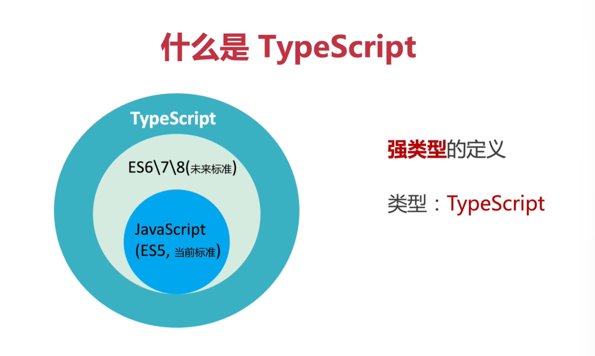
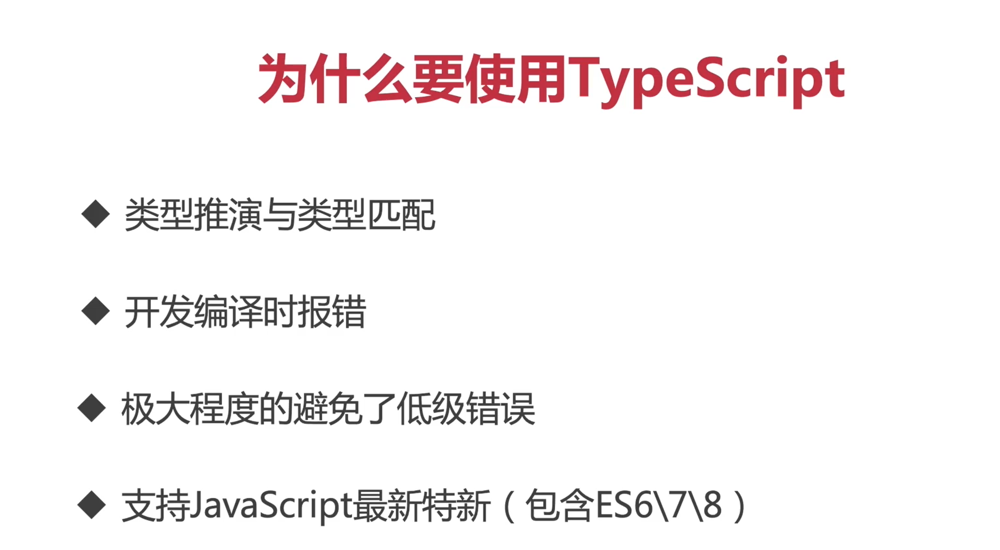
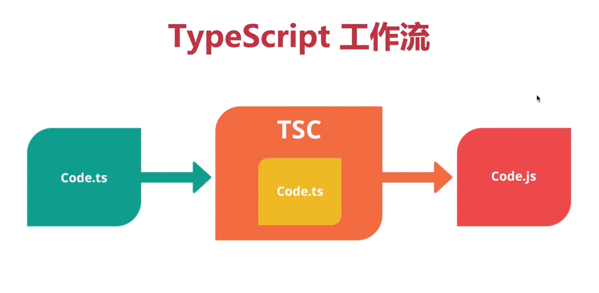
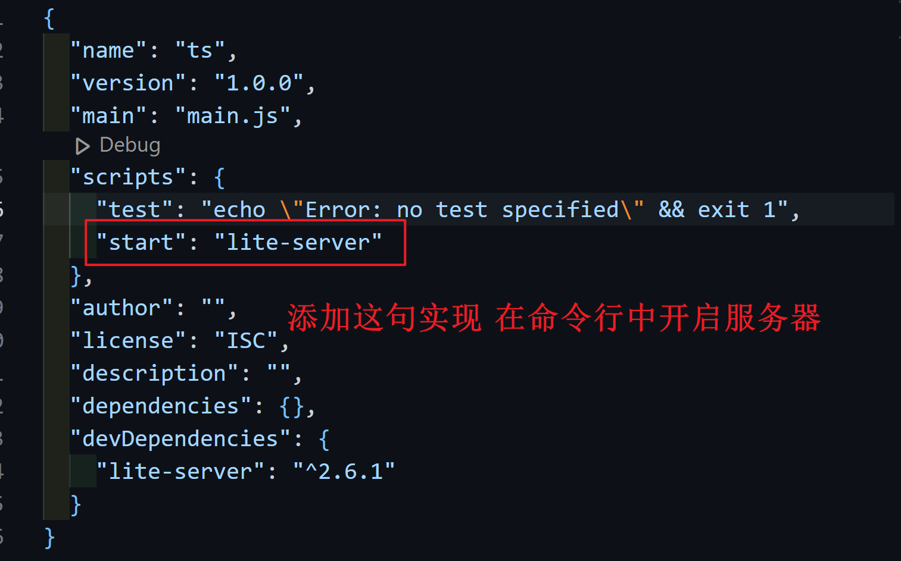
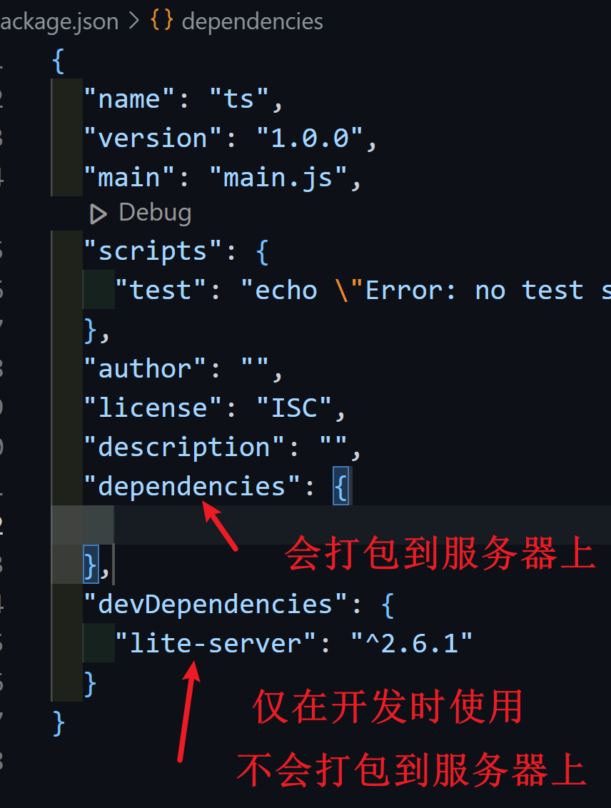
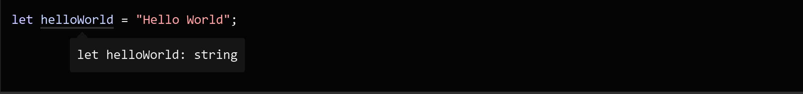

# 什么是TypeScript

Typing 强类型





## 编译TypeScript

需要编译器将TypeScript转换成JavaScript才能在主流浏览器进行运行

```cmd
tsc mian.ts
// 编译器会创建对应的js文件
node main.js
```

## TypeScript工作流



## JavaScript命名梳理

ECMA International 负责维护版本

ECMAScript = ES = 对应的JavaScript版本

- ES3、ES5：支持目前左右主流浏览器(ES4失败了未推出)
- ES6 = ES2015：目前浏览器不支持，但未来一定会支持
- ES7 = ES2017
- ES8 = ES2018


```cmd
npm init
npm install --save-dev lite-server
```





# Types

## Type Aliases

Type Aliases allow defining types with a custom name (an Alias).

Type Aliases can be used for primitives like `string` or more complex types such as `objects` and `arrays`:

```tsx
type CarYear = number
type CarType = string
type CarModel = string
type Car = {
  year: CarYear,
  type: CarType,
  model: CarModel
}

const carYear: CarYear = 2001
const carType: CarType = "Toyota"
const carModel: CarModel = "Corolla"
const car: Car = {
  year: carYear,
  type: carType,
  model: carModel
};
```

## Inference

> Interfaces are similar to type aliases, except they **only** apply to `object` types.

TypeScript knows the JavaScript language and will `generate types` for you in many cases.



> **So Here is the Interface come**: However, some design patterns make it difficult for types to be inferred automatically (for example, patterns that use dynamic programming). To cover these cases, TypeScript supports an extension of the JavaScript language, which offers places for you to tell TypeScript what the types should be.

You can explicitly describe this object’s shape using an `interface` declaration:

```tsx
interface User {
  name: string;
  id: number;
}
```

你可以在变量声明后面使用`: Typename `指定对象的属性类型

```jsx
const 对象名 : User = {属性: 属性值}
```

```jsx
const user: User = {
  name: "Hayes",
  id: 0,
};
```

如果需要对已经指定的类型进行重命名定义 最好使用type


指定属性类型的的数组

```jsx
{ name: string, age: number }[]
```

# 泛型

在 TypeScript 中,当定义一个 React 类组件时,我们通常会在 `React.Component` 后面使用尖括号 `<>` 来指定组件的属性(props)和状态(state)类型。这个语法叫做"泛型"(generics)。

具体来说:

1. **属性(props)类型**:

   - 在尖括号的第一个位置,我们可以指定组件的属性类型。
   - 这个类型可以是一个接口(interface)、类型别名(type)或者一个字面量对象类型。
   - 例如: `React.Component<{ title: string }>`

2. **状态(state)类型**:

   - 在尖括号的第二个位置,我们可以指定组件的状态类型。
   - 同样,这个类型可以是一个接口、类型别名或者字面量对象类型。
   - 例如: `React.Component<{ title: string }, { count: number }>`

3. **省略状态类型**:

   - 如果组件没有自己的状态(state),则可以省略第二个类型参数。

   - 例如: `React.Component<{ title: string }>`

     ```jsx
     interface State extends LanguageState {} // 继承接口
     React.Component<
       RouteComponentProps & WithTranslation,
       State
     >
     ```

```tsx
interface Props {
  
}

interface State {
  List:any
}

class App extends React.Component<Props, State>{
  constructor(props) {
    super(props);
    this.state = {
      List: [],
    }
  }
}
```

