## 初识Web API

### API 和 WebAPI

**APl**(Application Programming Interface,应用程序编程接口)是一些预先定义的函数，目的是提供应用程序与开发人员基于某软件或硬件得以访问一组例程的能力，而又无需访问源码，或理解内部江机制的细节。
简单理解：**API是给程序员提供的一种工具，以便能更轻松的实现想要完成的功能。**

**Web API**是**浏览器**提供的一套操作浏览器功能和页面元素的API(BOM和DOM)。

> [!Tip]
>
> 1. AP是为我们程序员提供的一个接口，帮助我们实现某种功能，我们会使用就可以了，不必纠结内部做如何实现
> 2. Web API主要是针对于浏览器提供的接口，主要针对于浏览器做交互效果。
> 3. Web API一般都有输入和输出（函数的传参和返回值），Veb API很多都是方法（函数）
> 4. 学习Web API可以结合前面学习内置对象方法的思路学习

### DOM

文档对象模型(Document Object Model,简称DOM) ，是W3C组织推荐的处理可扩展标记语言(HTML或者XML)的标准编程接口。

### HTML DOM Tree


**文档**：一个页面就是一个文档，DOM中使用document表示

**元素**：页面中的所有标签都是元素，DOM中使用element表示

**节点**：网页中的所有内容都是节点(标签、属性、文本、注释等)，DOM中使用node表示

> [!IMPORTANT]
> **DOM把以上内容都看做对象**

## 获取元素

根据ID获取

使用getElementById(" ")

```html
<div id="time">2019-9-9</div>
```

```javascript
      var Time = document.getElementById("time");
      console.log(Time);
      //   返回一个表示与指定 ID 相匹配的 DOM 元素的 Element 对象。若在当前文档中没有找到匹配的元素，则返回 null。
      console.log(typeof Time); //object
      // console.dir 打印我们返回的元素对象 更好的查看属性和方法
      console.dir(Time);

```

> [!note]
>
> 1. 参数 id是大小写敏感的字符串
> 2. 返回的是一个元素对象

### 根据标签名获取

> [!NOTE]
>
> **getElementsByTagName**返回的是获取过来元素对象的集合 以**伪数组**的形式存储

```html
    <ul>
      <li>你好1</li>
      <li>你好2</li>
      <li>你好3</li>
      <li>你好4</li>
      <li>你好5</li>
    </ul>
```

```javascript
      var lis = document.getElementsByTagName("li"); //输出所有<li>标签中的内容
      console.log(lis);
      console.log(lis[0]); //你好1
      //   遍历输出
      for (var i = 0; i < lis.length; i++) {
        console.log(lis[i]);
      }
```

> [!NOTE]
>
> getElementsByTagName可以获取某个元素(父元素)内部所有的指定标签名的子元素
>
> ​      //   父元素必须是指定的单个元素
>
> ​      //   element.getElementsByTagName('标签名')

```html
    <ol id="ol">
      <li>我好1</li>
      <li>我好2</li>
      <li>我好3</li>
      <li>我好4</li>
      <li>我好5</li>
      <li>我好6</li>
    </ol>
```

```javascript
      var ol = document.getElementsByTagName("ol"); //获得的ol是伪数组，不是标签
      console.log(ol[0].getElementsByTagName("li")); //ol[0]才是标签
      //一般是给ol指定id更为方便
      var ol = document.getElementById("ol");
      console.log(ol.getElementsByTagName("li"));
```

### getElementsByClassName

> [!NOTE]
>
> 根据类名获取某些元素集合 返回值为伪数组[对象]

```html
<div class="box">box</div>
<div class="box">box</div>
```

```javascript
var boxs = document.getElementsByClassName("box");
```

### querySelector

> [!Note]
>
> 返回指定选择器的第一个元素对象

```html
    <div class="box">box</div>
    <div class="box">box</div>
    <div id="nav">
      <ul>
        <li>index</li>
        <li>product</li>
      </ul>
    </div>
```

```javascript
      var firstBox = document.querySelector(".box");
      console.log(firstBox);
      var bav = document.querySelector("#nav");
      console.log(nav);
      var li = document.querySelector("li");
      console.log(li);
```

### querySelectorAll

> [!Note]
>
> 返回指定选择器的所有元素对象集合 返回值为伪数组

```html
    <div class="box">box</div>
    <div class="box">box</div>
```

```javascript
      var allBox = document.querySelectorAll(".box");
      console.log(allBox);
```

### 获取特殊元素信息

```javascript
      //1. 获取body元素
      var body = document.body;
      console.log(body);
      //   2. 获取html元素
      var html = document.documentElement;
      console.log(html);
```

## 事件三要素

> [!Note]
>
> 事件是有三部分组成 事件源 事件类型 事件处理程序
>
> 事件：点击一个按钮，弹出一个对话框
>
> 事件源：事件被处罚的对象 按钮
>
> 事件类型： 如何触发 比如鼠标点击(onclick) 鼠标经过 键盘按下
>
> 事件处理程序：通过一个函数赋值的方式完成

```html
    <button id="btn">刘亦菲</button>
    <script>
      var btn = document.getElementById("btn");
      btn.onclick = function () {
        alert("拜拜");
      };
    </script>
```

## 事件基础

执行事件的步骤

1. 获取事件源
2. 注册事件(绑定事件)
3. 添加事件处理程序(采取函数赋值形式)

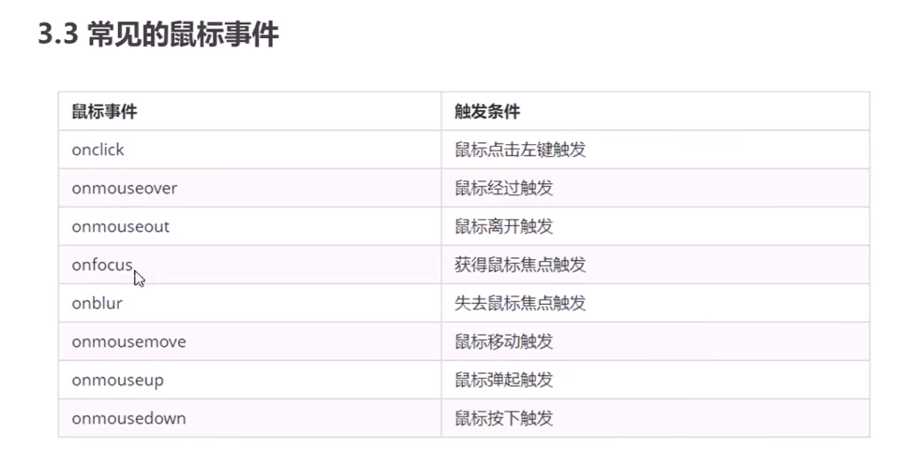

```html
    <div>123</div>
    <script>
      // 点击div 控制台输出 我被选中了
      //   1. 获取事件源
      var div = document.querySelector("div");
      div.onclick = function () {
        console.log("我被选中了");
      };
    </script>
```

## 操作元素

JavaScript的DOM操作可以改变网页内容、结构和样式，我们可以利用DOM操作元素来改变元素里面的内容、属性等。

### 改变元素内容

`element.innerText` 和`element.innerHTMl`(通常使用后者)均可读写 可以获取元素里面的内容

> [!Note]
>
> innerText 和 innerHTML的区别
>
> ```javascript
> var div1 = document.querySelector("div");
> div1.innerText = "<strong>今天是：<strong>2024年"; 
> //innerText不识别html标签
> div1.innerHTML = "<strong>今天是：</strong>2024年"; 
> //识别html标签
> var p = document.querySelector("p");
> console.log(p.innerText); 
> //->123，会自动去除空格和换行
> console.log(p.innerHTML); 
> // 保留空格和换行
> ```

例：每次点击按钮都实时显示时间

```html
    <button>显示当前时间</button>
    <div>某个时间</div>
```

```javascript
      // 当我们点击了按钮，div里面的文字会发生变化
      //   1. 获取元素
      var btn = document.querySelector("button");
      var div = document.querySelector("div");
      //   2. 注册事件
      btn.onclick = function () {
        div.innerText = getDate();
      };
      function getDate() {
        var date = new Date();
        var h = date.getHours();
        var m = date.getMinutes();
        var s = date.getSeconds();
        h = h < 10 ? "0" + h : h;
        m = m < 10 ? "0" + m : m;
        s = s < 10 ? "0" + s : s;
        return h + ":" + m + ":" + s;
      }
```

### 修改元素属性

实现点击不同按钮显示不同图片功能

```html
    <button id="1">1</button>
    <button id="2">2</button>
     alt="1.jpg" style="zoom:33%;"> alt="" />
    <script>
      var btn1 = document.getElementById("1");
      var btn2 = document.getElementById("2");
      var img = document.querySelector("img");
      btn1.onclick = function () {
        img.src = "1.jpg";
      };
      btn2.onclick = function () {
        img.src = "2.jpg";
      };
    </script>
```

原精灵图

> [!Note]
>
> 此时innerHTML不再适用,.
>
> **value 通常用于输入/表单元素。**innerHTML 通常用于 div、span、td 和类似元素

```html
    <button>按钮</button>
    <input type="text" value="输入内容" />
    <script>
      var btn = document.querySelector("button");
      var input = document.querySelector("input");
      btn.onclick = function () {
        input.value = "被点击了";
        //   如果想要某个表单被禁用，不能再点击 disabled 我们想要禁用这个按钮 button禁用
        this.disabled = true;
        //this 指向的是事件函数的调用者 btn
      };
    </script>
```

例题-点击按钮显示密码，再次点击隐藏密码 

> 利用一个flag变量，来判断flag的值，
> 如果是1就切换为文本框，flag设置为0，
> 如果是0就切换为密码框，flag设置为1 

```html
<!DOCTYPE html>
<html lang="en">
  <head>
    <meta charset="UTF-8" />
    <meta name="viewport" content="width=device-width, initial-scale=1.0" />
    <title>Document</title>
    <style>
      .box {
        width: 400px;
        border-bottom: 1px solid #ccc;
        margin: 100px auto;
        position: relative;
      }
      .box input {
        width: 370px;
        height: 30px;
        border: 0;
        outline: none;
      }
      .box img {
        width: 24px;
        position: absolute;
        top: 7px;
        right: 3px;
      }
    </style>
  </head>
  <body>
    <div class="box">
      <label for="">
         alt="close.png" style="zoom:33%;"> alt="" id="eye" />
      </label>
      <input type="password" name="" id="pwd" />
    </div>
    <script>
      var eye = document.getElementById("eye");
      var pwd = document.getElementById("pwd");
      var flag = 0;
      eye.onclick = function () {
        if (flag == 0) {
          pwd.type = "text";
          eye.src = "open.png";
          flag = 1;
        } else {
          pwd.type = "password";
          eye.src = "close.png";
          flag = 0;
        }
      };
    </script>
  </body>
</html>
```

### 修改样式属性

#### 通过classList的三个方法控制css

**注意类目里面不用加.**

```javascript
//追加一个类
元素.classList.add('类名');
//删除一个类
元素.classList.remove('类名');
//切换一个类
//有就删没有就加
元素.classList.toggle('类名');
```

```html
    <script>
      // 通过classList添加
      const box = document.querySelector(".box");
      box.classList.add("active");
      //   remove
      //   box.classList.remove("active");
      //   toggle : 有就删除，没有就加上
      box.classList.toggle("active"); //此时active则被删除
    </script>
```

#### element.style 行内样式操作

生成的是行内样式表，权重很高，css中很难修改

```html
<!DOCTYPE html>
<html lang="en">
  <head>
    <meta charset="UTF-8" />
    <meta name="viewport" content="width=device-width, initial-scale=1.0" />
    <title>Document</title>
    <style>
      div {
        width: 200px;
        height: 200px;
        background-color: aquamarine;
      }
    </style>
  </head>
  <body>
    <div></div>
    <script>
      //element.style 行内样式操作
      var div = document.querySelector("div");
      div.onclick = function () {
        this.style.backgroundColor = "black";
        this.style.width = "250px";
      };
    </script>
  </body>
</html>
```

例1：点击x则关闭图片

```html
<!DOCTYPE html>
<html lang="en">
  <head>
    <meta charset="UTF-8" />
    <meta name="viewport" content="width=device-width, initial-scale=1.0" />
    <title>Document</title>
    <style>
      img {
        width: 300px;
      }
      i {
        position: relative;
        top: -292px;
        right: -20px;
      }
    </style>
  </head>
  <body>
    <div class="box">
       alt="1.jpg" style="zoom:33%;"> alt="" />
      <i class="close-btn">x</i>
    </div>
    <script>
      var btn = document.querySelector(".close-btn");
      var box = document.querySelector(".box");
      btn.onclick = function () {
        box.style.display = "none";
      };
    </script>
  </body>
</html>
```

例2：显示/隐藏文本内容

```html
<!DOCTYPE html>
<html lang="en">
  <head>
    <meta charset="UTF-8" />
    <meta name="viewport" content="width=device-width, initial-scale=1.0" />
    <title>Document</title>
    <style>
      input {
        color: #999;
      }
    </style>
  </head>
  <body>
    <!-- 首先需要2个事件，获得焦点 onfocus 失去焦点 onblur
            如果获得焦点 判断表单内容是否为默认文字 如果是默认文字 就清空表单内容 
    -->
    <input type="text" value="手机" />
    <script>
      var text = document.querySelector("input");
      text.onfocus = function () {
        if (this.value === "手机") {
          this.value = "";
        }
        // 获得焦点文本颜色变黑
        this.style.color = "black";
      };
      //   如果失去焦点，判断表单内容是否为空，如果为空，则表单内容改为默认文字
      text.onblur = function () {
        if (this.value === "") {
          this.value = "手机";
        }
        // 失去焦点文本颜色变灰
        this.style.color = "#999";
      };
    </script>
  </body>
</html>
```

#### element.className 类名样式操作

> 使用element.style修改样式 过于繁琐，使用className更改大量样式非常方便

先在style中声明一个类.change，里面就装着想修改成为的样式，再让div 的类名 = change，利用className实现点击样式更改

> [!CAUTION]
>
> **className 会直接更改元素的类名，会覆盖原先的类名**,如果想保留原先的类名，见例题中的方法

```html
<!DOCTYPE html>
<html lang="en">
  <head>
    <meta charset="UTF-8" />
    <meta name="viewport" content="width=device-width, initial-scale=1.0" />
    <title>Document</title>
    <style>
      .change {
        background-color: pink;
        color: #fff;
        font-size: large;
      }
    </style>
  </head>
  <body>
    <div>text</div>
    <!-- <div class="change">text</div> -->
    <script>
      // 使用element.style修改样式 过于繁琐
      //   使用className更改大量样式非常方便，先在style中声明一个类.change，再让div class = .change
      //   利用className实现点击样式更改
      //   className 会直接更改元素的类名，会覆盖原先的类名

      var test = document.querySelector("div");
      test.onclick = function () {
        // this.className = "change";
        //   如果想要保留原先的类名，可以如下
        this.className = "first change";
      };
    </script>
  </body>
</html>

```

### 操作表单属性

此时innerHTML不再适用，设置 `value`通常用于输入/表单元素。i`nnerHTML` 通常用于 div、span、td 和类似元素

```JavaScript
      var btn = document.querySelector("button");
      var input = document.querySelector("input");
      btn.onclick = function () {
        input.value = "被点击了";
        //   如果想要某个表单被禁用，不能再点击 disabled 我们想要禁用这个按钮 button禁用
        this.disabled = true;
        //this 指向的是事件函数的调用者 btn
      };
```

The `name` attribute is used to reference elements in a JavaScript, or to reference form data after a form is submitted.
`name` 属性用于引用 JavaScript 中的元素，或在提交表单后引用表单数据。

Note: Only form elements with a `name` attribute will have their values passed when submitting a form.
注意：提交表单时，**只有具有 `name` 属性的表单元素才会传递其值。**

> [!NOte]
>
> 表单属性添加或移除属性一律使用**布尔值**表示，如果为true则表示添加了该属性，如果为false表示移除了该属性
>
> ```javascript
> btn.disabled = true;
> ```

尝试使复选框打勾

```html
const ipt = document.querySelector('input');
ipt.checked = true;
```

### 自定义属性(H5新增)data-id

data-开头的自定义属性，以element.dataset的方式获取对象、

```html
    <div data-id="1" data-spm="不知道">1</div>
    <div data-id="2">2</div>
    <div data-id="3">3</div>
    <div data-id="4">4</div>
    <div data-id="5">5</div>
    <script>
      const one = document.querySelector("div");
      console.log(one.dataset); //输出一个对象
      //   获取自定义属性
      console.log(one.dataset.id); //输出属性值
    </script>
```

dataset的返回值为对象，其中每一个data- 都为他的属性

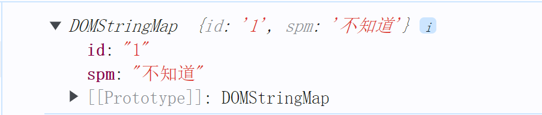

data-id 搭配for循环使用

## 定时器

### **间歇函数setInterval()**

使用场景：网页中经常会需要一种功能：**每隔一段时间**需要**自动**执行一段代码。不需要我们手动去触发

例如：网页中的倒计时，每一秒自动更新数据

### 开关定时器

```javascript
let timeId = setInterval(函数名, 间隔时间);
//每间隔一段时间调用这个函数 间隔时间的单位是毫秒
//注意是函数名，不用带(),函数名()就是执行函数了
clearIterval(timeId);
```

> [!WARNING]
>
> 1. 由于每次开关多个间歇函数会导致简写函数的编号(num)的改变，所以要记得使用**let**声明变量num
> 2. 最好**在函数外部声明**定时器函数的编号变量**timeId**,因为在函数内部使用let声明变量是会计作用域，是无法在函数外部调用的

```html
<Script> 
function fn() {
        console.log(i++);
      }
      let n = setInterval(fn, 1000);
      console.log(n); //序号为n的定时器，定时器开关会改变序号值，所以用let声明变量
      //   关闭定时器
      //   let 变量名 = setInterval(函数, 间隔时间); 用变量存储定时器序号
      //   clearInterval(变量名); 关掉指定序号的变量名
      var btn = document.querySelector("button");
      btn.onclick = function () {
        clearInterval(n);
        console.log("拜拜");
      };
      const num = 10;
      num = 10;
  </script>
```

### 用户倒计时案例

要求：按钮60秒后才可使用，在此之前一直处于禁用状态

```html
    <textarea name="" id="">
**APl**(Application Programming Interface,应用程序编程接口)是一些预先定义的函数，目的是提供应用程序与开发人员基于某软件或硬件得以访问一组例程的能力，而又无需访问源码，或理解内部江机制的细节。
        简单理解：**API是给程序员提供的一种工具，以便能更轻松的实现想要完成的功能。**
        
        **Web API**是**浏览器**提供的一套操作浏览器功能和页面元素的API(BOM和DOM)。</textarea
    >
    <button>倒计时60秒后才可以点击</button>
    <script>
      let second = 6;
      // 按钮60秒后才可以使用
      var btn = document.querySelector("button");
      btn.disabled = true;
      function fn() {
        second--; //这句话一定要放在最前面，不让second为0还会执行完一整个fn函数，导致second最终为1
        btn.innerHTML = `倒计时${second}秒后才可以点击`;
        if (second === 0) {
          clearInterval(num);
          btn.disabled = false;
          btn.innerHTML = "Agree";
        }
      }
      let num = setInterval(fn, 1000);
    </script>
```

### **延时函数setTimeOut()**

**仅仅只执行一次**

```html
<script>
  setTimeout(function () {
    console.log("时间到了");
  }, 2000);
</script>
```

清除延时函数

```js
let timer = setTimeOut(回调函数, 等待的毫秒数)
clearTimeout(timer)
```

> [!Note]
>
> 1. 延时器需要等待，后面的代码会先执行
> 2. 每一次调用延时器都会产生一个新的延时器

## 事件监听

### 什么是事件监听

就是让程序检测是否有事件产生，一旦有事件触发，就立即调用一个函数做出响应，也称为**绑定事件**或者**注册事件** ，比如鼠标经过显示下拉菜单，比如点击可以播放轮播图等等

### 事件监听三要素

**事件源**：那个dom元素被四件触发了，要获取dom元素

**事件类型**：用什么方式触发，比如点击click鼠标经过mouseover等

**事件调用函数**：要做什么事

```html
元素对象.addEventListener('事件类型', 要执行的函数)
```

**函数不是立即执行，什么时候触发事件，则什么时候执行**

```html
    <button>按钮</button>
    <script>
      //   点击按钮则弹出对话框
      const btn = document.querySelector("button");
      btn.addEventListener("click", function () {
        alert("Hi！");
      });
    </script>
```

### 事件监听版本

DOM L0 事件源.on事件 = function() { } 

DOM L2 事件源.addEventListener(事件， 事件处理函数) 

> 区别： on方式会被覆盖，addEventListener方式可绑定多次，拥有事件更多特性，推荐使用
>
> ```html
>     <script>
>       //   DOM L0
>       const bn = document.querySelector("button");
>       btn.onclick = function () {
>         alert(11);
>       };
>       btn.onclick = function () {
>         alert(22);
>       };
>       // 会被覆盖
>       // DOM L2
>       btn.addEventListener("click", function () {
>         alert(11);
>       });
>       btn.addEventListener("click", function () {
>         alert(22);
>       });
>       //   不会覆盖，这就是二者的差别
>     </script>
> ```

## 事件类型

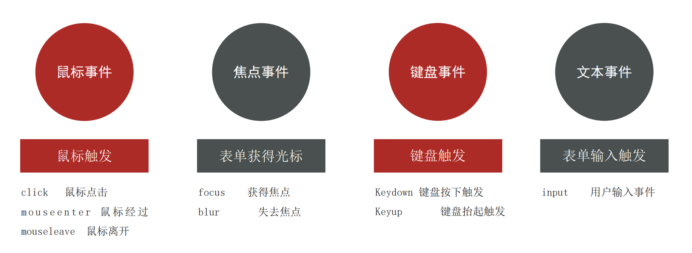

### 鼠标事件

```html
    <div>1</div>
    <script>
      const div = document.querySelector("div");
      div.addEventListener("mouseenter", function () {
        console.log("来了");
      });
      div.addEventListener("mouseleave", function () {
        console.log("走了");
      });
    </script>
```

### 焦点事件

->见经典案例：小米搜索框、评论区回车发布

### 键盘事件

```html
    <input type="text" />
    <script>
      // 键盘事件
      const input = document.querySelector("input");
      input.addEventListener("keydown", function () {
        console.log("键盘按下");
      });
      input.addEventListener("keyup", function () {
        console.log("键盘弹起");
      });
      //   文本事件
      input.addEventListener("input", function () {
        console.log(`正在输入：${input.value}`);
        //获取输入的值并实时输出
      });
    </script>
```

### **click VS submit**

In summary, `click()` is used to simulate a mouse click on any element, triggering its associated actions, while `submit()` is specifically used to submit form data, triggering the **form** submission process.

**submit** 表单在提交时会自动跳转到 `action` 属性指定的 URL。这是表单的默认行为,是由浏览器控制的。若未指定URL, 则自动刷新当前页面

**阻止自动提交表单**

```js
const form = document.querySelector('form');
form.addEventListener('submit', (event) => {
  event.preventDefault(); // 阻止表单默认提交行为
  // 在这里编写自定义的表单提交逻辑
});
```

## 事件对象

> **什么是事件对象**
>
> 也是一个对象，这个对象有事件触发时的相关信息
>
> 例如：鼠标点击事件中，事件对象就存储了鼠标在哪个位置等信息
>
> **使用场景**
>
> 可以判断用户按下那个键，比如按下回车键可以发布新闻
>
> 可以判断鼠标点击了哪个元素，从而做出相应的操作
>

**在事件绑定的回调函数的第一个参数就是事件对象**, 一般命名为event 、ev 、e

```javascript
元素.addEventListener("click", function(e) {
	//e为事件对象
  e.target.classList.add("active");
})
```

> [!CAUTION]
>
> **e.target = document.queryselector( )**
>
> 注意只有在addEventListener中 第一个参数才会为事件对象 其他的情况就是普通的形参

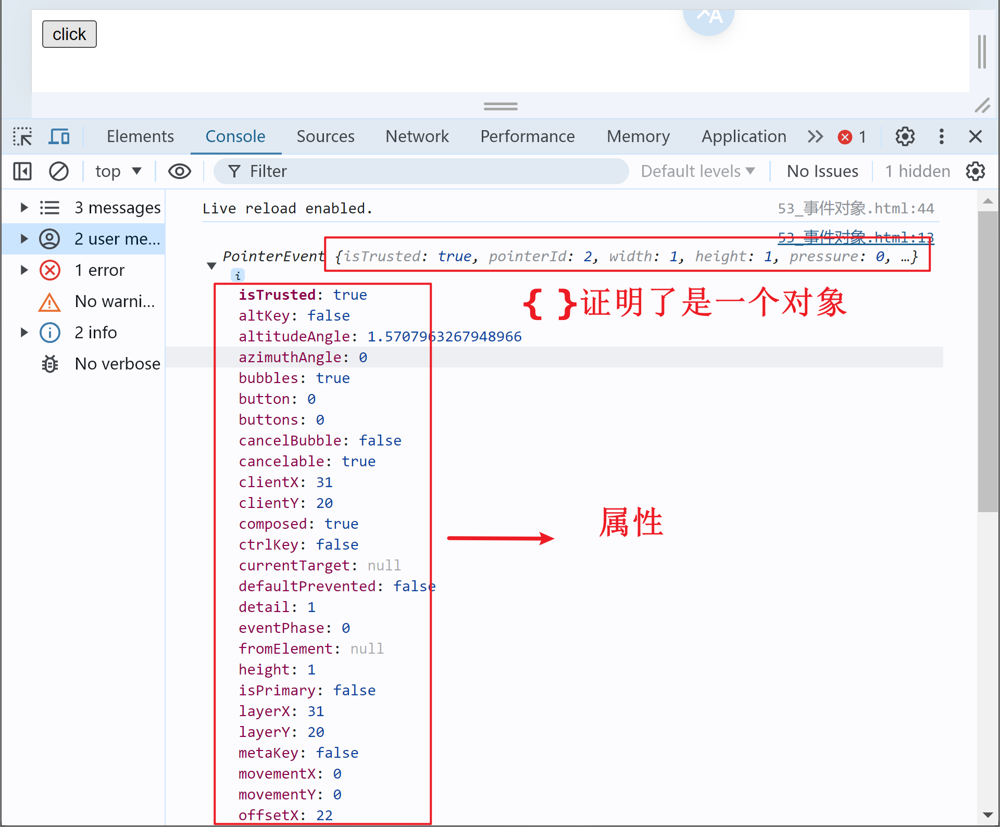

### 事件对象常见属性

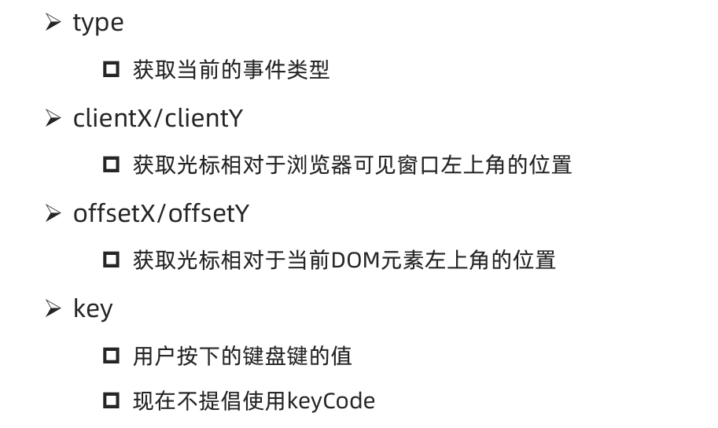

**key属性的使用**

当用户按下的值为Enter键时，输出回车

```JavaScript
      const input = document.querySelector("input");
      input.addEventListener("keyup", function (e) {
        if (e.key === "Enter") console.log("回车");
      });
```

## 环境对象

环境对象：指的是函数内部特殊的变量 this ，**它代表着当前函数运行时所处的环境作用,** **【谁调用， this 就是谁】** 

> 函数的调用方式不同，this 指代的对象也不同
>
> 直接调用函数，其实相当于是 window.函数，所以 this 指代 window
>

## 回调函数

当一个**函数当做参数**来传递给另外一个函数的时候，这个函数就是回调函数

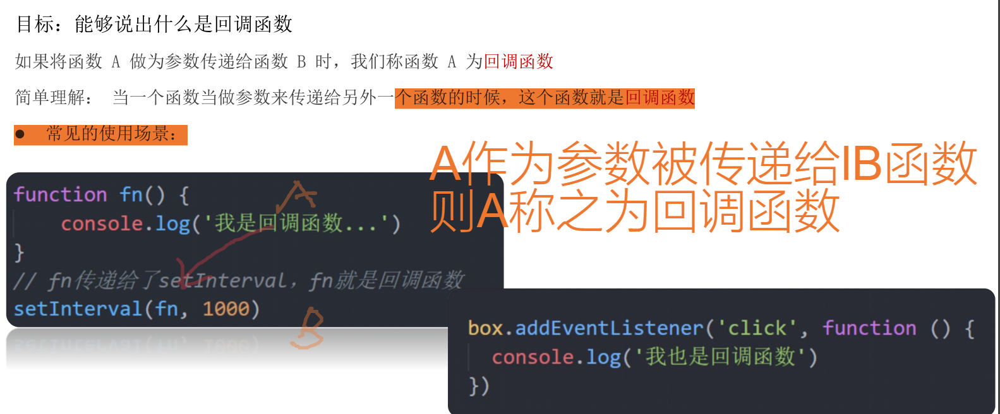

这左右两个都是回调函数

## 事件流

**事件流指的是事件完整执行过程中的流动路径**


> 说明：假设页面里有个div，当触发事件时，会经历两个阶段，分别是捕获阶段、冒泡阶段l

简单来说：**捕获阶段是 从父到子  冒泡阶段是从子到父**

**实际工作都是使用事件冒泡为主**

### 事件捕获

从DOM的根元素开始去执行对应的事件 (从外到里)

```javascript
元素.addEventListener(事件类型, 事件处理函数, true)
```

> [!IMPORTANT]
>
> 1. addEventListener第三个参数传入 true 代表是捕获阶段触发（很少使用）
>
> 2. 若传入false代表冒泡阶段触发，**默认就是false**
> 3. 若使用 L0 事件监听，则只有冒泡阶段，没有捕获

> 案例-点击儿子，会发现先弹出father，在弹出son
>
> ```html
> <!DOCTYPE html>
> <html lang="en">
>   <head>
>     <meta charset="UTF-8" />
>     <meta name="viewport" content="width=device-width, initial-scale=1.0" />
>     <title>Document</title>
>     <style>
>       .father {
>         width: 600px;
>         height: 600px;
>         background-color: rgb(21, 190, 15);
>       }
>       .son {
>         width: 200px;
>         height: 200px;
>         background-color: blue;
>       }
>     </style>
>   </head>
>   <body>
>     <div class="father">
>       <div class="son">66</div>
>     </div>
>     <script>
>       const fa = document.querySelector(".father");
>       const son = document.querySelector(".son");
>       //   事件捕获
>       // 点击son ,先弹出的是father 然后是son
>       fa.addEventListener(
>         "click",
>         function () {
>           alert("father");
>         },
>         true
>       );
>       son.addEventListener(
>         "click",
>         function () {
>           alert("son");
>         },
>         true
>       );
>     </script>
>   </body>
> </html>
> ```

### 事件冒泡

当一个元素的事件被触发时，同样的事件将会在该元素的所有祖先元素中依次被触发。这一过程被称为事件冒泡

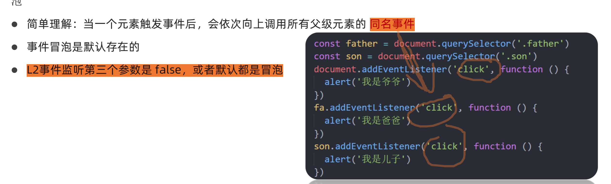

> 案例：点击son,会在弹出son后，紧接着弹出father
>
> ```html
> <!DOCTYPE html>
> <html lang="en">
>   <head>
>     <meta charset="UTF-8" />
>     <meta name="viewport" content="width=device-width, initial-scale=1.0" />
>     <title>Document</title>
>     <style>
>       .father {
>         width: 600px;
>         height: 600px;
>         background-color: rgb(21, 190, 15);
>       }
>       .son {
>         width: 200px;
>         height: 200px;
>         background-color: blue;
>       }
>     </style>
>   </head>
>   <body>
>     <div class="father">
>       <div class="son">66</div>
>     </div>
>     <script>
>       const fa = document.querySelector(".father");
>       const son = document.querySelector(".son");
>       //   事件冒泡：同名事件会被依次向上调动
>       // 点击son ,先弹出的是son 然后是father
>       fa.addEventListener("click", function () {
>         alert("father");
>       });
>       son.addEventListener("click", function (e) {
>         alert("son");
>       });
>     </script>
>   </body>
> </html>
> ```

### 阻止冒泡

> 因为默认就有冒泡模式的存在，所以容易导致事件影响到父级元素，若想把事件就限制在当前元素内，就需要阻止事件冒泡

**前提：阻止事件冒泡需要拿到事件对象 e**

```javascript
事件对象.stopPropagation()
```

> [!NOTE]
>
> 此方法可以阻断事件流动传播，不光在冒泡阶段有效，捕获阶段也有效

```html
    <script>
      const fa = document.querySelector(".father");
      const son = document.querySelector(".son");
      //   事件冒泡：同名事件会被依次向上调动
      // 点击son ,先弹出的是son 然后是father
      fa.addEventListener("click", function () {
        alert("father");
      });
      son.addEventListener("click", function (e) {
        alert("son");
        e.stopPropagation(); //阻止冒泡 是一个方法不是属性，需要带括号
      });
    </script>
```

### 阻止默认行为

阻止默认行为的发生，比如 阻止 链接的跳转，表单域跳转

```javascript
事件对象.preventDefault()
```

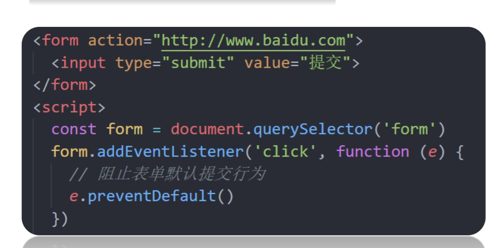

### 解绑事件

#### L0的解绑方式

```html
元素.on事件 = null;
```

#### L2的解绑方式

 注意：匿名函数无法解绑

```html
事件.removeEventListener(事件类型, 函数名)
```

案例

```html
    <button>click</button>
    <script>
      const btn = document.querySelector("button");
      //   L0 的解绑方式 元素.on事件 = null;
      btn.onclick = function () {
        alert("dada");
        btn.onclick = null; //null是一个空对象
        // 点击一次后就解绑了
      };
      function fn() {
        alert("kaka");
      }
      //   L1 匿名函数是无法解绑的 removeEventListener
      btn.addEventListener("click", fn);
      btn.removeEventListener("click", fn);
    </script>
```

### `鼠标经过事件区别`

mouseover 和 mouseout 会有冒泡效果

mouseenter和mouseleave没有冒泡效果（推荐）

```html
    <script>
      const dad = document.querySelector(".dad");
      const baby = document.querySelector(".baby");

      dad.addEventListener("mouseover", function () {
        console.log("鼠标经过");
      });
      dad.addEventListener("mouseout", function () {
        console.log("鼠标离开");
      });
      //   孩子没有鼠标经过事件，但是爸爸有，会冒泡到爸爸身上
    </script>
```

### `两种注册事件的区别`

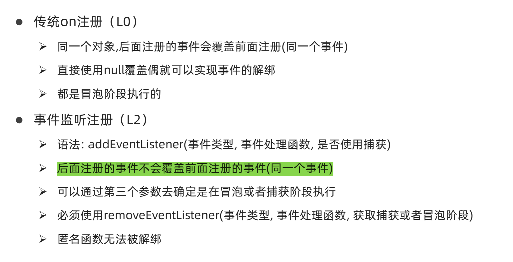

## 事件委托

**给父元素注册事件，当我们触发子元素的时候，会冒泡到父元素身上，从而触发父元素的事件。**

事件委托其实是利用**事件冒泡**的特点。**事件委托为父元素上，真正触发的是子元素**

==注意：利用事件委托 绑定在原本就存在的tbody 上 而不是后来渲染的tr上==

> ```html
> console.log(e.target)
> ```
>
> 得到标签 `<span class="del">删除</span>`
>
> 1. **利用类名找到目标元素**
>
> ```js
> console.log(e.target.classlist);
> ```
>
> 将会得到一个`DOMTokenList`,是 JavaScript 中一个用于处理 DOM 元素 class 属性的接口。它是一个类数组对象,表示一个元素的 class 属性中的令牌列表。
>
> - `contains()`：检查是否包含某个 class。可以利用该方法判断点击的是否时目标元素
>
>   ```js
>   if(e.target.classList.contains("指定类名"))
>   ```
>
> 2. **利用标签名找到目标元素**
>
>    `事件对象.target.tagName`
>
> ```html
>     <script>
>       // 点击则字体变色
>       //   使用事件委托只需要获取父元素
>       const ul = document.querySelector("ul");
>       ul.addEventListener("click", function (e) {
>         console.log(e.target.tagName); //⭐通过e事件对象.target获取当前点击的元素
>         // e.target.style.color = "red"; //实现 被点击对象 变色
>         if (e.target.tagName === "LI") {
>           //只有点击li才变色
>           e.target.style.color = "red";
>         }
>       });
>     </script>
> ```
>

## 其他事件

### 页面加载事件

#### load

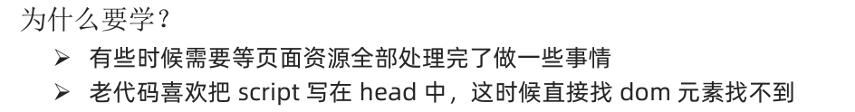

**监听页面所有资源加载完毕**

```javascript
window.addEventListener("load", function () {}
```

> [!NOTE]
>
> 不光可以监听整个页面资源加载完毕，也可以针对某个资源绑定load事件

```html
<!DOCTYPE html>
<html lang="en">
  <head>
    <meta charset="UTF-8" />
    <meta name="viewport" content="width=device-width, initial-scale=1.0" />
    <title>Document</title>
    <script>
      // 等待页面所有资源加载完毕就会执行回调函数
      window.addEventListener("load", function () {
        const btn = document.querySelector("button");
        btn.addEventListener("click", function () {
          console.log("111");
        });
      });
      // ⭐不光可以监听整个页面资源加载完毕，也可以针对某个资源绑定load事件
      // 等待图片加载完毕再执行里面的代码
      const img = document.querySelector("img");
      img.addEventListener("load", function () {
        console.log("picture");
      });
    </script>
  </head>
  <body>
    <button>click</button>
     alt="avatar.jpg" style="zoom:33%;"> alt="" />
  </body>
</html>
```

#### DOMContentLoaded

当初始的 HTML 文档被完全加载和解析完成之后，DOMContentLoaded 事件被触发，而无需等待样式表、图像等完全加载

**相当于直接展示dom节点**

```html
    <script>
      document.addEventListener("DOMContentLoaded", function () {
        const btn = document.querySelector("button");
        btn.addEventListener("click", function () {
          console.log("11");
        });
      });
    </script>
  </head>
  <body>
    <button>ss</button>
  </body>
```

### 页面滚动事件

#### scroll

滚动条在滚动的时候持续触发的事件

```html
window.addEventListener("scroll", function () {});
```

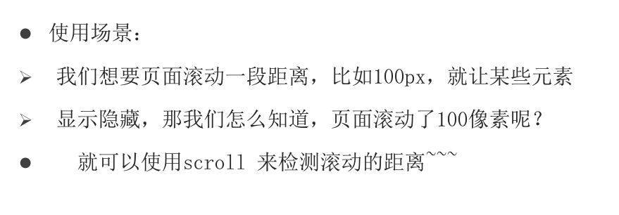

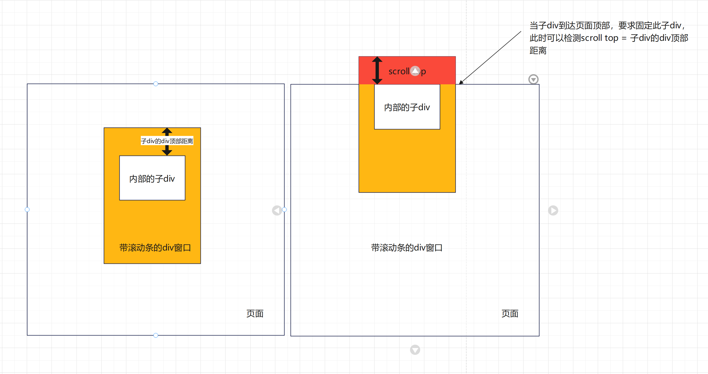

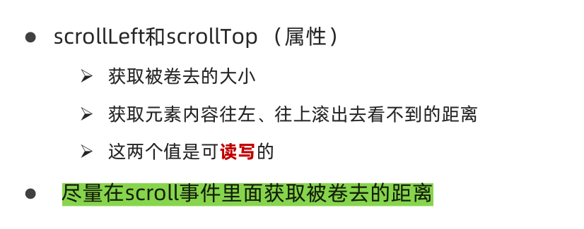


**检测页面滚动的头部距离（被卷去的头部）用那个属性？**

> [!CAUTION]
>
> document.documentElement   HTML 文档返回对象为**HTML元素**

```html
document.documentElement.scrollTop
```

#### 滚动到指定位置

1. scroll

```javascript
document.documentElement.scrollTop = 100;
```

1. scrollTo

```javascript
window.scrollTo(x ,y);
```

#### 案例 -1 初步演示

```html
<!DOCTYPE html>
<html lang="en">
  <head>
    <meta charset="UTF-8" />
    <meta name="viewport" content="width=device-width, initial-scale=1.0" />
    <title>Document</title>
    <style>
      body {
        margin-top: 100px;
        height: 3000px;
      }
      div {
        margin: 100px;
        overflow: scroll;
        width: 200px;
        height: 200px;
        border: 2px solid black;
        display: none;
      }
    </style>
  </head>
  <body>
    <div>
      dddddddddddd dddddddddddd dddddddddddd dddddddddddd dddddddddddd
      dddddddddddd dddddddddddd dddddddddddd dddddddddddd dddddddddddd
      dddddddddddd dddddddddddd dddddddddddd dddddddddddd dddddddddddd
      dddddddddddd dddddddddddd dddddddddddd dddddddddddd dddddddddddd
      dddddddddddd dddddddddddd dddddddddddd
    </div>
    <script>
      const div = document.querySelector("div");
      window.addEventListener("scroll", function () {
        //我想获取滚动的高度 scrollTop
        // ⭐获取html的滑动距离 scrollTop
        // const  n = document.documentElement.scrollTop ⭐这样写一直会等于0，不能写在外部
        console.log(document.documentElement.scrollTop);
        if (document.documentElement.scrollTop >= 100) {
          // 大于100则显示
          div.style.display = "block";
        }
      });
      //   可赋值 不带单位
      // document.documentElement.scrollTop = 100;
    </script>
  </body>
</html>
```

#### 案列 -2 滑动显示 + 返回顶部

```html
    <script>
      // 当页面滚动大于300像素 就显示电梯导航
      const xtxElevator = document.querySelector(".xtx-elevator");
      window.addEventListener("scroll", function () {
        if (document.documentElement.scrollTop >= 300) {
          xtxElevator.style.opacity = 1;
        }
      });

      // 返回顶部
      const backTop = document.querySelector("#backTop");
      backTop.addEventListener("click", function () {
        document.documentElement.scrollTop = 0;
        // 方法二
        // window.scrollTo(x, y)
      });
    </script>
```

### 页面尺寸事件

会在窗口尺寸改变的时候触发事件：**resize**

```javascript
window.addEventListener("resize", function () {}
```

获取元素的可见部分宽高（不包含边框，margin，滚动条等）

#### clientWidth和clientHeight

```javascript
window.addEventListener("resize", function () {
	let w = document.documentElement.clientWidth
	console.log(w);
}
```

测试

```html
  <body>
    <div>1</div>
    <script>
      const div = document.querySelector("div");
      window.addEventListener("resize", function () {
        // 检测元素宽高 clientHeight 只包含padding，border margin不包含
        console.log(div.clientHeight);
        // clientHeight 包含padding border
        console.log(div.offsetHeight);
      });
    </script>
  </body>
```

#### offsetLeft和offsetTop  ⭐

获取元素的自身宽高、包含元素自身设置的宽高、padding、border ，常用来获取元素在页面所处的位置

> [!CAUTION]
>
> 1. `offsetTop`: 元素的顶边相对于最近的定位祖先元素（最近的 `position` 不为 `static` 的祖先元素）的顶边的垂直距离。
> 2. 🔴如果元素的所有祖先元素的 `position` 都是 `static`，那么 `offsetTop` 和 `offsetLeft` 仍然会返回该元素相对于其最近的包含块（通常是文档的根元素 `<html>` 或 `<body>`）的偏移量。**所以当父级元素position均为static时返回元素位于整个页面的位置**
> 3. offsetLeft和offsetTop注意是只读属性，无法复制

测试：

```html
 <body>
    <div>
      <p>s</p>
    </div>
    <script>
      const div = document.querySelector("div");
      const p = document.querySelector("p");
      console.log(p.offsetLeft);
      //   有position 就相当于距离父元素的距离，无则是距离页面的距离
    </script>
```

案例：当滑动距离大于元素所处高度，即可显示

```html
  <body>
    <div class="header">我是顶部导航栏</div>
    <div class="content">
      <div class="sk">秒杀模块</div>
    </div>
    <div class="backtop">
       alt="close2.png" style="zoom:33%;"> alt="" />
      <a href="javascript:;"></a>
    </div>
    <script>
      const header = document.querySelector(".header");
      const sk = document.querySelector(".sk");
      window.addEventListener("scroll", function () {
        if (document.documentElement.scrollTop >= sk.offsetHeight) {
          header.style.opacity = 1;
        } else {
          header.style.opacity = 0;
        }
      });
    </script>
  </body>
```

## 经典案例

### 随机点名案例

要求：

① 点击开始按钮随机抽取数组的一个数据，放到页面中 

② 点击结束按钮删除数组当前抽取的一个数据 

③ 当抽取到最后一个数据的时候，两个按钮同时禁用（写点开始里面，只剩最后一个数据不用抽了 ）

```html
<!DOCTYPE html>
<html lang="en">
  <head>
    <meta charset="UTF-8" />
    <meta name="viewport" content="width=device-width, initial-scale=1.0" />
    <title>Document</title>
    <style>
      * {
        margin: 0;
        padding: 0;
      }

      h2 {
        text-align: center;
      }

      .box {
        width: 600px;
        margin: 50px auto;
        display: flex;
        font-size: 25px;
        line-height: 40px;
      }

      .qs {
        width: 450px;
        height: 40px;
        color: red;
      }

      .btns {
        text-align: center;
      }

      .btns button {
        width: 120px;
        height: 35px;
        margin: 0 50px;
      }
      .btns button:hover {
        cursor: pointer;
      }
    </style>
  </head>

  <body>
    <h2>随机点名</h2>
    <div class="box">
      <span>名字是：</span>
      <div class="qs">这里显示姓名</div>
    </div>
    <div class="btns">
      <button class="start">开始</button>
      <button class="end">结束</button>
    </div>

    <script>
      // 数据数组
      const arr = ["马超", "黄忠", "赵云", "关羽", "张飞"];
      const start = document.querySelector(".start");
      const end = document.querySelector(".end");
      const name = document.querySelector(".qs");

      let timerId = 0,
        random = 0;

      start.addEventListener("click", function () {
        timerId = setInterval(function () {
          //要在外部声明该变量，否则在关闭时间函数时无法调用该变量
          randomNum = parseInt(Math.random() * arr.length);
          name.innerHTML = `${arr[randomNum]}`;
        }, 60);
      });

      end.addEventListener("click", function () {
        clearInterval(timerId);
        //被抽到的同学就可以删除了
        arr.splice(randomNum, 1);
        console.log(arr);
        //当数组内部只有一个元素的时候，禁用俩个按钮
        while (arr.length === 1) {
          //   start.disabled = true;
          //   end.disabled = true;
          start.disabled = end.disabled = true; //可以直接这样写
        }
      });
    </script>
  </body>
</html>
```

### 轮播图

不重要的style部分

```html
<head>
    <meta charset="UTF-8" />
    <meta http-equiv="X-UA-Compatible" content="IE=edge" />
    <meta name="viewport" content="width=device-width, initial-scale=1.0" />
    <title>轮播图点击切换</title>
    <style>
      * {
        box-sizing: border-box;
      }
  
      .slider {
        width: 560px;
        height: 400px;
        overflow: hidden;
      }
  
      .slider-wrapper {
        width: 100%;
        height: 320px;
      }
  
      .slider-wrapper img {
        width: 100%;
        height: 100%;
        display: block;
      }
  
      .slider-footer {
        height: 80px;
        background-color: rgb(100, 67, 68);
        padding: 12px 12px 0 12px;
        position: relative;
      }
  
      .slider-footer .toggle {
        position: absolute;
        right: 0;
        top: 12px;
        display: flex;
      }
  
      .slider-footer .toggle button {
        margin-right: 12px;
        width: 28px;
        height: 28px;
        appearance: none;
        border: none;
        background: rgba(255, 255, 255, 0.1);
        color: #fff;
        border-radius: 4px;
        cursor: pointer;
      }
  
      .slider-footer .toggle button:hover {
        background: rgba(255, 255, 255, 0.2);
      }
  
      .slider-footer p {
        margin: 0;
        color: #fff;
        font-size: 18px;
        margin-bottom: 10px;
      }
  
      .slider-indicator {
        margin: 0;
        padding: 0;
        list-style: none;
        display: flex;
        align-items: center;
      }
  
      .slider-indicator li {
        width: 8px;
        height: 8px;
        margin: 4px;
        border-radius: 50%;
        background: #fff;
        opacity: 0.4;
        cursor: pointer;
      }
  
      .slider-indicator li.active {
        width: 12px;
        height: 12px;
        opacity: 1;
      }
    </style>
```

```html
	</head>
      <!-- 
      准备数组对象，里面包含详细信息
      随机选择一个数字，选出数组对应的对，更换图片，底部盒子背景颜色，以及文字内容
      利用这个随机数字，让小圆点添加高亮的类(addClass)利用css伪结构选择器
      -->
  <body>
    <div class="slider">
      <div class="slider-wrapper">
         alt="slider01.jpg" style="zoom:33%;"> alt="" />
      </div>
      <div class="slider-footer">
        <p>对人类来说会不会太超前了？</p>
        <ul class="slider-indicator">
          <li class="active"></li>
          <li></li>
          <li></li>
          <li></li>
          <li></li>
          <li></li>
          <li></li>
          <li></li>
        </ul>
        <div class="toggle">
          <button class="prev">&lt;</button>
          <button class="next">&gt;</button>
        </div>
      </div>
    </div>
    <script>
      // 1. 初始数据 使用对象数组来存放数据
      const sliderData = [
        { url: './images/slider01.jpg', title: '凤凰传奇陪你过大年！', color: 'rgb(100, 67, 68)' },
        { url: './images/slider02.jpg', title: '开启剑与雪的黑暗传说！', color: 'rgb(43, 35, 26)' },
        { url: './images/slider03.jpg', title: '对人类来说会不会太超前了？', color: 'rgb(36, 31, 33)' },
        { url: './images/slider04.jpg', title: '真正的jo厨出现了！', color: 'rgb(139, 98, 66)' },
        { url: './images/slider05.jpg', title: '李玉刚：让世界通过B站看到东方大国文化', color: 'rgb(67, 90, 92)' },
        { url: './images/slider06.jpg', title: '快来分享你的寒假日常吧~', color: 'rgb(166, 131, 143)' },
        { url: './images/slider07.jpg', title: '哔哩哔哩小年YEAH', color: 'rgb(53, 29, 25)' },
        { url: './images/slider08.jpg', title: '一站式解决你的电脑配置问题！！！', color: 'rgb(99, 72, 114)' },
      ]
      const img = document.querySelector('.slider-wrapper img');
      const p = document.querySelector('.slider-footer p');
      const color = document.querySelector('.slider-footer');

      let i = 0;
      function change() {
        // 需要修改的有图片、文字、背景色、小圆点
        img.src = sliderData[i].url;
        p.innerHTML = sliderData[i].title;
        color.style.backgroundColor = sliderData[i].color;
        document.querySelector(`.slider-indicator .active`).classList.remove('active');
        const circle = document.querySelector(`.slider-indicator li:nth-child(${i+1})`);//伪类选择器
        circle.classList.add('active');
      }

      // 按钮功能实现
      const left = document.querySelector(".prev");
      const right = document.querySelector(".next");

      right.addEventListener("click", function () {
        if(i < sliderData.length-1) i++;
        else i = 0;
        change();
      });
      left.addEventListener("click", function() {
        if(i > 0) i--;
        else i = 7;
        // i = i > 0 ? i-- : 7; 三元运算符
        change();
      })

      // 🔴超简便代码实现自动轮播
      // ⭐利用js自动调用点击事件
      // click必须添加()
      let timerId = setInterval(function() {
        right.click()
      }, 1000);


      //  原自动轮播按钮
      // let timerId = setInterval(function() {
      //   if(i < sliderData.length-1) i++;
      //   else i = 0;
      //   change();
      //   console.log("轮播执行");
      // }, 1000);

      // 鼠标经过按钮 停止播放
      const slider = document.querySelector('.slider');
      // 关定时器
      slider.addEventListener("mouseenter", function() {
        clearInterval(timerId);
        console.log("悬停");
      })
      // 开定时器
      slider.addEventListener("mouseleave", function() {
        clearInterval(timerId);
        //要先关掉定时器，然后再开启一个新的
        timerId = setInterval(function() {
        right.click()
      }, 1000);
        console.log("离开");
      })
    </script>
  </body>
  
  </html>
```

### 小米搜索框

```html
<!DOCTYPE html>
<html lang="en">
  <head>
    <meta charset="UTF-8" />
    <meta http-equiv="X-UA-Compatible" content="IE=edge" />
    <meta name="viewport" content="width=device-width, initial-scale=1.0" />
    <title>Document</title>
    <style>
      * {
        margin: 0;
        padding: 0;
        box-sizing: border-box;
      }

      ul {
        list-style: none;
      }

      .mi {
        position: relative;
        width: 223px;
        margin: 100px auto;
      }

      .mi input {
        width: 223px;
        height: 48px;
        padding: 0 10px;
        font-size: 14px;
        line-height: 48px;
        border: 1px solid #e0e0e0;
        outline: none;
      }

      .mi .search {
        border: 1px solid #ff6700;
      }

      .result-list {
        position: absolute;
        left: 0;
        top: 48px;
        width: 223px;
        border: 1px solid #ff6700;
        border-top: 0;
        background: #fff;
        display: none;
      }

      .result-list a {
        display: block;
        padding: 6px 15px;
        font-size: 12px;
        color: #424242;
        text-decoration: none;
      }

      .result-list a:hover {
        background-color: #eee;
      }
    </style>
  </head>

  <body>
    <div class="mi">
      <input type="search" placeholder="小米笔记本" />
      <ul class="result-list">
        <li><a href="#">全部商品</a></li>
        <li><a href="#">小米11</a></li>
        <li><a href="#">小米10S</a></li>
        <li><a href="#">小米笔记本</a></li>
        <li><a href="#">小米手机</a></li>
        <li><a href="#">黑鲨4</a></li>
        <li><a href="#">空调</a></li>
      </ul>
    </div>
    <script>
      const input = document.querySelector("[type = search]"); //属性选择器
      const ul = document.querySelector("ul");
      input.addEventListener("focus", function () {
        ul.style.display = "block"; //则表示显示 none 则隐藏
        input.classList.add("search"); //框变色
      });
      input.addEventListener("blur", function () {
        ul.style.display = "none";
        input.classList.remove("search");
      });
    </script>
  </body>
</html>
```

### 评论区回车发布

1. 点击文本框实现显示字数实时统计

   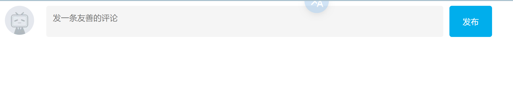

   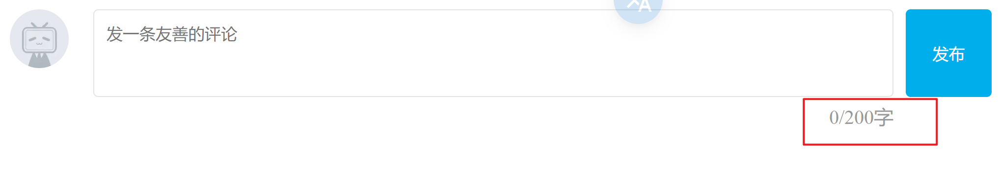

   ```html
       <script>
         const tx = document.querySelector("#tx");
         const total = document.querySelector(".total");
         // 1. 当文本域获得焦点，就让 total 显示
         tx.addEventListener("focus", function () {
           total.style.opacity = 1; //opacity表示透明不透明度
         });
         // 2. 当文本域失去焦点，就让 total 隐藏
         tx.addEventListener("blur", function () {
           total.style.opacity = 0;
         });
   
         // 3.判断用户输入事件 类型：input
         tx.addEventListener("input", function () {
           total.innerHTML = `${tx.value.length}/200字`;
         });
       </script>
   ```

2.    需求：按下回车键盘，可以发布信息

      ①：用到按下键盘事件keydown或者keyup都可以

      ②：如果用户按下的是回车键盘，则发布信息

      ③：让留言信息模块显示，把拿到的数据渲染到对应标签内部

> [!note]
>
> 1. 注意要排除用户输出的内容为空格，使用trim()方法，当去除两边的空格后字符串不为空，则输出所有的内容
> 2.  当输出后要记得清空评论框，同时恢复字数统计为0/200字

```javascript
      const list = document.querySelector(".list");
      const text = document.querySelector(".text");
      tx.addEventListener("keyup", function (e) {
        if (e.key === "Enter") {
          if (tx.value.trim()) {
            //去掉空格任然有内容，则输出
            list.style.display = "block";
            text.innerHTML = this.value;
          }
          this.value = ""; //同时清空评论框,要放在外部，不然输入空格就不能被清空
          this.style.color = "black";
          total.innerHTML = "0/200字"; //复原字数统计
        }
      });
```

### tab栏切换

> [!IMPORTANT]
>
> 永远记住，这种轮播样式的一般都是先**关闭当前样式** `classList.remove("active")`

1. 法一：利用循环的方式绑定

   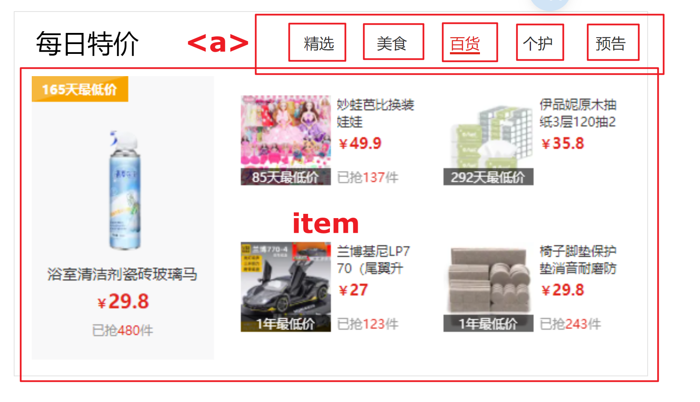

   ```html
       <script>
         // 利用循环绑定事件到 5个<a>
         const as = document.querySelectorAll("a");
         const item = document.querySelectorAll(".item");
   
         //   console.log(as); 得到的是数组
         for (let i = 0; i < as.length; i++) {
           // ⭐使用遍历的方式完成全部的绑定
           as[i].addEventListener("mouseenter", function () {
             // 1. 先移除当前active 这一步骤不能落，一定需要的
             document.querySelector(".tab-nav .active").classList.remove("active");
             //  2. 添加active
             this.classList.add("active");
   
             //大盒子
             //   1. 先移除当前active
             document
               .querySelector(".tab-content .active")
               .classList.remove("active");
             //   2. 对应序号的item显示
             document
               .querySelector(`.tab-content .item:nth-child(${i + 1})`)
               //⭐注意这里的``要包裹住整个类名
               .classList.add("active");
           });
         }
       </script>
   ```


2. 法二 利用事件委托

   ```html
   <script>
         // 采取事件委托的形式tab栏切换
         // 1. 获取ul父元素
         const ul = document.querySelector(".tab-nav ul");
         //   2. 添加事件 注意mouseenter没有冒泡效果
         ul.addEventListener("mouseover", function (e) {
           if (e.target.tagName === "A") {
             document.querySelector(".tab-nav .active").classList.remove("active");
             e.target.classList.add("active");
   
             //   大盒子 利用li标签的data-id 选出对应的div
             // 1. 获取所有的div
             const divs = document.querySelectorAll(".item");
             // 2. 先移除
             document
               .querySelector(".tab-content .active")
               .classList.remove("active");
             // 3. 再添加
             // console.log(divs[e.target.dataset.id]);
             divs[e.target.dataset.id].classList.add("active");
           }
         });
       </script>
   ```

   

### 表单全选反选

> [!note]
>
> 1. 全选 / 取消全选 核心思想：让每个小复选框的状态等于全选框的状态
>
> 2. ```javascript
>    document.querySelectorAll(".ck:checked").length === ck.length;
>    ```
>
>    利用伪类.ck:checked获取已选择的个数

```html
    <script>
      const checkAll = document.querySelector("#checkAll");
      const ck = document.querySelectorAll(".ck");

      checkAll.addEventListener("click", function () {
        for (let i = 0; i < ck.length; i++) {
          //   ck[i].checked = true; 这样取消全选其他并不会消失
          ck[i].checked = checkAll.checked; //⭐实际上应该等于大复选框的状态
        }
      });

      //当自己选择的个数等于总个数 全选框自动勾选
      for (let i = 0; i < ck.length; i++) {
        ck[i].addEventListener("click", function () {
          checkAll.checked =
            document.querySelectorAll(".ck:checked").length === ck.length;
          //⭐记住selectorAll会返回一个伪数组！！！，先获取类名，返回数组，才能获取长度
        });
      }
    </script>
```

### 学生信息表

> 1. 提交表单前要判断内容是否为空 为空则
>
>    ```js
>    if (!items[i].value) {
>      return alert("元素不能为空");
>    }
>    ```
>
> 2. 阻止`submit`的默认行为，不跳转或刷新网页
>
>    ```js
>    info.addEventListener("submit", function (e) {
>            // 阻止默认行为 不跳转
>            e.preventDefault();
>    ```
>
> 3. 传值，记住表单的值是 `获取的新元素名.value`
>
>    ```js
>    const obj = {
>      stuId: arr.length + 1,
>      uname: uname.value,
>      age: age.value,
>      gender: gender.value,
>      salary: salary.value,
>      city: city.value,
>    };
>    ```
>
> 4. **重置表单控件的值**`reset ()`，当调用reset()方法时，表单中的所有输入控件(如 `<input>`, `<textarea>`, `<select>`)将被重置为它们的初始值。这包括单选框、复选框和下拉菜单等控件。**恢复表单的默认状态**：`reset()` 方法会将表单恢复到它最初的状态,这对于用户取消填写表单或者需要重新填写表单时非常有用。
>
>    ```js
>    this.reset()
>    ```
>
> 5. 在渲染函数中。要记得先清空tbody，否则页面元素个数 1 -> 1+2=3 -> 1+2+3=6
>
>    ```js
>    tbody.innerHTML = "";
>    ```
>
> 6. 增加节点利用`for循环`、`createElement`和实现`appendChild`实现
>
>    ```js
>    for (let i = 0; i < arr.length; i++) {
>      const tr = document.createElement("tr");
>      tr.innerHTML = `
>              <tr>
>                <td>${arr[i].stuId}</td>
>                <td>${arr[i].uname}</td>
>                <td>${arr[i].age}</td>
>                <td>${arr[i].gender}</td>
>                <td>${arr[i].salary}</td>
>                <td>${arr[i].city}</td>
>                <td>
>                  <a href="javascript:" data-id = ${i}>删除</a>
>                </td>
>              </tr>
>              `;
>      tbody.appendChild(tr);
>    }
>    ```
>
>    
>
> 7. 利用了`属性选择器 [ ]`，选择具有该属性的元素，
>
>    ```js
>    const items = document.querySelectorAll("[name]");
>    
>    ```
>
> 8. 删除元素 ，利用事件委托
>
>    ```js
>    tbody.addEventListener("click", function (e) {
>            if (e.target.tagName === "A") {
>              arr.splice(e.target.dataset.id, 1);
>              // 🔴重新渲染
>              render();
>            }
>    ```

### 本地存储实现学生信息表

```html
<!DOCTYPE html>
<html lang="en">
  <head>
    <meta charset="UTF-8" />
    <meta name="viewport" content="width=device-width, initial-scale=1.0" />
    <meta http-equiv="X-UA-Compatible" content="ie=edge" />
    <title>学生信息管理</title>
    <link rel="stylesheet" href="css/index.css" />
  </head>

  <body>
    <h1>新增学员</h1>
    <form class="info" autocomplete="off">
      姓名：<input type="text" class="uname" name="uname" /> 年龄：<input
        type="text"
        class="age"
        name="age"
      />
      性别:
      <select name="gender" class="gender">
        <option value="男">男</option>
        <option value="女">女</option>
      </select>
      薪资：<input type="text" class="salary" name="salary" /> 就业城市：<select
        name="city"
        class="city"
      >
        <option value="北京">北京</option>
        <option value="上海">上海</option>
        <option value="广州">广州</option>
        <option value="深圳">深圳</option>
        <option value="曹县">曹县</option>
      </select>
      <button class="add">录入</button>
    </form>

    <h1>就业榜</h1>
    <table>
      <thead>
        <tr>
          <th>学号</th>
          <th>姓名</th>
          <th>年龄</th>
          <th>性别</th>
          <th>薪资</th>
          <th>就业城市</th>
          <th>操作</th>
        </tr>
      </thead>
      <tbody>
        <!-- 
        <tr>
          <td>1001</td>
          <td>欧阳霸天</td>
          <td>19</td>
          <td>男</td>
          <td>15000</td>
          <td>上海</td>
          <td>
            <a href="javascript:">删除</a>
          </td>
        </tr> 
        -->
      </tbody>
    </table>
    <script>
      // 参考数据
      const initData = [
        {
          stuId: 1001,
          uname: "欧阳霸天",
          age: 19,
          gender: "男",
          salary: "20000",
          city: "上海",
        },
      ];
      const tbody = document.querySelector("tbody");
      // localStorage.setItem("data", JSON.stringify(initData));
      // 1. 渲染业务
      // 1.1 先读取本地存储的数据
      // 渲染业务 从本地存储取数据
      const arr = JSON.parse(localStorage.getItem("data")) || [];
      //🔴逻辑或中断，如果前面为真 ，后面就不执行，如果前面为假，则输出空数组 []
      // 新增、删除业务 也要对本地数据进行修改
      const form = document.querySelector("form");
      form.addEventListener("submit", function (e) {
        e.preventDefault();
        // 非空判断
        const uname = document.querySelector(".uname");
        const age = document.querySelector(".age");
        const salary = document.querySelector(".salary");
        const gender = document.querySelector(".gender");
        const city = document.querySelector(".city");
        if (!uname.value || !age.value || !salary.value) {
          return alert("不能为空");
        }
        // 追加对象
        arr.push({
          stuId: arr.length ? arr[arr.length - 1].stuId + 1 : 1,
          uname: uname.value,
          age: age.value,
          salary: salary.value,
          gender: gender.value,
          city: city.value,
        });

        render();
        // 重置表单
        this.reset();

        // 把数组重新存入本地存储 保证data里面存储的是最新的数据
        localStorage.setItem("data", JSON.stringify(arr));
      });

      // 删除业务
      // 1. 利用事件委托的形式 给tbody注册点击事件
      tbody.addEventListener("click", function (e) {
        // 判断点击的是否为删除按钮 再删除
        // 利用数组data-id = 索引号
        if (e.target.tagName === "A") {
          arr.splice(e.target.dataset.id, 1);
          render();
          // 更新本地存储的数据
          localStorage.setItem("data", JSON.stringify(arr));
        }
      });

      // 渲染函数
      function render() {
        // 1. 利用map遍历数组， 返回对应tr的数组
        const trArr = arr.map(function (element, index) {
          return `
            <tr>
              <td>${element.stuId}</td>
              <td>${element.uname}</td>
              <td>${element.age}</td>
              <td>${element.gender}</td>
              <td>${element.salary}</td>
              <td>${element.city}</td>
              <td>
                <a href="javascript:" data-id="${index}">删除</a>
              </td>
            </tr>
          `;
        });
        console.log(trArr);
        // 2. 把数组转换为字符串
        // 3. 把生成的字符串追加给tbody
        tbody.innerHTML = trArr.join("");
        //
      }
      render();
    </script>
  </body>
</html>

```

### 电梯导航

输出点击a标签对应的dataset属性

```js
console.log(e.target.dataset);
```

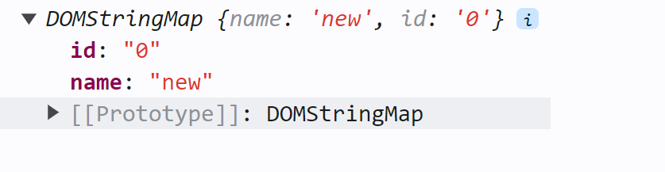


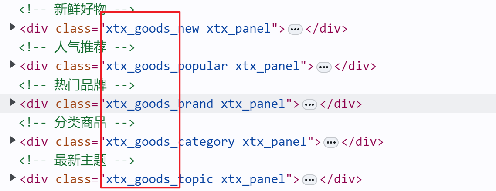 alt="image-20240711190012729.png" style="zoom:33%;"> alt="image-20240711190012729" style="zoom:150%;" />

```javascript
//利用蒙版字符串获取对应的类名
let activeBoxClassName = `xtx_goods_${e.target.dataset.name}`;
//利用得到的类名获取元素
let activeBox = document.querySelector(`.${activeBoxClassName}`);
//让页面滑动距离的当前元素的offsetTop
document.documentElement.scrollTop = activeBox.offsetTop;
```

### 五秒后自动跳转

```html
<a href="http://www.baidu.com">5秒后跳转</a>
    <script>
      //   1. 获取元素
      const a = document.querySelector("a");
      //   2. 开启定时器
      let num = 5;
      let timeId = setInterval(function () {
        num--;
        a.innerHTML = `${num}秒后跳转`;
        if (num === 0) {
          clearInterval(timeId);
          location.href = "http://www.baidu.com";
        }
      }, 1000);
    </script>
```

### `map( )渲染`对象数组 + `Object.value( )`+ `reduce( )` + 字符串转标签内容 +解构

> 1. 首先在js中获取对象数组的全部，然后使用`map()`方法实现渲染
>
>    - 利用`解构`获取对象的属性值
>    - return ` <html>...`.join() 将数组转为字符串
>
> 2. 商品列表的总价计算，利用`reduce()`,在`计算含小数的数值`时要先使其转换成整数计算再最后转换成小数
>
>    ```js
>    const total = goodsList.reduce(
>    (prev, item) => prev + (item.price * item.count * 100) / 100,
>    0
>    );
>    ```
>
> 3. `字符串转至对应html标签`内容，使用split()、map()、join()
>
>    ```js
>              const str = gift
>                ? gift
>                    .split(",")
>                    .map((item) => `<span class="tag">【赠品】${item}</span>`)
>                    .join("")
>                : "";
>    ```

```html
<!DOCTYPE html>
<html lang="en">
  <head>
    <meta charset="UTF-8" />
    <meta http-equiv="X-UA-Compatible" content="IE=edge" />
    <meta name="viewport" content="width=device-width, initial-scale=1.0" />
    <title>Document</title>
    <style>
      * {
        margin: 0;
        padding: 0;
        box-sizing: border-box;
      }

      .list {
        width: 990px;
        margin: 100px auto 0;
      }

      .item {
        padding: 15px;
        transition: all 0.5s;
        display: flex;
        border-top: 1px solid #e4e4e4;
      }

      .item:nth-child(4n) {
        margin-left: 0;
      }

      .item:hover {
        cursor: pointer;
        background-color: #f5f5f5;
      }

      .item img {
        width: 80px;
        height: 80px;
        margin-right: 10px;
      }

      .item .name {
        font-size: 18px;
        margin-right: 10px;
        color: #333;
        flex: 2;
      }

      .item .name .tag {
        display: block;
        padding: 2px;
        font-size: 12px;
        color: #999;
      }

      .item .price,
      .item .sub-total {
        font-size: 18px;
        color: firebrick;
        flex: 1;
      }

      .item .price::before,
      .item .sub-total::before,
      .amount::before {
        content: "¥";
        font-size: 12px;
      }

      .item .spec {
        flex: 2;
        color: #888;
        font-size: 14px;
      }

      .item .count {
        flex: 1;
        color: #aaa;
      }

      .total {
        width: 990px;
        margin: 0 auto;
        display: flex;
        justify-content: flex-end;
        border-top: 1px solid #e4e4e4;
        padding: 20px;
      }

      .total .amount {
        font-size: 18px;
        color: firebrick;
        font-weight: bold;
        margin-right: 50px;
      }
    </style>
  </head>

  <body>
    <div class="list">
      <!-- <div class="item">
       alt="84a59ff9c58a77032564e61f716846d6.jpg" style="zoom:33%;"> alt="">
      <p class="name">称心如意手摇咖啡磨豆机咖啡豆研磨机 <span class="tag">【赠品】10优惠券</span></p>
      <p class="spec">白色/10寸</p>
      <p class="price">289.90</p>
      <p class="count">x2</p>
      <p class="sub-total">579.80</p>
    </div> -->
    </div>
    <div class="total">
      <div>合计：<span class="amount"></span></div>
    </div>
    <script>
      const goodsList = [
        {
          id: "4001172",
          name: "称心如意手摇咖啡磨豆机咖啡豆研磨机",
          price: 289.9,
          picture:
            "https://yanxuan-item.nosdn.127.net/84a59ff9c58a77032564e61f716846d6.jpg",
          count: 2,
          spec: { color: "白色" },
        },
        {
          id: "4001009",
          name: "竹制干泡茶盘正方形沥水茶台品茶盘",
          price: 109.8,
          picture:
            "https://yanxuan-item.nosdn.127.net/2d942d6bc94f1e230763e1a5a3b379e1.png",
          count: 3,
          spec: { size: "40cm*40cm", color: "黑色" },
        },
        {
          id: "4001874",
          name: "古法温酒汝瓷酒具套装白酒杯莲花温酒器",
          price: 488,
          picture:
            "https://yanxuan-item.nosdn.127.net/44e51622800e4fceb6bee8e616da85fd.png",
          count: 1,
          spec: { color: "青色", sum: "一大四小" },
        },
        {
          id: "4001649",
          name: "大师监制龙泉青瓷茶叶罐",
          price: 139,
          picture:
            "https://yanxuan-item.nosdn.127.net/4356c9fc150753775fe56b465314f1eb.png",
          count: 1,
          spec: { size: "小号", color: "紫色" },
          gift: "50g茶叶,清洗球",
        },
      ];
      /*
      function rebderForEach(list) {
        let str = "";
        list.forEach((element) => {
          const {
            name,
            price,
            picture,
            count,
            spec: { color, sum },
          } = element;

          str += `
          <div class="item">
            
            <p class="name">${name} <span class="tag">【赠品】10优惠券</span></p>
            <p class="spec">${color}/10寸</p>
            <p class="price">${price}</p>
            <p class="count">${count}</p>
            <p class="sub-total">${count * price}</p>
          </div>
        `;
        });

        document.querySelector(".list").innerHTML = str;
      }
      rebderForEach(goodsList);
      */
      // let total = 0.0;
      //🔴用map进行渲染 //🔴使用了Object.value(spec)获取对象内部的属性值
      document.querySelector(".list").innerHTML = goodsList
        .map((item) => {
          const { name, price, picture, count, spec, gift } = item;
          // total += count * price;
          // 赠品模块
          const str = gift
            ? gift
                .split(",")
                .map((item) => `<span class="tag">【赠品】${item}</span>`)
                .join("")
            : "";
          // 列表模块 🔴小数先乘以100再除以100
          return `
          <div class="item">
            
            <p class="name">${name}${str}</p>
            <p class="spec">${Object.values(spec).join("/")}</p>
            <p class="price">${price.toFixed(2)}</p>
            <p class="count">${count}</p>
            <p class="sub-total">${((count * price * 100) / 100).toFixed(2)}</p>
          </div>
        `;
        })
        .join("");
      // 总价更新 使用reduce累计
      const total = goodsList.reduce(
        (prev, item) => prev + (item.price * item.count * 100) / 100,
        0
      );
      document.querySelector(
        ".total"
      ).innerHTML = `<div>合计：<span class="amount">${total.toFixed(
        2
      )}</span></div>`;
    </script>
  </body>
</html>
```


## 节点操作

所有的增删改查节点针对的都是元素节点

`父节点`

```html
子元素.parentNode
```

`子节点`

返回一个**伪数组**

```html
父元素.children
//获得所有子元素节点 
```

`兄弟节点`

```javascript
兄弟元素.nextElementSibling;
兄弟元素.previousElementSibling;
```

### 增加节点

1. 先创建节点 **只有这个需要' ' **

```js
const *** = document.createElement('标签名');
```

2. 放入节点到指定位置 

```javascript
// appendChild() 一次只能添加一个节点。且只能添加元素节点
父元素.appendChild(标签名);
//在父元素的末尾插入
父元素.insertBefore(要插入的元素, 在哪个元素的前面)
//指定插入在某个元素之前,前提是这两个值都已通过querySelector获取，记住不需要引号

// append() 可以一次添加多个节点，可添加文本节点
父元素.append(newNode, newNode1, ..., textNode)
```

#### append 用法

> ```js
> // 将新节点和文本节点一起添加到父节点的末尾
> const parentNode = document.getElementById("parent");
> parentNode.append(newNode, textNode);
> ```

#### appendChild 和 insertBefore 用法

```html
    <script>
      // 增加节点
      // 1. 创建节点 不要忘记获取
      const p = document.createElement("p");
      const two = document.querySelector(".two");
      const ul = document.querySelector("ul");
      const li = document.createElement("li");
      //   2. 插入节点
      p.innerHTML = "what?";
      li.innerHTML = "22222";
      //   🔴document.body 返回 <body> 元素的引用。它代表整个文档的主体部分，即包含所有网页内容的 HTML 元素
      document.body.appendChild(p);//文档尾部
      ul.insertBefore(li, ul.children[0]);
      //   ul.appendChild(li);
    </script>
```

### 克隆节点

1. 赋值一个原有的节点
2. 把复制的节点放入到指定的元素内部

```JavaScript
元素.cloneNode(布尔值) //true / false
// true 会克隆所有的内容 包括标签内部文本
// false 意思就是只克隆标签名
```

```html
<ul>
  <li>1</li>
  <li>2</li>
  <li>3</li>
</ul>
<script>
  // 1. 克隆节点 内容也被复制了
  const ul = document.querySelector("ul");
  const li1 = ul.children[0];
  const li1Clone = li1.cloneNode(true);

  //   2. 插入节点
  ul.appendChild(liClone);
</script>
```

### 删除节点

在JavaScript原生DOM中，要删除元素必须**通过父元素**，如果不存在父子关秀则删除不成功

```js
父元素.removeChild(要删除元素);
待删除元素.remove(无需参数);
```

> remove 和 removeChild 的用法差别
>
> 1. 删除对象
>    - `remove()` 方法是在当前节点上调用的,用于删除当前节点自身。
>    - `removeChild()` 方法是在父节点上调用的,用于删除指定的子节点。
> 2. 传入参数
>    - `remove()` 不需要传入任何参数,直接删除当前节点。
>    - `removeChild()` 需要传入要删除的子节点作为参数。
> 3. 返回值
>    - `remove()` 没有返回值。
>    - `removeChild()` 返回被删除的节点。

```html
    <ul>
      <li>你点一下我就没了</li>
    </ul>
    <script>
      const ul = document.querySelector("ul");
      ul.addEventListener("click", function () {
        ul.removeChild(ul.children[0]);
      });
    </script>
```

### **例-通过节点操作来增添网页内容**

> 首先获取父元素
>
> ```js
> const ul = document.querySelector(".clearfix");
> ```
>
> 然后利用createElement()创造子节点
>
> ```js
> let li = document.createElement("li");
> ```
>
> 再利用appendChild()添加到父节点上
>
> ```js
> ul.appendChild(li);
> ```

```html
<!DOCTYPE html>
<html lang="en">
  <head>
    <meta charset="UTF-8" />
    <meta name="viewport" content="width=device-width, initial-scale=1.0" />
    <meta http-equiv="X-UA-Compatible" content="ie=edge" />
    <title>学车在线首页</title>
    <link rel="stylesheet" href="./css/style.css" />
    <style></style>
  </head>

  <body>
    <!-- 4. box核心内容区域开始 -->
    <div class="box w">
      <div class="box-hd">
        <h3>精品推荐</h3>
        <a href="#">查看全部</a>
      </div>
      <div class="box-bd">
        <ul class="clearfix"></ul>
      </div>
    </div>
    <script>
      // 1. 重构
      let data = [
        {
          src: "images/course01.png",
          title: "Think PHP 5.0 博客系统实战项目演练",
          num: 1125,
        },
        {
          src: "images/course02.png",
          title: "Android 网络动态图片加载实战",
          num: 357,
        },
        {
          src: "images/course03.png",
          title: "Angular2 大前端商城实战项目演练",
          num: 22250,
        },
        {
          src: "images/course04.png",
          title: "Android APP 实战项目演练",
          num: 389,
        },
        {
          src: "images/course05.png",
          title: "UGUI 源码深度分析案例",
          num: 124,
        },
        {
          src: "images/course06.png",
          title: "Kami2首页界面切换效果实战演练",
          num: 432,
        },
        {
          src: "images/course07.png",
          title: "UNITY 从入门到精通实战案例",
          num: 888,
        },
        {
          src: "images/course08.png",
          title: "Cocos 深度学习你不会错过的实战",
          num: 590,
        },
      ];
      const ul = document.querySelector(".clearfix");
      for (let i = 0; i < data.length; i++) {
        let li = document.createElement("li");
        li.innerHTML = `
            <a href = '#'>
                
                <h4>
                    ${data[i].title}
                </h4>
                <div class= "info">
                    <span>高级<span> · <span>${data[i].num}人在学习
                </div>
            </a>  
        `;
        ul.appendChild(li);
      }
    </script>
  </body>
</html>

```


## M端事件

移动端自己独特的地方，比如**触屏事件 touch**

touch 对象代表一个触摸点。触摸点可能是一根手指，也可能是一根触摸笔。触屏事件可响应用户手指（或触控笔）对屏幕或者触控板操作。

| 触屏事件      |                               |
| ------------- | ----------------------------- |
| 触屏touch事件 | 说明                          |
| touchstart    | 手指触摸到一个DOM元素时触发   |
| touchmove     | 手指在一个DOM元素上滑动时触发 |
| touchend      | 手指从一个DOM元素上移开时触发 |

```html
    <div></div>
    <script>
      const div = document.querySelector("div");
      div.addEventListener("touchstart", function () {
        console.log("touching");
      });
      div.addEventListener("touchmove", function () {
        console.log("keep touching");
      });
      div.addEventListener("touchend", function () {
        console.log("touch leave");
      });
    </script>
```

## [JS插件](https://www.swiper.com.cn/)

> 1. 引入css 和 js 
>
> ```html
>     <link rel="stylesheet" href="./css/swiper-bundle.min.css" />
> ```
>
> ```html
> <script src="./js/swiper-bundle.min.js">
> </script>
> ```
>
> 2. 复制对应的html和css
> 3. 可以到[API文档](https://www.swiper.com.cn/api/index.html)中进行其他功能的添加


```html
<!DOCTYPE html>
<html lang="en">
  <head>
    <meta charset="UTF-8" />
    <meta name="viewport" content="width=device-width, initial-scale=1.0" />
    <title>Document</title>
    <link rel="stylesheet" href="./css/swiper-bundle.min.css" />
    <style>
      .box {
        width: 800px;
        height: 300px;
        background-color: pink;
        margin: 100px auto;
      }
      html,
      body {
        position: relative;
        height: 100%;
      }

      body {
        background: #eee;
        font-family: Helvetica Neue, Helvetica, Arial, sans-serif;
        font-size: 14px;
        color: #000;
        margin: 0;
        padding: 0;
      }

      .swiper {
        width: 100%;
        height: 100%;
      }

      .swiper-slide {
        text-align: center;
        font-size: 18px;
        background: #fff;
        display: flex;
        justify-content: center;
        align-items: center;
      }

      .swiper-slide img {
        display: block;
        width: 100%;
        height: 100%;
        object-fit: cover;
      }
    </style>
  </head>
  <body>
    <div class="box">
      <!-- Swiper -->
      <div class="swiper mySwiper">
        <div class="swiper-wrapper">
          <div class="swiper-slide">Slide 1</div>
          <div class="swiper-slide">Slide 2</div>
          <div class="swiper-slide">Slide 3</div>
          <div class="swiper-slide">Slide 4</div>
          <div class="swiper-slide">Slide 5</div>
          <div class="swiper-slide">Slide 6</div>
          <div class="swiper-slide">Slide 7</div>
          <div class="swiper-slide">Slide 8</div>
          <div class="swiper-slide">Slide 9</div>
        </div>
        <div class="swiper-pagination"></div>
      </div>
    </div>
    <script src="./js/swiper-bundle.min.js"></script>
    <script>
      var swiper = new Swiper(".mySwiper", {
        pagination: {
          el: ".swiper-pagination",
        },
        autoplay: {
          disableOnInteraction: false, //触摸之后继续自动播放
        },
        keyboard: true, //键盘控制
      });
    </script>
  </body>
</html>

```

## BOM

**BOM**(Browser Object Model ) 是浏览器对象模型

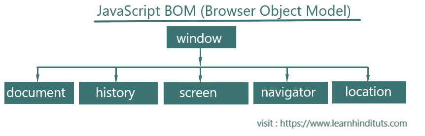

- **window对象**是一个全局对象，也可以说是JavaScript中的顶级对象
- 像document、alert()、console.log()这些都是window的属性，基本BOM的属性和方法都是window的。
- 所有通过**var**定义在全局作用域中的变量、函数都会变成window对象的属性和方法
- **window对象下的属性和方法调用的时候可以省略window**

## window对象

### location对象

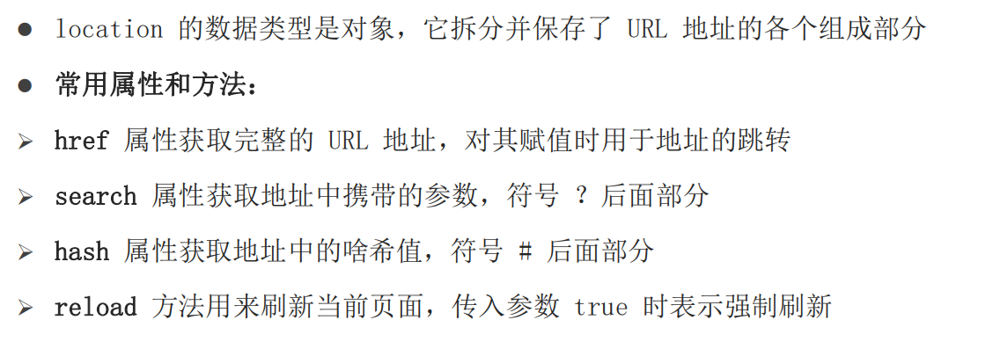

```js
// 得到当前文件url地址
console.log(location.href);
// href 经常用href 利用js的方法跳转页面
location.href = "http://www.baidu.com";
// hash 后期vue路由的铺垫，经常用于不刷新页面，显示不同页面，比如 网易云音乐
<a href="#/my">我的</a>
<a href="#/friend">关注</a>
<a href="#/download">下载</a>
// reload 强制刷新
loacation.reload(true)
```

### navigator对象

该对象下记录了浏览器自身的相关信息。通过 `userAgent` 检测浏览器的版本及平台

`自动跳转至移动端`

```html
    <script>
      // 检测 userAgent（浏览器信息）
      !(function () {
        const userAgent = navigator.userAgent;

        // 验证是否为Android或iPhone
        const android = userAgent.match(/(Android);?[\s\/]+([\d.]+)?/);
        const iphone = userAgent.match(/(iPhone\sOS)\s([\d_]+)/);

        // 如果是Android或iPhone，则跳转至移动站点
        if (android || iphone) {
          location.href = "http://m.itcast.cn";
        }
      })();
    </script>
```

### history对象

history 的数据类型是对象，主要管理历史记录， 该对象与浏览器地址栏的操作相对应，如前进、后退、历史记录等。

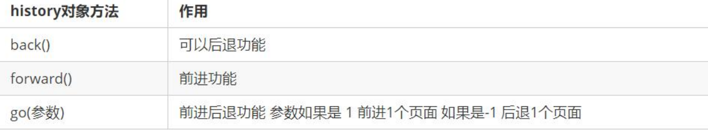

## [DOMTokenList](https://developer.mozilla.org/zh-CN/docs/Web/API/DOMTokenList)

它和 JavaScript [`Array`](https://developer.mozilla.org/zh-CN/docs/Web/JavaScript/Reference/Global_Objects/Array) 对象一样，索引从 0 开始。`DOMTokenList` 总是区分大小写（case-sensitive）。

如由 

- [`Element.classList`](https://developer.mozilla.org/zh-CN/docs/Web/API/Element/classList)、
- [`HTMLLinkElement.relList`](https://developer.mozilla.org/en-US/docs/Web/API/HTMLLinkElement/relList)
- [`HTMLAnchorElement.relList`](https://developer.mozilla.org/en-US/docs/Web/API/HTMLAnchorElement/relList) 
- [`HTMLAreaElement.relList`](https://developer.mozilla.org/en-US/docs/Web/API/HTMLAreaElement/relList) 

返回的一组值。

定义了方法 `contains()`、`add()`、`remove()` 和 `toggle()` 方法

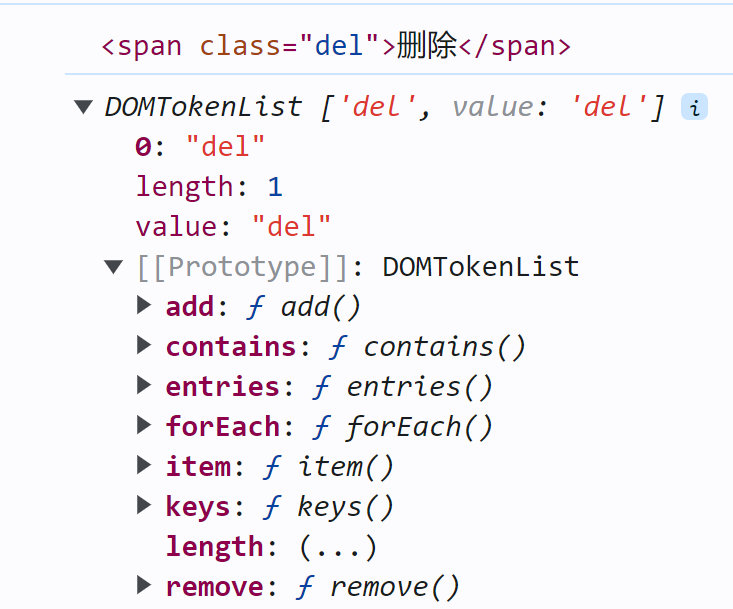

**`Element.classList`** 是一个只读属性，返回一个元素 `class` 属性的动态 [`DOMTokenList`](https://developer.mozilla.org/zh-CN/docs/Web/API/DOMTokenList) 集合。这可以用于操作 class 集合。

所以 DOMTokenList 相当于对象 classList相当于属性 add()则是方法

## 本地存储

### localStorage

作用: 可以将数据`永久存储`在本地(用户的电脑), 除非手动删除，否则关闭页面也会存在l

特性： 

1. 本地存储只能存储字符串，**无论存储的是什么，最后的得到的都是字符串**

2. 可以多窗口（页面）共享（同一浏览器可以共享） 

3. 以键值对的形式存储使用

```js
localStorage.setItem("key","value");
localStorage.getItem("key");
localStorage.removeItem("key");
```

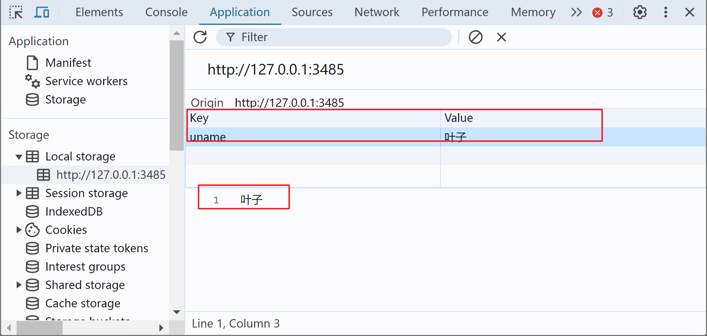

### sessionStorage

特性：

1. 生命周期为关闭浏览器窗口
2. 在同一个窗口（页面）下数据可以共享
3. 以键值对的形式存储使用
4. 用法跟localStorage基本相同

### 存储复杂数据类型

由于本地只能存储字符串,无法存储复杂数据类型，所以需要将`复杂数据类型`转换成`JSON字符串`,在存储到本地

#### JSON.stringify

将复杂数据类型转换成JSON字符串,在存储到本地

```js
JSON.stringify(复杂数据类型)
```

#### JSON.parse

把取出来的字符串转换为对象

```js
JSON.parse(JSON字符串)
```

```html
<script>
  const obj = {
    uname: "叶子",
    gender: "女",
  };
  //   存储复杂数据类型 转换为json字符串存储
  localStorage.setItem("obj", JSON.stringify(obj)); //加" " 的是键
  //   取 把字符串转换为对象取出
console.log(JSON.parse(localStorage.getItem("obj")));
</script>
```


## [json](https://www.microfocus.com/documentation/silk-performer/195/en/silkperformer-195-webhelp-en/GUID-6AFC32B4-6D73-4FBA-AD36-E42261E2D77E.html)

### 正则表达式

```js
const 变量名 = /表达式/
```

`test()方法 `用来查看正则表达式与指定的字符串是否匹配

`exec() 方法`在一个指定字符串中执行一个搜索匹配

```html
<script>
  // const 变量名 = /表达式/
  const str = "woman is good";
  //   1. 定义规则
  const reg = /good/;
  //   2. 是否匹配 返回布尔值
  console.log(reg.test(str));
  //   exec 返回的是一个数组
  console.log(reg.exec(str));
</script>
```

### 元字符

1. 边界符 ：正则表达式中的边界符（位置符）用来提示字符所处的位置，**如果 ^ 和 $ 在一起，表示必须是精确匹配(只能为这个字符切只出现一次)。**

   `^` 表示匹配首行的文本(以谁开始) 

   `$` 表示匹配首行的文本(以谁结束) 

2. 量词：用来设定某个模式出现的次数（逗号左右两侧千万不要出现空格）

   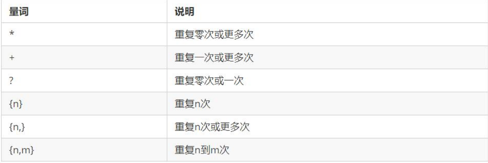

3. 字符类：

   - `[ ] `匹配字符集合

   - `[ ] `里面加上 `- `连字符: `[a-z] `表示 a 到 z 26个英文字母都可以 `[a-zA-Z] `表示大小写都可以`[0-9] `表示 0~9 的数字都可以

   - `[ ] `里面加上` ^ `取反符号:`[^a-z]`匹配除了小写字母以外的字符

```html
腾讯QQ号： ^[1-9][0-9]{4,}$
```

```js
// 1. 元字符
      console.log(/哈/.test("哈"));
      console.log("---------------------");
      // 1.1 边界符
      console.log(/^哈/.test("哈")); //必须以 哈 开头 ->true
      console.log(/^哈/.test("二哈")); //->false
      console.log(/^哈$/.test("哈")); //必须以哈开头和结尾 精确匹配 只有这种情况为true->true
      console.log(/^哈$/.test("哈哈")); //精确匹配意味着里面只能出现一个哈 -> false
      console.log("---------------------");
      //   1.2 量词 * >=0 次
      console.log(/^哈*$/.test("")); //true
      console.log(/^哈*$/.test("哈哈")); //出现>= 0次都可以 true
      console.log(/^哈*$/.test("哈很哈")); //🔴false 里面只能有哈 不能有其他字符
      console.log("---------------------");
      // 量词 {n} ,必须出现n次 🔴重复的是距离{}的字符
      console.log(/^哈{4}$/.test("哈哈哈")); //false
      console.log(/^哈{4}$/.test("哈哈哈哈")); //true
      console.log("---------------------");
      // 量词 {n,m} >=n && <=m
      // 🔴逗号左右两侧千万不要出现空格 {4,6}✔️ {4, 6}✖️
      //   字符类 [abc] 只要包含其中任意一个即可
      console.log(/^[abc]$/.test("gcs")); //false 有精准匹配没有以abc中任意一个开头结尾
      console.log(/^[abc]$/.test("c")); // true
      console.log(/[abc]/.test("scd")); // true 只要包含abc 中任意一个即可
      console.log(/[a-z]/.test("x")); //只要包含x - z 的任意一个即可
      console.log(/[0-9]/.test("2")); //true
      console.log(/^[a-zA-Z0-9]$/.test("2")); //true
      console.log(/^[a-zA-Z0-9]$/.test("t")); //true
      console.log(/^[a-zA-Z0-9]$/.test("Q")); //true
      console.log("---------------------");
```

### 修饰符

修饰符约束正则执行的某些细节行为，如是否区分大小写、是否支持多行匹配等

```js
/表达式/修饰符
```

1. i 是单词 ignore 的缩写，正则匹配时字母不区分大小写 

2. g 是单词 global 的缩写，匹配所有满足正则表达式的结果

```js
console.log(/a/i.test('a'))	//true
console.log(/a/i.test('A')) //true
```

3. replace 替换

```js
字符串.replace(/正则表达式/, '替换的文本')
```

```js
      //   i不区分大小写
      console.log(/^a$/i.test("A")); //true
      // ig 不区分大小写全局替换
      const str = "我是神，我来自地球";
      const re = str.replace(/我/gi, "你"); //将所有的我替换成你
      console.log(re);
```

### QQ号讲解

```js
^[1-9][0-9]{4,}$
```

这个正则表达式用于验证一个字符串是否满足以下要求:

1. 以一个 1 到 9 之间的数字开头。
2. 后面跟着 4 位或更多位的数字。
3. 整个字符串必须完全匹配正则表达式。

让我们来逐步解释一下这个正则表达式的各个部分:

- `^`: 表示字符串的开始。

- `[1-9]`: 匹配一个 1 到 9 之间的数字。这是为了确保第一个字符不是 0。

- ```
  [0-9]{4,}
  ```

  : 匹配 4 位或更多位的数字。

  - `[0-9]`: 匹配任何数字 0 到 9。
  - `{4,}`: 匹配前面的模式(单个数字)至少重复 4 次或更多次。

- `$`: 表示字符串的结束。

总的来说,这个正则表达式用于验证一个字符串是否是一个由 5 位或更多位数字组成的正整数,且第一位不能是 0。

一些示例:

- `"12345"` 符合要求,因为它以 1 开头,后面跟着 4 位数字。
- `"098765"` 不符合要求,因为第一个字符是 0。
- `"1"` 不符合要求,因为它少于 5 位数字。
- `"123456789"` 符合要求。
- `"1a2345"` 不符合要求,因为它包含了非数字字符。

### 验证用户名案例

```html
<!DOCTYPE html>
<html lang="en">

<head>
    <meta charset="UTF-8">
    <meta http-equiv="X-UA-Compatible" content="IE=edge">
    <meta name="viewport" content="width=device-width, initial-scale=1.0">
    <title>Document</title>
    <style>
        span {
            display: inline-block;
            width: 250px;
            height: 30px;
            vertical-align: middle;
            line-height: 30px;
            padding-left: 15px;
        }

        .error {
            color: red;
            background: url(./images/error1.png) no-repeat left center;
        }

        .right {
            color: green;
            background: url(./images/right.png) no-repeat left center;
        }
    </style>
</head>

<body>
    <input type="text">
    <span></span>
    <script>
        // 1. 准备正则
        const reg = /^[a-zA-Z0-9-_]{6,16}$/
        const input = document.querySelector('input')
        const span = input.nextElementSibling
        input.addEventListener('blur', function () {
            // console.log(reg.test(this.value))
            if (reg.test(this.value)) {
                span.innerHTML = '输入正确'
                span.className = 'right'
            } else {
                span.innerHTML = '请输入6~16位的英文数字下划线'
                span.className = 'error'
            }
        })
    </script>
</body>

</html>
```

