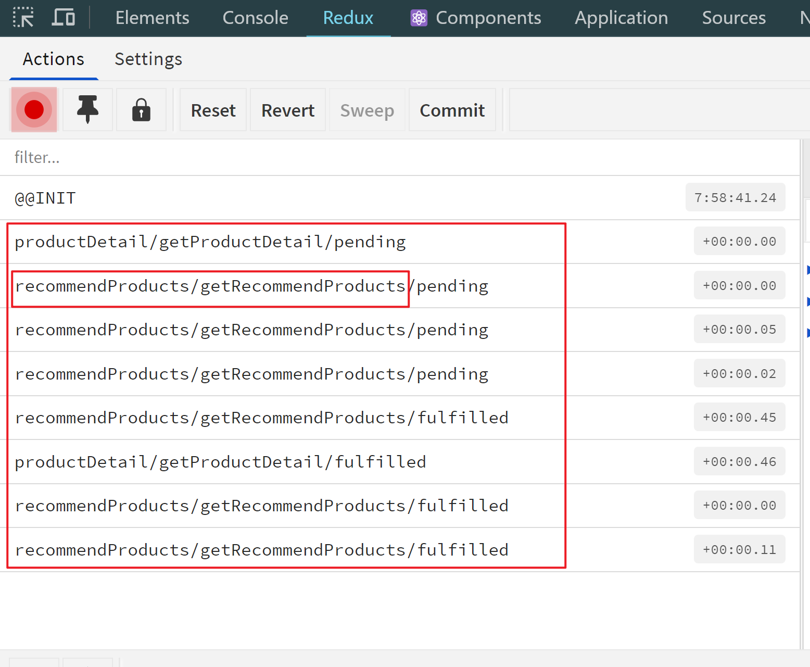

# Redux

- state -- Redux Toolkit  --> store +（hooks）
- Reducer -- Redux Toolkit --> slice
- Action -- Redux-Thunk --> thunk(function)

==思维导图== [markmap.html](思维导图/markmap.html) 

## Redux-Toolkit 同步与异步的区别

==思维导图== [markmap2.html](思维导图/markmap2.html) 

| 特点              | 同步                                          | 异步                                                   |
| ----------------- | --------------------------------------------- | ------------------------------------------------------ |
| **Reducer 定义**  | 在 `reducers` 中定义，生成同步 action creator | 在 `extraReducers` 中定义，处理异步操作的结果          |
| **导出内容**      | 导出 `actions` 和 `reducer`                   | 只需导出 `reducer`                                     |
| **dispatch 内容** | `dispatch(action)`                            | `dispatch(thunkFunction)`                              |
| **store 定义**    | 不需要额外配置中间件                          | 默认包含 `redux-thunk`，也可添加其他中间件如middleware |

1. **Reducer的创建方法不同**。在`slice.ts`文件中：

   -  `同步`的reducer在`reducers`中创建
   - `异步`的reducer 在`extraReducers`中创建

   ```jsx
   const userSlice = createSlice({
     name: '',
     initialState,
     reducers: {
       // 同步 action
     },
     extraReducers: (builder) => {
       // 异步 action
   });
   ```

2. **slice文件中需要导出的内容不同**。在`slice.ts`文件中：

   - `同步`需要使用导出 `ation` 和 `reducer`

     ```jsx
     // 导出 action 创建函数
     export const { changeLanguage } = changeLanguageSlice.actions;
     
     // 导出 reducer 以供 store 使用
     export default changeLanguageSlice.reducer;
     ```

   - `异步`只需要导出`reducer`

     ```jsx
     export default productDetailSlice.reducer;
     ```

   > - 同步：Redux Toolkit 自动为每个定义的 reducer 生成 action creator 函数，并将它们放在 `slice.actions` 对象中。如果你在 `reducers` 中定义了操作，比如 `increment` 或 `decrement`，那么你需要导出这些 action creators 以便在其他地方使用。
   >
   > - 异步：这些 actions 通常不需要手动创建，因为它们是由异步 thunk 自动生成的，所以不需要从 `slice.actions` 中导出这些 actions。

3. **dispatch()的内容不同。**

   - `同步`dispatch(action)

     ```jsx
     const dispatch = useAppDispatch();
     // 这里的changeLanguage就是之前在slice.ts中导出的action
     const onClick = (e) => {
       // 派发同步 action 来更改语言
       dispatch(changeLanguage(e.key));
     };
     ```

   - `异步`dispatch(thunkFunction)

     ```tsx
       useEffect(() => {
         if (touristRouteId) {
           // 这里的getProductDetail就来自thunkFunction
           dispatch(getProductDetail(touristRouteId));
         }
       }, [touristRouteId, dispatch]);
     ```

4. **store 定义的方式不同。**

   - 如果存在异步，则可以再store注入middleware，用于输出actionLog

     ```jsx
     const store = configureStore({
       reducer: rootReducer,
       middleware: (getDefaultMiddleware) =>
         getDefaultMiddleware().concat(actionLog),
     });
     ```

## Redux-Toolkit(同步)

> 以下的展示是一个翻译切换的数据渲染在函数组件Header 中实现
>
> - slice.ts
> - store.ts
> - hooks.ts(与异步相同，见异步)
> - use in component

### slice.ts

- `initialState` & it's `interface`
- `Slice`: use createSlice 
- export `slice.action`
- export `slice.reducer`

```jsx
import i18n from "../../i18n/config";
import { createSlice } from "@reduxjs/toolkit";

interface LanguageState {
  language: "en" | "zh";
  languageList: { name: string; code: string }[];
}

const initialState: LanguageState = {
  language: "zh",
  languageList: [
    { name: "中文", code: "zh" },
    { name: "English", code: "en" },
  ],
};

export const changeLanguageSlice = createSlice({
  name: "changeLanguage",
  initialState,
  reducers: {
    changeLanguage: (state, action) => {
      i18n.changeLanguage(action.payload);
      return { ...state, language: action.payload };
    },
  },
});

// 导出 action 创建函数
export const { changeLanguage } = changeLanguageSlice.actions;

// 导出 reducer 以供 store 使用
export default changeLanguageSlice.reducer;
```

### store.ts

```jsx
const rootReducer = combineReducers({
  changeLanguage: changeLanguageSlice.reducer,
	...
});

const store = configureStore({
  reducer: rootReducer,
});

```

### use in <Header>

```jsx
  const language = useSelector((state) => state.changeLanguage.language);
  const languageList = useSelector(
    (state) => state.changeLanguage.languageList
  );
  const items = languageList.map((l) => {
    return { key: l.code, label: l.name };
  });
  const dispatch = useAppDispatch();

  const onClick = (e) => {
    // 派发同步 action 来更改语言
    dispatch(changeLanguage(e.key));
  };

{
  // 组件中
  <a onClick={(e) => e.preventDefault()}>
    {language === "zh" ? "中文" : "English"}
  </a>
}
```

## Redux-Thunk

### 为什么需要Redux-Thunk?

> 我们不是有action craeator 吗? 为什么需要Redux-Thunk？
>

**Redux** 是一个**同步状态管理库**，意味着所有的状态更新都是立即发生的。那如果我们需要一个异步操作呢，例如，我们想点击按钮2秒后再请求信息

```jsx
var asyncSayActionCreator = function (message) {
 setTimeout(function () {
     return {
         type: 'SAY',
         message
     }
 }, 2000)
}
```

这会报错，因为这个`asyncSayActionCreator`返回的不是一个`action`，而是一个`function`。这个返回值无法被reducer识别。

而这个时候就可以**使用Redux-Thunk 实现异步操作，再创建action**。

### 什么是Redux-Thunk?

- 是一个redux中间件, 用于处理异步操作 (logic effect)。它是包含在Redux中的一个部分。它的核心就是`middleware`和`Thunk函数`。
- ==a middleware that allows developers to write action creators that return functions instead of action objects==.，我们由原先的**dispatch(action)**变成了现在**dispatch(thunkFunction)**
- 使用方法：在sotre中注入middleware, 创建thunk函数，内部包含异步逻辑

#### **middleware**

- 作用：Redux 中的中间件是在 `dispatch` 和 `reducer` 之间的一个层，它能够拦截或修改 `dispatch` 的行为。

- 用法：在stroe中注入middleware

  ```jsx
  const store = configureStore({
    reducer: rootReducer,
    middleware: (getDefaultMiddleware) =>
      getDefaultMiddleware().concat(actionLog),
  });
  ```

  > **How Does the Middleware Work?**
  >
  > 核心：[柯里化](https://segmentfault.com/a/1190000017981474)
  >
  > 首先来看看源码,这是一个柯里化的函数
  >
  > ```jsx
  > // standard middleware definition, with 3 nested functions:
  > // 1) Accepts `{dispatch, getState}`
  > // 2) Accepts `next`
  > // 3) Accepts `action`
  > const thunkMiddleware =
  >   ({ dispatch, getState }) =>
  >   next =>
  >   action => {
  >     // If the "action" is actually a function instead...
  >     if (typeof action === 'function') {
  >       // then call the function and pass `dispatch` and `getState` as arguments
  >       return action(dispatch, getState)
  >     }
  > 
  >     // Otherwise, it's a normal action - send it onwards
  >     return next(action)
  >   }
  > 
  > ```
  >
  > 这是一个`柯里化`的函数：`thunkMiddleware` 是在 Redux 的中间件链中被*自动调用*的，它接收 `store` 的 `dispatch` 和 `getState` 作为参数。
  >
  > middleware是如何被执行的？
  >
  > 1. 通过`store.dispatch(function / action)`被自动调用
  >
  > 2. 判断`store.dispath()`传入的值
  >
  >    - 当`store.dispath(function)`时，它会调用这个函数。通常这个函数是我们创建的`Thunk函数`(内部包含了异步请求和send action)。
  >
  >    - 当`store.dispath(action)`，它会通过`next(action)`将其传递给`reducer`，而如果有多个middleware，它会传递给下一个middleware

#### **Thunk 函数**

- 允许你在 action creators 中返回一个函数，而不是一个普通的 action 对象。这个返回的函数可以包含异步逻辑（如网络请求）。

使用`createAsyncThunk`创建`thunk函数`，通常用于`执行异步逻辑`

```jsx
export const getRecommendProducts = createAsyncThunk(
  "recommendProducts/getRecommendProducts",
  // Declare the type your function argument here，具体解释见下面解析
  async (_, thunkAPI) => {
    // 为什么是_和thunkAPI，如何携带参数发送axios请求，具体见下面解析
    try {
      const { data } = await axios.get(
        "http://82.157.43.234:8080/api/productCollections"
      );
      return data;
    } catch (error) {
      return thunkAPI.rejectWithValue(error || "Unknown error");
    }
  }
);
```

> 1. 为什么 `action type` 很重要？
>
> ​	在使用 `createAsyncThunk` 时，`'users/fetchById'` 这个名字（也称为 action type）并不是固定的，但它是非常重要的。这个名字是用来标	识这个异步 action 的类型的，并且在生成的 actions 和 reducers 中会用到。
>
> - 唯一标识: 每个 thunk action 都有一个唯一的 action type，确保不同的 actions 不会冲突。例如，`'users/fetchById'` 这个名字就是为这个特定的异步 action 定义的。
>
> - 生成的 actions: `createAsyncThunk` 会自动生成三个 action types：`pending`、`fulfilled` 和 `rejected`，它们的格式是 `${actionType}/pending`、`${actionType}/fulfilled` 和 `${actionType}/rejected`。这使得你能够在 `extraReducers` 中处理不同的请求状态。
>
>   
>
> - 调试和日志: 在开发过程中，action type 使得调试工具能够显示具体的 action 类型，帮助你理解当前的状态和数据流。(见上图)
>
> 2. async (_, thunkAPI)  为什么是`_`和`thunkAPI`?
>
>    async()括号中的内容表示这次axios请求需要携带的参数
>
>    - `_ `：如果不需要使用这个参数，可以用 `_` 来表示，如果要携带参数发送axios请求：
>
>      ```tsx
>        async (touristRouteId: string, thunkAPI) => {
>          try {
>            const { data } = await axios.get(
>              `http://82.157.43.234:8080/api/touristRoutes/${touristRouteId}`
>            );
>      ```
>
>    - `thunkAPI`:是 `createAsyncThunk` 自动提供的一个对象
>
>      - `thunkAPI` 包含的属性:
>        - `dispatch`: 用于在异步操作中派发其他 actions。
>        - `getState`: 用于在异步操作中访问 Redux store 的当前状态。
>        - `rejectWithValue(value)`: 用于在异步操作失败时返回一个自定义的错误值。
>        - `signal`: 如果使用了 AbortController 进行请求取消，这里可以访问请求的信号。

拆解柯里化

```jsx
const thunkMiddleware = function({ dispatch, getState }) {
  return function(next) {
    return function(action) {
      // 如果 action 是一个函数，调用它并传递 dispatch 和 getState
      if (typeof action === 'function') {
        return action(dispatch, getState);
      }

      // 如果 action 不是函数，直接传递给下一个 middleware 或 reducer
      return next(action);
    };
  };
};
```


```jsx
thunkMiddleware(thunk/action) {
  return functionReturn1
}
const functionReturn1 = function(next) {
  return functionRetun2;
}
const functionReturn2 = function(action) {
  if(action is a function) call action
  if(action is a action) pass the action to the reducer(or pass to the next middleware, if there are mutiple middlewares) 
}
```

假设你有三个 middleware：`loggerMiddleware`、`thunkMiddleware` 和 `errorMiddleware`。配置顺序如下：

```jsx
const store = createStore(
  rootReducer,
  applyMiddleware(loggerMiddleware, thunkMiddleware, errorMiddleware)
);
```

```jsx
const loggerMiddleware = store => next => action => {
  console.log('Logging action:', action);
  return next(action); // 传递给下一个 middleware
};

const thunkMiddleware = ({ dispatch, getState }) => next => action => {
  if (typeof action === 'function') {
    return action(dispatch, getState);
  }
  return next(action); // 传递给下一个 middleware 或 reducer
};

const errorMiddleware = store => next => action => {
  try {
    return next(action); // 传递给 reducer
  } catch (err) {
    console.error('Caught an exception!', err);
  }
};

```

## Redux-Toolkit(异步)

**Redux Toolkit** 是 Redux 的官方工具库，旨在简化 Redux 的使用。

主要由以下三部分构成

- store
- hooks
- slice
- thunk

### Slice.ts

- `initialState` & `it's interface`

- `thunkFunction`: use createAsyncThunk()

- `slice` : use createSlice({ }) ，在其内部使用 builder.addCase 处理action的不同状态

  - pendIng
  - fulfilled
  - rejected

  ```jsx
  const userSlice = createSlice({
    name: 'user',
    initialState,
    reducers: {
      // 同步 action
    },
    extraReducers: (builder) => {
      // 这里的builder和它的三个方法是什么见下面详解
      builder
        .addCase(fetchUserById.pending, (state) => {
          state.loading = true;
          state.error = null;
        })
        .addCase(fetchUserById.fulfilled, (state, action) => {
          state.loading = false;
          state.user = action.payload;
        })
        .addCase(fetchUserById.rejected, (state, action: PayloadAction<any>) => {
          state.loading = false;
          state.error = action.payload || "Unknown error";
        });
    }
  });
  
  ```

  > 在 `createSlice` 中，`extraReducers` 是一个用于处理异步操作的特殊配置项。它接收一个 `builder` 对象，用于定义如何处理不同的异步操作状态（例如 `pending`、`fulfilled` 和 `rejected`）。这个 `builder` 对象提供了用于创建这些状态处理的 API。
  >
  > `builder` 是由 `createSlice` 提供的，在你的 `extraReducers` 回调函数中，你使用它来注册处理不同 `action` 类型的逻辑。
  >
  > 常用方法：
  >
  > - **`.addCase(actionCreator, reducer)`**: 用于处理特定 `action` 的不同状态。`actionCreator` 是一个 `action` 创建函数（比如 `fetchUserById.pending`），`reducer` 是处理该状态的 reducer 函数。
  > - .addMatcher(matcher, reducer): 用于匹配多个 `action` 类型并使用一个 reducer 函数来处理它们。
  > - .addDefaultCase(reducer): 用于处理未显式匹配的 `action`，通常不需要，除非你有一些额外的处理逻辑。

- `reducer`: 导出slice中的reducer

```jsx
export default productDetailSlice.reducer;
```

### store.ts

- `rootReducer` : combine all reducers to rootReducer

- `store` : use configureStore to create store, 要求传入以下两个参数

  - reducer：rootReducer

  - middleware:  redux-thunk 默认已经包含在内，*默认情况不需要手动添加*，除非你需要actionLog

    ```jsx
    // redux/middleware/actionLog.ts
    import { Middleware } from "redux";
    
    export const actionLog: Middleware = (store) => (next) => (action) => {
      console.log("state 当前", store.getState());
      console.log("fire action ", action);
      next(action);
      console.log("state 更新", store.getState());
    };
    ```

- `Root State type` 和 `AppDispatch type`

```jsx
//combine all reducers to rootReducer
const rootReducer = combineReducers({
  language: languageReducer,
  recommendProducts: recomendProductsSlice.reducer,
  productDetail: productDetailSlice.reducer,
});

// use congiureStore to create store
const store = configureStore({
  reducer: rootReducer,
  middleware: (getDefaultMiddleware) =>
    getDefaultMiddleware().concat(actionLog),
});

// dispatch thunk function
store.dispatch(getProductDetail("fb6d4f10-79ed-4aff-a915-4ce29dc9c7e1")); // 调用getProductDetail并传入一个实际的id
store.dispatch(getRecommendProducts());

export default store;
```

### hooks.ts(类组件无需)

- 类型化 `useSelector` 和 `useDispatch`
- 类组件不用，因为类组件获取 state和派发的函数 使用的是高阶组件connect

```jsx
import {
  useSelector as useReduxSelector,
  TypedUseSelectorHook,
  useDispatch,
} from "react-redux";
import { RootState, AppDispatch } from "./store";

export const useSelector: TypedUseSelectorHook<RootState> = useReduxSelector;
export const useAppDispatch = () => useDispatch<AppDispatch>();
```

**完整模板**

```jsx
interface ProductDetailState {
  loading: boolean;
  error: string | null;
  data: any;
}

const initialState: ProductDetailState = {
  loading: true,
  error: null,
  data: null,
};

// 使用 createAsyncThunk 创建异步 action
export const getProductDetail = createAsyncThunk(
  "productDetail/getProductDetail",
  async (touristRouteId: string, thunkAPI) => {
    try {
      const { data } = await axios.get(
        `http://82.157.43.234:8080/api/touristRoutes/${touristRouteId}`
      );
      return data;
    } catch (error) {
      // 捕获并返回错误
      return thunkAPI.rejectWithValue(error || "Unknown error");
    }
  }
);

// 使用 createSlice 创建 slice
export const productDetailSlice = createSlice({
  name: "productDetail",
  initialState,
  reducers: {
    // 处理同步操作的reducer
  },
  extraReducers: (builder) => {
    // 处理异步操作的reducer
    builder
      .addCase(getProductDetail.pending, (state) => {
        state.loading = true;
        state.error = null;
        console.log("Loading..."); // 添加调试信息
      })
      .addCase(getProductDetail.fulfilled, (state, action) => {
        state.data = action.payload;
        state.loading = false;
        console.log("Data fetched:", action.payload); // 添加调试信息
      })
      .addCase(
        getProductDetail.rejected,
        (state, action: PayloadAction<any>) => {
          state.loading = false;
          state.error = action.payload || "Unknown error";
          console.error("Failed to fetch data:", action.payload); // 添加调试信息
        }
      );
  },
});

export default productDetailSlice.reducer;
```

### Use in two Components

> **实现数据在组件中通信从而实现UI渲染**

#### Class Components

通过以下步骤实现在组件使用`this.props.属性/方法` 实现数据获取或者派发action

1. 定义 `connect` 高阶组件类型

   ```jsx
   export const HomePage = connect(mapStateToProps, mapDispatchToProps)(MyComponent);
   ```

2. 使用 `mapStateToProps` 获取数据

   ```jsx
   // 将state映射到Props
   const mapStateToProps = (state: RootState) => {
     return {
       loading: state.recommendProducts.loading,
       error: state.recommendProducts.error,
       data: state.recommendProducts.data, 
     };
   };
   ```

3. 使用 `mapDispatchToProps` Dispatch Action

   ```jsx
   // 将Dispatch映射到Props
   const mapDispatchToProps = (dispatch) => {
     return {
       giveMeData: () => {
         dispatch(getRecommendProducts()); 
       },
     };
   };
   ```

4. 在组件内部的 `componentDidMount `中实现数据获取

   ```jsx
   componentDidMount() {
     this.props.giveMeData();
   }
   ```

#### Function Components

1. 使用在`hooks.ts` 中`手动定义`的`useState` 和 `useDispatch`获取state 和 派发函数

   ```jsx
   import { useSelector, useAppDispatch } from "../../redux/hooks";
   
   // 获取state中的属性
   const loading = useSelector((state) => state.productDetail.loading);
   const error = useSelector((state) => state.productDetail.error);
   const product = useSelector((state) => state.productDetail.data);
   // 获取dispatch函数
   const dispatch = useAppDispatch();
   ```

2. 在`useEffect`中获取数据据

   ```tsx
     useEffect(() => {
       if (touristRouteId) {
         dispatch(getProductDetail(touristRouteId));
       }
     }, [touristRouteId, dispatch]);
   ```

## 在哪里进行dispatch

### 异步

#### 函数组件

在useEffect中进行dispatch

```jsx
import { useEffect } from 'react';
import { useAppDispatch, useAppSelector } from '../hooks'; // 自定义 hooks
import { fetchUserById } from '../slices/userSlice';

const UserComponent = ({ userId }: { userId: string }) => {
  const dispatch = useAppDispatch();
  const user = useAppSelector((state) => state.user.user);
  const loading = useAppSelector((state) => state.user.loading);
  const error = useAppSelector((state) => state.user.error);

  useEffect(() => {
    dispatch(fetchUserById(userId));
  }, [dispatch, userId]);

  if (loading) return <div>Loading...</div>;
  if (error) return <div>Error: {error}</div>;

  return <div>User: {user?.name}</div>;
};
```

#### 类组件

在componentDidMount中进行dispatch

```jsx
  componentDidMount() {
    this.props.giveMeData();
  }
```

### 同步

类组件

```jsx
  const dispatch = useAppDispatch();

  const onClick = (e) => {
    // 派发同步 action 来更改语言
    dispatch(changeLanguage(e.key));
  };
// 组件内部
<a onClick={(e) => e.preventDefault()}>
```

