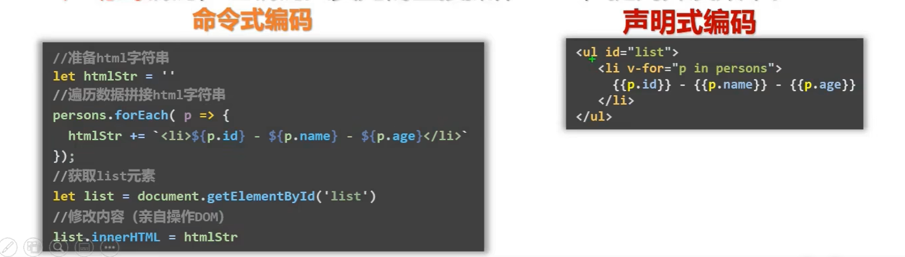
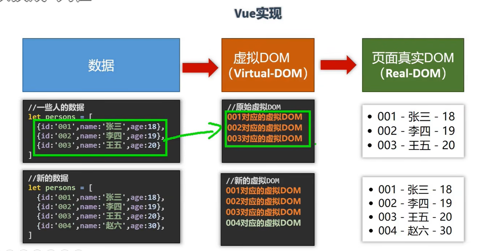
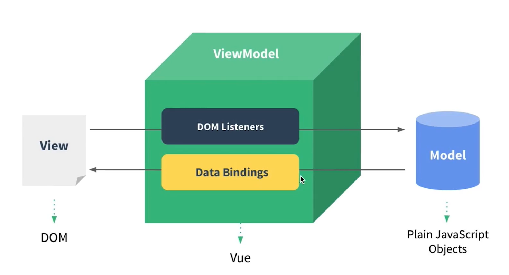
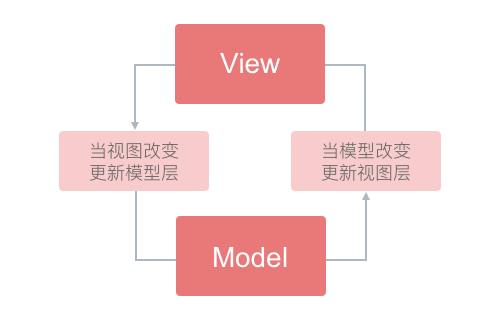
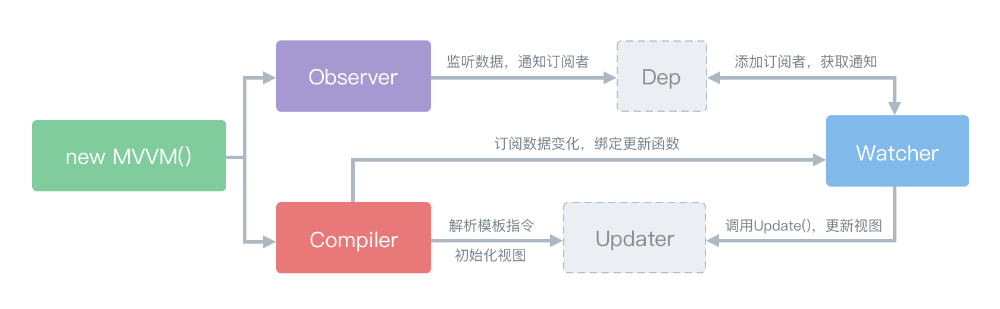

# Vue的特点

1. 采用组件化模式，提高代码复用率

2. 声明式编码，让编码人员无需直接操作DOM

   

3. 虚拟DOM和Diff算法

   

# Hello Vue

想让Vue工作，就必须创建一个Vue实例，且要传入一个配置对象

- 容器和实例是一一对应的关系
- {{}}内部只能写js表达式

```jsx
<html lang="en">
  <head>
    <meta charset="UTF-8" />
    <meta name="viewport" content="width=device-width, initial-scale=1.0" />
    <title>Document</title>
    <script src="./vue.js"></script>
  </head>
  <body>
    <!-- 准备好一个容器 -->
    <div id="root">
      <h1>Hello {{name}}</h1>
    </div>
    <script>
      Vue.config.productionTip = false; // 阻止 vue 在启动时生成生产提示。
      // 创建Vue实例
      new Vue({
        // {配置对象}
        el: "#root", //el用于指定当前Vue实例为哪个容器服务，值通常为css选择器字符串
        // el:document.getElementById("root")
        data: {
          //data用于存储数据，供el所指的的容器去使用，值暂时先写成一个对象
          name: "ziyi",
        },
      });
    </script>
  </body>
</html>
```

# 模版语法

```jsx
    <div id="root">
      <h1>插值语法</h1>
      <h3>你好{{name}}</h3>
      <hr />
      <h1>指令语法</h1>
      <a v-bind:href="school.url">点我去百度</a>
      <a :href="school.url">点我去{{school.name}}</a>
    </div>
```

## 插值语法

功能：用于解析标签体内容

写法：{{xxx}}， xxx是表达式，且可以直接读取data中的所有属性

## 指令语法

功能：用户解析标签(包括：标签属性、标签体内容、绑定事件...)

### v-bind

- 单向数据绑定：数据只能从data流向页面
- `v-bind：href="xxx"`可简写为 `:href="xxx"`, xxx同样要写JS表达式，且可以直接读取到data中的所有属性

```jsx
单向数据绑定：<input type="text" v-bind:value="name" />
```

### v-model

- 双向数据绑定：数据可以在页面和data之间相互流通

- v-model 只能用在`表单类元素`上(输入类元素)
- v-model:value 可以`简写为v-model`，因为v-model默认收集的就是value值

```jsx
双向数据绑定：<input type="text" v-model:value="name" />
双向数据绑定简写：<input type="text" v-model="name" />
//错误案例
<h2 v-bind:x="你好"></h2>
```

# el和data的两种写法

## el的两种写法

```js
const v = new Vue({
  // el: "#root", 第一种写法
  data: {
    name: "子怡",
  },
});
setTimeout(() => {
  v.$mount("#root"); //第二种写法 mount:挂载，可实现延时显示
}, 2000);
```

## data的两种写法

```jsx
new Vue({
  el: "#root",
  //data的第一种写法：对象式
   data: {
     name:"ziyi"
   }

  // data的第二种写法：函数式,不能是箭头函数，且必须返回一个对象
  data() {
    console.log("@@@", this);
    // 此处的this是Vue实例对象
    return {
      name: "ziyi",
    };
  },
});
```

# 设计模式

## MVP设计模式

## MVVM设计模式



我们在开发过程中只需要关注model数据本身即可

### Model

**对应data中的数据**

在MVVM中，我们可以把Model称为数据层，因为它仅仅关注数据本身，不关心任何行为（格式化数据由View的负责），这里可以把它理解为一个类似json的数据对象。

### View

**模版**

和MVC/MVP不同的是，MVVM中的View通过使用模板语法来声明式的将数据渲染进DOM，当ViewModel对Model进行更新的时候，会通过数据绑定更新到View。

### ViewModel

**Vue实例对象**

ViewModel大致上就是MVC的Controller和MVP的Presenter了，也是整个模式的重点，业务逻辑也主要集中在这里，其中的一大核心就是数据绑定。MVVM把View和Model的同步逻辑自动化了。

### 数据绑定

> 双向数据绑定，可以简单而不恰当地理解为一个模版引擎，但是会根据数据变更实时渲染。——《界面之下：还原真实的MV*模式》




# Vue双向数据绑定

Vue 数据双向绑定原理是通过 `数据劫持` + `发布者-订阅者模式` 的方式来实现的，首先是通过 `ES5` 提供的 `Object.defineProperty()` 方法来劫持（监听）各属性的 **getter、setter**，并在当监听的属性发生变动时通知订阅者，是否需要更新，若更新就会执行对应的更新函数。要实现Vue中的双向数据绑定，大致可以划分三个模块：Observer、Compile、Watcher，如图：



- Observer 数据监听器

  负责对数据对象的所有属性进行监听（数据劫持），监听到数据发生变化后通知订阅者。

- Compiler 指令解析器

  	扫描模板，并对指令进行解析，然后绑定指定事件。

- Watcher 订阅者

   关联Observer和Compile，能够订阅并收到属性变动的通知，执行指令绑定的相应操作，更新视图。Update()是它自身的一个方法，用于执行Compile中绑定的回调，更新视图。

# 数据代理

# 事件处理

## 基本使用

使用v-on:xxx 或 @ 绑定事件，其中xxx是事件名

methods中配置的函数不能是箭头函数，否则this的指向就是window了

methods中配置的函数，都是被Vue所管理的函数，this的指向是vm或组件实例对象

@click = "demo" 和 @click = "($event, value)" 效果一致，但后者可以传参

## 事件修饰符

修饰符可以连着写

@click.stop.prevent 先停止冒泡，再停止默认事件

## 键盘事件

### Vue中常用的按键别名

回车 enter

删除 delete(包含Delete和Backspace)

退出 esc

空格 space

换行 tab(特殊，必须配合keydown使用)

上下左右 up down left right

### Vue中未提供别名的按键

可以使用原始的key值去绑定，但注意要转为kebab-case(短横线去命名)

例如：CapsLock -> caps-lock

# 计算属性