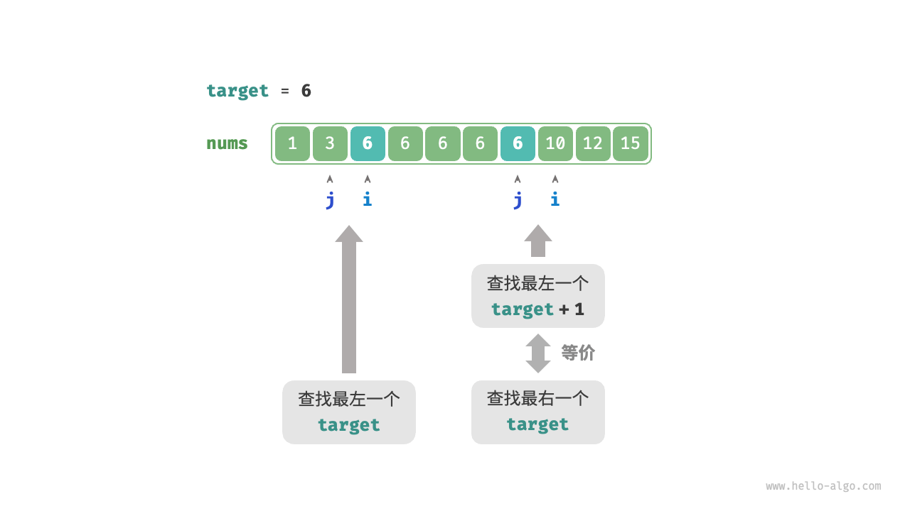
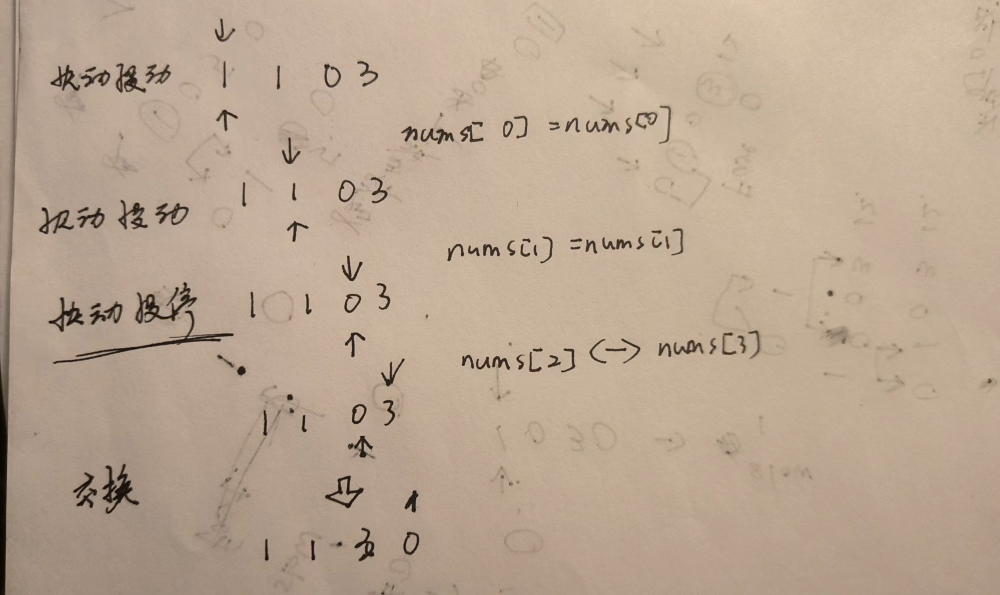

# 数组

**数组是存放在连续内存空间上的相同类型数据的集合。**

需要两点注意的是

- **数组下标都是从0开始的。**
- **数组内存空间的地址是连续的**

正是**因为数组在内存空间的地址是连续的，所以我们在删除或者增添元素的时候，就难免要移动其他元素的地址。**

**数组的元素是不能删的，只能覆盖。**

## 二分法

**前提是数组为有序数组**，同时还强调**数组中无重复元素**

### 二分查找

```js
var search = function (nums, target) {
    let i = 0,
        j = nums.length-1;
    while(i <= j) {
        const m = parseInt(i + (j - i) / 2);
        if(nums[m] < target) i = m + 1;
        else if(nums[m] > target) j = m - 1;
        else return m
    }
    return -1
};
```

### 二分查找插入点

#### 不存在重复元素

**问题一**：当数组中包含 `target` 时，插入点的索引是否是该元素的索引？

题目要求将 `target` 插入到相等元素的左边，这意味着新插入的 `target` 替换了原来 `target` 的位置。也就是说，**当数组包含 `target` 时，插入点的索引就是该 `target` 的索引**。

**问题二**：当数组中不存在 `target` 时，插入点是哪个元素的索引？

进一步思考二分查找过程：当 `nums[m] < target` 时 i 移动，这意味着指针 i 在向大于等于 `target` 的元素靠近。同理，指针 j 始终在向小于等于 `target` 的元素靠近。

因此二分结束时一定有：==i 指向首个大于 `target` 的元素，j 指向首个小于 `target` 的元素==。**易得当数组不包含 `target` 时，插入索引为 i** 。代码如下所示：

```jsx
var searchInsert = function(nums, target) {
    let i = 0; let j = nums.length-1
    while (i <=j) {
        const m = parseInt(i + (j-i)/2);
        if(nums[m] < target) i = m+1;
        else if(nums[m] > target) j = m-1;
        else return m
    }
    return i
};
```

#### 存在重复元素

题目要求将目标元素插入到最左边，**所以我们需要查找数组中最左一个 `target` 的索引**。

1. 执行二分查找，得到任意一个 `target` 的索引，记为 k 。
2. 从索引 k 开始，向左进行线性遍历，当找到最左边的 `target` 时返回。

> 反正是找最左边，只管k的左边即可

```jsx
/* 二分查找插入点（存在重复元素） */
function binarySearchInsertion(nums, target) {
    let i = 0,
        j = nums.length - 1; // 初始化双闭区间 [0, n-1]
    while (i <= j) {
        const m = Math.floor(i + (j - i) / 2); // 计算中点索引 m, 使用 Math.floor() 向下取整
        if (nums[m] < target) {
            i = m + 1; // target 在区间 [m+1, j] 中
        } else if (nums[m] > target) {
            j = m - 1; // target 在区间 [i, m-1] 中
        } else {
            j = m - 1; // 首个小于 target 的元素在区间 [i, m-1] 中
        }
    }
    // 返回插入点 i
    return i;
}
```

### 二分查找边界

> 进行两次查找，先查找左边界，再查找右边界。
>
> 回忆二分查找插入点的方法，搜索完成后 i 指向最左一个 `target` ，**因此查找插入点本质上是在查找最左一个 `target` 的索引**。
>
> - 插入点的索引 i 越界。
> - 元素 `nums[i]` 与 `target` 不相等。
>
> **将查找最右一个 `target` 转化为查找最左一个 `target + 1`**。
>
> 
>
> 查找完成后，指针  j 指向最右一个 `target` ，**因此返回 j 即可**。

```js
// 查找存重复元素的数组的插入点
var binarySearchInsertion = function(nums, target) {
    let i = 0, j = nums.length - 1;  
    while (i <= j) {
        const m = parseInt(i + (j - i) / 2);  // 取中间值
        if (nums[m] < target) i = m + 1;
        else j = m - 1;  // 查找第一个出现的位置
    }
    return i;
}

var searchRange = function(nums, target) {
    const arr = [];  // 定义结果数组

    // 查找target的第一个出现的位置
    const i = binarySearchInsertion(nums, target);
		// i向右移动 最终可能趋近于nums.length
    if (i === nums.length || nums[i] !== target) {
        arr[0] = -1;
    } else {
        arr[0] = i;
    }

    // 查找target的最后一个出现的位置
    const j = binarySearchInsertion(nums, target + 1) - 1;
    // j向左移动 最终可能趋近于0 - 1
    if (j === -1 || nums[j] !== target) {
        arr[1] = -1;
    } else {
        arr[1] = j;
    }

    return arr;  // 返回数组
};
```

### 平方根

我们可以使用「二分查找」来查找这个整数，不断缩小范围去猜。

- 猜的数平方以后大了就往小了猜；

- 猜的数平方以后大了就往小了猜；
- 猜的数平方以后恰恰好等于输入的数就找到了；
- 猜的数平方以后小了，可能猜的数就是，也可能不是。

```jsx
var mySqrt = function(x) {
    if (x === 0) return 0;
    if (x === 1) return 1;
    
    let i = 1, j = Math.floor(x / 2);  // 设置区间
    let result = 0;  // 保存最终的结果
    
    while(i <= j) {
        const m = Math.floor(i + (j - i) / 2);
        if(m*m === x) return m;
        else if(m*m < x) {
            i = m+1;
            result = m;
        }
        else j = m-1;    
    }
    return result;
}
```

## [双指针](https://www.bilibili.com/video/BV12A4y1Z7LP/?vd_source=3f3e1409a3b647c670854cd10e14f06c)

一个快指针一个慢指针实际上在同一数组上移动，快指针指向满足新数组条件的元素，慢指针指向新数组元素的索引。每当出现满足"新数组"条件的元素，就对其赋值`nums[slowIndex] = nums[fastIndex]`

### [移除元素](https://leetcode.cn/problems/remove-element/description/)

```js
var removeElement = function(nums, val) {
  let fastIndex = 0, slowIndex = 0;
  for(;fastIndex < nums.length; fastIndex++) {
    if(nums[fastIndex] !== val) {
      nums[slowIndex] = nums[fastIndex];
      slowIndex++
    }
  }
  return slowIndex;
};
```

### [移除重复元素](https://leetcode.cn/problems/remove-duplicates-from-sorted-array/)

```jsx
var removeDuplicates = function(nums) {
    if (nums.length === 0) return [];  // 如果数组为空，返回空数组

    let slowIndex = 0;

    for (let fastIndex = 1; fastIndex < nums.length; fastIndex++) {
        if (nums[fastIndex] !== nums[slowIndex]) {
            slowIndex++;  // 增加 slowIndex
            nums[slowIndex] = nums[fastIndex];  // 将非重复元素赋值给 slowIndex 处
        }
    }

    // 返回去重后的数组，即前 slowIndex + 1 个元素
    return slowIndex+1;
};
```

### [移动零](https://leetcode.cn/problems/move-zeroes/description/)

注意是**交换元素**，而不是直接赋值

快指针向后移动，当遇到不为0的元素，则与慢指针进行交换（相当于直接原封不动的赋值），由于if条件，**慢指针会停在值0**的位置等待下一次交换，**但此时快指针一直在移动，**当出现不为0的数值时，发生交换，此时慢指针才会移动一格，快指针继续...



```jsx
var moveZeroes = function(nums) {
    let slowIndex = 0;

    // 遍历数组，找到非零元素
    for (let fastIndex = 0; fastIndex < nums.length; fastIndex++) {
        if (nums[fastIndex] !== 0) {
            // 交换 slowIndex 和 fastIndex 处的元素
            [nums[slowIndex], nums[fastIndex]] = [nums[fastIndex], nums[slowIndex]];
            slowIndex++;  // 移动 slowIndex
        }
    }
};
```

